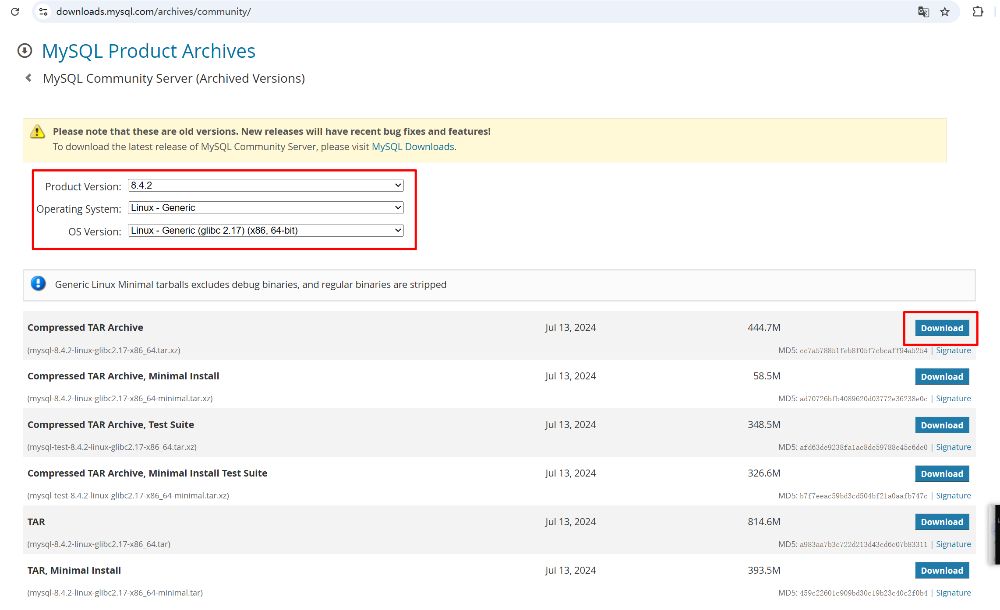

1.检查是否已安装

```bash
# 1.检查是否已通过RPM方式安装MySQL
rpm -qa | grep -i mysql

# 如果无输出，表示未通过RPM方式安装（二进制安装不会出现在此列表中）
# 如果有输出，请先卸载相关包，避免冲突

# 2.检查MariaDB组件（CentOS 7默认可能安装）
# 查看已安装的MariaDB组件
rpm -qa | grep mariadb
# 如果发现有MariaDB组件，建议卸载以避免与MySQL冲突
# 卸载查到的组件（替换"mariadb-libs-xxx.x86_64"为实际查到的包名）
sudo rpm -e --nodeps mariadb-libs-xxx.x86_64


# 3.检查系统中已存在的MySQL相关文件
which mysql
which mysqld

# 4.查看MySQL版本（如果环境变量配置正确）
mysql --version

# 补充
# MySQL两种安装方式的区别:
+------------------------+--------------------------------------+-----------------------------------------------+
| 特性                   | RPM包安装                            | 二进制包安装（您使用的方式）                  |
+------------------------+--------------------------------------+-----------------------------------------------+
| 安装方式               | yum install mysql 或 rpm -ivh mysql.rpm | 下载tar包解压配置                              |
+------------------------+--------------------------------------+-----------------------------------------------+
| 查询命令               | rpm -qa | grep mysql 有输出          | rpm -qa | grep mysql 无输出                   |
+------------------------+--------------------------------------+-----------------------------------------------+
| 安装位置               | 系统默认路径（如 /usr/bin/）          | 自定义路径（如 /opt/module/mysql/）            |
+------------------------+--------------------------------------+-----------------------------------------------+
| 管理方式               | 使用系统包管理器                      | 手动管理                                       |
+------------------------+--------------------------------------+-----------------------------------------------+
| 优势                   | 自动处理依赖，方便升级                | 灵活，可多版本共存，不污染系统目录              |
+------------------------+--------------------------------------+-----------------------------------------------+
| 劣势                   | 版本受限，位置固定                    | 需要手动配置服务和环境变量                     |
+------------------------+--------------------------------------+-----------------------------------------------+
| 卸载方式               | rpm -e 或 yum remove                 | 直接删除安装目录                               |
+------------------------+--------------------------------------+-----------------------------------------------+
| 适合场景               | 快速部署，生产环境                    | 开发测试，需要多版本共存                       |
+------------------------+--------------------------------------+-----------------------------------------------+
```

2.官网下载MySQL 包

```bash
# 首先，查看服务器glibc版本，来选择MySQL的安装版本
# rpm -qa | grep glibc
[vagrant@server01 ~]$ rpm -qa | grep glibc
glibc-headers-2.17-326.el7_9.3.x86_64
glibc-devel-2.17-326.el7_9.3.x86_64
glibc-2.17-326.el7_9.3.x86_64
glibc-common-2.17-326.el7_9.3.x86_64
[vagrant@server01 ~]$

# 官方下载地址：
# https://downloads.mysql.com/archives/community/
```

官方下载地址：https://downloads.mysql.com/archives/community/



3.win11系统上传jar包到Linux系统

```bash
scp -i "D:\doc\Vagrant\server01\.vagrant\machines\default\virtualbox\private_key" "D:\Downloads\mysql-8.4.2-linux-glibc2.17-x86_64.tar.xz" vagrant@192.168.56.11:/home/vagrant/
```

4.创建解压目录并解压安装包

```bash
# 1. 创建/opt/module目录（若已存在可跳过）
sudo mkdir -p /opt/module

# 2. 解压MySQL安装包到/opt/module目录
sudo tar -xvf /home/vagrant/mysql-8.4.2-linux-glibc2.17-x86_64.tar.xz -C /opt/module/
# 或者
sudo tar -xJvf /home/vagrant/mysql-8.4.2-linux-glibc2.17-x86_64.tar.xz -C /opt/module/


# 3. 重命名解压后的文件夹（简化后续操作，可选但推荐）
sudo mv /opt/module/mysql-8.4.2-linux-glibc2.17-x86_64 /opt/module/mysql
```

5.创建MySQL用户和用户组

```bash
# 1. 创建mysql用户组
sudo groupadd mysql

# 2. 创建mysql用户，加入mysql组，设置为不可登录系统（仅用于运行MySQL）
# sudo useradd -r -g mysql -s /sbin/nologin mysql
[vagrant@server01 ~]$ sudo useradd -r -g mysql -s /sbin/nologin mysql

# 验证用户创建结果
# id mysql
[vagrant@server01 ~]$ id mysql
uid=997(mysql) gid=1001(mysql) groups=1001(mysql)
```

6.配置MySQL目录权限

```bash
# 给 MySQL 安装目录和相关目录赋予 mysql 用户 / 组的权限，避免权限不足问题
# 1. 给MySQL主目录赋予mysql用户/组权限
sudo chown -R mysql:mysql /opt/module/mysql/

# 2. 给目录设置读写执行权限（确保MySQL可正常操作）
sudo chmod -R 755 /opt/module/mysql/
```

7.创建 MySQL 数据存储和日志目录

```bash
# 默认解压包无数据目录和日志目录，需手动创建并授权
# 1. 创建数据目录（存储数据库文件）
sudo mkdir -p /opt/module/mysql/data

# 2. 创建日志目录（存储错误日志等）
sudo mkdir -p /opt/module/mysql/logs

# 3. 给新建目录赋予mysql用户/组权限
sudo chown -R mysql:mysql /opt/module/mysql/data/
sudo chown -R mysql:mysql /opt/module/mysql/logs/


# 4.赋予数据目录及MySQL主目录完整权限
sudo chown -R mysql:mysql /opt/module/mysql/
sudo chmod -R 755 /opt/module/mysql/data/
sudo chown -R mysql:mysql /opt/module/mysql/
```

8.配置 MySQL 核心配置文件（my.cnf）

```bash
# 编辑 /etc/my.cnf 配置文件，设置 MySQL 的基础运行参数
# 1. 备份原有my.cnf文件（若存在）
sudo mv /etc/my.cnf /etc/my.cnf.bak

# 2. 新建并编辑my.cnf文件
sudo vim /etc/my.cnf
```

> 在 my.cnf 中写入以下配置内容（根据实际目录调整，确保路径正确）：

```ini
[mysqld]
# 允许监听所有网卡的连接请求（0.0.0.0表示监听所有IP）
bind-address = 0.0.0.0
# 开启 TCP/IP 连接，允许 TCP/IP 方式的访问
skip_networking = 0
# MySQL安装目录
basedir = /opt/module/mysql
# 数据存储目录
datadir = /opt/module/mysql/data
# 套接字文件路径
socket = /tmp/mysql.sock
# 端口号（默认3306）
port = 3306
# 字符集（统一为utf8mb4，支持所有特殊字符）
character-set-server = utf8mb4
# 排序规则
collation-server = utf8mb4_general_ci
# 日志文件路径（仅保留一条，删除重复项）
log-error = /opt/module/mysql/logs/mysql_error.log
# 进程ID文件路径
pid-file = /opt/module/mysql/mysql.pid
# 允许最大连接数
max_connections = 1000
# 禁用DNS解析（提升连接速度）
skip-name-resolve
# 注释掉初始化阶段不支持的参数（关键修改）
# default_authentication_plugin = mysql_native_password

[mysql]
# 客户端字符集
default-character-set = utf8mb4

[mysqld_safe]
log-error = /opt/module/mysql/logs/mysql_error.log
pid-file = /opt/module/mysql/mysql.pid
```

9.配置 MySQL 环境变量

```bash
# 1. 编辑系统环境变量配置文件
sudo vim /etc/profile

# 2. 在文件末尾添加以下内容
export MYSQL_HOME=/opt/module/mysql
export PATH=$PATH:$MYSQL_HOME/bin:$MYSQL_HOME/support-files

# 3. 使环境变量立即生效
source /etc/profile

# 4. 验证环境变量（出现MySQL版本信息即成功）
mysql --version
```

10.初始化 MySQL 服务

```bash
# 通过 mysqld 命令初始化 MySQL，生成临时 root 密码（需记录后续登录使用）

# 以mysql用户身份初始化（必须指定用户，否则权限异常）
sudo su - mysql -s /bin/bash -c "mysqld --initialize --user=mysql --basedir=/opt/module/mysql --datadir=/opt/module/mysql/data"

# 查看临时密码（关键！后续登录需使用，密码在日志中以“temporary password is generated for root@localhost:”开头）
cat /opt/module/mysql/logs/mysql_error.log | grep "temporary password"
# 示例临时密码：_Root@123456（每个人的密码不同，需复制自己的日志内容）
```

> 解决初始化报错

```bash
[vagrant@server01 ~]$ sudo su - mysql -s /bin/bash -c "mysqld --initialize --user=mysql --basedir=/opt/module/mysql --datadir=/opt/module/mysql/data"
su: warning: cannot change directory to /home/mysql: No such file or directory
mysqld: error while loading shared libraries: libaio.so.1: cannot open shared object file: No such file or directory

# 问题1：缺少依赖库 libaio
# 对于 RHEL/CentOS/Fedora 系统
sudo yum install -y libaio

# 对于 Debian/Ubuntu 系统
sudo apt-get update
sudo apt-get install -y libaio1

# 安装后检查库文件是否存在
sudo find /usr -name "libaio.so.*"


# 问题2：mysql 用户没有家目录（警告信息，不影响运行）
# 解决方法（可选，可以忽略警告）：
# 为 mysql 用户创建家目录
sudo mkdir -p /home/mysql
sudo chown mysql:mysql /home/mysql


# 如果还有问题，可以尝试：
# 手动初始化（不使用 su）：
# 切换到 mysql 用户直接执行
sudo -u mysql /bin/bash -c "cd /tmp && /opt/module/mysql/bin/mysqld --initialize --user=mysql --basedir=/opt/module/mysql --datadir=/opt/module/mysql/data"
```

11.配置 MySQL 系统服务（开机自启）

```bash
# 将 MySQL 添加到 systemd 系统服务，方便管理启动 / 停止 / 开机自启
# 1. 创建MySQL服务文件
sudo vim /usr/lib/systemd/system/mysqld.service
```

> 在打开的文件中，输入以下内容：

```ini
[Unit]
Description=MySQL Server
After=network.target

[Service]
User=mysql
Group=mysql
Type=forking
ExecStart=/opt/module/mysql/support-files/mysql.server start
ExecStop=/opt/module/mysql/support-files/mysql.server stop
ExecRestart=/opt/module/mysql/support-files/mysql.server restart
PrivateTmp=false

[Install]
WantedBy=multi-user.target
```

12. 启动MySQL服务

```bash
# 重新加载systemd配置
sudo systemctl daemon-reload

# 启动MySQL服务（注意服务名是 mysqld）
sudo systemctl start mysqld

# 查看服务状态
sudo systemctl status mysqld

# 设置开机自启
sudo systemctl enable mysqld

```

13.连接 MySQL 并修改root密码

```bash
# 1. 使用初始化时的临时密码登录MySQL
mysql -u root -p

# 输入前面初始化时记录的临时密码（如：_Root123456）
```

> 成功登录后，执行以下SQL命令修改密码：

```mysql
-- 修改root密码（替换'NewPassword123!'为您自己的强密码）
ALTER USER 'root'@'localhost' IDENTIFIED BY 'NewPassword123!';

-- MySQL 8.0+ 使用以下语法（如果上面的报错）
ALTER USER 'root'@'localhost' IDENTIFIED WITH mysql_native_password BY 'NewPassword123!';

-- 刷新权限
FLUSH PRIVILEGES;

-- 退出MySQL
EXIT;
```

14.配置远程连接

```bash
# 1. 使用新密码重新登录MySQL
mysql -u root -p
```

```sql
-- 2. 创建远程访问用户（可选，生产环境建议创建专用用户）
CREATE USER 'remote_user'@'%' IDENTIFIED BY 'RemotePassword123!';

-- 3. 授予权限（根据需要调整权限）
GRANT ALL PRIVILEGES ON *.* TO 'remote_user'@'%' WITH GRANT OPTION;

-- 或者更安全的权限设置（只授予特定数据库权限）
-- GRANT SELECT, INSERT, UPDATE, DELETE ON your_database.* TO 'remote_user'@'%';

-- 4. 修改root用户的host为%，允许远程登录（生产环境不推荐）
USE mysql;
UPDATE user SET host='%' WHERE user='root';

-- 5. 刷新权限
FLUSH PRIVILEGES;

-- 6. 查看用户权限
SELECT user, host FROM mysql.user;

-- 7. 退出
EXIT;
```

15.防火墙配置（如果需要远程访问）

```bash
# 1. 检查防火墙状态
sudo systemctl status firewalld

# 2. 如果防火墙开启，开放3306端口
sudo firewall-cmd --zone=public --add-port=3306/tcp --permanent

# 3. 重新加载防火墙规则
sudo firewall-cmd --reload

# 4. 查看已开放的端口
sudo firewall-cmd --zone=public --list-ports
```

16.安全配置建议

```bash
# 1. 运行MySQL安全安装向导
sudo mysql_secure_installation

# 按照提示进行以下安全设置：
# - 验证密码强度插件
# - 设置root密码（如果还没设置）
# - 移除匿名用户
# - 禁止root远程登录（生产环境推荐）
# - 移除test数据库
# - 重新加载权限表
```

17.测试连接

```bash
# 本地连接测试：
# 使用root用户连接
mysql -u root -p -h localhost

# 或者使用新创建的远程用户
mysql -u remote_user -p -h 127.0.0.1


# 远程连接测试：
# 从其他机器连接（替换IP地址为您的服务器IP）：
# 在另一台Linux机器上测试
mysql -u remote_user -p -h 192.168.56.11

# Windows可以使用MySQL Workbench或命令行
# mysql -u remote_user -p -h 192.168.56.11
```

18.常用管理和维护命令

```bash
# 查看MySQL版本
mysql --version

# 查看MySQL运行状态
sudo systemctl status mysql

# 停止MySQL服务
sudo systemctl stop mysql

# 重启MySQL服务
sudo systemctl restart mysql

# 查看MySQL日志
sudo tail -f /opt/module/mysql/logs/mysql_error.log

# 查看MySQL数据文件大小
sudo du -sh /opt/module/mysql/data/

# 备份数据库
mysqldump -u root -p --all-databases > backup.sql

# 设置MySQL配置文件后重启
sudo systemctl restart mysql
```

19.常见问题——忘记root密码，重置密码

```bash
# 步骤 1：先停止运行中的 MySQL 服务
sudo systemctl stop mysqld
# 验证停止成功（无active(running)即正常）
sudo systemctl status mysqld


# 步骤 2：编辑主配置/etc/my.cnf，添加跳过密码验证参数
sudo vi /etc/my.cnf
# 在 [mysqld]节点下任意位置（推荐加在现有配置末尾）添加以下两行核心配置
[mysqld]
# 原有所有配置保持不变...
# 新增：跳过密码验证（核心）
skip-grant-tables
# 新增：禁止远程连接（重置密码期间安全防护）
skip-networking


# 步骤 3：重启 MySQL 服务，让主配置的跳过参数生效
sudo systemctl restart mysqld
# 验证服务正常运行（显示active(running)即成功）
sudo systemctl status mysqld


# 步骤 4：无密码登录 MySQL（此时必成功）
# 直接执行命令，无需加-p，即可进入 MySQL 命令行
mysql -uroot


# 步骤 5：重置root@localhost密码（MySQL8 适配）
# 登录后按以下顺序执行 SQL，必须先执行FLUSH PRIVILEGES，否则修改密码会报错
-- 1. 刷新权限表（必备，激活权限修改功能）
FLUSH PRIVILEGES;

-- 2. 执行 SQL 查询所有已存在的 MySQL 用户，验证有无'root'@'localhost'
SELECT user, host FROM mysql.user;
-- 2.1 如果没有root用户，创建root@localhost账号，设置密码）
CREATE USER 'root'@'localhost' IDENTIFIED BY '新密码';
# 或者
--强制初始化root@localhost密码，IF EXISTS适配隐式账号框架（MySQL8专属解决方案）
ALTER USER IF EXISTS 'root'@'localhost' IDENTIFIED BY '新密码';

-- 2.2 如果有root用户，直接重置密码（替换<你的新密码>，MySQL8要求复杂度：大小写+数字+特殊符号）
ALTER USER 'root'@'localhost' IDENTIFIED BY '新密码';

-- 3. 再次刷新权限，让新密码立即生效
FLUSH PRIVILEGES;

-- 4. 退出MySQL命令行
exit;

# 或者
# 步骤 5：重置root@localhost密码（ MySQL8.4.2 适配）
-- 1. 刷新权限表，激活账号/权限操作（必备）
FLUSH PRIVILEGES;

-- 2. 显式创建root@localhost本地账号【指定默认插件】+ 设置密码（MySQL自动加密，无需任何函数）
CREATE USER 'root'@'localhost' IDENTIFIED WITH caching_sha2_password BY '新密码';

-- 3. 授予本地root账号最高全权限（与root@%一致，满足本地所有操作）
GRANT ALL PRIVILEGES ON *.* TO 'root'@'localhost' WITH GRANT OPTION;

-- 4. 再次刷新权限，让账号/密码/权限立即生效（核心）
FLUSH PRIVILEGES;

-- 5. 验证创建结果（此时能看到root@localhost已显式存在，非隐式）
SELECT user, host, plugin FROM mysql.user WHERE user = 'root';

# 或者
# 步骤 5：重置root@localhost密码（ MySQL8.4.2 适配）
-- 1. 刷新权限表，激活账号/密码修改功能（必备前置步骤，否则修改不生效）
FLUSH PRIVILEGES;

-- 2. 重置root@%密码（唯一有效root账号，正确语法，无任何弃用函数）
ALTER USER 'root'@'%' IDENTIFIED BY '新密码';

-- 3. 再次刷新权限，让密码立即、永久生效（核心步骤，缺一不可）
FLUSH PRIVILEGES;

-- 4. 验证账号状态（确认仅存在root@%，无其他root账号）
SELECT user, host, plugin FROM mysql.user WHERE user = 'root';


-- 1. 刷新权限（激活参数修改功能）
FLUSH PRIVILEGES;

-- 2. 关键：设置MySQL监听所有IP的3306端口（包括127.0.0.1和远程IP，适配CDC）
SET GLOBAL bind_address = '0.0.0.0';

-- 3. 关键：关闭禁止TCP/IP连接的限制（确保端口监听生效）
SET GLOBAL skip_networking = 0;

-- 4. 再次刷新权限，让参数立即生效
FLUSH PRIVILEGES;

-- 5. 验证监听参数（确认设置成功）
SHOW VARIABLES LIKE 'bind_address';
SHOW VARIABLES LIKE 'skip_networking';


# 步骤 6：恢复 MySQL 正常配置（删除跳过参数，关键！）
# 必须删除/etc/my.cnf中的skip-grant-tables和skip-networking，否则 MySQL 会一直允许无密码登录，存在严重安全隐患
sudo vi /etc/my.cnf


# 步骤 7：重启 MySQL，验证新密码登录
# 重启服务使正常配置生效
sudo systemctl restart mysqld
# 用新密码登录
mysql -uroot -P 3306 -p
# -h 127.0.0.1 强制使用root@%账号本地登录
mysql -uroot -h 127.0.0.1 -P 3306 -p
```

20.其他常见问题解决

问题1：无法启动MySQL

```bash
# 检查错误日志
sudo tail -100 /opt/module/mysql/logs/mysql_error.log

# 常见错误：目录权限问题
sudo chown -R mysql:mysql /opt/module/mysql/
sudo chmod -R 755 /opt/module/mysql/

# 重新启动
sudo systemctl restart mysql
```

问题2：忘记root密码

```sql
# 1. 停止MySQL服务
sudo systemctl stop mysql

# 2. 以安全模式启动MySQL（跳过权限验证）
sudo mysqld_safe --skip-grant-tables --user=mysql &

# 3. 无密码登录MySQL
mysql -u root

# 4. 在MySQL中执行
FLUSH PRIVILEGES;
ALTER USER 'root'@'localhost' IDENTIFIED BY 'NewPassword123!';
FLUSH PRIVILEGES;
EXIT;

# 5. 重启MySQL服务
sudo systemctl restart mysql
```

问题3：无法远程连接

```bash
# 检查MySQL用户权限
mysql -u root -p
SELECT user, host FROM mysql.user;

# 检查防火墙
sudo firewall-cmd --list-ports

# 检查MySQL绑定地址
cat /etc/my.cnf | grep bind-address
```

