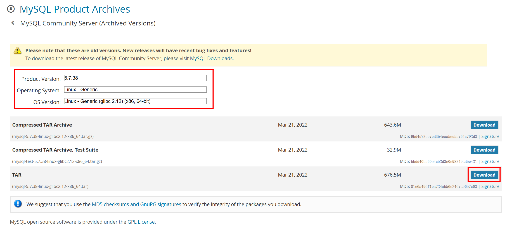

1.下载mysql5.7的安装包



2.上传安装包到linux服务器

```bash
# win11系统上传安装包到centos虚拟机
scp -i "E:\axxp\VM-Vagrant\server02\.vagrant\machines\default\virtualbox\private_key" "C:\Users\xxxx\Downloads\mysql-5.7.38-linux-glibc2.12-x86_64.tar" vagrant@192.168.56.12:/home/vagrant/
```

3.连接linux虚拟机

```bash
ssh -i "E:\axxp\VM-Vagrant\server02\.vagrant\machines\default\virtualbox\private_key" vagrant@192.168.56.12
```

4.创建解压目录并解压安装包

```bash
[vagrant@server02 ~]$ pwd
/home/vagrant
[vagrant@server02 ~]$ ls
mysql-5.7.38-linux-glibc2.12-x86_64.tar

# 1. 创建/opt/module目录（若已存在可跳过）
sudo mkdir -p /opt/module

# 2. 解压MySQL安装包到/opt/module目录
sudo tar -xf /home/vagrant/mysql-5.7.38-linux-glibc2.12-x86_64.tar -C /opt/module/

# 3.生成了两个压缩包
[vagrant@server02 ~]$ ls /opt/module/
mysql-5.7.38-linux-glibc2.12-x86_64.tar.gz  mysql-test-5.7.38-linux-glibc2.12-x86_64.tar.gz

# 4.解压mysql-5.7.38-linux-glibc2.12-x86_64.tar
[vagrant@server02 ~]$ cd /opt/module/
[vagrant@server02 module]$ ls
mysql-5.7.38-linux-glibc2.12-x86_64.tar.gz mysql-test-5.7.38-linux-glibc2.12-x86_64.tar.gz
[vagrant@server02 module]$ tar xf mysql-5.7.38-linux-glibc2.12-x86_64.tar.gz
[vagrant@server02 module]$ ls
mysql-5.7.38-linux-glibc2.12-x86_64   mysql-test-5.7.38-linux-glibc2.12-x86_64.tar.gz   mysql-5.7.38-linux-glibc2.12-x86_64.tar.gz

# 5.重命名
[vagrant@server02 module]$ mv mysql-5.7.38-linux-glibc2.12-x86_64 mysql-5.7.38
[vagrant@server02 module]$ ls
mysql-5.7.38
```

5.创建MySQL用户和用户组

```bash
# 创建一个mysql组和mysql-5.7.38用户
# 步骤 1：创建 mysql 用户组
sudo groupadd -r mysql

# 步骤 2：创建 mysql-5.7.38 用户并加入 mysql 组
# 创建mysql-5.7.38用户，加入mysql组，设置为不可登录（安全）
sudo useradd -r -s /sbin/nologin -g mysql mysql-5.7.38

# 步骤 3：验证用户 / 组是否创建成功
# 查看mysql组信息（能看到mysql组ID则创建成功）
cat /etc/group | grep mysql

# 查看mysql-5.7.38用户信息（能看到归属mysql组则成功）
cat /etc/passwd | grep mysql-5.7.38

# 简化验证方式（直接输出用户所属组）
id mysql-5.7.38
# 预期输出示例：
# uid=995(mysql-5.7.38) gid=993(mysql) 组=993(mysql)

# 步骤 4：（可选）将 MySQL 目录权限赋予 mysql-5.7.38 用户
# 创建用户后，需将 MySQL 安装目录的所有权赋予该用户（确保 MySQL 进程有读写权限）
# 递归设置/opt/module/mysql-5.7.38目录的所有者为mysql-5.7.38:mysql
sudo chown -R mysql-5.7.38:mysql /opt/module/mysql-5.7.38/

# 设置目录权限（755：所有者可读可写可执行，其他用户只读/执行）
sudo chmod -R 755 /opt/module/mysql-5.7.38/
```

6.安装 MySQL 运行依赖

```bash
# MySQL 5.7 在 CentOS 7 下运行依赖libaio-devel等系统库，先安装依赖包
# 安装必要依赖（sudo执行，保持和之前操作权限一致）
sudo yum install -y libaio-devel numactl-devel
# 若提示yum锁定，可先执行：sudo rm -f /var/run/yum.pid 再重试
```

7.配置 MySQL 环境变量（全局调用 mysql 命令）

```bash
# 配置后无需输入完整路径即可执行mysql、mysqld等命令，方便后续操作
# 编辑系统环境变量文件
sudo vi /etc/profile

# 按「ESC」→ 输入「o」换行，粘贴以下内容（适配你的安装目录）
export MYSQL_HOME=/opt/module/mysql-5.7.38
export PATH=$PATH:$MYSQL_HOME/bin

# 保存退出：按「ESC」→ 输入「:wq」→ 回车
# 刷新环境变量使其立即生效
source /etc/profile

# 验证环境变量（输出/opt/module/mysql-5.7.38则生效）
echo $MYSQL_HOME
```

8.创建 MySQL 核心配置文件（my.cnf）

```bash
# MySQL 的核心配置文件为/etc/my.cnf，需替换为适配环境的配置（避免系统默认配置冲突）

# 备份系统原有my.cnf（防止覆盖）
sudo mv /etc/my.cnf /etc/my.cnf.bak

# 创建新的my.cnf文件并写入配置
sudo vi /etc/my.cnf

# 粘贴以下配置
[mysqld]
# 安装目录（和你的路径一致）
basedir=/opt/module/mysql-5.7.38
# 数据存储目录（自动创建，无需提前建）
datadir=/opt/module/mysql-5.7.38/data
# 端口（默认3306）
port=3306
# socket文件路径
socket=/tmp/mysql.sock
# 运行用户（你创建的mysql-5.7.38）
user=mysql-5.7.38
# 默认字符集
character-set-server=utf8
# 跳过DNS解析（提升连接速度）
skip-name-resolve
# 服务端ID（单机部署设为1）
server-id=1


[mysql]
# 客户端默认字符集
default-character-set=utf8
socket=/tmp/mysql.sock

[mysqld_safe]
# 日志文件路径（自动生成）
log-error=/opt/module/mysql-5.7.38/data/mysqld.log
# 进程ID文件路径
pid-file=/opt/module/mysql-5.7.38/data/mysqld.pid

# 保存退出：ESC → :wq → 回车
```

9.初始化 MySQL（生成临时密码，关键步骤）

```bash
# MySQL 5.7 必须先初始化，会自动生成root用户的临时密码（务必保存），且需指定创建的mysql-5.7.38用户

# 执行初始化命令
sudo mysqld --initialize --user=mysql-5.7.38 --basedir=/opt/module/mysql-5.7.38 --datadir=/opt/module/mysql-5.7.38/data
# 或者
# 用绝对路径执行初始化命令（替换原来的mysqld命令）
sudo /opt/module/mysql-5.7.38/bin/mysqld --initialize --user=mysql-5.7.38 --basedir=/opt/module/mysql-5.7.38 --datadir=/opt/module/mysql-5.7.38/data
# 2026-01-24T11:47:16.635141Z 1 [Note] A temporary password is generated for root@localhost: *o<WWn)6MFjt

# 查看临时密码（复制保存，后续登录用）
sudo cat /opt/module/mysql-5.7.38/data/mysqld.log | grep 'temporary password'
```

10.配置 MySQL 为系统服务（开机自启）

```bash
# 将 MySQL 注册为系统服务，方便通过service命令管理（启动 / 停止 / 开机自启）
# 复制MySQL服务脚本到系统服务目录
sudo cp /opt/module/mysql-5.7.38/support-files/mysql.server /etc/init.d/mysqld

# 赋予服务脚本执行权限
sudo chmod +x /etc/init.d/mysqld

# 添加为系统服务（设置开机自启）
sudo chkconfig --add mysqld

# 验证服务添加成功（输出mysqld的启动级别则成功）
sudo chkconfig --list mysqld
```

11.启动 MySQL 服务并检查状态

```bash
# 启动MySQL服务
sudo service mysqld start

# 检查服务状态（输出「active (running)」则启动成功）
sudo service mysqld status

# 若启动失败，可查看日志排查：
# sudo cat /opt/module/mysql-5.7.38/data/mysqld.log
```

12.登录 MySQL 并修改临时密码

```bash
# 登录MySQL（输入临时密码）
mysql -uroot -p
# 提示「Enter password:」时，粘贴步骤9的临时密码，回车登录

# 修改root密码（替换为你的自定义密码，如PS666666，生产环境建议复杂密码）
ALTER USER 'root'@'localhost' IDENTIFIED BY 'PS666666';

# 刷新权限（使密码修改生效）
FLUSH PRIVILEGES;
```

13.配置 root 用户远程访问（Windows / 其他机器连接）（可选）

13.1 授权 root 远程访问（MySQL 命令行内执行）

```bash
# 默认 root 仅能本地登录，如需远程连接（如 Navicat、DataGrip），需授权并开放端口
# 在MySQL登录状态下执行（替换为你的root密码）
GRANT ALL PRIVILEGES ON *.* TO 'root'@'%' IDENTIFIED BY 'PS666666' WITH GRANT OPTION;
FLUSH PRIVILEGES;

# 退出MySQL
exit;
```

13.2 开放 CentOS 7 的 3306 端口（防火墙）

```bash
# 启动FirewallD服务
sudo systemctl start firewalld

# 设置FirewallD开机自启（避免重启后防火墙关闭）
sudo systemctl enable firewalld

# 验证FirewallD状态（输出active(running)则成功）
sudo systemctl status firewalld

# 开放3306端口（永久生效）
sudo firewall-cmd --zone=public --add-port=3306/tcp --permanent

# 重启防火墙使配置生效
sudo firewall-cmd --reload

# （可选）临时关闭SELinux（避免权限拦截，生产环境建议配置SELinux规则而非关闭）
sudo setenforce 0
```

14.验证 MySQL 安装成功

```bash
# 重新登录MySQL（使用新密码）
mysql -uroot -p你的自定义密码

# 查看MySQL版本（输出5.7.38则正确）
SELECT VERSION();

# 查看数据库列表（能正常显示则安装完成）
SHOW DATABASES;

# 退出MySQL
exit;
```


