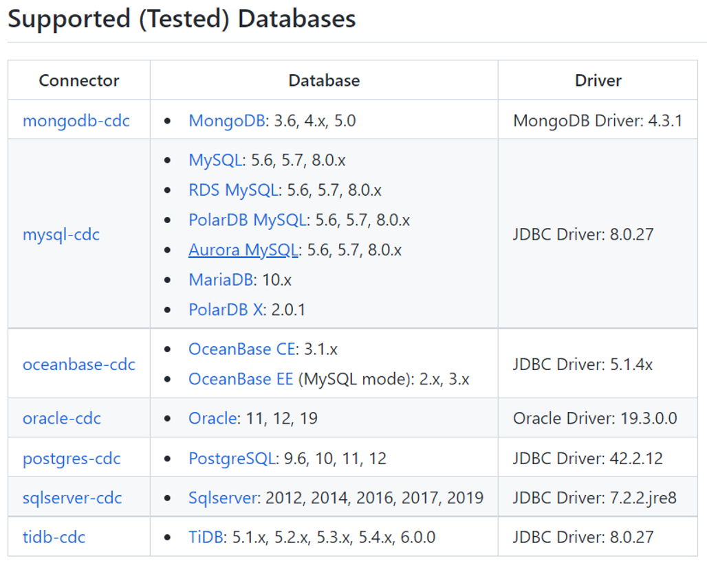
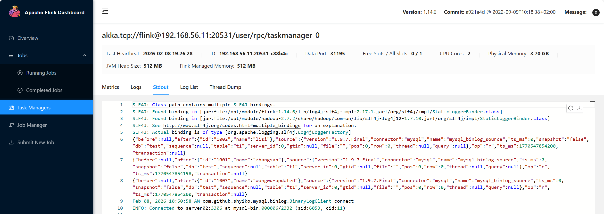
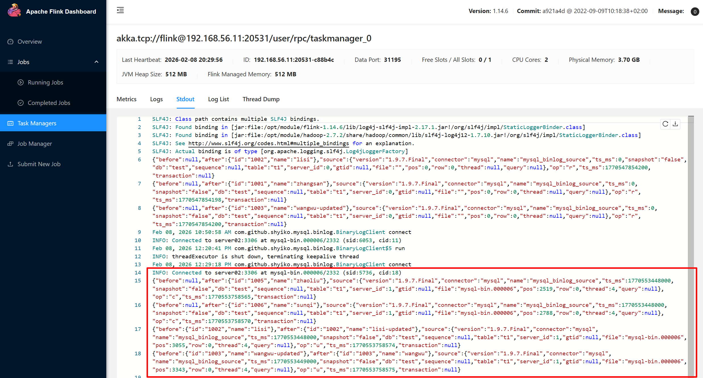
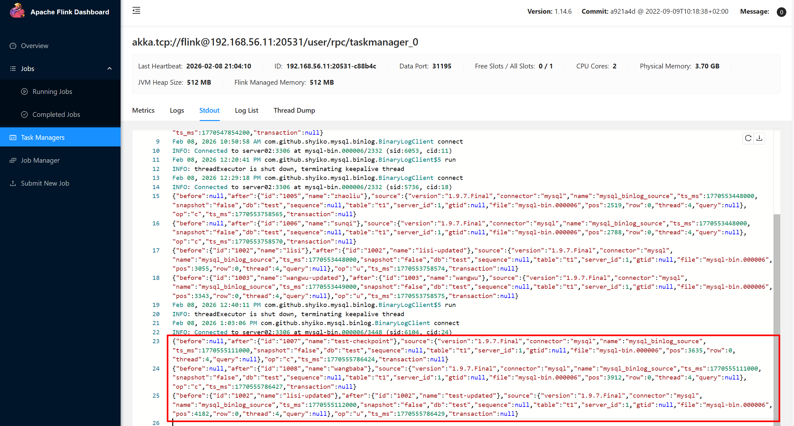

<!-- START doctoc generated TOC please keep comment here to allow auto update -->
<!-- DON'T EDIT THIS SECTION, INSTEAD RE-RUN doctoc TO UPDATE -->
**Table of Contents**  *generated with [DocToc](https://github.com/thlorenz/doctoc)*

- [1.CDC简介](#1cdc%E7%AE%80%E4%BB%8B)
    - [1.1 什么是CDC](#11-%E4%BB%80%E4%B9%88%E6%98%AFcdc)
    - [1.2 CDC的种类](#12-cdc%E7%9A%84%E7%A7%8D%E7%B1%BB)
    - [1.3 Flink-CDC](#13-flink-cdc)
- [2.数据准备](#2%E6%95%B0%E6%8D%AE%E5%87%86%E5%A4%87)
    - [2.1 数据准备](#21-%E6%95%B0%E6%8D%AE%E5%87%86%E5%A4%87)
    - [2.2 插入数据](#22-%E6%8F%92%E5%85%A5%E6%95%B0%E6%8D%AE)
    - [2.3 开启MySQL Binlog并重启MySQL](#23-%E5%BC%80%E5%90%AFmysql-binlog%E5%B9%B6%E9%87%8D%E5%90%AFmysql)
- [3.`DataStream API`方式的应用](#3datastream-api%E6%96%B9%E5%BC%8F%E7%9A%84%E5%BA%94%E7%94%A8)
    - [3.1 导入依赖](#31-%E5%AF%BC%E5%85%A5%E4%BE%9D%E8%B5%96)
    - [3.2 编写代码](#32-%E7%BC%96%E5%86%99%E4%BB%A3%E7%A0%81)
    - [3.3 测试](#33-%E6%B5%8B%E8%AF%95)
- [4.`DataStream API`断点续传实现](#4datastream-api%E6%96%AD%E7%82%B9%E7%BB%AD%E4%BC%A0%E5%AE%9E%E7%8E%B0)
    - [4.1 导入依赖](#41-%E5%AF%BC%E5%85%A5%E4%BE%9D%E8%B5%96)
    - [4.2 编写代码](#42-%E7%BC%96%E5%86%99%E4%BB%A3%E7%A0%81)
    - [4.3 测试](#43-%E6%B5%8B%E8%AF%95)
- [5.FlinkSQL方式的应用](#5flinksql%E6%96%B9%E5%BC%8F%E7%9A%84%E5%BA%94%E7%94%A8)
    - [5.1 编写代码](#51-%E7%BC%96%E5%86%99%E4%BB%A3%E7%A0%81)
    - [5.2 代码测试](#52-%E4%BB%A3%E7%A0%81%E6%B5%8B%E8%AF%95)
- [6.MySQL到Doris的StreamingETL实现（3.0）](#6mysql%E5%88%B0doris%E7%9A%84streamingetl%E5%AE%9E%E7%8E%B030)
    - [6.1 环境准备](#61-%E7%8E%AF%E5%A2%83%E5%87%86%E5%A4%87)
    - [6.2 同步变更](#62-%E5%90%8C%E6%AD%A5%E5%8F%98%E6%9B%B4)
    - [6.3 路由变更](#63-%E8%B7%AF%E7%94%B1%E5%8F%98%E6%9B%B4)

<!-- END doctoc generated TOC please keep comment here to allow auto update -->

## 1.CDC简介

### 1.1 什么是CDC

CDC是Change Data Capture(变更数据获取)
的简称。核心思想是，监测并捕获数据库的变动（包括数据或数据表的插入、更新以及删除等），将这些变更按发生的顺序完整记录下来，写入到消息中间件中以供其他服务进行订阅及消费。

FlinkCDC：Flink CDC(Flink Change Data Capture)是一个用于实时捕获数据库变更日志的工具，它可以将数据库（如MySQL，PostgreSQL，MariaDB等）的变更实时同步到Apache
Flink系统中。

Flink CDC发展史：1.X提供DataStream以及FlinkSQL方式实现数据动态获取。2.x丰富对接的数据库以及增加全量同步锁表问题的解决方案。3.x提供StreamingETL方式导入数据方案

### 1.2 CDC的种类

CDC主要分为基于查询和基于Binlog两种方式，主要了解一下这两种之间的区别：

| 对比项          | 基于查询的CDC    | 基于Binlog的CDC           |
|--------------|-------------|------------------------|
| 开源产品         | Sqoop、DataX | Canal、Maxwell、Debezium |
| 执行模式         | Batch       | Streaming              |
| 是否可以捕获所有数据变化 | 否           | 是                      |
| 延迟性          | 高延迟         | 低延迟                    |
| 是否增加数据库压力    | 是           | 否                      |

### 1.3 Flink-CDC

Flink社区开发了 flink-cdc-connectors 组件，这是一个可以直接从 MySQL、PostgreSQL 等数据库直接读取全量数据和增量变更数据的
source 组件。

目前也已开源，开源地址：https://github.com/ververica/flink-cdc-connectors



---

## 2.数据准备

### 2.1 数据准备

在MySQL中创建数据库及表，使用 MySQL 客户端连接后执行以下 SQL：

```sql
#
mysql版本
： 5.7.38
[vagrant@server02 ~]$ mysql -uroot -p
Enter password:
# mysql版本
： 5.7.38
mysql>
SELECT VERSION();
+------------+
| VERSION()  |
+------------+
| 5.7.38-log |
+------------+

-- 建库：IF NOT EXISTS 避免重复创建，utf8mb4 支持完整 Unicode（含 emoji）
CREATE
DATABASE IF NOT EXISTS test
  CHARACTER SET utf8mb4
  COLLATE utf8mb4_unicode_ci;

CREATE
DATABASE IF NOT EXISTS test_route
  CHARACTER SET utf8mb4
  COLLATE utf8mb4_unicode_ci;

-- test 库下的表
USE
test;

CREATE TABLE IF NOT EXISTS t1
(
    id
    VARCHAR
(
    255
) NOT NULL COMMENT '主键',
    name VARCHAR
(
    255
) DEFAULT NULL COMMENT '姓名',
    PRIMARY KEY
(
    id
)
    ) ENGINE=InnoDB DEFAULT CHARSET=utf8mb4 COLLATE =utf8mb4_unicode_ci COMMENT='表t1';

CREATE TABLE IF NOT EXISTS t2
(
    id
    VARCHAR
(
    255
) NOT NULL COMMENT '主键',
    name VARCHAR
(
    255
) DEFAULT NULL COMMENT '姓名',
    PRIMARY KEY
(
    id
)
    ) ENGINE=InnoDB DEFAULT CHARSET=utf8mb4 COLLATE =utf8mb4_unicode_ci COMMENT='表t2';

CREATE TABLE IF NOT EXISTS t3
(
    id
    VARCHAR
(
    255
) NOT NULL COMMENT '主键',
    sex VARCHAR
(
    255
) DEFAULT NULL COMMENT '性别',
    PRIMARY KEY
(
    id
)
    ) ENGINE=InnoDB DEFAULT CHARSET=utf8mb4 COLLATE =utf8mb4_unicode_ci COMMENT='表t3';

-- test_route 库下的表（结构同上）
USE
test_route;

CREATE TABLE IF NOT EXISTS t1
(
    id
    VARCHAR
(
    255
) NOT NULL COMMENT '主键',
    name VARCHAR
(
    255
) DEFAULT NULL COMMENT '姓名',
    PRIMARY KEY
(
    id
)
    ) ENGINE=InnoDB DEFAULT CHARSET=utf8mb4 COLLATE =utf8mb4_unicode_ci COMMENT='表t1';

CREATE TABLE IF NOT EXISTS t2
(
    id
    VARCHAR
(
    255
) NOT NULL COMMENT '主键',
    name VARCHAR
(
    255
) DEFAULT NULL COMMENT '姓名',
    PRIMARY KEY
(
    id
)
    ) ENGINE=InnoDB DEFAULT CHARSET=utf8mb4 COLLATE =utf8mb4_unicode_ci COMMENT='表t2';

CREATE TABLE IF NOT EXISTS t3
(
    id
    VARCHAR
(
    255
) NOT NULL COMMENT '主键',
    sex VARCHAR
(
    255
) DEFAULT NULL COMMENT '性别',
    PRIMARY KEY
(
    id
)
    ) ENGINE=InnoDB DEFAULT CHARSET=utf8mb4 COLLATE =utf8mb4_unicode_ci COMMENT='表t3';
```

### 2.2 插入数据

**1）在test数据库中插入数据**

```sql
use
test;
INSERT INTO t1
VALUES ('1001', 'zhangsan');
INSERT INTO t1
VALUES ('1002', 'lisi');
INSERT INTO t1
VALUES ('1003', 'wangwu');
INSERT INTO t2
VALUES ('1001', 'zhangsan');
INSERT INTO t2
VALUES ('1002', 'lisi');
INSERT INTO t2
VALUES ('1003', 'wangwu');
INSERT INTO t3
VALUES ('1001', 'F');
INSERT INTO t3
VALUES ('1002', 'F');
INSERT INTO t3
VALUES ('1003', 'M');
```

**2）在test_route数据库中插入数据**

```sql
use
test_route;
INSERT INTO t1
VALUES ('1001', 'zhangsan');
INSERT INTO t1
VALUES ('1002', 'lisi');
INSERT INTO t1
VALUES ('1003', 'wangwu');
INSERT INTO t2
VALUES ('1004', 'zhangsan');
INSERT INTO t2
VALUES ('1005', 'lisi');
INSERT INTO t2
VALUES ('1006', 'wangwu');
INSERT INTO t3
VALUES ('1001', 'F');
INSERT INTO t3
VALUES ('1002', 'F');
INSERT INTO t3
VALUES ('1003', 'M');
```

### 2.3 开启MySQL Binlog并重启MySQL

```bash
[vagrant@server01 ~]$ sudo vim /etc/my.cnf
```

在配置文件中添加如下配置信息，开启 `test` 以及 `test_route` 数据库的Binlog：

```ini
[mysqld]
# 数据库id，单实例1即可，主从集群需全局唯一
server-id = 1
# 启动binlog，文件名前缀（默认存储在datadir目录）
log-bin=mysql-bin
# binlog类型，Maxwell强制要求row行级日志
binlog_format=row
# 【必备】数据同步工具核心参数，记录行的完整变更（含旧值+所有新值）
binlog_row_image=FULL
# 【正确配置】指定需要生成binlog的数据库（test和test_route均生效）
binlog-do-db=test
binlog-do-db=test_route
```

重启MySQL服务，让配置生效

```sql
#
通用重启命令
，适配大多数Linux发行版
sudo systemctl restart mysqld
# 验证服务是否启动成功
（显示active(running)即正常
）
sudo systemctl status mysqld
```

登录MySQL，验证配置是否生效

```sql
#
登录MySQL客户端
mysql -uroot -p


-- 1. 检查binlog是否开启（log_bin为ON即正常）
show variables like '%log_bin%';
-- 2. 检查binlog格式和行镜像（必须为ROW和FULL）
show
variables like 'binlog_format';
show
variables like 'binlog_row_image';
-- 3. 检查指定的同步库（显示test和test_route即生效）
show
variables like 'binlog_do_db';
-- 若用了replicate-wild-do-table，执行以下命令检查
show
variables like 'replicate_wild_do_table';
```

## 3.`DataStream API`方式的应用

### 3.1 导入依赖

```xml

<properties>
    <maven.compiler.source>8</maven.compiler.source>
    <maven.compiler.target>8</maven.compiler.target>
    <flink-version>1.18.0</flink-version>
    <project.build.sourceEncoding>UTF-8</project.build.sourceEncoding>
</properties>
<dependencies>
<dependency>
    <groupId>org.apache.flink</groupId>
    <artifactId>flink-java</artifactId>
    <version>${flink-version}</version>
</dependency>
<dependency>
    <groupId>org.apache.flink</groupId>
    <artifactId>flink-streaming-java</artifactId>
    <version>${flink-version}</version>
</dependency>
<dependency>
    <groupId>org.apache.flink</groupId>
    <artifactId>flink-clients</artifactId>
    <version>${flink-version}</version>
</dependency>
<dependency>
    <groupId>org.apache.flink</groupId>
    <artifactId>flink-table-planner_2.12</artifactId>
    <version>${flink-version}</version>
</dependency>
<dependency>
    <groupId>org.apache.flink</groupId>
    <artifactId>flink-table-runtime</artifactId>
    <version>${flink-version}</version>
</dependency>
<dependency>
    <groupId>org.apache.flink</groupId>
    <artifactId>flink-table-api-java-bridge</artifactId>
    <version>${flink-version}</version>
</dependency>
<dependency>
    <groupId>org.apache.flink</groupId>
    <artifactId>flink-connector-base</artifactId>
    <version>${flink-version}</version>
</dependency>
<dependency>
    <groupId>com.ververica</groupId>
    <artifactId>flink-connector-mysql-cdc</artifactId>
    <version>3.0.0</version>
</dependency>
<dependency>
    <groupId>mysql</groupId>
    <artifactId>mysql-connector-java</artifactId>
    <version>8.0.31</version>
</dependency>
</dependencies>
<build>
<plugins>
    <plugin>
        <groupId>org.apache.maven.plugins</groupId>
        <artifactId>maven-assembly-plugin</artifactId>
        <version>3.0.0</version>
        <configuration>
            <descriptorRefs>
                <descriptorRef>jar-with-dependencies</descriptorRef>
            </descriptorRefs>
        </configuration>
        <executions>
            <execution>
                <id>make-assembly</id>
                <phase>package</phase>
                <goals>
                    <goal>single</goal>
                </goals>
            </execution>
        </executions>
    </plugin>
</plugins>
</build>
```

### 3.2 编写代码

```java
package com.action.flinkcdcDataStream;


import com.ververica.cdc.connectors.mysql.source.MySqlSource;
import com.ververica.cdc.connectors.mysql.table.StartupOptions;
import com.ververica.cdc.debezium.JsonDebeziumDeserializationSchema;
import org.apache.flink.api.common.eventtime.WatermarkStrategy;
import org.apache.flink.streaming.api.datastream.DataStreamSource;
import org.apache.flink.streaming.api.environment.StreamExecutionEnvironment;

public class FlinkCDC_DataStream_Initial {

    public static void main(String[] args) throws Exception {

        //1.获取Flink执行环境
        StreamExecutionEnvironment env = StreamExecutionEnvironment.getExecutionEnvironment();
        env.setParallelism(1);

        //2.开启CheckPoint

        //3.使用FlinkCDC构建MySQLSource
        MySqlSource<String> mySqlSource = MySqlSource.<String>builder()
                .hostname("server02")
                .port(3306)
                .username("root")
                .password("PS666666")
                .databaseList("test")
                .tableList("test.t1") //在写表时，需要带上库名。如果什么都不写，则表示监控所有的表
                .startupOptions(StartupOptions.initial())
                .serverTimeZone("UTC")  // MySQL 5.7.38 使用 UTC，需与 JVM 时区一致或显式指定
                .deserializer(new JsonDebeziumDeserializationSchema())
                .build();

        //4.读取数据
        DataStreamSource<String> mysqlDS = env.fromSource(mySqlSource, WatermarkStrategy.noWatermarks(), "mysql-source");

        //5.打印
        mysqlDS.print();

        //6.启动
        env.execute();

    }
}
```

### 3.3 测试

```
/*测试流程及效果如下*/
/*
1.在MySQL中创建测试表并插入数据
-- 建库：IF NOT EXISTS 避免重复创建，utf8mb4 支持完整 Unicode（含 emoji）
CREATE DATABASE IF NOT EXISTS test
  CHARACTER SET utf8mb4
  COLLATE utf8mb4_unicode_ci;

USE test;

CREATE TABLE IF NOT EXISTS t1 (
  id   VARCHAR(255) NOT NULL COMMENT '主键',
  name VARCHAR(255) DEFAULT NULL COMMENT '姓名',
  PRIMARY KEY (id)
) ENGINE=InnoDB DEFAULT CHARSET=utf8mb4 COLLATE=utf8mb4_unicode_ci COMMENT='表t1';


-- 先插入一些历史数据
INSERT INTO t1 VALUES('1001','zhangsan');
INSERT INTO t1 VALUES('1002','lisi');
INSERT INTO t1 VALUES('1003','wangwu');
INSERT INTO t1 VALUES('1004','sun4');

-- 执行一些历史更新和删除操作
UPDATE t1 SET name='wangwu-updated' WHERE id='1003';
DELETE FROM t1 WHERE id='1004';
*/


/*
2.程序启动后，因指定了StartupOptions.initial()启动模式，Flink CDC 首先对MySQL 的 test 库 t1 表执行全量数据快照读取，将表中已存在的 3 条业务数据（id:1001/1002/1003）以Debezium 标准 JSON 格式逐条输出
{"before":null,"after":{"id":"1003","name":"wangwu-updated"},"source":{"version":"1.9.7.Final","connector":"mysql","name":"mysql_binlog_source","ts_ms":0,"snapshot":"false","db":"test","sequence":null,"table":"t1","server_id":0,"gtid":null,"file":"","pos":0,"row":0,"thread":null,"query":null},"op":"r","ts_ms":1770465776722,"transaction":null}
{"before":null,"after":{"id":"1001","name":"zhangsan"},"source":{"version":"1.9.7.Final","connector":"mysql","name":"mysql_binlog_source","ts_ms":0,"snapshot":"false","db":"test","sequence":null,"table":"t1","server_id":0,"gtid":null,"file":"","pos":0,"row":0,"thread":null,"query":null},"op":"r","ts_ms":1770465776721,"transaction":null}
{"before":null,"after":{"id":"1002","name":"lisi"},"source":{"version":"1.9.7.Final","connector":"mysql","name":"mysql_binlog_source","ts_ms":0,"snapshot":"false","db":"test","sequence":null,"table":"t1","server_id":0,"gtid":null,"file":"","pos":0,"row":0,"thread":null,"query":null},"op":"r","ts_ms":1770465776722,"transaction":null}
*/


// 3.随后，Flink CDC 继续监听MySQL 的 binlog 日志，当我们对 test 库 t1 表执行 INSERT/UPDATE/DELETE 操作时，Flink CDC 能够实时捕获这些变更，并将变更数据以Debezium 标准 JSON 格式输出
/*
3.1 新增数据:   INSERT INTO t1 (id, name) VALUES ('1005', 'zhaoliu');
{"before":null,"after":{"id":"1005","name":"zhaoliu"},"source":{"version":"1.9.7.Final","connector":"mysql","name":"mysql_binlog_source","ts_ms":1770465896000,"snapshot":"false","db":"test","sequence":null,"table":"t1","server_id":1,"gtid":null,"file":"mysql-bin.000004","pos":6704,"row":0,"thread":2,"query":null},"op":"c","ts_ms":1770465897231,"transaction":null}


3.2 新增数据:   INSERT INTO t1 (id, name) VALUES ('1006', 'sunqi');
{"before":null,"after":{"id":"1006","name":"sunqi"},"source":{"version":"1.9.7.Final","connector":"mysql","name":"mysql_binlog_source","ts_ms":1770465919000,"snapshot":"false","db":"test","sequence":null,"table":"t1","server_id":1,"gtid":null,"file":"mysql-bin.000004","pos":6973,"row":0,"thread":2,"query":null},"op":"c","ts_ms":1770465919975,"transaction":null}


3.3 更新数据:   UPDATE t1 SET name='lisi-updated' WHERE id='1002';
{"before":{"id":"1002","name":"lisi"},"after":{"id":"1002","name":"lisi-updated"},"source":{"version":"1.9.7.Final","connector":"mysql","name":"mysql_binlog_source","ts_ms":1770465955000,"snapshot":"false","db":"test","sequence":null,"table":"t1","server_id":1,"gtid":null,"file":"mysql-bin.000004","pos":7240,"row":0,"thread":2,"query":null},"op":"u","ts_ms":1770465955813,"transaction":null}

3.4 更新数据:   UPDATE t1 SET name='wangwu' WHERE id='1003';
{"before":{"id":"1003","name":"wangwu-updated"},"after":{"id":"1003","name":"wangwu"},"source":{"version":"1.9.7.Final","connector":"mysql","name":"mysql_binlog_source","ts_ms":1770466042000,"snapshot":"false","db":"test","sequence":null,"table":"t1","server_id":1,"gtid":null,"file":"mysql-bin.000004","pos":7528,"row":0,"thread":2,"query":null},"op":"u","ts_ms":1770466043133,"transaction":null}

3.5 删除数据:   DELETE FROM t1 WHERE id='1001';
{"before":{"id":"1001","name":"zhangsan"},"after":null,"source":{"version":"1.9.7.Final","connector":"mysql","name":"mysql_binlog_source","ts_ms":1770466064000,"snapshot":"false","db":"test","sequence":null,"table":"t1","server_id":1,"gtid":null,"file":"mysql-bin.000004","pos":7820,"row":0,"thread":2,"query":null},"op":"d","ts_ms":1770466064460,"transaction":null}


3.6 删除数据:   DELETE FROM t1 WHERE id='1005';
{"before":{"id":"1005","name":"zhaoliu"},"after":null,"source":{"version":"1.9.7.Final","connector":"mysql","name":"mysql_binlog_source","ts_ms":1770466096000,"snapshot":"false","db":"test","sequence":null,"table":"t1","server_id":1,"gtid":null,"file":"mysql-bin.000004","pos":8090,"row":0,"thread":2,"query":null},"op":"d","ts_ms":1770466096661,"transaction":null}
*/


/*4.AI总结
Flink CDC 通过捕获MySQL 的 binlog 日志，实现了对MySQL 数据库变更的实时监听和处理。
它能够捕获INSERT、UPDATE 和 DELETE 等操作，并将变更数据以Debezium 标准 JSON 格式输出，方便后续的数据处理和分析工作。
Flink CDC 的这种能力使得它在实时数据集成和流处理场景中非常有用，能够帮助企业实现对数据库变更的实时响应和处理。

一、Debezium标准JSON核心结构
顶层固定字段：
- before：数据变更前的内容
- after：数据变更后的内容
- source：数据源元信息（含库表、Binlog、操作时间等）
- op：操作类型标识（r/c/u/d）
- ts_ms：Flink CDC处理事件的时间戳
- transaction：事务信息（本次无事务，为null）

source元信息通用特征：
- 固定：db=test、table=t1（监控目标）、connector=mysql
- 增量操作时：包含有效Binlog信息（server_id/file/pos）和MySQL实际操作时间戳
- 全量快照时：Binlog相关字段为0/空，无实际Binlog解析信息

二、不同操作类型的JSON字段规律
+------------+--------------+--------------+----------------------------------+
| 操作类型   | before       | after        | source 特征                        |
+------------+--------------+--------------+----------------------------------+
| 全量快照(r)| null         | 全量业务数据 | Binlog字段为0/空，无解析信息           |
+------------+--------------+--------------+----------------------------------+
| 插入(c)    | null         | 新插入数据   | 含有效Binlog信息和操作时间戳          |
+------------+--------------+--------------+----------------------------------+
| 更新(u)    | 修改前旧数据 | 修改后新数据 | 含有效Binlog信息和操作时间戳           |
+------------+--------------+--------------+----------------------------------+
| 删除(d)    | 删除前旧数据 | null         | 含有效Binlog信息和操作时间戳         |
+------------+--------------+--------------+----------------------------------+

所有操作的JSON均清晰区分业务数据与元信息，字段含义明确、规律统一，便于解析和后续业务处理。
*/
```

## 4.`DataStream API`断点续传实现

### 4.1 导入依赖

```xml

<project xmlns="http://maven.apache.org/POM/4.0.0" xmlns:xsi="http://www.w3.org/2001/XMLSchema-instance"
         xsi:schemaLocation="http://maven.apache.org/POM/4.0.0 http://maven.apache.org/xsd/maven-4.0.0.xsd">
    <modelVersion>4.0.0</modelVersion>
    <parent>
        <groupId>com.action.flinkcdc</groupId>
        <artifactId>flink-cdc</artifactId>
        <version>1.0-SNAPSHOT</version>
    </parent>

    <artifactId>cdc-02-FlinkCDC-DataStream-Checkpoint</artifactId>
    <packaging>jar</packaging>

    <name>cdc-02-DataStream-Checkpoint</name>
    <url>http://maven.apache.org</url>

    <properties>
        <project.build.sourceEncoding>UTF-8</project.build.sourceEncoding>
    </properties>

    <dependencies>
        <!-- Flink 由集群提供，打 jar 时排除，避免重复与冲突 -->
        <dependency>
            <groupId>org.apache.flink</groupId>
            <artifactId>flink-java</artifactId>
            <scope>provided</scope>
        </dependency>
        <dependency>
            <groupId>org.apache.flink</groupId>
            <artifactId>flink-streaming-java</artifactId>
            <scope>provided</scope>
        </dependency>
        <dependency>
            <groupId>org.apache.flink</groupId>
            <artifactId>flink-clients</artifactId>
            <scope>provided</scope>
        </dependency>
        <dependency>
            <groupId>org.apache.flink</groupId>
            <artifactId>flink-table-planner_${scala.binary.version}</artifactId>
            <scope>provided</scope>
        </dependency>
        <dependency>
            <groupId>org.apache.flink</groupId>
            <artifactId>flink-table-runtime</artifactId>
            <scope>provided</scope>
        </dependency>
        <dependency>
            <groupId>org.apache.flink</groupId>
            <artifactId>flink-table-api-java-bridge</artifactId>
            <scope>provided</scope>
        </dependency>
        <dependency>
            <groupId>org.apache.flink</groupId>
            <artifactId>flink-connector-base</artifactId>
            <scope>provided</scope>
        </dependency>
        <!-- Flink CDC、MySQL 驱动需打入 JAR，集群默认没有 -->
        <dependency>
            <groupId>com.ververica</groupId>
            <artifactId>flink-connector-mysql-cdc</artifactId>
        </dependency>
        <dependency>
            <groupId>mysql</groupId>
            <artifactId>mysql-connector-java</artifactId>
        </dependency>
        <dependency>
            <groupId>junit</groupId>
            <artifactId>junit</artifactId>
            <version>3.8.1</version>
            <scope>test</scope>
        </dependency>
    </dependencies>

    <!-- 部署到 Flink 集群时请使用 target 下带 -jar-with-dependencies 的胖包，否则会 ClassNotFoundException -->
    <build>
        <plugins>
            <plugin>
                <groupId>org.apache.maven.plugins</groupId>
                <artifactId>maven-compiler-plugin</artifactId>
            </plugin>
            <plugin>
                <groupId>org.apache.maven.plugins</groupId>
                <artifactId>maven-assembly-plugin</artifactId>
            </plugin>
        </plugins>
    </build>
</project>
```

### 4.2 编写代码

```java
package com.action.flinkcdc;


import com.ververica.cdc.connectors.mysql.source.MySqlSource;
import com.ververica.cdc.connectors.mysql.table.StartupOptions;
import com.ververica.cdc.debezium.JsonDebeziumDeserializationSchema;
import org.apache.flink.api.common.eventtime.WatermarkStrategy;
import org.apache.flink.streaming.api.CheckpointingMode;
import org.apache.flink.streaming.api.datastream.DataStreamSource;
import org.apache.flink.streaming.api.environment.StreamExecutionEnvironment;
import org.apache.flink.streaming.api.environment.CheckpointConfig;

public class FlinkCDC_DataStream_Initial_Checkpoint {

    public static void main(String[] args) throws Exception {

        //1.获取Flink执行环境
        StreamExecutionEnvironment env = StreamExecutionEnvironment.getExecutionEnvironment();
        env.setParallelism(1);

        //2.开启 Checkpoint：Flink-CDC 将读取 binlog 的位置信息以状态方式保存在 CK 中，断点续传需从 Checkpoint 或 Savepoint 恢复启动
        env.enableCheckpointing(5000L);   // 每 5000ms 触发一次 Checkpoint，定期持久化状态（含 CDC binlog 位点）
        env.getCheckpointConfig().setCheckpointTimeout(10000L);   // 单次 Checkpoint 超时时间 10 秒，超时未完成则本次 CK 失败
        env.getCheckpointConfig().setCheckpointStorage("hdfs://server01:9000/flinkCDC/ck");   // CK 存储路径：端口需与 core-site.xml 中 fs.defaultFS 一致（当前为 9000）
        env.getCheckpointConfig().setCheckpointingMode(CheckpointingMode.EXACTLY_ONCE);   // 精确一次语义，保证每条记录只被处理一次
        env.getCheckpointConfig().setMaxConcurrentCheckpoints(1);   // 同一时刻最多 1 个 CK 进行，避免多 CK 并发加重 I/O
        env.getCheckpointConfig().enableExternalizedCheckpoints(CheckpointConfig.ExternalizedCheckpointCleanup.RETAIN_ON_CANCELLATION);   // 任务取消时保留最后一次 CK，便于从该 CK 恢复

        //3.使用FlinkCDC构建MySQLSource
        MySqlSource<String> mySqlSource = MySqlSource.<String>builder()
                .hostname("server02")
                .port(3306)
                .username("root")
                .password("PS666666")
                .databaseList("test")
                .tableList("test.t1") //在写表时，需要带上库名。如果什么都不写，则表示监控所有的表
                .startupOptions(StartupOptions.initial())
                .serverTimeZone("UTC")  // MySQL 5.7.38 使用 UTC，需与 JVM 时区一致或显式指定
                .deserializer(new JsonDebeziumDeserializationSchema())
                .build();

        //4.读取数据
        DataStreamSource<String> mysqlDS = env.fromSource(mySqlSource, WatermarkStrategy.noWatermarks(), "mysql-source");

        //5.打印
        mysqlDS.print();

        //6.启动
        env.execute();

    }
}

```

### 4.3 测试

1.在MySQL中创建测试表并插入数据

```sql
-- 建库：IF NOT EXISTS 避免重复创建，utf8mb4 支持完整 Unicode（含 emoji）
CREATE
DATABASE IF NOT EXISTS test
  CHARACTER SET utf8mb4
  COLLATE utf8mb4_unicode_ci;

USE
test;
drop table t1;
CREATE TABLE IF NOT EXISTS t1
(
    id
    VARCHAR
(
    255
) NOT NULL COMMENT '主键',
    name VARCHAR
(
    255
) DEFAULT NULL COMMENT '姓名',
    PRIMARY KEY
(
    id
)
    ) ENGINE=InnoDB DEFAULT CHARSET=utf8mb4 COLLATE =utf8mb4_unicode_ci COMMENT='表t1';


-- 先插入一些历史数据
INSERT INTO t1
VALUES ('1001', 'zhangsan');
INSERT INTO t1
VALUES ('1002', 'lisi');
INSERT INTO t1
VALUES ('1003', 'wangwu');
INSERT INTO t1
VALUES ('1004', 'sun4');

-- 执行一些历史更新和删除操作
UPDATE t1
SET name='wangwu-updated'
WHERE id = '1003';
DELETE
FROM t1
WHERE id = '1004';
```

2.程序打包并上传至Linux

```bash
# 1.项目打包
mvn clean package -DskipTests
# 生成了两个 JAR
cdc-02-DataStream-Checkpoint-1.0-SNAPSHOT.jar — 瘦包
cdc-02-DataStream-Checkpoint-1.0-SNAPSHOT-jar-with-dependencies.jar — 胖包（含 Flink CDC 等依赖）


# 2.win11上传jar包到Linux服务器
scp -i "E:\vm\vagrant\server01\.vagrant\machines\default\virtualbox\private_key" "D:\github\flink-cdc\cdc-02-DataStream-Checkpoint\target\cdc-02-DataStream-Checkpoint-1.0-SNAPSHOT-jar-with-dependencies.jar" vagrant@192.168.56.11:/home/vagrant/

# Linux服务器查看jar包
[vagrant@server01 ~]$ pwd
/home/vagrant
[vagrant@server01 ~]$ ls
cdc-02-DataStream-Checkpoint-1.0-SNAPSHOT-jar-with-dependencies.jar
```

3.启动HDFS集群

```bash
# 启动HDFS集群
# start-dfs.sh
[vagrant@server01 ~]$ start-dfs.sh
Starting namenodes on [server01]
server01: starting namenode, logging to /opt/module/hadoop-2.7.2/logs/hadoop-vagrant-namenode-server01.out
server02: starting datanode, logging to /opt/module/hadoop-2.7.2/logs/hadoop-vagrant-datanode-server02.out
server03: starting datanode, logging to /opt/module/hadoop-2.7.2/logs/hadoop-vagrant-datanode-server03.out
Starting secondary namenodes [0.0.0.0]
0.0.0.0: starting secondarynamenode, logging to /opt/module/hadoop-2.7.2/logs/hadoop-vagrant-secondarynamenode-server01.out
[vagrant@server01 ~]$
```

4.启动Flink集群

```bash
# 进入flink安装目录
[vagrant@server01 ~]$ cd $FLINK_HOME
[vagrant@server01 flink-1.14.6]$ pwd
/opt/module/flink-1.14.6

# 启动Flink集群
# 启动 Flink 集群（JobManager 会监听 8081）
# bin/start-cluster.sh
[vagrant@hadoop102 flink-1.18.0]$ bin/start-cluster.sh
```

5.启动程序

```bash
# 提交作业
# bin/flink run -c com.action.flinkcdc.FlinkCDC_DataStream_Initial_Checkpoint /home/vagrant/cdc-02-DataStream-Checkpoint-1.0-SNAPSHOT-jar-with-dependencies.jar
[vagrant@server01 flink-1.14.6]$ bin/flink run -c com.action.flinkcdc.FlinkCDC_DataStream_Initial_Checkpoint /home/vagrant/cdc-02-DataStream-Checkpoint-1.0-SNAPSHOT-jar-with-dependencies.jar
SLF4J: Class path contains multiple SLF4J bindings.
SLF4J: Found binding in [jar:file:/opt/module/flink-1.14.6/lib/log4j-slf4j-impl-2.17.1.jar!/org/slf4j/impl/StaticLoggerBinder.class]
SLF4J: Found binding in [jar:file:/opt/module/hadoop-2.7.2/share/hadoop/common/lib/slf4j-log4j12-1.7.10.jar!/org/slf4j/impl/StaticLoggerBinder.class]
SLF4J: See http://www.slf4j.org/codes.html#multiple_bindings for an explanation.
SLF4J: Actual binding is of type [org.apache.logging.slf4j.Log4jLoggerFactory]
Job has been submitted with JobID c5ecbdcb4fdd70ddcba89fa12e537992
```

6.观察TaskManager日志，会从头读取表数据

> 访问 http://server01:8081/



7.停止作业后从 Checkpoint / Savepoint 恢复

> 停止当前 Flink CDC 作业后，有两种方式从已保存的状态恢复，实现断点续传（从上次 binlog 位点继续消费）

7.1 方式一：先打 Savepoint 再取消，从 Savepoint 恢复（推荐）

```bash
# 1.查看运行中的作业 ID
# 在 server01 上执行
# cd $FLINK_HOME
# bin/flink list -r
[vagrant@server01 ~]$ cd $FLINK_HOME
[vagrant@server01 flink-1.14.6]$ bin/flink list -r
SLF4J: Class path contains multiple SLF4J bindings.
SLF4J: Found binding in [jar:file:/opt/module/flink-1.14.6/lib/log4j-slf4j-impl-2.17.1.jar!/org/slf4j/impl/StaticLoggerBinder.class]
SLF4J: Found binding in [jar:file:/opt/module/hadoop-2.7.2/share/hadoop/common/lib/slf4j-log4j12-1.7.10.jar!/org/slf4j/impl/StaticLoggerBinder.class]
SLF4J: See http://www.slf4j.org/codes.html#multiple_bindings for an explanation.
SLF4J: Actual binding is of type [org.apache.logging.slf4j.Log4jLoggerFactory]
Waiting for response...
------------------ Running/Restarting Jobs -------------------
08.02.2026 10:50:42 : c5ecbdcb4fdd70ddcba89fa12e537992 : Flink Streaming Job (RUNNING)
--------------------------------------------------------------


# 2.为当前作业创建 Savepoint（在取消前执行）
# cd $FLINK_HOME
# bin/flink savepoint <JobID> hdfs://server01:9000/flinkCDC/save
# 将 <JobID> 替换为上一步得到的 Job ID，Savepoint 目录使用与当前环境一致的 HDFS（server01:9000）
# bin/flink savepoint <JobID> hdfs://server01:9000/flinkCDC/save
[vagrant@server01 flink-1.14.6]$ bin/flink savepoint c5ecbdcb4fdd70ddcba89fa12e537992 hdfs://server01:9000/flinkCDC/save
SLF4J: Class path contains multiple SLF4J bindings.
SLF4J: Found binding in [jar:file:/opt/module/flink-1.14.6/lib/log4j-slf4j-impl-2.17.1.jar!/org/slf4j/impl/StaticLoggerBinder.class]
SLF4J: Found binding in [jar:file:/opt/module/hadoop-2.7.2/share/hadoop/common/lib/slf4j-log4j12-1.7.10.jar!/org/slf4j/impl/StaticLoggerBinder.class]
SLF4J: See http://www.slf4j.org/codes.html#multiple_bindings for an explanation.
SLF4J: Actual binding is of type [org.apache.logging.slf4j.Log4jLoggerFactory]
Triggering savepoint for job c5ecbdcb4fdd70ddcba89fa12e537992.
Waiting for response...
Savepoint completed. Path: hdfs://server01:9000/flinkCDC/save/savepoint-c5ecbd-2a1398a3898a
You can resume your program from this savepoint with the run command.

# 命令解读
# bin/flink savepoint <JobID> hdfs://server01:9000/flinkCDC/save
# bin/flink：Flink 安装目录下的命令行工具（位于$FLINK_HOME/bin/flink），用于提交、管理、监控 Flink 作业。
# savepoint：子命令，表示“为指定作业创建一个 Savepoint（状态快照）”。
# <JobID>：要创建 Savepoint 的作业 ID（例如 dada00c49fa7421f0118b28a1606673d）。可通过 bin/flink list -r 或 Web UI 查看
# hdfs://server01:9000/flinkCDC/save：Savepoint 的存储路径（HDFS 目录）
# hdfs://：HDFS 协议前缀。
# server01:9000：NameNode 地址和端口（需与 core-site.xml 中 fs.defaultFS 一致）。
# /flinkCDC/save：HDFS 上的目录路径（Flink 会在该目录下自动创建以 savepoint- 开头的子目录）。


# 3.取消作业
# 在 Web UI 中：进入该作业详情页，点击 Cancel Job；或
# 命令行：bin/flink cancel <JobID>
bin/flink cancel c5ecbdcb4fdd70ddcba89fa12e537992


# 4.在MySQL的test.t1表中添加、修改或者删除数据
INSERT INTO t1 (id, name) VALUES ('1005', 'zhaoliu');
INSERT INTO t1 (id, name) VALUES ('1006', 'sunqi');
UPDATE t1 SET name='lisi-updated' WHERE id='1002';
UPDATE t1 SET name='wangwu' WHERE id='1003';


# 5.从 Savepoint 恢复启动
# 恢复后，Flink CDC 会从 Savepoint 中保存的 binlog 位点继续消费，不会从头全量拉取
# 使用上一步得到的 Savepoint 路径（hdfs://server01:9000/flinkCDC/save/savepoint-c5ecbd-2a1398a3898a）
# cd $FLINK_HOME
# bin/flink run -s hdfs://server01:9000/flinkCDC/save/savepoint-c5ecbd-2a1398a3898a -c com.action.flinkcdc.FlinkCDC_DataStream_Initial_Checkpoint /home/vagrant/cdc-02-DataStream-Checkpoint-1.0-SNAPSHOT-jar-with-dependencies.jar
[vagrant@server01 ~]$ cd $FLINK_HOME
[vagrant@server01 flink-1.14.6]$ bin/flink run -s hdfs://server01:9000/flinkCDC/save/savepoint-c5ecbd-2a1398a3898a -c com.action.flinkcdc.FlinkCDC_DataStream_Initial_Checkpoint /home/vagrant/cdc-02-DataStream-Checkpoint-1.0-SNAPSHOT-jar-with-dependencies.jar
SLF4J: Class path contains multiple SLF4J bindings.
SLF4J: Found binding in [jar:file:/opt/module/flink-1.14.6/lib/log4j-slf4j-impl-2.17.1.jar!/org/slf4j/impl/StaticLoggerBinder.class]
SLF4J: Found binding in [jar:file:/opt/module/hadoop-2.7.2/share/hadoop/common/lib/slf4j-log4j12-1.7.10.jar!/org/slf4j/impl/StaticLoggerBinder.class]
SLF4J: See http://www.slf4j.org/codes.html#multiple_bindings for an explanation.
SLF4J: Actual binding is of type [org.apache.logging.slf4j.Log4jLoggerFactory]
Job has been submitted with JobID c9225f0694990f2556747d5a626583e6
```



7.2 使用取消时保留的 Checkpoint 恢复

> 本代码已开启「取消时保留最后一次 Checkpoint」 （`enableExternalizedCheckpoints(RETAIN_ON_CANCELLATION)`），因此直接 *
*Cancel Job** 后，最后一次 Checkpoint 会保留在 HDFS 上

```bash
# 1.查看运行中的作业 ID
# 在 server01 上执行
# cd $FLINK_HOME
# bin/flink list -r
[vagrant@server01 flink-1.14.6]$ bin/flink list -r
SLF4J: Class path contains multiple SLF4J bindings.
SLF4J: Found binding in [jar:file:/opt/module/flink-1.14.6/lib/log4j-slf4j-impl-2.17.1.jar!/org/slf4j/impl/StaticLoggerBinder.class]
SLF4J: Found binding in [jar:file:/opt/module/hadoop-2.7.2/share/hadoop/common/lib/slf4j-log4j12-1.7.10.jar!/org/slf4j/impl/StaticLoggerBinder.class]
SLF4J: See http://www.slf4j.org/codes.html#multiple_bindings for an explanation.
SLF4J: Actual binding is of type [org.apache.logging.slf4j.Log4jLoggerFactory]
Waiting for response...
------------------ Running/Restarting Jobs -------------------
08.02.2026 12:29:16 : c9225f0694990f2556747d5a626583e6 : Flink Streaming Job (RUNNING)
--------------------------------------------------------------


# 2.取消作业
# 在 Web UI 中 Cancel Job ，或 bin/flink cancel <JobID>
# bin/flink cancel c9225f0694990f2556747d5a626583e6
[vagrant@server01 flink-1.14.6]$ bin/flink cancel c9225f0694990f2556747d5a626583e6
SLF4J: Class path contains multiple SLF4J bindings.
SLF4J: Found binding in [jar:file:/opt/module/flink-1.14.6/lib/log4j-slf4j-impl-2.17.1.jar!/org/slf4j/impl/StaticLoggerBinder.class]
SLF4J: Found binding in [jar:file:/opt/module/hadoop-2.7.2/share/hadoop/common/lib/slf4j-log4j12-1.7.10.jar!/org/slf4j/impl/StaticLoggerBinder.class]
SLF4J: See http://www.slf4j.org/codes.html#multiple_bindings for an explanation.
SLF4J: Actual binding is of type [org.apache.logging.slf4j.Log4jLoggerFactory]
Cancelling job c9225f0694990f2556747d5a626583e6.
Cancelled job c9225f0694990f2556747d5a626583e6.


# 3.在 HDFS 上找到该作业的 Checkpoint 目录
# Checkpoint 根目录为 hdfs://server01:9000/flinkCDC/ck，结构一般为
/flinkCDC/ck/
  └── <JobID>/
        └── chk-<序号>/

# 查看方式：
# 查看
# hdfs dfs -ls hdfs://server01:9000/flinkCDC/ck
# 进入对应 JobID 目录
# hdfs dfs -ls hdfs://server01:9000/flinkCDC/ck/<JobID>
[vagrant@server01 flink-1.14.6]$ hdfs dfs -ls hdfs://server01:9000/flinkCDC/ck
Found 5 items
drwxr-xr-x   - vagrant supergroup          0 2026-02-07 17:19 hdfs://server01:9000/flinkCDC/ck/0352a2460df5df686ad5ff019c04222b
drwxr-xr-x   - vagrant supergroup          0 2026-02-08 05:56 hdfs://server01:9000/flinkCDC/ck/b20a3e81be093ac8d61f9026b9273083
drwxr-xr-x   - vagrant supergroup          0 2026-02-08 12:20 hdfs://server01:9000/flinkCDC/ck/c5ecbdcb4fdd70ddcba89fa12e537992
drwxr-xr-x   - vagrant supergroup          0 2026-02-08 12:40 hdfs://server01:9000/flinkCDC/ck/c9225f0694990f2556747d5a626583e6
drwxr-xr-x   - vagrant supergroup          0 2026-02-08 05:39 hdfs://server01:9000/flinkCDC/ck/dada00c49fa7421f0118b28a1606673d
[vagrant@server01 flink-1.14.6]$

# 命令解读：hdfs dfs -ls hdfs://server01:9000/flinkCDC/ck
# 
# 命令结构：
# - hdfs dfs：HDFS 文件系统操作命令
# - -ls：列出目录内容（类似 Linux 的 ls）
# - hdfs://server01:9000/flinkCDC/ck：要查看的 HDFS 目录路径
#
# 输出解读：
# Found 5 items：找到 5 个条目（5 个作业的 Checkpoint 目录）
#
# 每行输出格式：权限 副本数 所有者 所属组 大小 修改时间 路径
# 示例：drwxr-xr-x   - vagrant supergroup  0  2026-02-08 12:40  hdfs://server01:9000/flinkCDC/ck/c9225f0694990f2556747d5a626583e6
#
# - drwxr-xr-x：文件类型和权限
#   - d：目录（directory）
#   - rwxr-xr-x：权限（所有者可读/写/执行，组可读/执行，其他可读/执行）
# - -：副本数（目录显示为 -，文件会显示实际副本数）
# - vagrant：所有者（创建该目录的用户）
# - supergroup：所属组
# - 0：大小（目录大小为 0，实际内容在子目录中）
# - 2026-02-08 12:40：最后修改时间（该作业最后一次 Checkpoint 的时间）
# - hdfs://server01:9000/flinkCDC/ck/c9225f0694990f2556747d5a626583e6：完整路径
#   - 其中 c9225f0694990f2556747d5a626583e6 就是该作业的 JobID
#
# 说明：每个作业在取消时（如果开启了 RETAIN_ON_CANCELLATION），会在 /flinkCDC/ck/ 下创建一个以 JobID 命名的目录

# 4.查看该作业目录下的 Checkpoint 子目录（chk-xxx）
# 进入对应 JobID 目录，查看具体的 chk-xxx 子目录
[vagrant@server01 flink-1.14.6]$ hdfs dfs -ls hdfs://server01:9000/flinkCDC/ck/c9225f0694990f2556747d5a626583e6
Found 3 items
drwxr-xr-x   - vagrant supergroup          0 2026-02-08 12:33 hdfs://server01:9000/flinkCDC/ck/c9225f0694990f2556747d5a626583e6/chk-512
drwxr-xr-x   - vagrant supergroup          0 2026-02-08 12:29 hdfs://server01:9000/flinkCDC/ck/c9225f0694990f2556747d5a626583e6/shared
drwxr-xr-x   - vagrant supergroup          0 2026-02-08 12:29 hdfs://server01:9000/flinkCDC/ck/c9225f0694990f2556747d5a626583e6/taskowned
[vagrant@server01 flink-1.14.6]$

# 命令解读：hdfs dfs -ls hdfs://server01:9000/flinkCDC/ck/<JobID>
#
# 命令结构：
# - hdfs dfs -ls：列出目录内容
# - hdfs://server01:9000/flinkCDC/ck/c9225f0694990f2556747d5a626583e6：某个作业的 Checkpoint 目录
#
# 输出解读：
# Found 1 items：找到 1 个条目（该作业保留了 1 个 Checkpoint）
#
# 输出行：drwxr-xr-x   - vagrant supergroup  0  2026-02-08 12:40  hdfs://server01:9000/flinkCDC/ck/c9225f0694990f2556747d5a626583e6/chk-1
#
# - drwxr-xr-x：目录权限（d=目录，rwxr-xr-x=权限）
# - -：副本数（目录显示为 -）
# - vagrant：所有者
# - supergroup：所属组
# - 0：目录大小
# - 2026-02-08 12:40：最后修改时间（该 Checkpoint 的创建时间）
# - hdfs://server01:9000/flinkCDC/ck/c9225f0694990f2556747d5a626583e6/chk-1：完整路径
#   - chk-1：Checkpoint 序号（从 1 开始递增，每次 Checkpoint 都会创建新的 chk-xxx 目录）
#   - 如果作业运行时间较长，可能会有多个 chk-xxx 目录（chk-1, chk-2, chk-3...）
#   - 恢复时应使用最新的（序号最大的）Checkpoint 目录
#
# 说明：
# - 如果看到多个 chk-xxx 目录，选择序号最大的（最新的）进行恢复
# - 例如：如果有 chk-1、chk-2、chk-3，应使用 chk-3 恢复
# - 该路径就是恢复命令中 -s 参数的值

# 记下要恢复的 "chk-xxx" 的完整路径
# 例如: hdfs://server01:9000/flinkCDC/ck/c9225f0694990f2556747d5a626583e6/chk-1


# 5.在MySQL的test.t1表中添加、修改或者删除数据（模拟在作业停止期间的数据变更）
# 这些变更在恢复后会被捕获
INSERT INTO t1 (id, name) VALUES ('1007', 'test-checkpoint');
INSERT INTO t1 (id, name) VALUES ('1008', 'wangbaba');
UPDATE t1 SET name='test-updated' WHERE id='1002';


# 6.从该 Checkpoint 恢复启动
# 恢复后，Flink CDC 会从 Checkpoint 中保存的 binlog 位点继续消费，不会从头全量拉取
# 使用上一步得到的 Checkpoint 路径（hdfs://server01:9000/flinkCDC/ck/c9225f0694990f2556747d5a626583e6/chk-1）
# cd $FLINK_HOME
# bin/flink run -s hdfs://server01:9000/flinkCDC/ck/<JobID>/chk-<序号> -c com.action.flinkcdc.FlinkCDC_DataStream_Initial_Checkpoint /home/vagrant/cdc-02-DataStream-Checkpoint-1.0-SNAPSHOT-jar-with-dependencies.jar
[vagrant@server01 flink-1.14.6]$ bin/flink run -s hdfs://server01:9000/flinkCDC/ck/c9225f0694990f2556747d5a626583e6/chk-512
-c com.action.flinkcdc.FlinkCDC_DataStream_Initial_Checkpoint /home/vagrant/cdc-02-DataStream-Checkpoint-1.0-SNAPSHOT-jar-with-dependencies.jar
SLF4J: Class path contains multiple SLF4J bindings.
SLF4J: Found binding in [jar:file:/opt/module/flink-1.14.6/lib/log4j-slf4j-impl-2.17.1.jar!/org/slf4j/impl/StaticLoggerBinder.class]
SLF4J: Found binding in [jar:file:/opt/module/hadoop-2.7.2/share/hadoop/common/lib/slf4j-log4j12-1.7.10.jar!/org/slf4j/impl/StaticLoggerBinder.class]
SLF4J: See http://www.slf4j.org/codes.html#multiple_bindings for an explanation.
SLF4J: Actual binding is of type [org.apache.logging.slf4j.Log4jLoggerFactory]
Job has been submitted with JobID 315e54fc1b910e6492bdfd80789dccfe

# 7.验证恢复效果
# 观察 TaskManager 日志或 Web UI，确认：
# - 作业从 Checkpoint 恢复，不会从头全量拉取数据
# - 能够捕获到步骤5中在 MySQL 中新增/修改的数据（1007、1002 的更新）
# - binlog 位点从上次停止的位置继续消费
```



8.Savepoint 与 Checkpoint 比较

> 两种方式恢复后，都会从保存的 binlog 位点继续同步，不会重复处理已同步的数据。

| 方式         | 何时做                                                                | 恢复命令中的 -s 参数                                                   |
|------------|--------------------------------------------------------------------|----------------------------------------------------------------|
| Savepoint  | 取消前执行 `flink savepoint <JobID> hdfs://server01:9000/flinkCDC/save` | 命令输出中的 `hdfs://server01:9000/flinkCDC/save/savepoint-xxx`      |
| Checkpoint | 取消前无需额外操作（已开启 RETAIN_ON_CANCELLATION）                              | 到 HDFS 上查到的 `hdfs://server01:9000/flinkCDC/ck/<JobID>/chk-xxx` |

9.Savepoint 与 Checkpoint 的区别

| 对比项            | Checkpoint                                   | Savepoint                              |
|----------------|----------------------------------------------|----------------------------------------|
| **触发方式**       | 由 Flink 自动按间隔触发（如每 5 秒），用于故障恢复               | 由用户手动触发（`flink savepoint`），用于计划内的停止与恢复 |
| **主要用途**       | 任务失败时自动从最近一次 CK 恢复，保证 exactly-once           | 升级/迁移代码、调参、扩缩容、计划停机后从指定状态恢复            |
| **生命周期**       | 默认在任务取消后删除；开启 RETAIN_ON_CANCELLATION 可保留最后一次 | 一旦创建就持久保存，直到用户手动删除                     |
| **状态格式**       | 面向当前作业，可能与 Flink 内部实现绑定                      | 更偏向“可移植快照”，便于跨版本、改图后恢复（在兼容前提下）         |
| **恢复时的 -s 参数** | 使用 HDFS 上的 `.../ck/<JobID>/chk-<序号>`         | 使用命令输出的 `.../save/savepoint-xxx`       |

**简要理解**：Checkpoint 是“自动的、周期性的状态快照”，偏重**容错**；Savepoint 是“手动的、可长期保留的快照”，偏重**可控的停止与恢复
**（如发布新版本后从旧状态继续）。本项目中两种方式都能恢复 CDC 的 binlog 位点，实现断点续传。

## 5.FlinkSQL方式的应用

### 5.1 编写代码

```java
package com.vagrant;

import org.apache.flink.streaming.api.environment.StreamExecutionEnvironment;
import org.apache.flink.table.api.Table;
import org.apache.flink.table.api.bridge.java.StreamTableEnvironment;

public class FlinkSQLTest {
    public static void main(String[] args) {
        StreamExecutionEnvironment env = StreamExecutionEnvironment.getExecutionEnvironment();
        env.setParallelism(1);
        StreamTableEnvironment tableEnv = StreamTableEnvironment.create(env);
        tableEnv.executeSql("" +
                "create table t1(\n" +
                "    id string primary key NOT ENFORCED,\n" +
                "    name string\n" +
                ") WITH (\n" +
                " 'connector' = 'mysql-cdc',\n" +
                " 'hostname' = 'server01',\n" +
                " 'port' = '3306',\n" +
                " 'username' = 'root',\n" +
                " 'password' = '000000',\n" +
                " 'database-name' = 'test',\n" +
                " 'table-name' = 't1'\n" +
                ")");
        Table table = tableEnv.sqlQuery("select * from t1");
        table.execute().print();
    }
}
```

### 5.2 代码测试

直接运行即可，打包到集群测试与DataStream相同

## 6.MySQL到Doris的StreamingETL实现（3.0）

### 6.1 环境准备

1）安装FlinkCDC

```bash
[vagrant@hadoop102 software]$ tar -zxvf flink-cdc-3.0.0-bin.tar.gz -C /opt/module/
```

2）拖入MySQL以及Doris依赖包

将 flink-cdc-pipeline-connector-doris-3.0.0.jar 以及 flink-cdc-pipeline-connector-mysql-3.0.0.jar 放置在 FlinkCDC 的 lib
目录下

### 6.2 同步变更

1）编写MySQL到Doris的同步变更配置文件

在FlinkCDC目录下创建job文件夹，并在该目录下创建同步变更配置文件

```bash
[vagrant@hadoop102 flink-cdc-3.0.0]$ mkdir job/
[vagrant@hadoop102 flink-cdc-3.0.0]$ cd job
[vagrant@hadoop102 job]$ vim mysql-to-doris.yaml
```

配置文件内容如下：

```yaml
source:
  type: mysql
  hostname: server01
  port: 3306
  username: root
  password: "000000"
  tables: test.\.*
  server-id: 5400-5404
  server-time-zone: UTC+8
sink:
  type: doris
  fenodes: hadoop102:7030
  username: root
  password: "000000"
  table.create.properties.light_schema_change: true
  table.create.properties.replication_num: 1
pipeline:
  name: Sync MySQL Database to Doris
  parallelism: 1
```

2）启动任务并测试

（1）开启Flink集群，注意：在Flink配置信息中打开CheckPoint

```bash
[vagrant@server01 flink-1.18.0]$ vim conf/flink-conf.yaml
```

添加如下配置信息：

```yaml
execution.checkpointing.interval: 5000
```

分发该文件至其他Flink机器并启动Flink集群

```bash
[vagrant@server01 flink-1.18.0]$ bin/start-cluster.sh
```

（2）开启Doris FE

```bash
[vagrant@hadoop102 fe]$ bin/start_fe.sh
```

（3）开启Doris BE

```bash
[vagrant@hadoop102 be]$ bin/start_be.sh
```

（4）在Doris中创建test数据库

```bash
[vagrant@server01 doris]$ mysql -uroot -p000000 -P9030 -hhadoop102
mysql: [Warning] Using a password on the command line interface can be insecure.
Welcome to the MySQL monitor.  Commands end with ; or \g.
Your MySQL connection id is 0
Server version: 5.7.99 Doris version doris-1.2.4-1-Unknown
Copyright (c) 2000, 2022, Oracle and/or its affiliates.
Oracle is a registered trademark of Oracle Corporation and/or its
affiliates. Other names may be trademarks of their respective
owners.
Type 'help;' or '\h' for help. Type '\c' to clear the input statement.
mysql> create database test;
Query OK, 1 row affected (0.00 sec)
mysql> create database doris_test_route;
Query OK, 1 row affected (0.00 sec)
```

（5）启动FlinkCDC同步变更任务

```bash
[vagrant@server01 flink-cdc-3.0.0]$ bin/flink-cdc.sh job/mysql-to-doris.yaml
```

（6）刷新Doris中test数据库观察结果

（7）在MySQL的test数据中对应的几张表进行新增、修改数据以及新增列操作，并刷新Doris中test数据库观察结果

### 6.3 路由变更

1）编写MySQL到Doris的路由变更配置文件

```yaml
source:
  type: mysql
  hostname: server01
  port: 3306
  username: root
  password: "000000"
  tables: test_route.\.*
  server-id: 5400-5404
  server-time-zone: UTC+8
sink:
  type: doris
  fenodes: hadoop102:7030
  benodes: hadoop102:7040
  username: root
  password: "000000"
  table.create.properties.light_schema_change: true
  table.create.properties.replication_num: 1
route:
  - source-table: test_route.t1
    sink-table: doris_test_route.doris_t1
  - source-table: test_route.t2
    sink-table: doris_test_route.doris_t1
  - source-table: test_route.t3
    sink-table: doris_test_route.doris_t3
pipeline:
  name: Sync MySQL Database to Doris
  parallelism: 1
```

2）启动任务并测试

```bash
[vagrant@server01 flink-cdc-3.0.0]$ bin/flink-cdc.sh job/mysql-to-doris-route.yaml
```

3）刷新Doris中test_route数据库观察结果

4）在MySQL的test_route数据中对应的几张表进行新增、修改数据操作，并刷新Doris中doris_test_route数据库观察结果

