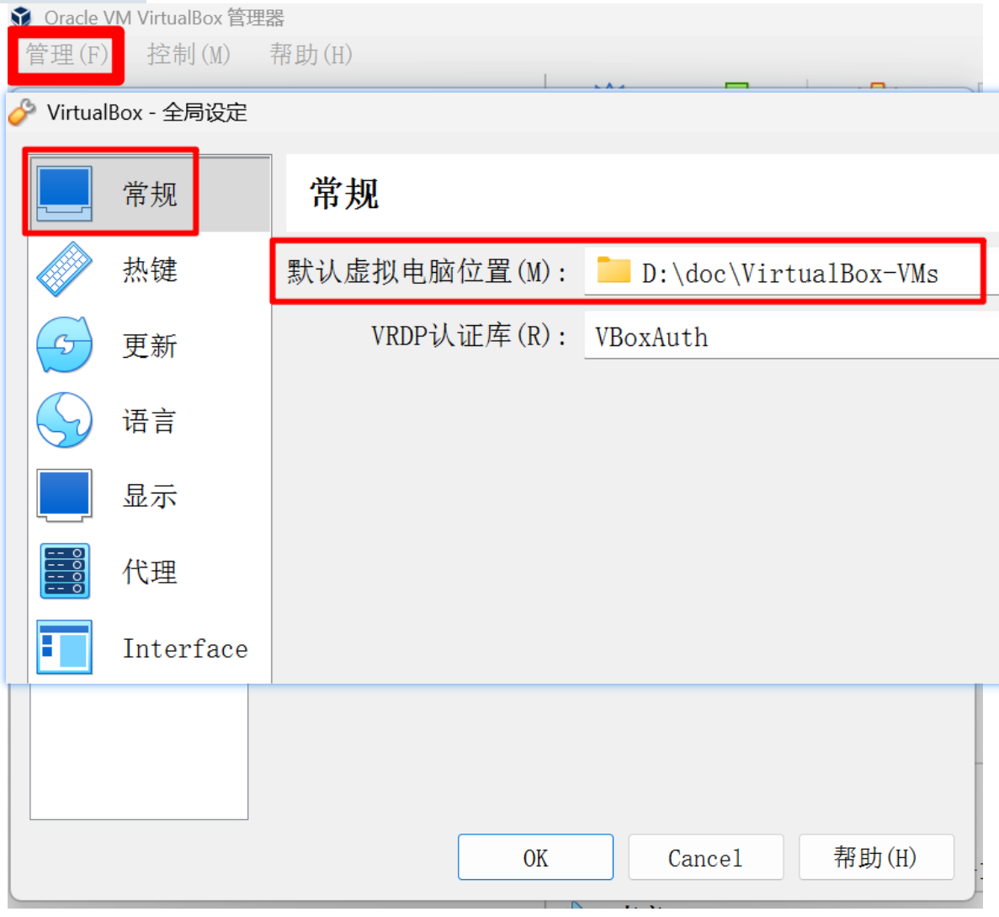
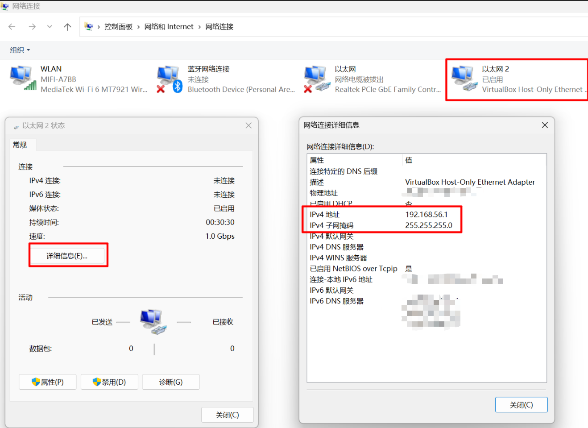

<!-- START doctoc generated TOC please keep comment here to allow auto update -->
<!-- DON'T EDIT THIS SECTION, INSTEAD RE-RUN doctoc TO UPDATE -->
**Table of Contents**  *generated with [DocToc](https://github.com/thlorenz/doctoc)*

- [1.VirtualBox安装|基本使用](#1virtualbox%E5%AE%89%E8%A3%85%E5%9F%BA%E6%9C%AC%E4%BD%BF%E7%94%A8)
- [2.配置3台服务器|设置免密登录](#2%E9%85%8D%E7%BD%AE3%E5%8F%B0%E6%9C%8D%E5%8A%A1%E5%99%A8%E8%AE%BE%E7%BD%AE%E5%85%8D%E5%AF%86%E7%99%BB%E5%BD%95)

<!-- END doctoc generated TOC please keep comment here to allow auto update -->

## 1.VirtualBox安装|基本使用

**版本说明**：

```bash
VirtualBox版本：VirtualBox-7.0.6-155176-Win.exe
# Vagrant通过一个名为Vagrantfile的配置文件来管理虚拟机，这让环境搭建变得非常简便
vagrant版本：   vagrant_2.4.9_windows_amd64.msi
```

VirtualBox 和 vagrant安装完成之后，为了避免虚拟机文件占用过多 C 盘空间，可以**修改 VirtualBox 默认虚拟机位置**，打开
VirtualBox，依次点击 **管理** -> **全局设定** -> **常规**，修改“默认虚拟电脑位置”



**初始化与配置**

- 创建新文件夹`D:\abcd\vagrant_centos7`，然后在此文件夹中打开命令行窗口

- 执行初始化命令

  ```bash
  # 执行初始化命令，会在当前目录生成 Vagrantfile配置文件
  vagrant init centos/7
  ```

- 查看VirtualBox主机网络适配器的IP
    - 打开 Windows 的 **控制面板** > **网络和 Internet** > **网络和共享中心**。在左侧点击 **“更改适配器设置”**
      。在网络连接列表中，找到名为 **“VirtualBox Host-Only Ethernet Adapter”** 的连接，并双击它。在弹出的状态窗口中，点击
      **“详细信息”** 按钮。在“网络连接详细信息”列表里，找到 **“IPv4 地址”** 这一行。其对应的值（例如 `192.168.56.1`
      ）就是宿主机的虚拟网卡 IP。需要在 Vagrantfile 中设置的 IP 地址（如 `192.168.56.10`）必须与此 IP 在同一个网段（即前三位相同）



- 打开 `Vagrantfile`，进行关键配置

  ```bash
  Vagrant.configure("2") do |config|
    config.vm.box = "centos/7"
    # 设置私有网络IP，便于宿主机访问虚拟机。IP前三位需与VirtualBox主机网络适配器的IP一致，例如192.168.56.x
    config.vm.network "private_network", ip: "192.168.56.10"
    # (可选)配置共享文件夹，将宿主机的当前目录映射到虚拟机的/vagrant目录
    config.vm.synced_folder ".", "/vagrant"
    # 使用provider配置来自定义VirtualBox虚拟机的硬件
    config.vm.provider "virtualbox" do |vb|
      # 设置虚拟机的名称
      vb.name = "CentOS-7-VM-4vCPU-8GB"
      # 分配内存大小，建议至少1GB（1024MB）
      vb.memory = "8192"
      # 分配CPU核心数
      vb.cpus = 4
    end
    # (可选)安装vbguest插件以避免每次启动时重复安装Guest Additions
    # config.vbguest.auto_update = false
  end
  ```

**启动与连接**

- 在命令行中运行以下命令，Vagrant将自动完成虚拟机的创建和启动：

  ```bash
  vagrant up
  ```

- 启动完成后，使用以下命令通过SSH登录到虚拟机：

  ```bash
  vagrant ssh
  ```

- 默认使用 `vagrant` 用户登录，该用户具有sudo权限。root用户的默认密码也是 `vagrant`

**常用命令与实用技巧**

| 命令                | 说明                                              |
|:------------------|:------------------------------------------------|
| `vagrant up`      | 启动虚拟机                                           |
| `vagrant ssh`     | 通过SSH登录到虚拟机                                     |
| `vagrant halt`    | 关闭虚拟机                                           |
| `vagrant reload`  | 重启虚拟机（相当于先`halt`再`up`），修改Vagrantfile后常用此命令使配置生效 |
| `vagrant suspend` | 暂停虚拟机（类似休眠，恢复快）                                 |
| `vagrant destroy` | **销毁虚拟机**，删除所有数据，释放磁盘空间                         |
| `vagrant status`  | 查看当前虚拟机的状态                                      |

**安装增强功能（Guest Additions）**

- 显著提升虚拟机的性能，特别是共享文件夹和显示性能。可以安装 `vagrant-vbguest` 插件来自动管理

```bash
vagrant plugin install vagrant-vbguest
vagrant reload
```

**使用Xshell、Termius等第三方SSH工具连接**

- Windows自带的命令行可能不支持 `vagrant ssh`。可以使用Xshell等工具连接。首先，在虚拟机内启用密码登录并设置root密码，然后使用分配的私有IP（如
  `192.168.56.10`）和端口`22`进行连接
- Termius连接虚拟机：

| 解决方案                    | 核心思路                                | 关键检查点/命令                                                                                                                       |
|:------------------------|:------------------------------------|:-------------------------------------------------------------------------------------------------------------------------------|
| **① 配置 Termius 使用密钥登录** | 让 Termius 使用 Vagrant 自动生成的私钥进行认证    | 在 Termius 的 “Identity” 设置中，选择路径 `[Vagrantfile所在目录]/.vagrant/machines/default/virtualbox/private_key` 下的私钥文件                    |
| **② 启用虚拟机内的密码认证**       | 修改虚拟机内 SSH 服务配置，允许使用 `vagrant` 密码登录 | 1. 通过 `vagrant ssh` 登录。 2. 编辑 `/etc/ssh/sshd_config` 文件，确保包含 `PasswordAuthentication yes`。 3. 执行 `sudo systemctl restart sshd` |
| **③ 检查网络与基础连接**         | 确认虚拟机已启动且网络设置正确，特别是端口转发规则           | 1. 在项目目录下执行 `vagrant status`。 2. 在 VirtualBox 中检查虚拟机的“网络”设置，确保端口转发规则正确配置                                                       |

```bash
# 在win11的命令行窗口或者Termius的TERMINAL下进行连接
C:\Users\12345> ssh -i "D:\abcd\vagrant_centos7\.vagrant\machines\default\virtualbox\private_key" vagrant@192.168.56.10
```

`scp`文件传递命令：

```bash
# 从 Windows本地 上传文件到 Linux 服务器 
scp -i "D:\doc\centos7\.vagrant\machines\default\virtualbox\private_key" "E:\dljd-kafka\ruanjian\kafka-eagle-bin-3.0.1.tar.gz" vagrant@192.168.56.10:/home/vagrant/

# 从 Linux 服务器下载文件到 Windows 本地
scp -i "D:\doc\centos7\.vagrant\machines\default\virtualbox\private_key" vagrant@192.168.56.10:/home/vagrant/kafka-eagle-bin-3.0.1.tar.gz "D:\in-action-aws"
```

## 2.配置3台服务器|设置免密登录

1.配置并启动3台centos服务器

> 配置第1台服务器并启动

```bash
# 执行初始化命令，会在当前目录生成 Vagrantfile配置文件
# win11系统的D:\doc\VM-Vagrant\server01目录下执行命令vagrant init centos/7
PS D:\doc\VM-Vagrant\server01> vagrant init centos/7

# 修改文件
"D:\doc\VM-Vagrant\server01\Vagrantfile"
# 配置如下:
Vagrant.configure("2") do |config|
  config.vm.box = "centos/7"
  # 设置私有网络IP，便于宿主机访问虚拟机。IP前三位需与VirtualBox主机网络适配器的IP一致，例如192.168.56.x
  config.vm.network "private_network", ip: "192.168.56.11"
  # (可选)配置共享文件夹，将宿主机的当前目录映射到虚拟机的/vagrant目录
  config.vm.synced_folder ".", "/vagrant"
  # 使用provider配置来自定义VirtualBox虚拟机的硬件
  config.vm.provider "virtualbox" do |vb|
    # 设置虚拟机的名称
    vb.name = "CentOS-7-VM-2vCPU-4GB-Server01"
    # 分配内存大小，建议至少1GB（1024MB）
    vb.memory = "4096"
    # 分配CPU核心数
    vb.cpus = 2
  end
  # (可选)安装vbguest插件以避免每次启动时重复安装Guest Additions
  # config.vbguest.auto_update = false
end

PS D:\doc\VM-Vagrant\server01> vagrant up
```

> 配置第2台服务器并启动

```bash
# win11系统的D:\doc\VM-Vagrant\server02目录下执行命令vagrant init centos/7
PS D:\doc\VM-Vagrant\server02> vagrant init centos/7


# 修改文件
"D:\doc\VM-Vagrant\server02\Vagrantfile"
# 配置如下:
Vagrant.configure("2") do |config|
  config.vm.box = "centos/7"
  # 设置私有网络IP，便于宿主机访问虚拟机。IP前三位需与VirtualBox主机网络适配器的IP一致，例如192.168.56.x
  config.vm.network "private_network", ip: "192.168.56.12"
  # (可选)配置共享文件夹，将宿主机的当前目录映射到虚拟机的/vagrant目录
  config.vm.synced_folder ".", "/vagrant"
  # 使用provider配置来自定义VirtualBox虚拟机的硬件
  config.vm.provider "virtualbox" do |vb|
    # 设置虚拟机的名称
    vb.name = "CentOS-7-VM-2vCPU-2GB-Server02"
    # 分配内存大小，建议至少1GB（1024MB）
    vb.memory = "2048"
    # 分配CPU核心数
    vb.cpus = 2
  end
  # (可选)安装vbguest插件以避免每次启动时重复安装Guest Additions
  # config.vbguest.auto_update = false
end

PS D:\doc\VM-Vagrant\server02> vagrant up
```

> 配置第3台服务器并启动

```bash
# win11系统的D:\doc\VM-Vagrant\server03目录下执行命令vagrant init centos/7
PS D:\doc\VM-Vagrant\server03> vagrant init centos/7


# 修改文件
"D:\doc\VM-Vagrant\server03\Vagrantfile"
Vagrant.configure("2") do |config|
  config.vm.box = "centos/7"
  # 设置私有网络IP，便于宿主机访问虚拟机。IP前三位需与VirtualBox主机网络适配器的IP一致，例如192.168.56.x
  config.vm.network "private_network", ip: "192.168.56.13"
  # (可选)配置共享文件夹，将宿主机的当前目录映射到虚拟机的/vagrant目录
  config.vm.synced_folder ".", "/vagrant"
  # 使用provider配置来自定义VirtualBox虚拟机的硬件
  config.vm.provider "virtualbox" do |vb|
    # 设置虚拟机的名称
    vb.name = "CentOS-7-VM-2vCPU-2GB-Server03"
    # 分配内存大小，建议至少1GB（1024MB）
    vb.memory = "2048"
    # 分配CPU核心数
    vb.cpus = 2
  end
  # (可选)安装vbguest插件以避免每次启动时重复安装Guest Additions
  # config.vbguest.auto_update = false
end

PS D:\doc\VM-Vagrant\server03> vagrant up
```

2.连接服务器

```bash
ssh -i "D:\doc\VM-Vagrant\server01\.vagrant\machines\default\virtualbox\private_key" vagrant@192.168.56.11

ssh -i "D:\doc\VM-Vagrant\server02\.vagrant\machines\default\virtualbox\private_key" vagrant@192.168.56.12

ssh -i "D:\doc\VM-Vagrant\server03\.vagrant\machines\default\virtualbox\private_key" vagrant@192.168.56.13
```

3.设置主机名

```bash
# 设置主机名：
# 在对应的服务器上执行以下命令：

# 在 192.168.10.11 上执行
sudo hostnamectl set-hostname server01

# 在 192.168.10.12 上执行
sudo hostnamectl set-hostname server02

# 在 192.168.10.13 上执行
sudo hostnamectl set-hostname server03
```

4.配置 hosts 文件

```bash
# 编辑hosts文件（所有服务器相同配置）
sudo tee -a /etc/hosts << EOF
192.168.56.11 server01
192.168.56.12 server02
192.168.56.13 server03
EOF

# 重启网络服务或重新登录使主机名生效
sudo systemctl restart systemd-hostnamed

# 测试连接
[vagrant@server02 ~]$ ping server01
[vagrant@server02 ~]$ ping server02
[vagrant@server02 ~]$ ping server03


# win11系统host配置
# 编辑"C:\Windows\System32\drivers\etc\hosts"文件
192.168.56.11 server01
192.168.56.12 server02
192.168.56.13 server03
```

5.配置SSH免密登录

```bash
# 在Linux系统中，用户密码通常是以加密的形式存储在/etc/shadow文件中，且不能被直接查看
# 系统管理员可以更改用户密码，或者为其他机器设置免密登录（通过SSH密钥对）来避免每次输入密码

# 步骤1: 临时启用密码认证（用于初始设置）
# 在每台服务器上执行如下命令
# 备份原始SSH配置
sudo cp /etc/ssh/sshd_config /etc/ssh/sshd_config.backup
# 编辑SSH配置，临时启用密码认证
sudo vi /etc/ssh/sshd_config
# /etc/ssh/sshd_config中找到并修改以下行
PasswordAuthentication yes
PubkeyAuthentication yes
# 重启SSH服务
sudo systemctl restart sshd


# 步骤2: 检查当前密码状态
# 检查当前用户
whoami
# 检查是否可以sudo不需要密码
sudo -n true
echo $?
# 返回0表示可以无密码sudo


# 步骤3：设置vagrant用户密码
# 设置vagrant用户密码
sudo passwd vagrant


# 步骤4: 配置SSH免密登录
# 在所有服务器上生成SSH密钥对：
# 生成RSA密钥对（一路回车使用默认值）
# ssh-keygen -t rsa
# 或者使用更安全的ed25519算法（此处使用ed25519）
ssh-keygen -t ed25519
# 查看生成情况
# 命令ls -la ~/.ssh/
# ls -la ~/.ssh/
[vagrant@server02 ~]$ ls -la ~/.ssh/
total 28
drwx------. 2 vagrant vagrant  134 Oct 29 16:51 .
drwx------. 3 vagrant vagrant   95 Oct 29 13:50 ..
-rw-------. 1 vagrant vagrant  383 Oct 29 15:54 authorized_keys
-rw-r--r--. 1 vagrant vagrant  332 Oct 29 16:51 config
-rw-------. 1 vagrant vagrant  411 Oct 29 15:53 id_ed25519
-rw-r--r--. 1 vagrant vagrant   98 Oct 29 15:53 id_ed25519.pub
-rw-------. 1 vagrant vagrant 3243 Oct 29 14:06 id_rsa
-rw-r--r--. 1 vagrant vagrant  738 Oct 29 14:06 id_rsa.pub
-rw-r--r--. 1 vagrant vagrant  552 Oct 29 14:12 known_hosts


# 步骤5：创建并分发授权密钥
# 手动分发（推荐用于生产环境）
# 在每台服务器上都需要执行包括自己在内的所有服务器的 ssh-copy-id 命令
# ssh-copy-id 是一个用于将本地用户的公钥复制到远程主机的 authorized_keys 文件中的脚本。它简化了设置SSH免密登录的过程。
# ssh-copy-id会将公钥追加到目标机器的authorized_keys中，所以需要在每台机器上执行两次ssh-copy-id（分别针对另外两台机器）
# 在server01上执行：
ssh-copy-id server01
ssh-copy-id server02  
ssh-copy-id server03

# 在server02上执行
ssh-copy-id server01
ssh-copy-id server02
ssh-copy-id server03

# 在server03上执行
ssh-copy-id server01
ssh-copy-id server02
ssh-copy-id server03


# 步骤6: 测试SSH免密登录
# 从任一服务器测试连接到其他服务器
# 从server01测试
ssh server02 date
ssh server03 date

# 从server02测试  
ssh server01 date
ssh server03 date

# 从server03测试
ssh server01 date
ssh server02 date

# 快速文件传输
# 不使用配置
scp -i ~/.ssh/id_rsa -P 22 file.txt root@server01:/tmp/
# 使用配置
scp file.txt server01:/tmp/


# 步骤7: 重新禁用密码认证（可选）
# 如果为了安全想要禁用密码认证
sudo vi /etc/ssh/sshd_config
# 修改为
PasswordAuthentication no
# 重启SSH服务
sudo systemctl restart sshd


# 步骤8：配置SSH客户端（可选优化）
# 配置的作用
# 定义主机别名：为每个服务器定义一个短名称（如server01），在连接时可以直接使用这个别名，而不需要输入完整的主机名或IP地址。
# 指定连接参数：对于每个主机别名，配置中指定了实际的主机名（HostName）、登录用户（User）、端口（Port）和身份认证文件（IdentityFile）。
# 配置解读
# Host server01: 定义了一个简短的别名，可以通过 ssh server01 快速连接
# HostName server01: 指定实际的主机名（从 /etc/hosts 或DNS解析）
# User root: 指定默认登录用户
# Port 22: 指定SSH端口
# IdentityFile: 指定使用的私钥文件
# 主要好处: 
    # 1.简化连接命令
    # 不使用配置时
    # ssh -i ~/.ssh/id_rsa -p 22 root@server01
    # 使用配置后：
    # ssh server01  # 一行命令搞定！
    # 2.提高工作效率
    # 集群管理变得非常简单
    # ssh server01 "systemctl status nginx"
    # ssh server02 "docker ps"
    # ssh server03 "tail -f /var/log/messages"
    # 批量执行命令
    for host in server01 server02 server03; do
        ssh $host "hostname; date"
    done

# 编辑所有服务器的SSH配置文件
vi ~/.ssh/config
# 添加以下内容
# 修改为以下内容（使用vagrant用户）
[vagrant@server02 ~]$ vi ~/.ssh/config
[vagrant@server02 ~]$ cat ~/.ssh/config
	Host server01
    HostName server01
    User vagrant
    Port 22
    IdentityFile ~/.ssh/id_ed25519

Host server02
    HostName server02
    User vagrant
    Port 22
    IdentityFile ~/.ssh/id_ed25519

Host server03
    HostName server03
    User vagrant
    Port 22
    IdentityFile ~/.ssh/id_ed25519

# 设置正确的权限
# 权限解读
# 保护配置中的敏感信息
# chmod 600 ~/.ssh/config
# 确保只有所有者可以访问SSH目录
# chmod 700 ~/.ssh
# 保护私钥，SSH要求严格权限
# chmod 600 ~/.ssh/id_rsa
# 公钥可以公开
# chmod 644 ~/.ssh/id_rsa.pub
# 已知主机文件
# chmod 644 ~/.ssh/known_hosts 
chmod 644 ~/.ssh/config
chmod 700 ~/.ssh
chmod 600 ~/.ssh/id_ed25519
chmod 600 ~/.ssh/id_rsa
chmod 644 ~/.ssh/id_ed25519.pub
chmod 644 ~/.ssh/id_rsa.pub
chmod 644 ~/.ssh/known_hosts
chmod 600 ~/.ssh/authorized_keys
```


