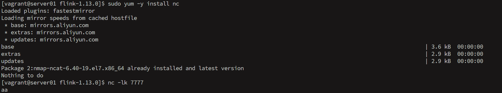
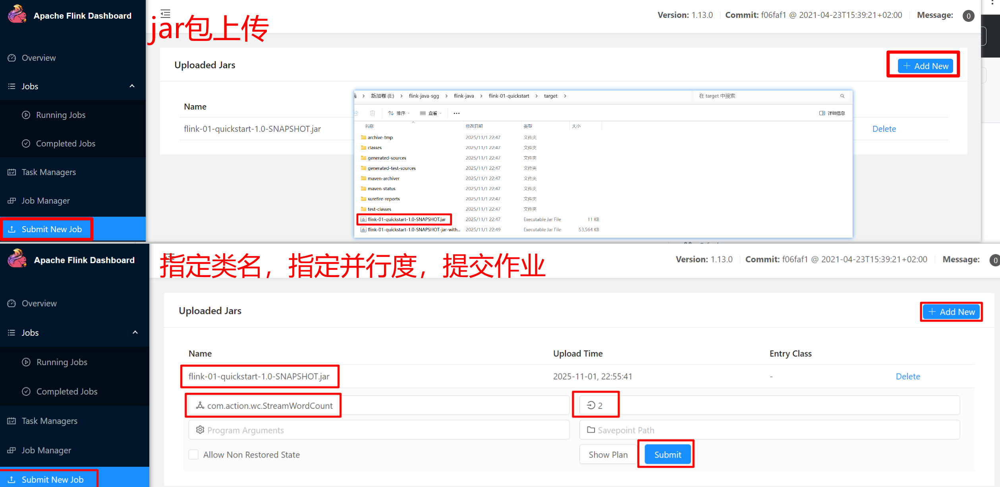
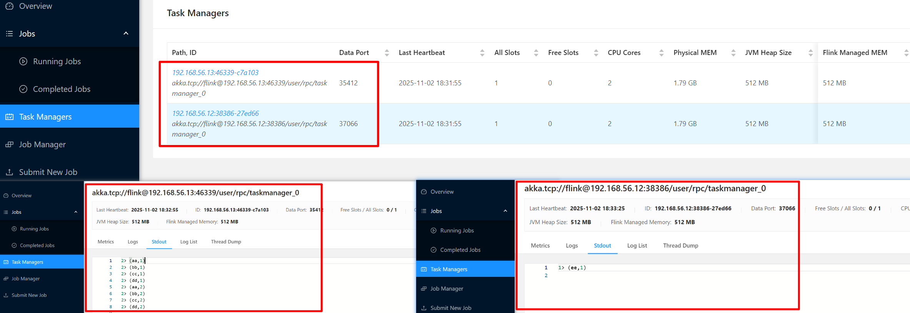

<!-- START doctoc generated TOC please keep comment here to allow auto update -->
<!-- DON'T EDIT THIS SECTION, INSTEAD RE-RUN doctoc TO UPDATE -->
**Table of Contents**  *generated with [DocToc](https://github.com/thlorenz/doctoc)*

- [1.Flink集群模式](#1flink%E9%9B%86%E7%BE%A4%E6%A8%A1%E5%BC%8F)
- [2.Standalone 部署模式](#2standalone-%E9%83%A8%E7%BD%B2%E6%A8%A1%E5%BC%8F)
  - [2.1 会话模式（Session Mode）](#21-%E4%BC%9A%E8%AF%9D%E6%A8%A1%E5%BC%8Fsession-mode)
  - [2.2 向集群提交作业](#22-%E5%90%91%E9%9B%86%E7%BE%A4%E6%8F%90%E4%BA%A4%E4%BD%9C%E4%B8%9A)
    - [2.2.1 通过 web UI 提交作业](#221-%E9%80%9A%E8%BF%87-web-ui-%E6%8F%90%E4%BA%A4%E4%BD%9C%E4%B8%9A)
    - [2.2.2 命令行方式提交作业](#222-%E5%91%BD%E4%BB%A4%E8%A1%8C%E6%96%B9%E5%BC%8F%E6%8F%90%E4%BA%A4%E4%BD%9C%E4%B8%9A)
- [3.YARN 部署模式](#3yarn-%E9%83%A8%E7%BD%B2%E6%A8%A1%E5%BC%8F)
  - [3.1 集群环境搭建](#31-%E9%9B%86%E7%BE%A4%E7%8E%AF%E5%A2%83%E6%90%AD%E5%BB%BA)
    - [3.1.1 hadoop集群环境搭建](#311-hadoop%E9%9B%86%E7%BE%A4%E7%8E%AF%E5%A2%83%E6%90%AD%E5%BB%BA)
    - [3.1.2 Flink安装配置](#312-flink%E5%AE%89%E8%A3%85%E9%85%8D%E7%BD%AE)
  - [3.2 YARN会话模式（Session Mode）](#32-yarn%E4%BC%9A%E8%AF%9D%E6%A8%A1%E5%BC%8Fsession-mode)
  - [3.3 YARN单作业模式（Per-Job Mode）](#33-yarn%E5%8D%95%E4%BD%9C%E4%B8%9A%E6%A8%A1%E5%BC%8Fper-job-mode)
  - [3.4 YARN应用模式（doc Mode）](#34-yarn%E5%BA%94%E7%94%A8%E6%A8%A1%E5%BC%8Fdoc-mode)
  - [3.5 常用命令与问题排查](#35-%E5%B8%B8%E7%94%A8%E5%91%BD%E4%BB%A4%E4%B8%8E%E9%97%AE%E9%A2%98%E6%8E%92%E6%9F%A5)

<!-- END doctoc generated TOC please keep comment here to allow auto update -->

## 1.Flink集群模式

Flink集群模式可以从两个维度来理解：部署模式和运行模式

**部署模式**：部署模式关注底层基础设施，包括Standalone、YARN和Kubernetes等。Standalone简单但功能有限，YARN适合已有Hadoop环境，Kubernetes则是云原生场景的首选。

**运行模式**：运行模式关注应用程序的调度和资源管理方式，主要包括Session、Per-Job和doc三种。三种模式的区别主要体现在集群生命周期、资源隔离和main()方法执行位置等关键维度上。三种模式的核心区别：1.Session模式是共享集群，适合短作业。2.Per-Job模式是独占集群，适合长作业。3.doc模式则是把应用程序逻辑放在集群端执行。

**三种运行模式比较**：

| 维度                     | Session 模式                     | Per-Job 模式                                   | doc 模式                                                 |
| :----------------------- | :------------------------------- | :--------------------------------------------- | :------------------------------------------------------- |
| **集群生命周期**         | 独立于作业，预先启动，手动关闭   | 与作业绑定，随作业启动而创建，随作业结束而销毁 | 与应用（doc）绑定，随应用启动而创建，随应用结束而消亡    |
| **资源隔离性**           | 差，所有作业共享集群资源         | 好，每个作业独享集群                           | 好，应用之间隔离，应用内作业共享集群                     |
| **`main()`方法执行位置** | 客户端（Client）                 | 客户端（Client）                               | 集群（Cluster）的JobManager上                            |
| **适用场景**             | 适合规模小、执行时间短的大量作业 | 适合长时间运行、稳定性要求高的大型作业         | 适合长时间运行的应用，以及依赖复杂或客户端资源紧张的场景 |

**三种运行模式**：

- **Session 模式**：**多作业共享集群**
  这种模式会**预先启动一个Flink集群**（包括JobManager和TaskManager）。这个集群像一种服务，**接收多个作业提交**，所有作业共享集群的资源。作业完成后，集群并不会销毁，而是继续运行等待下一个作业。
  - **工作流程**：先启动一个Flink Session集群，客户端将作业提交到这个集群的Dispatcher，由Dispatcher为每个作业启动一个JobMaster来管理。
  - **优点**：**作业启动快**，因为省去了集群启动和资源分配的时间。
  - **缺点**：**资源隔离性差**，某个作业行为异常（如耗尽内存）可能影响同集群其他作业；且JobManager存在**单点故障风险**，一旦出错会影响所有托管作业。
- **Per-Job 模式**：**为每个作业独立建集群**
  在这种模式下，**每个提交的作业都会独立启动一个专用的Flink集群**。这个集群只为这一个作业服务，作业完成后，集群随之解散，资源被释放。
  - **工作流程**：客户端提交作业，集群管理器（如YARN）首先为这个作业启动一个JobManager，然后JobManager根据需要申请TaskManager资源，作业执行完毕后，集群拆除。
  - **优点**：**资源隔离性好**，作业之间互不影响；作业的失败范围被限制在各自的集群内。
  - **缺点**：**作业启动延迟较高**，因为需要为每个作业单独申请资源并启动集群。
- **doc 模式**：**以应用为中心**
  这是Flink 1.11引入的新模式，可以看作是Per-Job模式的优化。它的核心思想是**为每一个Flink应用（doc）创建一个集群**。一个应用可以包含多个作业（例如，通过多次调用`execute()`）。最关键的区别在于，**应用的`main()`方法将在集群的JobManager上执行**，而非客户端。
  - **工作流程**：客户端只需将应用JAR包及其依赖提交给集群管理器。集群启动后，应用的`main()`方法在JobManager上被调用，进而生成JobGraph。
  - **优点**：**降低了客户端的负担**，尤其当应用依赖复杂或资源需求大时；更符合"应用"部署的直观逻辑。
  - **缺点**：不适合需要频繁提交大量小作业的场景；应用的日志集中在集群端，调试可能稍显不便。

**不同的部署环境**：

> 以上三种运行模式可以在不同的**部署环境**中实现，需要根据现有的技术栈和需求进行选择。

- **Standalone 模式**
  Flink自带的集群模式，不依赖外部资源管理器。
  - **优点**：部署简单，适合**测试、学习或小规模生产环境**。
  - **缺点**：资源管理功能相对薄弱，需要手动管理资源，**缺乏高效的资源隔离和弹性扩缩容能力**。
- **Flink on YARN**
  在Hadoop YARN资源管理器上运行Flink，是企业中常用的模式。
  - **优点**：可以**与Hadoop生态系统无缝集成**，充分利用YARN强大的资源管理和调度能力，实现多租户资源共享。
  - **缺点**：**部署和维护相对复杂**，依赖于Hadoop/YARN环境。
- **Flink on Kubernetes**
  在Kubernetes容器编排平台上以容器化的方式运行Flink，是云原生时代的首选。
  - **优点**：**弹性伸缩能力强**，可以更好地利用容器技术的优势，实现高效的资源管理和应用编排。
  - **缺点**：**技术门槛较高**，需要掌握Kubernetes相关技能。

 

## 2.Standalone 部署模式

### 2.1 会话模式（Session Mode）

1.flink下载

```bash
# 官网下载页面
https://flink.apache.org/downloads/
# 稳定发行版
https://flink.apache.org/downloads/#all-stable-releases
# Flink官网下载页面
https://archive.apache.org/dist/flink/
```

2.安装Java 1.8（所有机器执行）

```bash
# 检查系统类型
cat /etc/os-release

# 根据系统类型安装 Java（这里以 CentOS 为例）
# 安装JDK（Java 1.8）
sudo yum update -y
sudo yum install -y java-1.8.0-openjdk java-1.8.0-openjdk-devel

# 验证 Java 安装
java -version
javac -version

# 设置 JAVA_HOME 环境变量
echo 'export JAVA_HOME=/usr/lib/jvm/java-1.8.0-openjdk' >> ~/.bashrc
echo 'export PATH=$JAVA_HOME/bin:$PATH' >> ~/.bashrc
source ~/.bashrc

# 确认 JAVA_HOME 设置
# echo $JAVA_HOME
[vagrant@server02 ~]$ echo $JAVA_HOME
/usr/lib/jvm/java-1.8.0-openjdk
```

3.上传和解压Flink安装包

```bash
# 上传flink压缩包
# 先上传到vagrant用户有权限的目录
scp -i "D:\doc\VM-Vagrant\server01\.vagrant\machines\default\virtualbox\private_key" "E:\flink-java-sgg\flink-1.13.0-bin-scala_2.12.tgz" vagrant@192.168.56.11:/home/vagrant/
```

4.集群规划设计

```bash
# 集群规划设计
┌────────────┬─────────────┬─────────────┬─────────────┐
│ 节点服务器 │  server01   │  server02   │  server03   │
├────────────┼─────────────┼─────────────┼─────────────┤
│    角色    │  JobManager │ TaskManager │ TaskManager │
└────────────┴─────────────┴─────────────┴─────────────┘
```

5.配置Flink（在server01上操作）

```bash
# 解压Flink到指定目录
# sudo tar -zxvf /home/vagrant/flink-1.13.0-bin-scala_2.12.tgz -C /opt/module/flink/
[vagrant@server01 ~]$ pwd
/home/vagrant
[vagrant@server01 ~]$ ls
flink-1.13.0-bin-scala_2.12.tgz
[vagrant@server01 ~]$ sudo mkdir -p /opt/module/flink/
[vagrant@server01 ~]$
[vagrant@server01 ~]$
[vagrant@server01 ~]$
[vagrant@server01 ~]$ sudo tar -zxvf /home/vagrant/flink-1.13.0-bin-scala_2.12.tgz -C /opt/module/flink/


# 进入Flink配置目录
cd /opt/module/flink/flink-1.13.0/conf
[vagrant@server01 conf]$ ls
flink-conf.yaml           log4j.properties          logback-session.xml  workers
log4j-cli.properties      log4j-session.properties  logback.xml          zoo.cfg
log4j-console.properties  logback-console.xml       masters

# 备份原始配置
# cp flink-conf.yaml flink-conf.yaml.backup
[vagrant@server01 conf]$ cp flink-conf.yaml flink-conf.yaml.backup

# 编辑配置文件
# JobManager 节点地址修改
# jobmanager.rpc.address: server01
[vagrant@server01 conf]$ sudo vim flink-conf.yaml
[vagrant@server01 conf]$ cat flink-conf.yaml | grep jobmanager.rpc.address
jobmanager.rpc.address: server01
# 其他配置参数说明
# jobmanager.memory.process.size：对 JobManager 进程可使用到的全部内存进行配置，包括 JVM 元空间和其他开销，默认为 1600M，可以根据集群规模进行适当调整。

# taskmanager.memory.process.size：对 TaskManager 进程可使用到的全部内存进行配置，包括 JVM 元空间和其他开销，默认为 1600M，可以根据集群规模进行适当调整。

# taskmanager.numberOfTaskSlots：对每个 TaskManager 能够分配的 Slot 数量进行配置，默认为 1，可根据 TaskManager 所在的机器能够提供给 Flink 的 CPU 数量决定。所谓 Slot 就是TaskManager 中具体运行一个任务所分配的计算资源。

# parallelism.default：Flink 任务执行的默认并行度，优先级低于代码中进行的并行度配置和任务提交时使用参数指定的并行度数量。

# JobManager RPC地址（指向server01）
# jobmanager.rpc.address: server01

# JobManager堆内存大小（根据服务器内存调整）
# jobmanager.memory.process.size: 1024m

# TaskManager堆内存大小（根据服务器内存调整）
# taskmanager.memory.process.size: 1024m

# 每个TaskManager的task slots数量
# taskmanager.numberOfTaskSlots: 2

# 并行度默认值
# parallelism.default: 2


# 配置workers文件
[vagrant@server01 conf]$ pwd
/opt/module/flink/flink-1.13.0/conf
[vagrant@server01 conf]$ sudo vim workers
[vagrant@server01 conf]$ cat workers
server02
server03
```

6.分发Flink到其他节点

```bash
# 从server01分发到server02和server03（在server01上执行）

# 修改目标服务器server02目录权限
ssh server02 "sudo chown -R vagrant:vagrant /opt/module/ && chmod 755 /opt/module/"
# 分发到server02
scp -r /opt/module/flink/ server02:/opt/module/

# 修改目标服务器server03目录权限
ssh server03 "sudo chown -R vagrant:vagrant /opt/module/ && chmod 755 /opt/module/"
# 分发到server03  
scp -r /opt/module/flink/ server03:/opt/module/
```

7.启动Flink集群

```bash
# 在 server01 节点服务器上执行 start-cluster.sh 启动 Flink 集群
[vagrant@server01 ~]$ cd /opt/module/flink/flink-1.13.0
[vagrant@server01 flink-1.13.0]$ pwd
/opt/module/flink/flink-1.13.0
[vagrant@server01 flink-1.13.0]$ ls
bin  conf  examples  lib  LICENSE  licenses  log  NOTICE  opt  plugins  README.txt
# 启动集群
# bin/start-cluster.sh
[vagrant@server01 flink-1.13.0]$ bin/start-cluster.sh
Starting cluster.
Starting standalonesession daemon on host server01.
Starting taskexecutor daemon on host server02.
Starting taskexecutor daemon on host server03.

# 查看启动状态
# bin/flink list

# 验证集群状态
# 在浏览器中访问（从宿主机）
http://192.168.56.11:8081


# 常用管理命令
# 正常停止整个集群
bin/stop-cluster.sh

# 重启集群
bin/stop-cluster.sh
bin/start-cluster.sh

# 查看集群信息
bin/flink --help

# 提交作业
bin/flink run -d -c com.example.YourClass your-job.jar
```

### 2.2 向集群提交作业

#### 2.2.1 通过 web UI 提交作业

> 通过web UI进行作业提交：在浏览器中访问`http://192.168.56.11:8081`

1.安装 nc 工具，启动 nc 监听 7777 端口

```bash
# 安装 nc 工具（如果没有）
# sudo yum -y install nc
# sudo apt-get install netcat-openbsd
[vagrant@server01 flink-1.13.0]$ sudo yum -y install nc
# 启动 nc 监听 7777 端口
# nc -lk 7777
[vagrant@server01 flink-1.13.0]$ nc -lk 7777
aa
bb
cc
dd
ee
aa
bb
cc
dd
```



2.上传jar包，指定类名，指定并行度，提交作业



3.在 nc 终端中输入数据（每条消息后按回车）：


4.查看作业详情


5.查看TaskManager详情



#### 2.2.2 命令行方式提交作业

```bash
# 在server01主机上启动 nc 监听 7777 端口
# nc -lk 7777
[vagrant@server01 ~]$ nc -lk 7777


# 在win11系统上上传jar包到server02机器
# scp -i "D:\doc\VM-Vagrant\server02\.vagrant\machines\default\virtualbox\private_key" "E:\flink-java-sgg\flink-java\flink-01-quickstart\target\flink-01-quickstart-1.0-SNAPSHOT.jar" vagrant@192.168.56.12:/home/vagrant/


# 在server02上通过命令提交作业
# cd ~ 到用户目录/home/vagrant/
[vagrant@server02 flink-1.13.0]$ cd ~
[vagrant@server02 ~]$ ls
flink-01-quickstart-1.0-SNAPSHOT.jar
# 拷贝jar包到/opt/module/flink/flink-1.13.0目录
[vagrant@server02 ~]$ mv flink-01-quickstart-1.0-SNAPSHOT.jar /opt/module/flink/flink-1.13.0
[vagrant@server02 ~]$ cd /opt/module/flink/flink-1.13.03.0
[vagrant@server02 flink-1.13.0]$ ls
bin                                   licenses
conf                                  log
examples                              NOTICE
flink-01-quickstart-1.0-SNAPSHOT.jar  opt
lib                                   plugins
LICENSE                               README.txt

# 在server02上通过命令提交作业
# 通过命令提交作业
# ./bin/flink run -m server01:8081 -c com.action.wc.StreamWordCount -p 2 ./flink-01-quickstart-1.0-SNAPSHOT.jar
[vagrant@server02 flink-1.13.0]$ ./bin/flink run -m server01:8081 -c com.action.wc.StreamWordCount -p 2 ./flink-01-quickstart-1.0-SNAPSHOT.jar
Job has been submitted with JobID 58db9347b97a05e5bea8f638032f14ca
Program execution finished
Job with JobID 58db9347b97a05e5bea8f638032f14ca has finished.
Job Runtime: 89856 ms


# 在server01主机上启动 nc 监听 7777 端口
# 在 nc 终端中输入数据
[vagrant@server01 ~]$ nc -lk 7777
aa
bb
cc
dd
ee
ff
gg
aa
bb
cc
dd
ee
ff
gg
[vagrant@server01 ~]$

# 取消作业
[vagrant@server02 flink-1.13.0]$ ./bin/flink cancel 58db9347b97a05e5bea8f638032f14ca
Cancelling job 58db9347b97a05e5bea8f638032f14ca.
```

## 3.YARN 部署模式

> Flink YARN 模式支持 3 种部署方式：会话模式（Session Mode）、单作业模式（Per-Job Mode）、应用模式（doc Mode）

### 3.1 集群环境搭建

#### 3.1.1 hadoop集群环境搭建

> 集群规划：`server01（192.168.56.11）` 作为 NameNode/ResourceManager，`server02（192.168.56.12）` 和 `server03（192.168.56.13）` 作为 DataNode/NodeManager

1.卸载现有 Java 环境（卸载上一节安装的java jdk，所有机器执行）

```bash
# 上一节的jdk安装后在~/.bashrc中配置，现在重新安装jdk，改到/etc/profile中进行配置
# ~/.bashrc 和 /etc/profile 区别:
# 作用范围不同:
# ~/.bashrc是用户级别的配置文件，只对当前用户有效。
# /etc/profile是系统级别的配置文件，对所有用户都有效。
# 执行顺序不同:
# 当用户登录时，首先执行/etc/profile，然后执行用户主目录下的~/.bashrc
# 因此，/etc/profile中的设置会影响到所有用户，而~/.bashrc中的设置仅影响当前用户


# 1. 手动编辑删除~/.bashrc中的jdk配置
# 清除环境变量配置
# 使用文本编辑器打开 ~/.bashrc 文件
vim ~/.bashrc
# 或者使用 nano
nano ~/.bashrc
# 在文件中找到并删除以下两行
export JAVA_HOME=/usr/lib/jvm/java-1.8.0-openjdk
export PATH=$JAVA_HOME/bin:$PATH

# 保存退出后，重新加载配置
source ~/.bashrc

# 临时清除当前会话的环境变量
unset JAVA_HOME
export PATH=$(echo $PATH | sed 's|:/usr/lib/jvm[^:]*||g')

# 2. 卸载 OpenJDK 包
# 查看已安装的 Java 包
rpm -qa | grep java
# 卸载 OpenJDK 包
sudo yum remove -y java-1.8.0-openjdk java-1.8.0-openjdk-devel
# 清理残留文件
sudo rm -rf /usr/lib/jvm/java-1.8.0-openjdk*

# 3. 验证卸载
# 检查 Java 是否已卸载
java -version
# 应该显示 "command not found"
which java
# 应该没有输出
```

2.jdk安装（所有机器执行）

```bash
# win11 系统上传jak安装包到Linux centos机器
# scp -i "D:\doc\VM-Vagrant\server01\.vagrant\machines\default\virtualbox\private_key" "E:\Hadoop-2-sgg\jdk-8u144-linux-x64.tar.gz" vagrant@192.168.56.11:/home/vagrant/

# scp -i "D:\doc\VM-Vagrant\server02\.vagrant\machines\default\virtualbox\private_key" "E:\Hadoop-2-sgg\jdk-8u144-linux-x64.tar.gz" vagrant@192.168.56.12:/home/vagrant/

# scp -i "D:\doc\VM-Vagrant\server03\.vagrant\machines\default\virtualbox\private_key" "E:\Hadoop-2-sgg\jdk-8u144-linux-x64.tar.gz" vagrant@192.168.56.13:/home/vagrant/

# 解压到/opt/module/目录
sudo tar -zxvf /home/vagrant/jdk-8u144-linux-x64.tar.gz -C /opt/module/

# cd 到 /opt/module/目录
# 获取安装目录/opt/module/jdk1.8.0_144
[vagrant@server01 ~]$ cd /opt/module/jdk1.8.0_144/
[vagrant@server01 jdk1.8.0_144]$ pwd
/opt/module/jdk1.8.0_144


# 编辑环境变量
sudo vim /etc/profile
# 在/etc/profile中添加如下配置 
# JDK 1.8.0_144 环境变量配置
##JAVA_HOME
export JAVA_HOME=/opt/module/jdk1.8.0_144
export JRE_HOME=$JAVA_HOME/jre
export CLASSPATH=.:$JAVA_HOME/lib:$JRE_HOME/lib:$CLASSPATH
export PATH=$JAVA_HOME/bin:$JRE_HOME/bin:$PATH


# 加载最新配置
source /etc/profile

# 验证安装，查看版本
# java -version
# which java
[vagrant@server01 jdk1.8.0_144]$ java -version
java version "1.8.0_144"
Java(TM) SE Runtime Environment (build 1.8.0_144-b01)
Java HotSpot(TM) 64-Bit Server VM (build 25.144-b01, mixed mode)
[vagrant@server01 jdk1.8.0_144]$ which java
/opt/module/jdk1.8.0_144/bin/java
```

3.安装hadoop

```bash
# hadoop下载
# 网址：https://archive.apache.org/dist/hadoop/core/

# win11上传安装包文件到Linux centos
scp -i "D:\doc\VM-Vagrant\server01\.vagrant\machines\default\virtualbox\private_key" "E:\Hadoop-2-sgg\hadoop-2.7.2.tar.gz" vagrant@192.168.56.11:/home/vagrant/

# 解压
sudo tar -zxvf hadoop-2.7.2.tar.gz -C /opt/module/

# cd 到 /opt/module/hadoop-2.7.2/ 目录
# cd /opt/module/hadoop-2.7.2/
# 获取hadoop安装目录 /opt/module/hadoop-2.7.2
[vagrant@server01 module]$ cd /opt/module/hadoop-2.7.2/
[vagrant@server01 ~]$ cd /opt/module/hadoop-2.7.2/
[vagrant@server01 hadoop-2.7.2]$ ls
bin  etc  include  lib  libexec  LICENSE.txt  NOTICE.txt  README.txt  sbin  share
[vagrant@server01 hadoop-2.7.2]$ pwd
/opt/module/hadoop-2.7.2

# 配置hadoop
sudo vim /etc/profile
# 添加如下配置
##HADOOP_HOME
export HADOOP_HOME=/opt/module/hadoop-2.7.2
export PATH=$PATH:$HADOOP_HOME/bin
export PATH=$PATH:$HADOOP_HOME/sbin
export HADOOP_CONF_DIR=$HADOOP_HOME/etc/hadoop
# 通过 hadoop classpath 命令获取 Hadoop 完整类路径
export HADOOP_CLASSPATH=`hadoop classpath`

# 加载最新配置
source /etc/profile
# 验证配置（必须有输出，且包含 Hadoop jar 路径）
echo $HADOOP_CLASSPATH
# 预期输出示例：/opt/module/hadoop-2.7.2/etc/hadoop:/opt/module/hadoop-2.7.2/share/hadoop/common/...（一串长路径）


# 验证安装
# hadoop version
[vagrant@server01 hadoop-2.7.2]$ hadoop version
Hadoop 2.7.2
Subversion Unknown -r Unknown
Compiled by root on 2017-05-22T10:49Z
Compiled with protoc 2.5.0
From source with checksum d0fda26633fa762bff87ec759ebe689c
This command was run using /opt/module/hadoop-2.7.2/share/hadoop/common/hadoop-common-2.7.2.jar
```

4.配置 Hadoop 分布式集群（仅 server01 执行，核心步骤）

```bash
# Hadoop 集群配置依赖 $HADOOP_HOME/etc/hadoop/ 目录下的 4 个核心配置文件，需按集群规划修改

# 1.配置 hadoop-env.sh（指定 JDK 路径）
# deepseek解读:
# hadoop-env.sh中的原配置为export JAVA_HOME=${JAVA_HOME}，建议改成具体的路径，原因如下：
# 看似 export JAVA_HOME=${JAVA_HOME} 更灵活（引用系统环境变量），但在 Hadoop 2.x + JDK 8 的集群环境中，这种写法会导致 启动失败、兼容性报错，反而写死路径是更稳定、更推荐的配置
# ${JAVA_HOME} 是 引用系统中已定义的 JAVA_HOME 环境变量—— 如果你的系统（/etc/profile 或用户级配置）已经正确设置了 JAVA_HOME=/opt/module/jdk1.8.0_144，理论上这种写法能生效
# 但 Hadoop 2.x 有个致命问题：它的启动脚本（start-dfs.sh、start-yarn.sh）在加载环境变量时，优先级和传递机制不完善，导致 {JAVA_HOME} 经常 “失效”（读取为空或读取到错误路径）
# ${JAVA_HOME} 是 “依赖外部配置” 的写法 —— 如果后续有人修改了系统 JAVA_HOME（比如升级 JDK、误删配置），Hadoop 会直接受影响，而写死路径能避免这种 “连锁故障”，尤其适合集群生产环境
sudo vim $HADOOP_HOME/etc/hadoop/hadoop-env.sh
# 找到以下行，替换为实际JDK路径（之前安装的/opt/module/jdk1.8.0_144）
export JAVA_HOME=/opt/module/jdk1.8.0_144


# 2.配置 core-site.xml（HDFS 核心配置）
sudo vim $HADOOP_HOME/etc/hadoop/core-site.xml
# 在 <configuration> 标签内添加以下内容
<configuration>
    <!-- 指定HDFS的NameNode地址（主节点server01） -->
    <property>
        <name>fs.defaultFS</name>
        <value>hdfs://server01:9000</value>
    </property>
    <!-- 指定Hadoop临时目录（需手动创建） -->
    <property>
        <name>hadoop.tmp.dir</name>
        <value>/opt/module/hadoop-2.7.2/data/tmp</value>
    </property>
    <!-- 解决Hadoop 2.x与JDK 8的兼容性问题 -->
    <property>
        <name>hadoop.http.staticuser.user</name>
        <value>vagrant</value>
    </property>
</configuration>

# deepseek解读hadoop.http.staticuser.user配置: 
# 在 core-site.xml 中配置 hadoop.http.staticuser.user 属性是为了解决 Hadoop Web 界面（如 HDFS 的 NameNode 和 DataNode 的 Web 界面）在访问静态资源时的用户权限问题
# Hadoop 2.x 在设计时主要针对 JDK 7 进行开发和测试，当升级到 JDK 8 时，由于 Java 平台的安全机制和权限模型的变更，会出现一些兼容性问题。 
# 具体兼容性问题分析：HTTP 静态用户权限问题
# 问题根源：Hadoop Web UI（如 NameNode、DataNode、ResourceManager 的 Web 界面）需要访问静态资源
# 在 JDK 8 中，安全管理器对静态资源访问的权限控制更加严格
# 如果没有明确指定静态用户，Hadoop 会使用默认用户（如 dr.who），可能导致权限不足
# 解决方案：明确指定 Web UI 访问静态资源时使用的用户身份。确保 Hadoop Web 界面能够正常加载 CSS、JavaScript 等静态资源。避免出现 403 Forbidden 或静态资源加载失败的问题


# 3.配置 hdfs-site.xml（HDFS 存储配置）
sudo vim $HADOOP_HOME/etc/hadoop/hdfs-site.xml
# 在 <configuration> 标签内添加内容
<configuration>
    <!-- 指定HDFS副本数（默认3，与从节点数量一致） -->
    <property>
        <name>dfs.replication</name>
        <value>2</value>  <!-- 2个从节点，副本数设为2（避免副本数超过节点数） -->
    </property>
    <!-- 指定NameNode存储元数据的目录 -->
    <property>
        <name>dfs.namenode.name.dir</name>
        <value>/opt/module/hadoop-2.7.2/data/namenode</value>
    </property>
    <!-- 指定DataNode存储数据块的目录 -->
    <property>
        <name>dfs.datanode.data.dir</name>
        <value>/opt/module/hadoop-2.7.2/data/datanode</value>
    </property>
    <!-- 关闭HDFS权限检查（开发环境方便测试） -->
    <property>
        <name>dfs.permissions</name>
        <value>false</value>
    </property>
    <!-- WebUI访问端口（默认50070） -->
    <property>
        <name>dfs.namenode.http-address</name>
        <value>server01:50070</value>
    </property>
</configuration>


# 4.配置 yarn-site.xml（YARN 资源管理配置）
sudo vim $HADOOP_HOME/etc/hadoop/yarn-site.xml
# 在 <configuration> 标签内添加内容
<configuration>
    <!-- 指定YARN的ResourceManager地址（主节点server01） -->
    <!-- 指定YARN的ResourceManager的地址 -->
    <property>
        <name>yarn.resourcemanager.hostname</name>
        <value>server01</value>
    </property>
    <!-- Reducer获取数据的方式 -->
    <!-- 指定MapReduce的 shuffle 机制 -->
    <property>
        <name>yarn.nodemanager.aux-services</name>
        <value>mapreduce_shuffle</value>
    </property>
    <!-- 日志聚集功能使能 -->
    <property>
        <name>yarn.log-aggregation-enable</name>
        <value>true</value>
    </property>
    <!-- 日志保留时间设置7天 -->
    <property>
        <name>yarn.log-aggregation.retain-seconds</name>
        <value>604800</value>
    </property>
    <!-- WebUI访问端口（默认8088） -->
    <property>
        <name>yarn.resourcemanager.webapp.address</name>
        <value>server01:8088</value>
    </property>
</configuration>


# 5.配置 mapred-site.xml（MapReduce 配置）
# Hadoop 默认没有该文件，需复制模板创建
# 复制模板文件
# cp $HADOOP_HOME/etc/hadoop/mapred-site.xml.template $HADOOP_HOME/etc/hadoop/mapred-site.xml
# 查看是否存在配置
[vagrant@server01 ~]$ cd $HADOOP_HOME/etc/hadoop/
[vagrant@server01 hadoop]$ ls
mapred-site.xml.template
[vagrant@server01 hadoop]$ sudo cp $HADOOP_HOME/etc/hadoop/mapred-site.xml.template $HADOOP_HOME/etc/hadoop/mapred-site.xml

# 编辑配置文件
sudo vim $HADOOP_HOME/etc/hadoop/mapred-site.xml
# 在 <configuration> 标签内添加以下内容
<configuration>
    <!-- 指定MapReduce运行在YARN上 -->
    <property>
        <name>mapreduce.framework.name</name>
        <value>yarn</value>
    </property>
    <!-- 解决MapReduce与JDK 8的兼容性问题 -->
    <property>
        <name>mapred.child.env</name>
        <value>LD_LIBRARY_PATH=$HADOOP_HOME/lib/native</value>
    </property>
</configuration>


# 6.配置 slaves（指定从节点列表）
sudo vim $HADOOP_HOME/etc/hadoop/slaves
# 删除默认内容（localhost），添加从节点主机名
server02
server03


# 7.分发 Hadoop 到其他节点（server01 执行）
# 将 server01 配置好的 Hadoop 2.7.2 分发到 server02 和 server03，避免重复配置
# 先在server02、server03创建/opt/module目录（若不存在）并设置权限
ssh server02 "sudo mkdir -p /opt/module && sudo chown -R vagrant:vagrant /opt/module"
ssh server03 "sudo mkdir -p /opt/module && sudo chown -R vagrant:vagrant /opt/module"

# 在server01创建必要的Hadoop数据目录
sudo mkdir -p /opt/module/hadoop-2.7.2/data/tmp
sudo mkdir -p /opt/module/hadoop-2.7.2/data/namenode
sudo mkdir -p /opt/module/hadoop-2.7.2/data/datanode

# 修改server01上的目录权限
sudo chown -R vagrant:vagrant /opt/module/

# 分发Hadoop目录到其他节点（使用scp，免密登录已配置，无需密码）
scp -r /opt/module/hadoop-2.7.2 server02:/opt/module/
scp -r /opt/module/hadoop-2.7.2 server03:/opt/module/

# 在server02和server03上创建相同的目录结构并设置权限
ssh server02 "sudo mkdir -p /opt/module/hadoop-2.7.2/data/tmp /opt/module/hadoop-2.7.2/data/namenode /opt/module/hadoop-2.7.2/data/datanode && sudo chown -R vagrant:vagrant /opt/module/"

ssh server03 "sudo mkdir -p /opt/module/hadoop-2.7.2/data/tmp /opt/module/hadoop-2.7.2/data/namenode /opt/module/hadoop-2.7.2/data/datanode && sudo chown -R vagrant:vagrant /opt/module/"

# 验证分发结果
ssh server02 "source /etc/profile; hadoop version"
ssh server03 "source /etc/profile; hadoop version"
# 预期输出Hadoop 2.7.2，说明分发成功


# 8.格式化 HDFS（仅 server01 执行，仅执行一次）
# 首次启动 Hadoop 前，需格式化 NameNode（初始化元数据存储）
# 格式化命令（注意：仅执行一次，重复执行会导致集群损坏）
hdfs namenode -format
# 格式化成功的标志：输出 "successfully formatted" 和 "Exitting with status 0"
```

5.启动 Hadoop 集群（server01 执行）

```bash
# 1.启动 HDFS（分布式文件系统）
# 启动HDFS（包含NameNode、DataNode、SecondaryNameNode）
start-dfs.sh

# 验证HDFS进程（server01执行jps）
jps
# 预期进程：NameNode、SecondaryNameNode、Jps

# 检查HDFS状态
hdfs dfsadmin -report
# 检查Web UI（如果已启用）
# http://server01:50070

# 验证从节点进程（server02、server03执行jps）
ssh server02 jps  # 预期进程：DataNode、Jps
ssh server03 jps  # 预期进程：DataNode、Jps
# 或者
ssh server02 "source /etc/profile && jps"
ssh server03 "source /etc/profile && jps"


# 2.启动 YARN（资源管理器）
# 启动YARN（包含ResourceManager、NodeManager）
start-yarn.sh
# 验证YARN进程（server01执行jps）
jps
# 预期进程：NameNode、SecondaryNameNode、ResourceManager、Jps
# 验证从节点进程（server02、server03执行jps）
ssh server02 jps  # 预期进程：DataNode、NodeManager、Jps
ssh server03 jps  # 预期进程：DataNode、NodeManager、Jps
# 或者
ssh server02 "source /etc/profile && jps"
ssh server03 "source /etc/profile && jps"


# 关闭命令
# 停止整个集群
stop-yarn.sh && stop-dfs.sh
# 再重新启动
start-dfs.sh && start-yarn.sh
```

6.WebUI 验证集群状态

```bash
HDFS WebUI：访问 http://192.168.56.11:50070，查看 DataNodes（应显示 2 个从节点）
YARN WebUI：访问 http://192.168.56.11:8088，查看 Nodes（应显示 2 个 NodeManager）
```

#### 3.1.2 Flink安装配置

1.下载并上传 Flink 安装包、解压 Flink 安装包（server01执行）

```bash
# 1.下载并上传 Flink 安装包
# 下载 Flink 1.14.6（兼容 Hadoop 2.7.x 和 JDK 8）
# 官网地址：https://archive.apache.org/dist/flink/flink-1.14.6/flink-1.14.6-bin-scala_2.12.tgz
# Windows 上传到 server01 的 /home/vagrant 目录
scp -i "D:\doc\VM-Vagrant\server01\.vagrant\machines\default\virtualbox\private_key" "C:\Users\22418\Downloads\flink-1.14.6-bin-scala_2.12.tgz" vagrant@192.168.56.11:/home/vagrant/

# server01查看安装包
[vagrant@server01 ~]$ ls
flink-1.14.6-bin-scala_2.12.tgz


# 2.解压 Flink 安装包（server01 执行）
# 解压到 /opt/module 目录（保留原目录名，不重命名）
sudo tar -zxvf /home/vagrant/flink-1.14.6-bin-scala_2.12.tgz -C /opt/module/
# 设置目录权限（避免后续操作权限不足）
sudo chown -R vagrant:vagrant /opt/module/flink-1.14.6
```

2.配置 Flink 环境变量（server01执行）

```bash
# 编辑系统级环境变量配置文件
sudo vim /etc/profile

# 添加以下配置（指定 Flink 安装目录路径）
# flink配置
export FLINK_HOME=/opt/module/flink-1.14.6
export PATH=$FLINK_HOME/bin:$PATH

# 加载配置使其生效
source /etc/profile

# 验证配置（输出 Flink 版本信息即成功）
flink --version
# 预期输出：Version: 1.14.6, Commit ID:xxx
```

3.配置 Flink 集成 Hadoop（server01 执行）

```bash
# 核心：让 Flink 识别 YARN 环境，读取 Hadoop 配置
# 进入 Flink 配置目录
cd /opt/module/flink-1.14.6/conf

# 编辑 flink-conf.yaml（核心配置文件）
sudo vim flink-conf.yaml
# 或者
sudo vim $FLINK_HOME/conf/flink-conf.yaml

# 在文件末尾追加以下配置（按实际集群资源调整）
# ======================== Hadoop 集成配置 ========================
# 指定 Hadoop 配置目录（Flink 需读取 YARN/HDFS 配置）
# 1. 明确 Hadoop 配置目录（与 HADOOP_CONF_DIR 一致）
env.hadoop.conf.dir: /opt/module/hadoop-2.7.2/etc/hadoop
# 2. 明确 JDK 路径（避免 YARN 找不到 JDK）
env.java.home: /opt/module/jdk1.8.0_144
# ======================== YARN 资源配置 ========================
# YARN 应用重试次数（默认 1，生产环境可调整）
yarn.doc-attempts: 1
# 每个容器的 CPU 核心数（根据节点 CPU 配置）
yarn.containers.vcores: 1
# 每个容器的内存大小（默认 1024M，根据节点内存调整）
yarn.containers.memory: 1024
# 每个 TaskManager 的 Slot 数量（与 CPU 核心数匹配）
yarn.tm.slots: 2
# Flink 作业默认并行度（优先级低于代码/提交命令指定）
parallelism.default: 2
# ======================== 可选优化配置 ========================
# 启用 YARN 日志聚集（方便查看作业日志）
yarn.log-aggregation.enable: true
# 日志保留时间（7天，单位：秒）
yarn.log-aggregation.retain-seconds: 604800
```

### 3.2 YARN会话模式（Session Mode）

> 流程：启动 YARN 会话（长期占用资源池）→ 提交多个作业共享资源 → 作业完成后会话可复用 → 手动停止会话适用场景：短期、小批量作业，资源利用率高

1.启动 YARN 会话（server01 执行）

```bash
# 第一步：确保 Hadoop 集群已启动（若未启动）
start-dfs.sh && start-yarn.sh

# 第二步：启动 Flink YARN 会话（指定资源参数）
# yarn-session.sh -n 2 -s 2 -jm 1024 -tm 1024 -nm FlinkYarnSession
# 后台启动
# yarn-session.sh -n 2 -s 2 -jm 1024 -tm 1024 -nm FlinkYarnSession -d
# 方案 1：更低资源启动会话
yarn-session.sh -n 1 -s 1 -jm 256 -tm 256 -nm FlinkYarnSession -d

# -d 参数：后台运行会话，避免终端关闭导致会话停止

# 命令参数详解：
# -n：TaskManager 数量（2 个，对应 server02、server03 两个从节点）
# -s：每个 TaskManager 的 Slot 数量（2 个，与 flink-conf.yaml 配置一致）
# -jm：JobManager 内存大小（1024M，根据服务器内存调整）
# -tm：每个 TaskManager 内存大小（1024M，与 yarn.containers.memory 一致）
# -nm：YARN 应用名称（自定义，方便在 YARN WebUI 识别）
# -d：后台启动


# 启动成功标志：
# 终端输出 "Flink YARN session has been started"
# 显示 Flink WebUI 地址（如：http://server01:35725，端口随机分配）
```

2.提交 Flink 作业到会话

```bash
# 第一步：准备测试作业 Jar 包（沿用 StreamWordCount 词频统计示例）
# 若 Jar 包不在 server01，先上传到 Flink 安装目录
scp -i "D:\doc\VM-Vagrant\server01\.vagrant\machines\default\virtualbox\private_key" "E:\flink-java-sgg\flink-java\flink-01-quickstart\target\flink-01-quickstart-1.0-SNAPSHOT.jar" vagrant@192.168.56.11:/home/vagrant/

# 第二步：启动数据源（模拟输入，server01 新终端执行）
nc -lk 7777  # 后续在该终端输入文本（如 "aa bb cc aa"）

# 第三步：提交作业（server01 新终端执行）
# 1、Flink 会自动检测到运行的 YARN 会话并提交作业
flink run -c com.action.wc.StreamWordCount /home/vagrant/flink-01-quickstart-1.0-SNAPSHOT.jar
# 或者
# 2、通过 -yid 参数指定 YARN doc ID
flink run -yid doc_123456789_0001 -c com.action.wc.StreamWordCount /home/vagrant/flink-01-quickstart-1.0-SNAPSHOT.jar

# 提交成功标志：
# 终端输出 "Job has been submitted with JobID xxx"
```

3.验证作业运行

```bash
# 1. YARN WebUI 验证：访问 http://192.168.56.11:8088，查看 "FlinkYarnSession" 应用状态为 RUNNING
# 2. Flink WebUI 验证：通过启动会话时输出的地址访问（如 http://192.168.56.11:35725），查看作业运行状态
# 3. 数据测试：在 nc 终端输入文本（如 "aa bb cc aa"），在 Flink WebUI 的 TaskManager 日志中查看词频统计结果
```

4.停止 YARN 会话

```bash
# 查看 YARN 应用列表
yarn doc -list

# 方式 1：通过 YARN 应用 ID 停止（从 YARN WebUI 获取应用 ID，如 doc_1699999999999_0001）
yarn doc -kill doc_1699999999999_0001

# 方式 2：如果会话启动终端未关闭，直接按 Ctrl+C 停止
```

5.关闭yarn

```bash
# 关闭命令
# 停止整个集群
stop-yarn.sh && stop-dfs.sh
# 再重新启动
start-dfs.sh && start-yarn.sh
```

### 3.3 YARN单作业模式（Per-Job Mode）

> 提交作业时自动向 YARN 申请资源，作业完成后资源自动释放，资源隔离性好

1.提交单作业（server01 执行）

```bash
# 确保 Hadoop 集群已启动
start-dfs.sh && start-yarn.sh

# 启动 nc 监听（模拟数据源，server01 执行）
nc -lk 7777

# 提交单作业（另开终端，自动申请 YARN 资源）
flink run -d -t yarn-per-job -c com.action.wc.StreamWordCount /home/vagrant/flink-01-quickstart-1.0-SNAPSHOT.jar


# 提交单作业（另开终端，自动申请 YARN 资源）
# 早期版本也有另一种写法
flink run -m yarn-cluster -c com.action.wc.StreamWordCount /home/vagrant/flink-01-quickstart-1.0-SNAPSHOT.jar

# 命令参数说明
# -m yarn-cluster：指定 YARN 集群模式
# -yjm：JobManager 内存（1024M）
# -ytm：TaskManager 内存（1024M）
# -ys：每个 TaskManager 的 Slot 数量
# -yn：TaskManager 数量
```

2.验证作业运行

```bash
# 1. YARN WebUI：访问 http://192.168.56.11:8088，查看新生成的 Flink 应用（名称为 Jar 包名）
# 2. Flink WebUI：从 YARN 应用详情中点击 "Tracking URL" 进入，查看作业状态
# 3. 数据测试：在 nc 终端输入文本，验证词频统计结果
# 4.通过命令yarn doc -list获取 "Tracking URL"（如http://server03:37527/）查看
```

3.停止作业

```bash
# 通过 YARN 应用 ID 停止（从 YARN WebUI 获取）
yarn doc -kill doc_1699999999999_0002

# 或通过 Flink 命令停止（需知道作业 ID）
flink cancel -m yarn-cluster <JobID>
```

### 3.4 YARN应用模式（doc Mode）

> 直接在 YARN 上运行 Flink 应用主类，避免客户端提交时的依赖问题，适合生产环境

1.提交应用模式作业（server01 执行）

```bash
# 确保 Hadoop 集群已启动
start-dfs.sh && start-yarn.sh

# 启动 nc 监听（模拟数据源，server01 执行）
nc -lk 7777

# 提交应用（直接运行应用主类，YARN 负责启动 JobManager 和 TaskManager）
flink run-doc -d -t yarn-doc -c com.action.wc.StreamWordCount /home/vagrant/flink-01-quickstart-1.0-SNAPSHOT.jar
# 携带参数写法
flink run-doc -t yarn-doc \
  -c com.action.wc.StreamWordCount \
  -yjm 1024 -ytm 1024 -ys 2 -yn 2 \
  /home/vagrant/flink-01-quickstart-1.0-SNAPSHOT.jar
```

2.验证作业运行

```bash
# 1. YARN WebUI：访问 http://192.168.56.11:8088，查看新生成的 Flink 应用（名称为 Jar 包名）
# 2. Flink WebUI：从 YARN 应用详情中点击 "Tracking URL" 进入，查看作业状态
# 3. 数据测试：在 nc 终端输入文本，验证词频统计结果
# 4.通过命令yarn doc -list获取 "Tracking URL"（如http://server03:37527/）查看
```

3.停止作业

```bash
# 查看提交的任务情况，获取YARN 应用 ID
yarn doc -list

# 通过 YARN 应用 ID 停止（从 YARN WebUI 获取）
yarn doc -kill doc_1699999999999_0002

# 或通过 Flink 命令停止（需知道作业 ID）
flink cancel -m yarn-cluster <JobID>
```

### 3.5 常用命令与问题排查

1.核心常用命令

```bash
# 查看 YARN 上的 Flink 应用
yarn doc -list | grep Flink

# 查看 Flink 作业日志（通过 YARN 应用 ID）
yarn logs -docId <docID>

# 查看 Flink 集群状态（YARN 模式）
flink cluster -t yarn-doc -list

# 强制停止 YARN 上所有 Flink 应用
yarn doc -list | grep Flink | awk '{print $1}' | xargs yarn doc -kill
```

2.常见问题排查

```bash
# 问题 1：Flink 无法识别 YARN 集群
# 解决：确认 env.hadoop.conf.dir 配置正确，且 Hadoop 环境变量生效（echo $HADOOP_HOME）

# 问题 2：作业提交时提示 "Insufficient resources"
# 解决：减少 -yjm/-ytm 内存配置，或增加 YARN 节点资源（修改 yarn-site.xml 中的内存配置）

# 问题 3：Flink WebUI 无法访问
# 解决：检查 YARN 应用的防火墙端口（Flink 会话会随机分配端口，需确保集群节点间端口开放）
```

