<!-- START doctoc generated TOC please keep comment here to allow auto update -->
<!-- DON'T EDIT THIS SECTION, INSTEAD RE-RUN doctoc TO UPDATE -->
**Table of Contents**  *generated with [DocToc](https://github.com/thlorenz/doctoc)*

- [1.`Flink`简介](#1flink%E7%AE%80%E4%BB%8B)
  - [1.1 `Flink`起源和设计理念](#11-flink%E8%B5%B7%E6%BA%90%E5%92%8C%E8%AE%BE%E8%AE%A1%E7%90%86%E5%BF%B5)
  - [1.2 `Flink`在企业中的应用](#12-flink%E5%9C%A8%E4%BC%81%E4%B8%9A%E4%B8%AD%E7%9A%84%E5%BA%94%E7%94%A8)
  - [1.3 `Flink`的优势](#13-flink%E7%9A%84%E4%BC%98%E5%8A%BF)
  - [1.4 数据处理框架的演变](#14-%E6%95%B0%E6%8D%AE%E5%A4%84%E7%90%86%E6%A1%86%E6%9E%B6%E7%9A%84%E6%BC%94%E5%8F%98)
  - [1.5 流处理的应用场景](#15-%E6%B5%81%E5%A4%84%E7%90%86%E7%9A%84%E5%BA%94%E7%94%A8%E5%9C%BA%E6%99%AF)
  - [1.6 `Flink`的分层`API`](#16-flink%E7%9A%84%E5%88%86%E5%B1%82api)
  - [1.7 `Flink`和`Spark`的区别](#17-flink%E5%92%8Cspark%E7%9A%84%E5%8C%BA%E5%88%AB)
- [2.`Flink`的快速入门](#2flink%E7%9A%84%E5%BF%AB%E9%80%9F%E5%85%A5%E9%97%A8)
  - [2.1 依赖配置 & 测试数据](#21-%E4%BE%9D%E8%B5%96%E9%85%8D%E7%BD%AE--%E6%B5%8B%E8%AF%95%E6%95%B0%E6%8D%AE)
  - [2.2 `Flink wordCount` 程序](#22-flink-wordcount-%E7%A8%8B%E5%BA%8F)
    - [2.2.1 批处理WordCount（DataSet API）](#221-%E6%89%B9%E5%A4%84%E7%90%86wordcountdataset-api)
    - [2.2.2 有界流WordCount（DataStream API）](#222-%E6%9C%89%E7%95%8C%E6%B5%81wordcountdatastream-api)
    - [2.2.3 无界流WordCount（DataStream API）](#223-%E6%97%A0%E7%95%8C%E6%B5%81wordcountdatastream-api)
    - [2.2.4 三种模式对比](#224-%E4%B8%89%E7%A7%8D%E6%A8%A1%E5%BC%8F%E5%AF%B9%E6%AF%94)
  - [2.3 DataSet API vs DataStream API](#23-dataset-api-vs-datastream-api)
  - [2.4 核心概念说明](#24-%E6%A0%B8%E5%BF%83%E6%A6%82%E5%BF%B5%E8%AF%B4%E6%98%8E)
    - [2.4.1 Lambda表达式与泛型擦除](#241-lambda%E8%A1%A8%E8%BE%BE%E5%BC%8F%E4%B8%8E%E6%B3%9B%E5%9E%8B%E6%93%A6%E9%99%A4)
    - [2.4.2 KeyBy与GroupBy](#242-keyby%E4%B8%8Egroupby)
    - [2.4.3 输出格式说明](#243-%E8%BE%93%E5%87%BA%E6%A0%BC%E5%BC%8F%E8%AF%B4%E6%98%8E)
- [3.`Flink` 系统架构](#3flink-%E7%B3%BB%E7%BB%9F%E6%9E%B6%E6%9E%84)
  - [3.1 `Flink` 系统架构](#31-flink-%E7%B3%BB%E7%BB%9F%E6%9E%B6%E6%9E%84)
  - [3.2 作业提交流程](#32-%E4%BD%9C%E4%B8%9A%E6%8F%90%E4%BA%A4%E6%B5%81%E7%A8%8B)
  - [3.3 重要概念](#33-%E9%87%8D%E8%A6%81%E6%A6%82%E5%BF%B5)
- [4.DataStream API(基础篇）](#4datastream-api%E5%9F%BA%E7%A1%80%E7%AF%87)
  - [4.1 源算子（Source）](#41-%E6%BA%90%E7%AE%97%E5%AD%90source)
  - [4.2 转换算子（Transformation)](#42-%E8%BD%AC%E6%8D%A2%E7%AE%97%E5%AD%90transformation)
- [5.容错机制](#5%E5%AE%B9%E9%94%99%E6%9C%BA%E5%88%B6)
- [子模块文档](#%E5%AD%90%E6%A8%A1%E5%9D%97%E6%96%87%E6%A1%A3)

<!-- END doctoc generated TOC please keep comment here to allow auto update -->

`flink`官方文档：https://nightlies.apache.org/flink/flink-docs-master/zh/

## 1.`Flink`简介

### 1.1 `Flink`起源和设计理念

**`Flink` 是什么**：

- Apache Flink is a framework and distributed processing engine for stateful computations over unbounded and bounded data streams.

- Apache Flink是一个框架和分布式处理引擎，用于对无界和有界数据流进行状态计算。

**`Flink`发展时间线**：

- 2014年8月，Flink第一个版本0.6正式发布，与此同时Fink的几位核心开发者创办了Data Artisans公司
- 2014年12月，Flink项目完成孵化
- 2015年4月，Flink发布了里程碑式的重要版本0.9.0
- 2019年1月，长期对Flink投入研发的阿里巴巴，以9000万欧元的价格收购了Data Artisans公司
- 2019年8月，阿里巴巴将内部版本Blink开源，合并入Flink1.9.0版本

**`Flink`框架处理流程**：

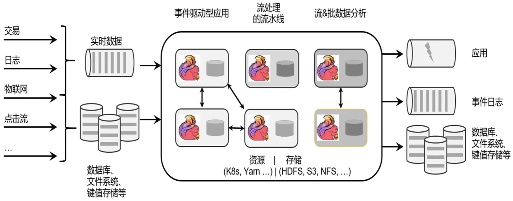

### 1.2 `Flink`在企业中的应用

Flink在企业中的应用：


`Flink`的应用场景：

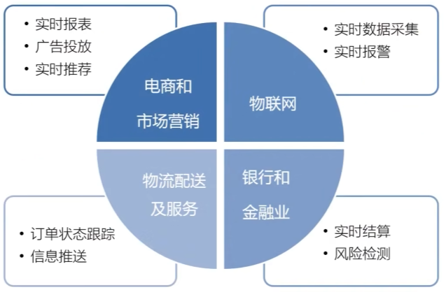


### 1.3 `Flink`的优势

**`Flink`的优势**：

- 批处理和流处理
- 流数据更真实地反映了现实世界场景
- 目标：低延迟、高吞吐、结果的准确性和良好的容错性

### 1.4 数据处理框架的演变

**传统数据处理架构**：

- 事务处理（OLTP）


- 分析处理（OLAP）


**有状态的流式处理**：

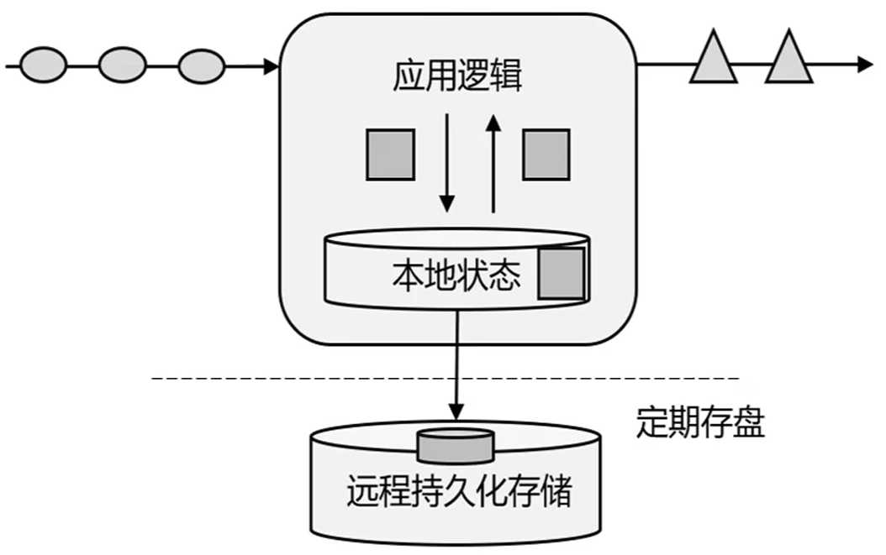

**lambda架构**：用两套系统，同时保证低延迟和结果准确

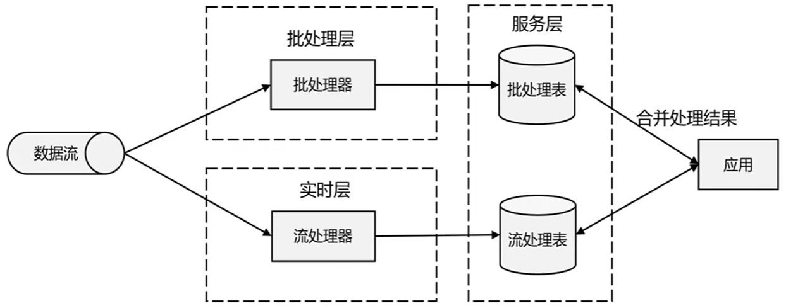

**新一代流处理器——`Flink`**：

> 核心特点：高吞吐，低延迟、高可用，支持动态扩展、结果的准确性、可以与众多常用存储系统连接、精确一次（exactly-once）的状态一致性保证

### 1.5 流处理的应用场景


**事件驱动型应用**

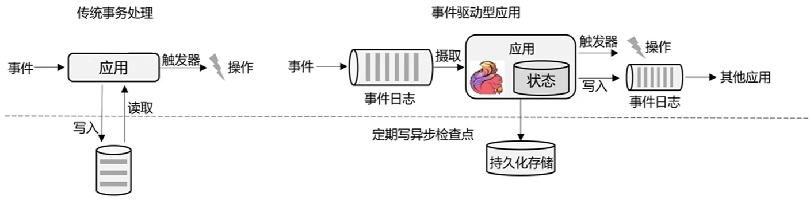

**数据分析型应用**

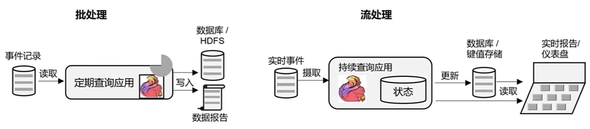

**数据管道型应用**


### 1.6 `Flink`的分层`API`

**分层`API`**：

- 越顶层越抽象，表达含义越简明，使用越方便

- 越底层越具体，表达能力越丰富，使用越灵活


### 1.7 `Flink`和`Spark`的区别

**`Flink` vs `Spark`**：数据处理架构对比

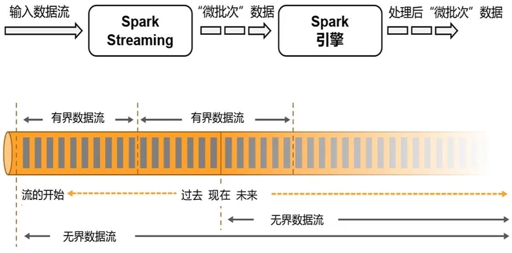


- 数据模型对比：
  - spark采用RDD模型，spark streaming 的 DStream实际上也就是一组组小批数据 RDD 的集合
  - fink基本数据模型是数据流，以及事件（Event）序列

- 运行时架构对比：
  - spark是批计算，将DAG划分为不同的stage，一个完成后才可以计算下一个
  - flink是标准的流执行模式，一个事件在一个节点处理完后可以直接发往下一个节点进行处理

## 2.`Flink`的快速入门

下面演示Flink的三种核心数据处理模式，通过经典的WordCount示例演示Flink API使用方法：

- **批处理（DataSet API）**：使用DataSet API处理有界数据集
- **有界流处理（DataStream API）**：使用DataStream API处理有界数据流  
- **无界流处理（DataStream API）**：使用DataStream API处理无界数据流

### 2.1 依赖配置 & 测试数据

`pom.xml`：引入Flink相关依赖

```xml
<dependencies>
    <!-- ==================== Flink 核心依赖 ==================== -->
    
    <!-- flink-java: Flink核心Java API，提供批处理DataSet API -->
    <!-- 注意：DataSet API在Flink 1.12+版本已废弃，推荐使用DataStream API -->
    <dependency>
        <groupId>org.apache.flink</groupId>
        <artifactId>flink-java</artifactId>
    </dependency>

    <!-- flink-streaming-java: Flink流处理Java API，提供DataStream API -->
    <!-- 注意：依赖Scala版本，因为Flink底层使用Akka进行分布式通信，而Akka是用Scala开发的 -->
    <!-- 最终解析为 org.apache.flink:flink-streaming-java_2.12:jar:1.13.0:compile -->
    <dependency>
        <groupId>org.apache.flink</groupId>
        <artifactId>flink-streaming-java_${scala.binary.version}</artifactId>
    </dependency>

    <!-- flink-clients: Flink客户端依赖，提供作业提交和客户端功能 -->
    <dependency>
        <groupId>org.apache.flink</groupId>
        <artifactId>flink-clients_${scala.binary.version}</artifactId>
    </dependency>

    <!-- ==================== 日志管理依赖 ==================== -->
    
    <!-- slf4j-api: 日志门面接口 -->
    <dependency>
        <groupId>org.slf4j</groupId>
        <artifactId>slf4j-api</artifactId>
    </dependency>

    <!-- slf4j-log4j12: slf4j到log4j的桥接器 -->
    <dependency>
        <groupId>org.slf4j</groupId>
        <artifactId>slf4j-log4j12</artifactId>
    </dependency>

    <!-- log4j-to-slf4j: log4j到slf4j的桥接器，避免日志冲突 -->
    <dependency>
        <groupId>org.apache.logging.log4j</groupId>
        <artifactId>log4j-to-slf4j</artifactId>
    </dependency>

    <!-- ==================== 测试依赖 ==================== -->
    <!-- JUnit 4: 单元测试框架 -->
    <dependency>
        <groupId>junit</groupId>
        <artifactId>junit</artifactId>
        <scope>test</scope>
    </dependency>
</dependencies>
```

**依赖说明：**

| 依赖 | 作用 | 使用场景 |
|-----|------|---------|
| **flink-java** | 批处理API | 批处理WordCount、离线分析 |
| **flink-streaming-java_2.12** | 流处理API | 流处理WordCount、实时分析 |
| **flink-clients_2.12** | 客户端功能 | 本地运行、作业提交 |
| **slf4j-api** | 日志门面 | 统一日志接口 |
| **slf4j-log4j12** | slf4j→log4j桥接 | 将slf4j调用转为log4j处理 |
| **log4j-to-slf4j** | log4j→slf4j桥接 | 避免日志冲突 |
| **junit** | 单元测试 | 编写和运行测试用例 |

`src/main/resources/log4j.properties`：日志配置

```properties
# 设置日志级别
log4j.rootLogger=INFO, console

# 控制台输出配置
log4j.appender.console=org.apache.log4j.ConsoleAppender
log4j.appender.console.target=System.err
log4j.appender.console.layout=org.apache.log4j.PatternLayout
log4j.appender.console.layout.ConversionPattern=%d{yyyy-MM-dd HH:mm:ss,SSS} %-5p %-60c %x - %m%n

# 设置Flink相关日志级别
log4j.logger.org.apache.flink=INFO
log4j.logger.akka=INFO
log4j.logger.org.apache.kafka=INFO
log4j.logger.org.apache.hadoop=INFO
log4j.logger.org.apache.zookeeper=INFO
```

`input/words.txt`：测试数据文件

```
hello flink
hello world
hello java
flink is great
java is awesome
hello flink java
```

### 2.2 `Flink wordCount` 程序

#### 2.2.1 批处理WordCount（DataSet API）

**DataSet API**：Flink的批处理API，用于处理有界数据集（批量数据）

**特点：**

- 处理有界数据流（数据集有明确的开始和结束）
- 适用于一次性数据分析任务
- 性能优化更侧重于吞吐量
- Flink 1.12+版本中，DataSet API已标记为废弃，推荐使用DataStream API的批处理模式

**核心实现：**

```java
package com.action.wc;

import org.apache.flink.api.common.typeinfo.Types;
import org.apache.flink.api.java.ExecutionEnvironment;
import org.apache.flink.api.java.operators.AggregateOperator;
import org.apache.flink.api.java.operators.DataSource;
import org.apache.flink.api.java.operators.FlatMapOperator;
import org.apache.flink.api.java.operators.UnsortedGrouping;
import org.apache.flink.api.java.tuple.Tuple2;
import org.apache.flink.util.Collector;

import java.util.Arrays;

/**
 * Flink批处理WordCount程序
 * 使用DataSet API实现单词频次统计
 * 
 * 执行流程：
 * 1. 创建批处理执行环境
 * 2. 从文件读取数据
 * 3. 将每一行文本拆分成单词，转换为(word, 1)元组
 * 4. 按单词分组
 * 5. 对每个分组求和
 * 6. 打印结果
 */
public class BatchWordCount {
    public static void main(String[] args) throws Exception {
        
        // ==================== 步骤1: 创建批处理执行环境 ====================
        ExecutionEnvironment env = ExecutionEnvironment.getExecutionEnvironment();

        // ==================== 步骤2: 从文件读取数据 ====================
        DataSource<String> lineDS = env.readTextFile("flink-01-quickstart/input/words.txt");

        // ==================== 步骤3: 转换数据格式 ====================
        FlatMapOperator<String, Tuple2<String, Long>> wordAndOne = lineDS
                .flatMap((String line, Collector<Tuple2<String, Long>> out) -> {
                    // 将一行文本按空格切分，转换成(word, 1)的二元组
                    Arrays.stream(line.split(" "))
                            .forEach(word -> out.collect(Tuple2.of(word, 1L)));
                })
                // 当Lambda表达式使用Java泛型时，由于泛型擦除，需要显式声明类型信息
                .returns(Types.TUPLE(Types.STRING, Types.LONG));

        // ==================== 步骤4: 按照word进行分组 ====================
        UnsortedGrouping<Tuple2<String, Long>> wordAndOneGroup = wordAndOne.groupBy(0);

        // ==================== 步骤5: 分组内聚合统计 ====================
        AggregateOperator<Tuple2<String, Long>> sum = wordAndOneGroup.sum(1);

        // ==================== 步骤6: 打印结果 ====================
        sum.print();
        
        /* 
        输出：
        (flink,3)
        (world,1)
        (hello,4)
        (awesome,1)
        (great,1)
        (java,3)
        (is,2)
        */
    }
}
```

**运行方式：**

```bash
# 方法1: 使用Maven运行
cd flink-01-quickstart
mvn compile exec:java -Dexec.mainClass="com.action.wc.BatchWordCount"

# 方法2: 打包后运行
mvn clean package
java -cp target/flink-01-quickstart-1.0-SNAPSHOT.jar com.action.wc.BatchWordCount

# 方法3: 在IDE中直接运行
# 右键 BatchWordCount.java -> Run 'BatchWordCount.main()'
```

#### 2.2.2 有界流WordCount（DataStream API）

**DataStream API**：Flink的流处理API，用于处理数据流

**有界流（Bounded Stream）**：

- 流有明确的开始和结束
- 可以被完整处理
- 处理完所有数据后程序结束
- 行为类似于批处理，但使用流处理的API

**核心实现：**

```java
package com.action.wc;

import org.apache.flink.api.common.typeinfo.Types;
import org.apache.flink.api.java.tuple.Tuple2;
import org.apache.flink.streaming.api.datastream.DataStreamSource;
import org.apache.flink.streaming.api.datastream.KeyedStream;
import org.apache.flink.streaming.api.datastream.SingleOutputStreamOperator;
import org.apache.flink.streaming.api.environment.StreamExecutionEnvironment;
import org.apache.flink.util.Collector;

import java.util.Arrays;

/**
 * Flink有界流处理WordCount程序
 * 使用DataStream API处理有界数据流（文件）
 * 
 * 执行流程：
 * 1. 创建流式执行环境
 * 2. 从文件读取数据作为流
 * 3. 将每一行文本拆分成单词，转换为(word, 1)元组
 * 4. 按单词分组
 * 5. 对每个分组求和
 * 6. 打印结果
 * 7. 执行任务
 */
public class BoundedStreamWordCount {
    public static void main(String[] args) throws Exception {
        
        // ==================== 步骤1: 创建流式执行环境 ====================
        StreamExecutionEnvironment env = StreamExecutionEnvironment.getExecutionEnvironment();

        // ==================== 步骤2: 读取文件作为数据流 ====================
        DataStreamSource<String> lineDSS = env.readTextFile("flink-01-quickstart/input/words.txt");

        // ==================== 步骤3: 转换数据格式 ====================
        SingleOutputStreamOperator<Tuple2<String, Long>> wordAndOne = lineDSS
                .flatMap((String line, Collector<String> words) -> {
                    // 将一行文本按空格切分，收集每个单词
                    Arrays.stream(line.split(" ")).forEach(words::collect);
                })
                .returns(Types.STRING)
                .map(word -> Tuple2.of(word, 1L))
                .returns(Types.TUPLE(Types.STRING, Types.LONG));

        // ==================== 步骤4: 按照word进行分组 ====================
        KeyedStream<Tuple2<String, Long>, String> wordAndOneKS = wordAndOne.keyBy(t -> t.f0);

        // ==================== 步骤5: 分组内聚合统计 ====================
        SingleOutputStreamOperator<Tuple2<String, Long>> result = wordAndOneKS.sum(1);

        // ==================== 步骤6: 打印结果 ====================
        result.print();

        // ==================== 步骤7: 执行任务 ====================
        env.execute();
        
        /*
        输出：
        9> (hello,1)
        6> (java,1)
        31> (is,1)
        25> (flink,1)
        17> (world,1)
        5> (awesome,1)
        6> (java,2)
        22> (great,1)
        6> (java,3)
        9> (hello,2)
        9> (hello,3)
        31> (is,2)
        9> (hello,4)
        25> (flink,2)
        25> (flink,3)
        */
    }
}
```

**运行方式：**

```bash
# 方法1: 使用Maven运行
cd flink-01-quickstart
mvn compile exec:java -Dexec.mainClass="com.action.wc.BoundedStreamWordCount"

# 方法2: 打包后运行
mvn clean package
java -cp target/flink-01-quickstart-1.0-SNAPSHOT.jar com.action.wc.BoundedStreamWordCount

# 方法3: 在IDE中直接运行
# 右键 BoundedStreamWordCount.java -> Run 'BoundedStreamWordCount.main()'
```

#### 2.2.3 无界流WordCount（DataStream API）

- **无界流（Unbounded Stream）**：
- 流没有明确的结束
  
- 持续接收数据并处理
  
- 需要实时或近实时处理
  
- 典型的流处理场景


- **Socket Text Stream**：
- 从网络socket接收数据
  
- 实时数据流
  
- 需要外部数据源持续发送数据


核心实现：

```java
package com.action.wc;

import org.apache.flink.api.common.typeinfo.Types;
import org.apache.flink.api.java.tuple.Tuple2;
import org.apache.flink.streaming.api.datastream.DataStreamSource;
import org.apache.flink.streaming.api.datastream.KeyedStream;
import org.apache.flink.streaming.api.datastream.SingleOutputStreamOperator;
import org.apache.flink.streaming.api.environment.StreamExecutionEnvironment;
import org.apache.flink.util.Collector;

import java.util.Arrays;

/**
 * Flink无界流处理WordCount程序
 * 使用DataStream API处理无界数据流（socket文本流）
 * 
 * 执行流程：
 * 1. 创建流式执行环境
 * 2. 从socket读取文本流
 * 3. 将每一行文本拆分成单词，转换为(word, 1)元组
 * 4. 按单词分组
 * 5. 对每个分组求和
 * 6. 打印结果
 * 7. 执行任务
 */
public class StreamWordCount {

    public static void main(String[] args) throws Exception {
        
        // ==================== 步骤1: 创建流式执行环境 ====================
        StreamExecutionEnvironment env = StreamExecutionEnvironment.getExecutionEnvironment();

        /* centos linux 使用nx命令创建数据流
        sudo yum -y install nc
        nc -lk 7777
        abc
        bbc
        abc
        aaa
        abc
        */
        
        // ==================== 步骤2: 读取文本流 ====================
        DataStreamSource<String> lineDSS = env.socketTextStream("192.168.56.11", 7777);

        // ==================== 步骤3: 转换数据格式 ====================
        SingleOutputStreamOperator<Tuple2<String, Long>> wordAndOne = lineDSS
                .flatMap((String line, Collector<String> words) -> {
                    // 将一行文本按空格切分
                    Arrays.stream(line.split(" ")).forEach(words::collect);
                })
                .returns(Types.STRING)
                .map(word -> Tuple2.of(word, 1L))
                .returns(Types.TUPLE(Types.STRING, Types.LONG));
        // 当Lambda表达式使用Java泛型的时候, 由于泛型擦除的存在, 需要显示的声明类型信息

        // ==================== 步骤4: 按照word进行分组 ====================
        KeyedStream<Tuple2<String, Long>, String> wordAndOneKS = wordAndOne.keyBy(t -> t.f0);

        // ==================== 步骤5: 分组内聚合统计 ====================
        SingleOutputStreamOperator<Tuple2<String, Long>> result = wordAndOneKS.sum(1);

        // ==================== 步骤6: 打印结果 ====================
        result.print();

        // ==================== 步骤7: 执行任务 ====================
        env.execute();

        /*
        # 控制台打印
        29> (abc,1)
        20> (bbc,1)
        29> (abc,2)
        20> (aaa,1)
        29> (abc,3)
        */
    }
}
```

**测试步骤：**

1. **启动Flink程序**
```bash
cd flink-01-quickstart
mvn compile exec:java -Dexec.mainClass="com.action.wc.StreamWordCount"
```

2. **准备数据源（在Linux服务器上）**
```bash
# 安装nc命令
sudo yum -y install nc

# 启动nc监听7777端口
nc -lk 7777
```

3. **发送测试数据**（在nc终端中输入，每条消息后按回车）
```
abc
bbc
abc
aaa
abc
```

4. **观察输出**：Flink程序控制台会实时输出处理结果

5. **停止程序**：在IDE中点击停止按钮或按Ctrl+C

#### 2.2.4 三种模式对比

| 特性 | 批处理（DataSet API） | 有界流（DataStream API） | 无界流（DataStream API） |
|-----|---------------------|----------------------|----------------------|
| **数据特征** | 有界 | 有界 | 无界 |
| **结束标志** | 数据读取完自动结束 | 数据读取完自动结束 | 需要手动停止 |
| **执行环境** | ExecutionEnvironment | StreamExecutionEnvironment | StreamExecutionEnvironment |
| **数据源类型** | DataSource | DataStreamSource | DataStreamSource |
| **数据源** | 文件 | 文件 | Socket/Kafka等 |
| **分组操作** | groupBy() | keyBy() | keyBy() |
| **处理延迟** | 高（等待全部数据） | 高（等待全部数据） | 低（实时处理） |
| **吞吐量** | 高 | 中 | 中 |
| **适用场景** | 离线分析、历史数据处理 | 数据导入、批量转换 | 实时监控、实时分析 |
| **API状态** | 已废弃（1.12+） | 推荐使用 | 推荐使用 |

### 2.3 DataSet API vs DataStream API

相似点：

- 都支持读取文件
- 都有相似的转换操作（map、flatMap、filter等）
- 都需要分组和聚合

不同点：

| 方面 | DataSet API | DataStream API |
|-----|------------|---------------|
| **API类型** | 批处理API | 流处理API |
| **执行环境** | ExecutionEnvironment | StreamExecutionEnvironment |
| **数据源** | `DataSource<T>` | `DataStreamSource<T>` |
| **分组** | groupBy() | keyBy() |
| **时间概念** | 无 | 支持事件时间、处理时间、摄入时间 |
| **窗口操作** | 不支持 | 支持滑动窗口、滚动窗口等 |
| **状态管理** | 无状态 | 支持有状态操作 |
| **一致性保证** | 最终一致性 | 精确一次或至少一次 |
| **未来** | 已废弃 | 继续发展 |

### 2.4 核心概念说明

#### 2.4.1 Lambda表达式与泛型擦除

**问题：** 为什么需要显式声明类型信息？

```java
// 当使用Lambda表达式时，由于Java泛型擦除，Flink无法推断类型
lineDSS.flatMap((String line, Collector<String> words) -> {
    Arrays.stream(line.split(" ")).forEach(words::collect);
})
.returns(Types.STRING)  // 必须显式声明返回类型
```

**原因：**

- Java的泛型在编译时会被擦除
- Flink需要类型信息进行序列化和优化
- 需要在运行时保留类型信息

**解决方案：**

- 使用`.returns(Types.STRING)`显式声明类型
- 或使用具体的类而非泛型
- 或使用TypeInformation子类

#### 2.4.2 KeyBy与GroupBy

**KeyBy：**

- DataStream API的分组操作
- 对流进行逻辑分区
- 相同key的数据路由到同一个subtask
- 用于状态管理和分布式处理

**GroupBy：**

- DataSet API的分组操作
- 对数据集进行分组
- 适用于批处理
- 数据需要在同一个算子内

#### 2.4.3 输出格式说明

**批处理输出：**

```
(flink,3)
(world,1)
(hello,4)
```

**流处理输出：**

```
29> (abc,1)    # 29是subtask ID
20> (bbc,1)    # 20是subtask ID
29> (abc,2)    # abc始终在subtask 29处理
```

**输出说明：**

- 前面的数字是subtask ID
- `>`后面是输出内容
- 相同key的数据会路由到相同的subtask

## 3.`Flink` 系统架构

### 3.1 `Flink` 系统架构

**JobManager（作业管理器)**：JobManager控制一个应用程序执行的主进程，是Flink集群中任务管理和调度的核心。JobManager又包含Jobmaster、ResourceManager（资源管理器) 和 Dispatcher（分发器）。**Jobmaster**：JobMaster是JobManager中最核心的组件，负责处理单独的作业(Job）。在作业提交时，JobMaster会先接收到要执行的应用。一般是由客户端提交来的。包括：Jar包，数据流图（dataflowgraph)，和作业图(JobGraph）。JobMaster会把JobGraph转换成一个物理层面的数据流图，这个图被叫作”执行图”（ExecutionGraph），它包含了所有可以并发执行的任务。JobMaster会向资源管理器（ResourceManager）发出请求，申请执行任务必要的资源。一旦它获取到了足够的资源，就会将执行图分发到真正运行它们的TaskManager上。在运行过程中，JobMaster会负责所有需要中央协调的操作，比如说检查点（checkpoints）的协调。**ResourceManager（资源管理器)**：ResourceManager主要负责资源的分配和管理，在Flink集群中只有一个。所谓“资源”，主要是指TaskManager的任务（taskslots）。任务槽就是Flink集群中的资源调配单元，包含了机器用来执行计算的一组CPU和内存资源。每一个任务（Task）都需要分配到一个slot上执行。**Dispatcher（分发器）**：Dispatcher主要负责提供一个REST接口，用来提交应用，并且负责为每一个新提交的作业启动一个新的JobMaster组件。Dispatcher也会启动一个Web UI，用来方便地展示和监控作业执行的信息。Dispatcher在架构中并不是必需的，在不同的部署模式下可能会被忽略掉。

**TaskManager(任务管理器)**：Flink中的工作进程。通常在Flink中会有多个TaskManager运行，每一个TaskManager都包含了一定数量的插槽（slots）。插槽的数量限制了TaskManager能够并行处理的任务数量。启动之后，TaskManager会向资源管理器注册它的插槽；收到资源管理器的指令后，TaskManager就会将一个或者多个插槽提供给JobMaster调用。JobMaster就可以向插槽分配任务（tasks）来执行了。在执行过程中，一个TaskManager可以跟其它运行同一应用程序的TaskManager交换数据。


### 3.2 作业提交流程

作业提交流程（宏观抽象流程）：

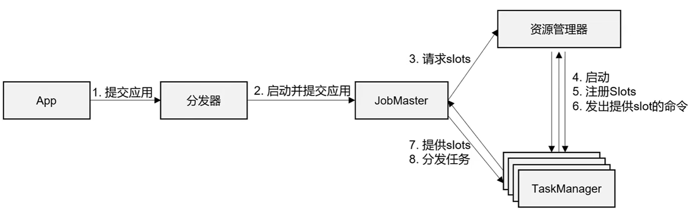

Standalone模式作业提交流程：

> Standalone模式中的会话模式（Session Mode）

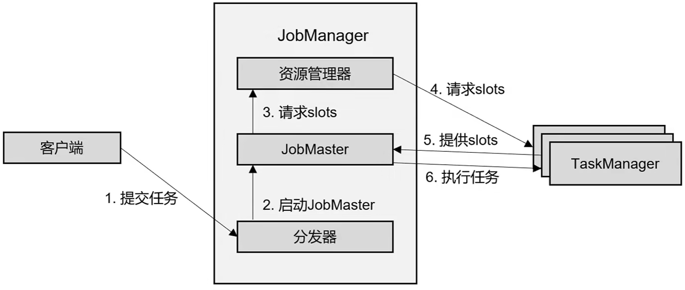


YARN会话模式作业提交流程：

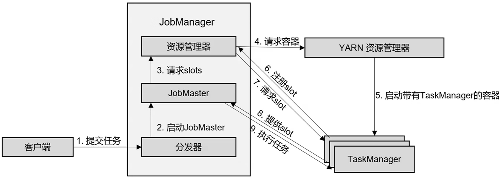

YARN单作业模式任务提交流程：

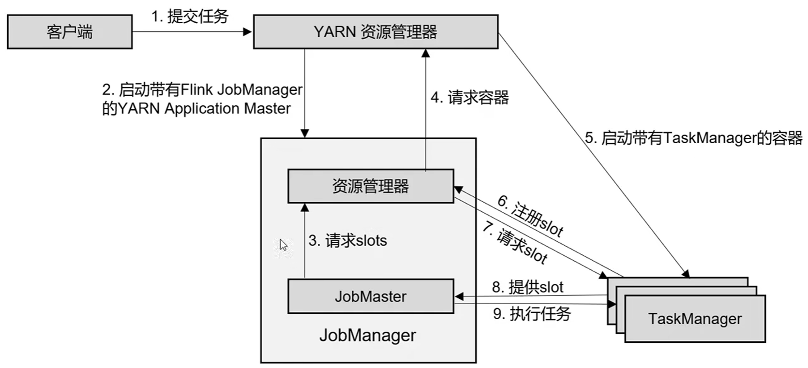

### 3.3 重要概念

**程序与数据流（DataFlow）**：所有的Flink程序都是由三部分组成的：Source、Transformation和Sink。Source负责读取数据源，Transformation利用各种算子进行处理加工，Sink负责输出。在运行时，Flink上运行的程序会被映射成“逻辑数据流”（dataflows），它包含了这三部分。每一个dataflow以一个或多个sources开始以一个或多个sinks结束。dataflow类似于任意的有向无环图（DAG）。在大部分情况下，程序中的转换运算（transformations）跟dataflow中的算子(operator）是——对应的关系。

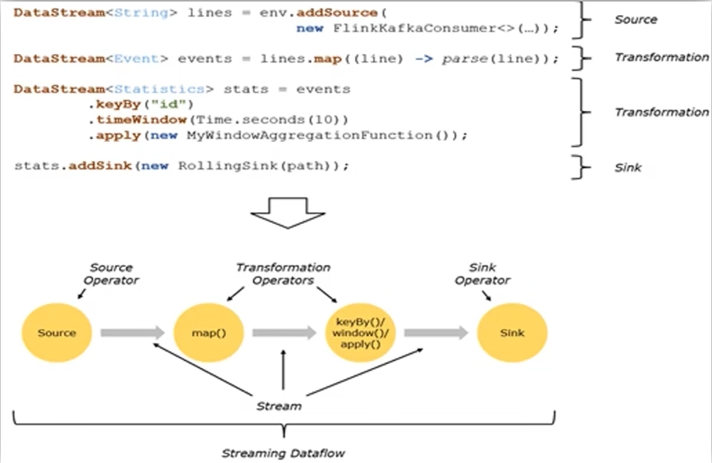


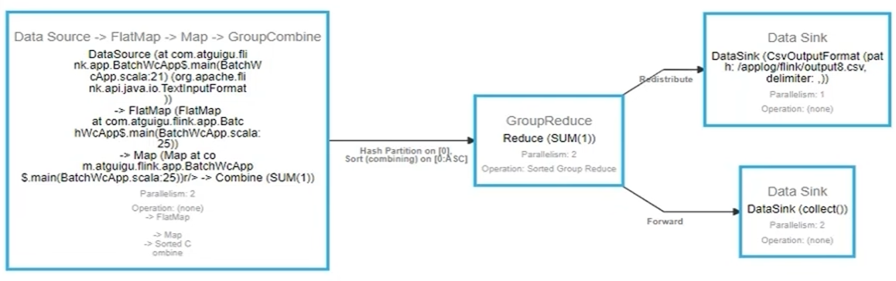

**并行度(Parallelism)**：每一个算子（operator）可以包含一个或多个子任务（operator subtask），这些子任务在不同的线程、不同的物理机或不同的容器中完全独立地执行。一个特定算子的子任务（subtask)的个数被称之为其并行度（parallelism）。

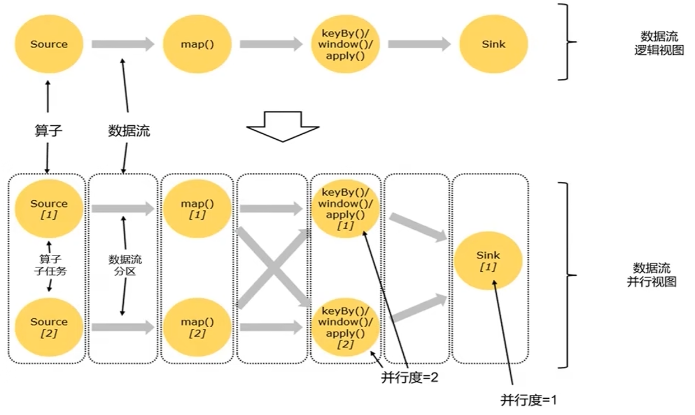

**数据传输形式**：一个程序中，不同的算子可能具有不同的并行度。算子之间传输数据的形式可以是one-to-one（forwarding）的模式也可以是redistributing的模式，具体是哪一种形式，取决于算子的种类。One-to-one：stream维护着分区以及元素的顺序（比如source和map之间）。这意味着map算子的子任务看到的元素的个数以及顺序跟source算子的子任务生产的元素的个数、顺序相同。map、fliter、flatMap等算子都是one-to-one的对应关系。Redistributing：stream的分区会发生改变。每一个算子的子任务依据所选择的transformation发送数据到不同的目标任务。例如，keyBy基于hashCode重分区、而broadcast和rebalance会随机重新分区，这些算子都会引起redistribute过程，而redistribute过程就类似于Spark中的shuffle过程。

**算子链(Operator Chains)**：Flink采用了一种称为任务链的优化技术，可以在特定条件下减少本地通信的开销。为了满足任务链的要求，必须将两个或多个算子设为相同的并行度，并通过本地转发（local forward）的方式进行连接相同并行度的one-to-one操作，Flink这样相连的算子链接在一起形成一个task，原来的算子成为里面的subtask。并行度相同、并且是one-to-one操作，两个条件缺一不可

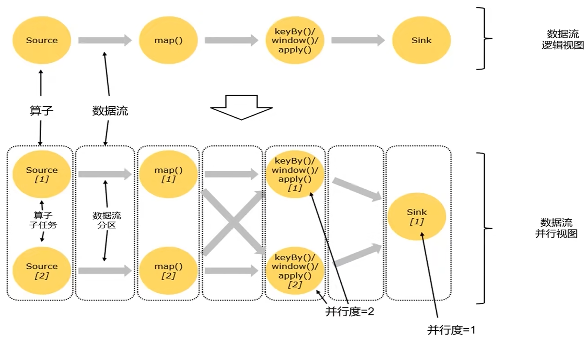

**执行图(ExecutionGraph)**：Flink 中的执行图可以分成四层：StreamGraph->JobGraph->ExecutionGraph->物理执行图。StreamGraph：是根据用户通过StreamAPI编写的代码生成的最初的图。用来表示程序的拓扑结构。JobGraph：StreamGraph经过优化后生成了JobGraph，提交给JobManager的数据结构。主要的优化为，将多个符合条件的节点chain在一起作为一个节点。ExecutionGraph:JobManager 根据JobGraph生成ExecutionGraph。ExecutionGraph是JobGraph的并行化版本，是调度层最核心的数据结构。物理执行图：JobManager根据ExecutionGraph对Job进行调度后，在各个TaskManager上部署Task后形成的”图”，并不是一个具体的数据结构。

**四层执行图**：

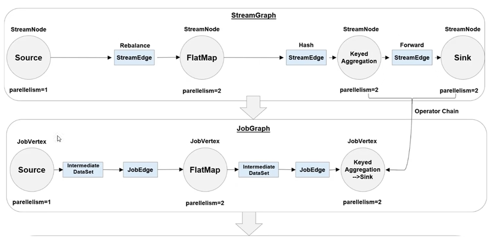

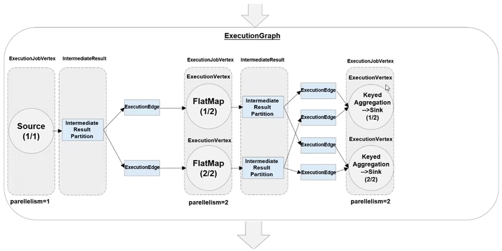

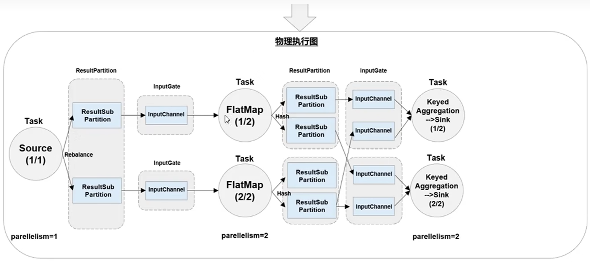


**任务(Task)和任务槽(Task Slots)**：Flink中每一个TaskManager都是一个JVM进程，它可能会在独立的线程上执行一个或多个子任务。为了控制一个TaskManager 能接收多少个task，TaskManager通过task slot 来进行控制（一个TaskManager至少有一个slot)

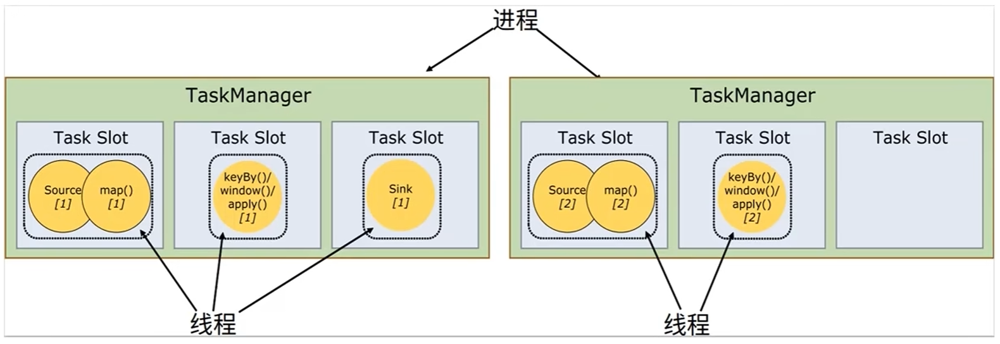

**任务共享Slot**：默认情况下，Flink允许子任务共享slot。这样的结果是，一个slot可以保存作业的整个管道。当我们将资源密集型和非密集型的任务同时放到一个sot中，它们就可以自行分配对资源占用的比例，从而保证最重的活平均分配给所有的TaskManager。

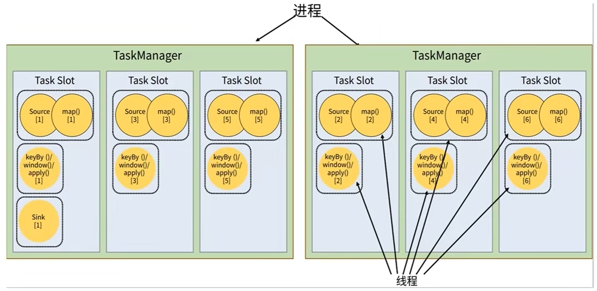

**Slot 和 并行度**：

- **Task Slot**：静态概念，是指TaskManager具有的并发执行能力。通过参数taskmanager.numberOfTaskSlots进行配置
- **并行度(parallelism)**：动态概念，也就是TaskManager运行程序时实际使用的并发能力。通过参数parallelism.default进行配置

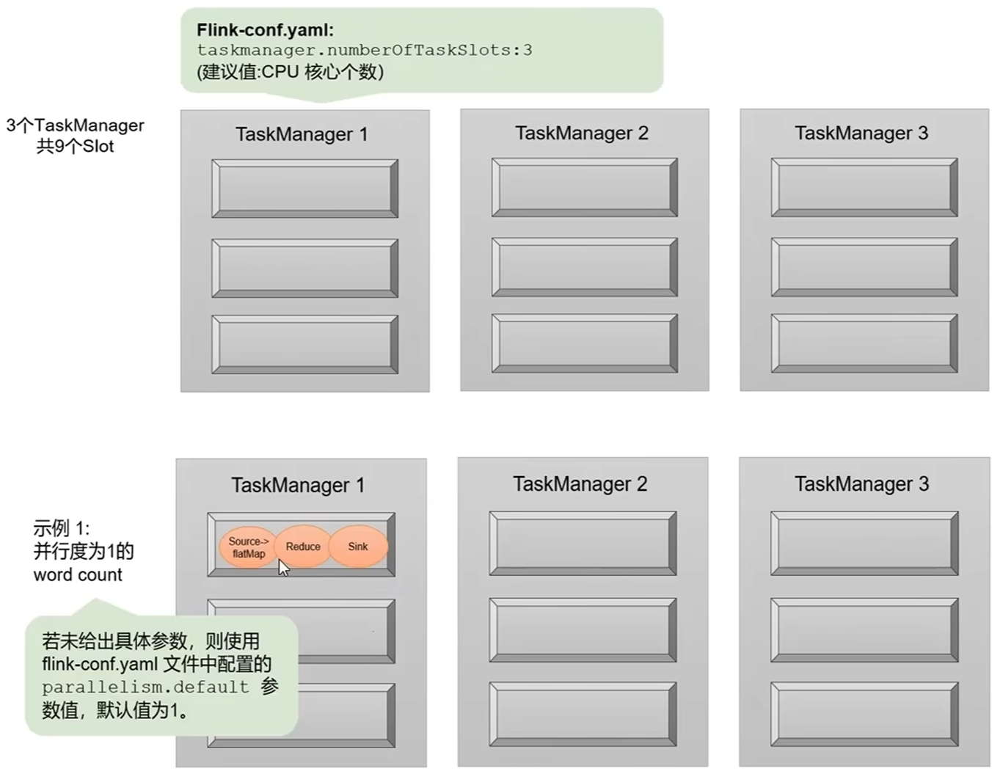


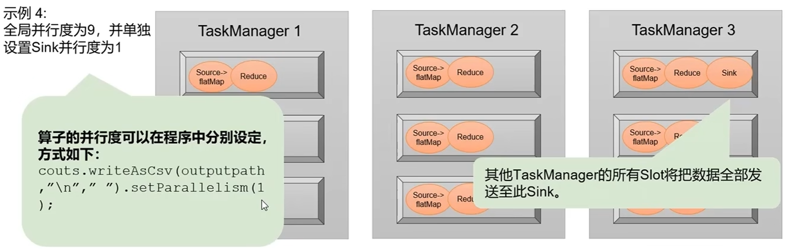


## 4.DataStream API(基础篇）

### 4.1 源算子（Source）

见`flink-02-DataSource`模块

### 4.2 转换算子（Transformation)


## 5.容错机制

**状态一致性**：对于流处理器内部来说，所谓的状态一致性，其实就是我们所说的计算结果要保证准确。一条数据不应该丢失，也不应该重复计算。在遇到故障时可以恢复状态，恢复以后的重新计算，结果应该也是完全正确的。


**状态一致性分类**：

- AT-MOST-ONCE(最多一次)：当任务故障时，最简单的做法是什么都不干，既不恢复丢失的状态，也不重播丢失的数据。At-most-once语义的含义是最多处理一次事件。
- AT-LEAST-ONCE（至少一次）：在大多数的真实应用场景，我们希望不丢失事件。这种类型的保障称为at-least-once，意思是所有的事件都得到了处理，而一些事件还可能被处理多次。
- EXACTLY-ONCE（精确一次）：恰好处理一次是最严格的保证，也是最难实现的。恰好处理一次语义不仅仅意味着没有事件丢失，还意味着针对每一个数据，内部状态仅仅更新一次。

**一致性检查点(Checkpoints)**：Flink使用了一种轻量级快照机制——检查点（checkpoint）来保证exactly-once语义。有状态流应用的一致检查点，其实就是：所有任务的状态，在某个时间点的一份拷贝（一份快照）。而这个时间点，应该是所有任务都恰好处理完一个相同的输入数据的时候。应用状态的一致检查点，是Flink故障恢复机制的核心

**端到端（end-to-end）状态一致性**：目前我们看到的一致性保证都是由流处理器实现的，也就是说都是在Flink流处理器内部保证的；而在真实应用中，流处理应用除了流处理器以外还包含了数据源（例如Kafa）和输出到持久化系统。端到端的一致性保证，意味着结果的正确性贯穿了整个流处理应用的始终；每一个组件都保证了它自己的一致性。整个端到端的一致性级别取决于所有组件中一致性最弱的组件

**端到端exactly-once**：

- 内部保证——checkpoint
- source端——可重设数据的读取位置
- sink端——从故障恢复时，数据不会重复写入外部系统
  - 幂等写入(Idempotent Writes)
  - 事务写入（Transactional Writes)

**幂等写入(Idempotent Writes)**：所谓幂等操作，是说一个操作，可以重复执行很多次，但只导致一次结果更改，也就是说，后面再重复执行就不起作用了。


**事务写入（Transactional Writes)**：

- 事务（Transaction)：应用程序中一系列严密的操作，所有操作必须成功完成，否则在每个操作中所作的所有更改都会被撤消
- 具有原子性：一个事务中的一系列的操作要么全部成功，要么一个都不做
- 实现思想：构建的事务对应着checkpoint，等到checkpoint真正完成的时候，才把所有对应的结果写入sink系统中
- 实现方式：预写日志、两阶段提交

**预写日志(Write-Ahead-Log，WAL)**：把结果数据先当成状态保存，然后在收到checkpoint完成的通知时，一次性写入sink系统。简单易于实现，由于数据提前在状态后端中做了缓存，所以无论什么sink系统，都能用这种方式一批搞定。DataStreamAPI提供了一个模板类GeneritWriteAheadSink来实现这种事务性sink

**两阶段提交（Two-Phase-Commit，2PC）**：对于每个checkpoint，sink任务会启动一个事务，并将接下来所有接收的数据添加到事务里。然后将这些数据写入外部sink系统，但不提交它们，这时只是“预提交”。当它收到checkpoint完成的通知时，它才正式提交事务，实现结果的真正写入。这种方式真正实现了exactly-once，它需要一个提供事务支持的外部 sink 系统。Flink提供了TwoPhaseCommitSinkFunction接口。

**2PC对外部sink系统的要求**：外部sink系统必须提供事务支持，或者sink任务必须能够模拟外部系统上的事务。在checkpoint的间隔期间里，必须能够开启一个事务并接受数据写入。在收到checkpoint完成的通知之前，事务必须是”等待提交”的状态。在故障恢复的情况下，这可能需要一些时间。如果这个时候sink系统关闭事务（例如超时了），那么未提交的数据就会丢失，sink任务必须能够在进程失败后恢复事务。提交事务必须是幂等操作

**不同Source和Sink的一致性保证**：

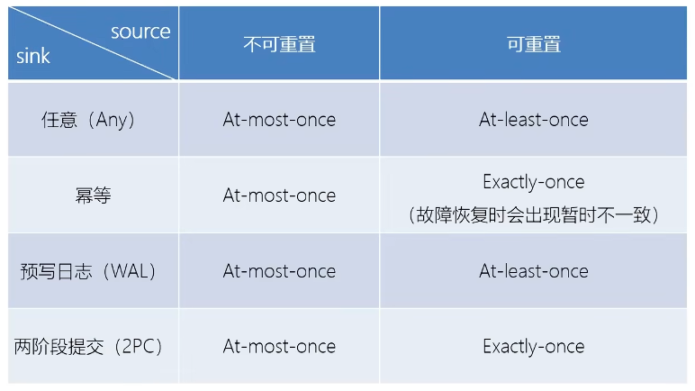

## 子模块文档

本项目包含以下子模块，每个模块都有详细的 README 文档，点击链接可跳转查看：

- [flink-00-flinktutorial - Flink 教程示例](flink-00-flinktutorial/README.md)
- [flink-01-quickstart - Flink 快速入门演示](flink-01-quickstart/README.md)
- [flink-02-DataSource - Flink 数据源读取演示](flink-02-DataSource/README.md)
- [flink-03-Transformation - Flink 转换算子演示](flink-03-Transformation/README.md)
- [flink-04-Sink - Flink 数据输出演示](flink-04-Sink/README.md)
- [flink-05-watermark - Flink Watermark 机制演示](flink-05-watermark/README.md)
- [flink-06-Window - Flink 窗口操作演示](flink-06-Window/README.md)
- [flink-07-ProcessFunction - Flink ProcessFunction 演示](flink-07-ProcessFunction/README.md)
- [flink-08-Multi-Stream-Transformations - Flink 多流转换演示](flink-08-Multi-Stream-Transformations/README.md)
- [flink-09-State - Flink 状态编程演示](flink-09-State/README.md)
- [flink-10-FaultTolerance - Flink 容错机制演示](flink-10-FaultTolerance/README.md)
- [flink-11-TableAPI-SQL - Flink Table API 和 SQL 演示](flink-11-TableAPI-SQL/README.md)
- [flink-12-FlinkCEP - Flink CEP 复杂事件处理演示](flink-12-FlinkCEP/README.md)

