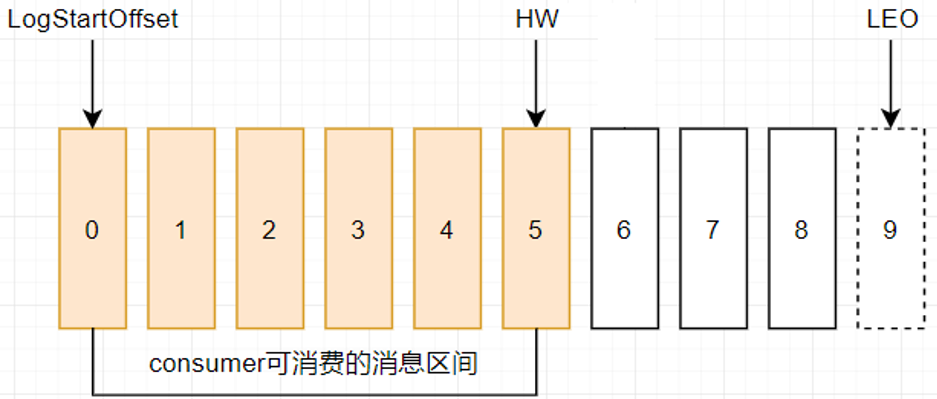
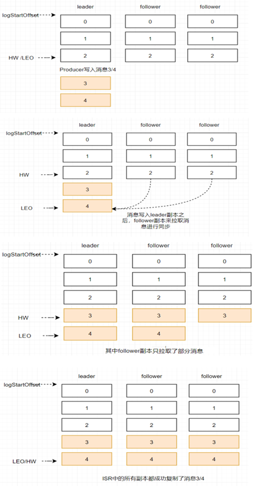
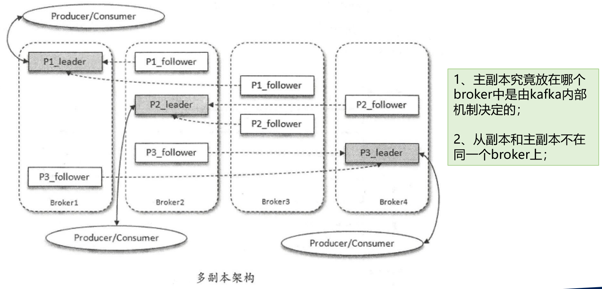
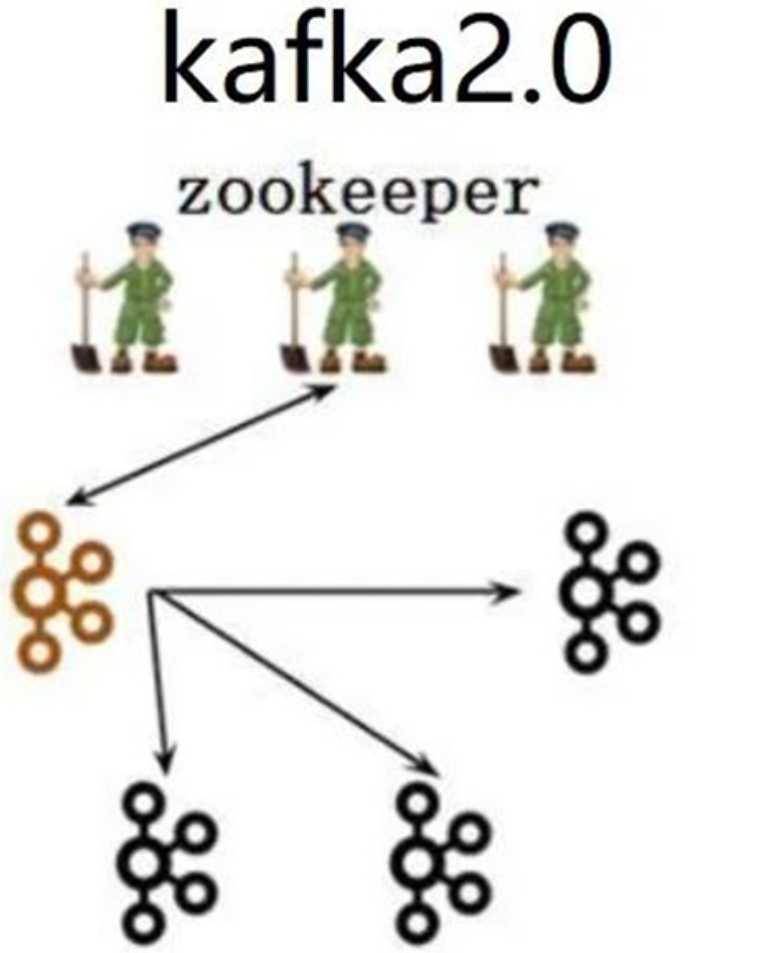
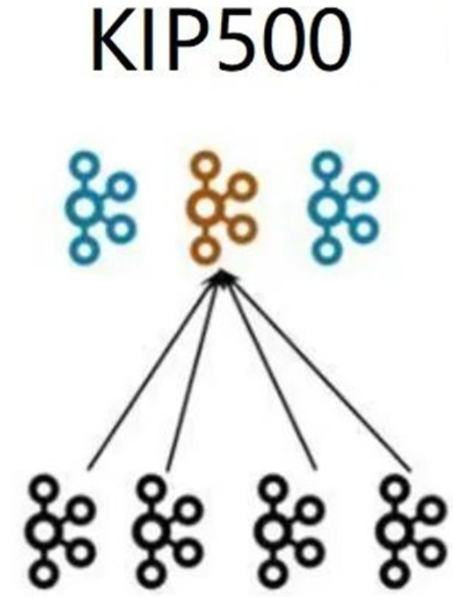
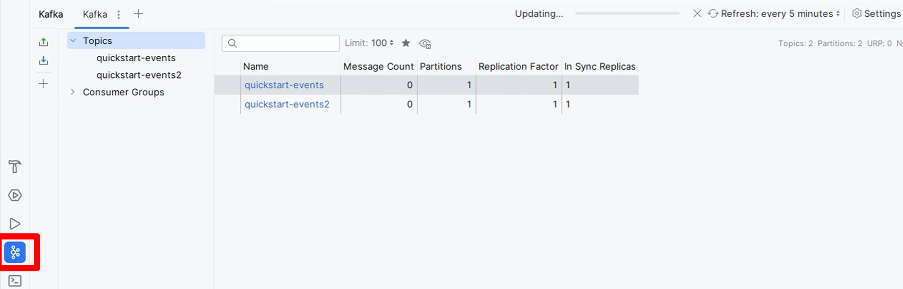
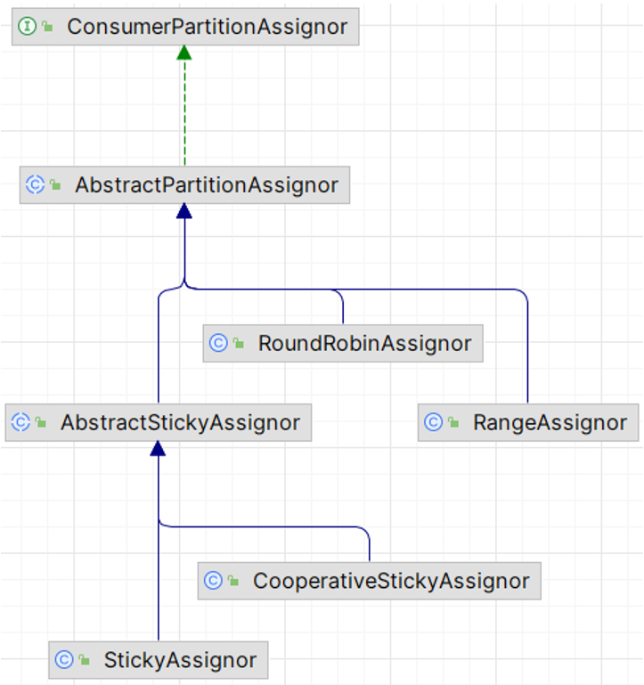

<!-- START doctoc generated TOC please keep comment here to allow auto update -->
<!-- DON'T EDIT THIS SECTION, INSTEAD RE-RUN doctoc TO UPDATE -->
**Table of Contents**  *generated with [DocToc](https://github.com/thlorenz/doctoc)*

- [1.`kafka`核心](#1kafka%E6%A0%B8%E5%BF%83)
  - [1.1 `kafka`简介](#11-kafka%E7%AE%80%E4%BB%8B)
  - [1.2 kafka核心概念及原理（重要）](#12-kafka%E6%A0%B8%E5%BF%83%E6%A6%82%E5%BF%B5%E5%8F%8A%E5%8E%9F%E7%90%86%E9%87%8D%E8%A6%81)
  - [1.3 kafka核心概念及原理—`deepseek`](#13-kafka%E6%A0%B8%E5%BF%83%E6%A6%82%E5%BF%B5%E5%8F%8A%E5%8E%9F%E7%90%86deepseek)
- [2.`kafka`安装部署](#2kafka%E5%AE%89%E8%A3%85%E9%83%A8%E7%BD%B2)
  - [2.1 搭建`JDK`运行环境](#21-%E6%90%AD%E5%BB%BAjdk%E8%BF%90%E8%A1%8C%E7%8E%AF%E5%A2%83)
  - [2.2  `Kafka`下载解压](#22--kafka%E4%B8%8B%E8%BD%BD%E8%A7%A3%E5%8E%8B)
  - [2.3 `Kafka`的三种启动方式](#23-kafka%E7%9A%84%E4%B8%89%E7%A7%8D%E5%90%AF%E5%8A%A8%E6%96%B9%E5%BC%8F)
    - [2.3.1 `Zookeeper`模式启动](#231-zookeeper%E6%A8%A1%E5%BC%8F%E5%90%AF%E5%8A%A8)
      - [2.3.1.1 使用自带的`Zookeeper`启动`Kafka`](#2311-%E4%BD%BF%E7%94%A8%E8%87%AA%E5%B8%A6%E7%9A%84zookeeper%E5%90%AF%E5%8A%A8kafka)
      - [2.3.1.2 使用独立的`Zookeeper`启动`Kafka`](#2312-%E4%BD%BF%E7%94%A8%E7%8B%AC%E7%AB%8B%E7%9A%84zookeeper%E5%90%AF%E5%8A%A8kafka)
    - [2.3.2 使用`KRaft`启动`Kafka`](#232-%E4%BD%BF%E7%94%A8kraft%E5%90%AF%E5%8A%A8kafka)
    - [2.3.3 使用`Docker`启动`Kafka`](#233-%E4%BD%BF%E7%94%A8docker%E5%90%AF%E5%8A%A8kafka)
      - [2.3.3.1 安装`docker`](#2331-%E5%AE%89%E8%A3%85docker)
      - [2.3.3.2 使用`Docker`镜像启动`kafka`](#2332-%E4%BD%BF%E7%94%A8docker%E9%95%9C%E5%83%8F%E5%90%AF%E5%8A%A8kafka)
  - [2.4 外部环境连接`Kafka`](#24-%E5%A4%96%E9%83%A8%E7%8E%AF%E5%A2%83%E8%BF%9E%E6%8E%A5kafka)
- [3.`Kafka`图形界面连接工具](#3kafka%E5%9B%BE%E5%BD%A2%E7%95%8C%E9%9D%A2%E8%BF%9E%E6%8E%A5%E5%B7%A5%E5%85%B7)
  - [3.1 `Offset Explorer`](#31-offset-explorer)
  - [3.2 `CMAK`](#32-cmak)
  - [3.2 EFAK`（kafka-eagle）`](#32-efakkafka-eagle)
- [4.`Kafka`命令操作](#4kafka%E5%91%BD%E4%BB%A4%E6%93%8D%E4%BD%9C)
  - [4.1 主题（`Topic`）相关命令](#41-%E4%B8%BB%E9%A2%98topic%E7%9B%B8%E5%85%B3%E5%91%BD%E4%BB%A4)
  - [4.2 创建`topic`时指定分区和副本](#42-%E5%88%9B%E5%BB%BAtopic%E6%97%B6%E6%8C%87%E5%AE%9A%E5%88%86%E5%8C%BA%E5%92%8C%E5%89%AF%E6%9C%AC)
  - [4.3 向主题（`Topic`）写入事件（`Events`）](#43-%E5%90%91%E4%B8%BB%E9%A2%98topic%E5%86%99%E5%85%A5%E4%BA%8B%E4%BB%B6events)
  - [4.4 从主题（`Topic`）读取事件（`Events`）](#44-%E4%BB%8E%E4%B8%BB%E9%A2%98topic%E8%AF%BB%E5%8F%96%E4%BA%8B%E4%BB%B6events)
  - [4.5 演示`offset`偏移量重置](#45-%E6%BC%94%E7%A4%BAoffset%E5%81%8F%E7%A7%BB%E9%87%8F%E9%87%8D%E7%BD%AE)
- [5.Kafka集群](#5kafka%E9%9B%86%E7%BE%A4)
  - [5.1 kafka集群简介](#51-kafka%E9%9B%86%E7%BE%A4%E7%AE%80%E4%BB%8B)
  - [5.2 kafka集群搭建](#52-kafka%E9%9B%86%E7%BE%A4%E6%90%AD%E5%BB%BA)
      - [5.2.1 基于`Zookeeper`的集群搭建](#521-%E5%9F%BA%E4%BA%8Ezookeeper%E7%9A%84%E9%9B%86%E7%BE%A4%E6%90%AD%E5%BB%BA)
      - [5.2.2 基于`KRaft`的集群搭建](#522-%E5%9F%BA%E4%BA%8Ekraft%E7%9A%84%E9%9B%86%E7%BE%A4%E6%90%AD%E5%BB%BA)
- [6.`SpringBoot`集成`Kafka`开发](#6springboot%E9%9B%86%E6%88%90kafka%E5%BC%80%E5%8F%91)
  - [6.1 集成 `spring-kafka`](#61-%E9%9B%86%E6%88%90-spring-kafka)
  - [6.2 `SpringBoot`集成`Kafka`](#62-springboot%E9%9B%86%E6%88%90kafka)
      - [6.2.1 核心配置类`KafkaProperties`](#621-%E6%A0%B8%E5%BF%83%E9%85%8D%E7%BD%AE%E7%B1%BBkafkaproperties)
      - [6.2.2 `SpringBoot`集成`Kafka`演示](#622-springboot%E9%9B%86%E6%88%90kafka%E6%BC%94%E7%A4%BA)
  - [6.3 `offset`偏移量配置](#63-offset%E5%81%8F%E7%A7%BB%E9%87%8F%E9%85%8D%E7%BD%AE)
  - [6.4 生产者消息发送](#64-%E7%94%9F%E4%BA%A7%E8%80%85%E6%B6%88%E6%81%AF%E5%8F%91%E9%80%81)
      - [6.4.1 生产者消息发送](#641-%E7%94%9F%E4%BA%A7%E8%80%85%E6%B6%88%E6%81%AF%E5%8F%91%E9%80%81)
      - [6.4.2 生产者发送消息的分区策略](#642-%E7%94%9F%E4%BA%A7%E8%80%85%E5%8F%91%E9%80%81%E6%B6%88%E6%81%AF%E7%9A%84%E5%88%86%E5%8C%BA%E7%AD%96%E7%95%A5)
      - [6.4.3 生产者消息拦截](#643-%E7%94%9F%E4%BA%A7%E8%80%85%E6%B6%88%E6%81%AF%E6%8B%A6%E6%88%AA)
  - [6.5 消费者接收消息](#65-%E6%B6%88%E8%B4%B9%E8%80%85%E6%8E%A5%E6%94%B6%E6%B6%88%E6%81%AF)
      - [6.5.1 消费者接收消息](#651-%E6%B6%88%E8%B4%B9%E8%80%85%E6%8E%A5%E6%94%B6%E6%B6%88%E6%81%AF)
      - [6.5.2 消费者批量消费消息](#652-%E6%B6%88%E8%B4%B9%E8%80%85%E6%89%B9%E9%87%8F%E6%B6%88%E8%B4%B9%E6%B6%88%E6%81%AF)
      - [6.5.3 消息转发](#653-%E6%B6%88%E6%81%AF%E8%BD%AC%E5%8F%91)
      - [6.5.3 消费者消息拦截](#653-%E6%B6%88%E8%B4%B9%E8%80%85%E6%B6%88%E6%81%AF%E6%8B%A6%E6%88%AA)
      - [6.5.4 消费者分区分配策略](#654-%E6%B6%88%E8%B4%B9%E8%80%85%E5%88%86%E5%8C%BA%E5%88%86%E9%85%8D%E7%AD%96%E7%95%A5)
- [7. Kafka案例演示—CurSor](#7-kafka%E6%A1%88%E4%BE%8B%E6%BC%94%E7%A4%BAcursor)
  - [7.1 Kafka Hello World](#71-kafka-hello-world)
  - [7.2 SpringBoot集成Kafka](#72-springboot%E9%9B%86%E6%88%90kafka)
  - [7.3 offset偏移量行为](#73-offset%E5%81%8F%E7%A7%BB%E9%87%8F%E8%A1%8C%E4%B8%BA)
  - [7.4 offset偏移量策略](#74-offset%E5%81%8F%E7%A7%BB%E9%87%8F%E7%AD%96%E7%95%A5)
  - [7.5 生产者消息发送](#75-%E7%94%9F%E4%BA%A7%E8%80%85%E6%B6%88%E6%81%AF%E5%8F%91%E9%80%81)
  - [7.6 生产者分区策略](#76-%E7%94%9F%E4%BA%A7%E8%80%85%E5%88%86%E5%8C%BA%E7%AD%96%E7%95%A5)
  - [7.7 生产者拦截器](#77-%E7%94%9F%E4%BA%A7%E8%80%85%E6%8B%A6%E6%88%AA%E5%99%A8)
  - [7.8 消费者事件消费](#78-%E6%B6%88%E8%B4%B9%E8%80%85%E4%BA%8B%E4%BB%B6%E6%B6%88%E8%B4%B9)
  - [7.9 Kafka发送对象消息](#79-kafka%E5%8F%91%E9%80%81%E5%AF%B9%E8%B1%A1%E6%B6%88%E6%81%AF)
  - [7.10 消费者指定Topic、Partition、Offset进行消费](#710-%E6%B6%88%E8%B4%B9%E8%80%85%E6%8C%87%E5%AE%9Atopicpartitionoffset%E8%BF%9B%E8%A1%8C%E6%B6%88%E8%B4%B9)
  - [7.11 消费者批量消息消费](#711-%E6%B6%88%E8%B4%B9%E8%80%85%E6%89%B9%E9%87%8F%E6%B6%88%E6%81%AF%E6%B6%88%E8%B4%B9)
  - [7.12 消费者消息拦截器](#712-%E6%B6%88%E8%B4%B9%E8%80%85%E6%B6%88%E6%81%AF%E6%8B%A6%E6%88%AA%E5%99%A8)
  - [7.13 消费者消息转发](#713-%E6%B6%88%E8%B4%B9%E8%80%85%E6%B6%88%E6%81%AF%E8%BD%AC%E5%8F%91)
  - [7.14 消费者分区分配策略](#714-%E6%B6%88%E8%B4%B9%E8%80%85%E5%88%86%E5%8C%BA%E5%88%86%E9%85%8D%E7%AD%96%E7%95%A5)
  - [7.15 Kafka集群](#715-kafka%E9%9B%86%E7%BE%A4)

<!-- END doctoc generated TOC please keep comment here to allow auto update -->

Kafka官网：`https://kafka.apache.org`

kafka官方文档：`https://kafka.apache.org/documentation/`

Kafka源码：`https://github.com/apache/kafka`

Scala官网：`https://www.scala-lang.org`

## 1.`kafka`核心

### 1.1 `kafka`简介

- Apache Kafka是一个开源分布式事件流平台，被数千家公司用于高性能数据管道、流分析、数据集成和关键任务应用程序；超过80%的财富100强公司信任并使用Kafka
- 官网：`https://kafka.apache.org`

**kafka使用现状**

> 以下是每个行业使用Kafka的前十大公司的数量快照
>
> - 10/10最大的保险公司
> - 10/10最大的制造公司
> - 10/10最大的信息技术和服务公司
> - 8/10最大的电信公司
> - 8/10最大的运输公司
> - 7/10最大的零售公司
> - 7/10最大的银行和金融公司
> - 6/10最大的能源和公用事业组织


**kafka的起源**：

- kafka最初由Linkedln（领英：全球最大的面向职场人士的社交网站）设计开发的，是为了解决LinkedIn的数据管道问题，用于Linkedln网站的活动流数据和运营数据处理工具；
  - 活动流数据：页面访问量、被查看页面内容方面的信息以及搜索情况等内容；
  - 运营数据：服务器的性能数据（CPU、IO使用率、请求时间、服务日志等数据）；
- 刚开始Linkedln采用的是ActiveMQ来进行数据交换，大约在2010年前后，那时的ActiveMQ还远远无法满足Linkedln对数据交换传输的要求，经常由于各种缺陷而导致消息阻塞或者服务无法正常访问，为了解决这个问题，Linkedln决定研发自己的消息传递系统，当时Linkedln的首席架构师jay kreps便开始组织团队进行消息传递系统的研发；

**kafka名字由来**：

- 由于Kafka的架构师jay kreps非常喜欢franz kafka(弗兰茨·卡夫卡）（是奥匈帝国一位使用德语的小说家和短篇犹太人故事家，被评论家们认为是20世纪作家中最具影响力的一位），并且觉得Kafka这个名字很酷，因此把这一款消息传递系统取名为Kafka；

**kafka的发展历程**：

- 2010年底，Kafka在Github上开源，初始版本为0.7.0；

- 2011年7月，因为备受关注，被纳入Apache孵化器项目；

- 2012年10月，Kafka从Apache孵化器项目毕业，成为Apache顶级项目；

- 2014年，jay kreps离开LinkedIn，成立confluent公司，此后LinkedIn和confluent成为kafka的核心代码贡献组织，致力于Kafka的版本迭代升级和推广应用；

**kafka版本迭代演进**：

- Kafka前期项目版本似乎有点凌乱，Kafka在1.x之前的版本，是采用4位版本号；比如：0.8.2.2、0.9.0.1、0.10.0.0..等等;

- 在1.x之后，kafka 采用Major.Minor.Patch三位版本号;

  - Major表示大版本，通常是一些重大改变，因此彼此之间功能可能会不兼容；

  - Minor表示小版本，通常是一些新功能的增加；
  - Patch表示修订版，主要为修复一些重点Bug而发布的版本;

- 比如：Kafka2.1.3，大版本就是2，小版本是1，Patch版本为3，是为修复Bug发布的第3个版本；

- Kafka总共发布了8个大版本，分别是0.7.x、0.8.x、0.9.x、0.10.x、0.11.x、1.x、2.x及3.x版本，截止目前，最新版本是Kafka3.7.0，也是最新稳定版本；

### 1.2 kafka核心概念及原理（重要）

12个Kafka核心概念：

- 服务器 broker
- 主题 topic
- 事件  Event （message、消息、数据）
- 生产者 producer
- 消费者 consumer
- 消费组 consumer group
- 分区 partition
- 偏移量offset（生产者偏移量，消费者偏移量）
- Replica副本：分为 Leader Replica 和 Follower Replica
- ISR副本：在同步中的副本 (In-Sync Replicas)
- LEO：日志末端偏移量 (Log End Offset)
- HW：高水位值 (High Water mark)


Kafka重要概念梳理：

- **主题Topic**：
  - 使用Kafka之前，第一件事情是必须创建一个主题（Topic）。主题（Topic）类似于文件系统中的文件夹。主题（Topic）用于存储事件（Events）


- **事件  Event （message、消息、数据）**：
  - 事件（Events）也称为记录或消息，比如支付交易、手机地理位置更新、运输订单、物联网设备或医疗设备的传感器测量数据等等都是事件（Events）。事件（Events）被组织和存储在主题（Topic）中。简单来说，主题（Topic）类似于文件系统中的文件夹，事件（Events）是该文件夹中的文件
- **分区Partition**：kafka中，每个topic可以有一个或多个partition。当创建topic时，如果不指定该topic的partition数量，那么默认就是1个partition
- **偏移量Offset**：

  - offset是标识每个分区中消息的唯一位置，从0开始。默认情况下，当启动一个新的消费者组时，它会从每个分区的最新偏移量（即该分区中最后一条消息的下一个位置）开始消费。如果希望从第一条消息开始消费，需要将消费者的auto.offset.reset设置为earliest。
  - **生产者Offset**：

    - 生产者发送一条消息到Kafka的broker的某个topic下某个partition中，Kafka内部会为每条消息分配一个唯一的offset，该offset就是该消息在partition中的位置

  - **消费者Offset**：

    - 消费者offset是消费者需要知道自己已经读取到哪个位置了，接下来需要从哪个位置开始继续读取消息。每个消费者组（Consumer Group）都会独立地维护自己的offset，当消费者从某个partition读取消息时，它会记录当前读取到的offset，这样，即使消费者崩溃或重启，它也可以从上次读取的位置继续读取，而不会重复读取或遗漏消息；（注意：消费者offset需要消费消息并提交后才记录offset）
    - 每个消费者组启动开始监听消息，默认从消息的最新的位置开始监听消息，即把最新的位置作为消费者offset。分区中还没有发送过消息，则最新的位置就是0。分区中已经发送过消息，则最新的位置就是生产者offset的下一个位置
    - 消费者消费消息后，如果不提交确认（ack），则offset不更新，提交了才更新。消费者从什么位置开始消费，取决于消费者组的offset是多少。offset可以通过如下命令：`./kafka-consumer-groups.sh --bootstrap-server 127.0.0.1:9092 --group osGroup --describe`
    - deepseek补充：

      - **Offset是消费者组级别的**：每个消费者组对于同一个topic的同一个partition，都会维护**自己独立的offset**。这意味着消费者组A可能读取到offset 100，而消费者组B可能只读取到offset 50，它们互不影响
      - **消费者组内的消费者共享offset**：在同一个消费者组内，多个消费者**不会**各自独立维护offset。当一个消费者消费某个partition时，它提交的offset是代表**整个消费者组**对这个partition的消费进度。如果该消费者宕机，重新分配partition给组内其他消费者时，新的消费者会从**组内已提交的offset**开始消费

  - **注意**： 如果之前已经用相同的消费者组ID消费过该主题，并且Kafka已经保存了该消费者组的偏移量，那么即使设置了`auto.offset.reset=earliest`，该设置也不会生效，因为Kafka只会在找不到偏移量时使用这个配置。在这种情况下，需要手动重置偏移量或使用一个新的消费者组ID


```bash
手动重置偏移量：
        --to-earliest	重置到最早偏移量
        --to-latest	    重置到最新偏移量
        --to-offset	    重置到特定偏移量
手动重置偏移量命令：
# ./kafka-consumer-groups.sh --bootstrap-server <your-kafka-bootstrap-servers> --group <your-consumer-group> --topic <your-topic> --reset-offsets --to-earliest --execute

# ./kafka-consumer-groups.sh --bootstrap-server 127.0.0.1:9092 --group hello-group-02 --topic hello-topic --reset-offsets --to-earliest --execute

# ./kafka-consumer-groups.sh --bootstrap-server <your-kafka-bootstrap-servers> --group <your-consumer-group> --topic <your-topic> --reset-offsets --to-latest --execute
```

- **Replica(副本)**：
- 为实现备份功能，保证集群中的某个节点发生故障时，该节点上的partition数据不丢失，且 Kafka仍然能够继续工作，Kafka提供了副本机制，一个topic的每个分区都有1个或多个副本；设置副本个数不能为0，也不能大于节点个数，否则将不能创建Topic
  
- Replica副本分为Leader Replica和Follower Replica：
  
  - Leader：每个分区多个副本中的“主”副本，生产者发送数据以及消费者消费数据，都是来自leader副本
  
  - Follower：每个分区多个副本中的“从”副本，实时从leader副本中同步数据，保持和leader副本数据的同步，leader副本发生故障时，某个follower副本会成为新的leader副本


  - 指定topic的分区和副本：

    - 方式一：通过Kafka提供的命令行工具在创建topic时指定分区和副本
      - `./kafka-topics.sh --create --topic myTopic --partitions 3 --replication-factor 1 --bootstrap-server 127.0.0.1:9092`


    - 方式二：执行代码时指定分区和副本
      - 使用`kafkaTemplate.send("topic", message);`进行分区创建。直接使用send()方法发送消息时，kafka会帮我们自动完成topic的创建工作，但这种情况下创建的topic默认只有一个分区，分区有1个副本，也就是有它自己本身的副本，没有额外的副本备份
      - 使用`NewTopic`。可以在项目中新建一个配置类专门用来初始化topic，在配置类中创建`NewTopic`类型的bean创建topic并指定topic的分区和副本

```java
// 指定topic的分区和副本
// 方式二：执行代码时指定分区和副本
@Configuration
public class KafkaConfig {
    // 创建一个名为heTopic的Topic并设置分区数为5，分区副本数为2
    @Bean
    public NewTopic initialTopic() {
        return new NewTopic("heTopic", 5, (short) 2 );
    }
     // 如果要修改分区数，只需修改配置值重启项目即可，修改分区数并不会导致数据的丢失，但是分区数只能增大不能减小
    @Bean
    public NewTopic updateTopic() {
        return new NewTopic("heTopic", 10, (short) 2 );
    }
}
```


- **ISR副本**：
  - 在同步中的副本 (In-Sync Replicas)，包含了Leader副本和所有与Leader副本保持同步的Follower副本；
  - 写请求首先由 Leader 副本处理，之后 Follower 副本会从 Leader 上拉取写入的消息，这个过程会有一定的延迟，导致 Follower 副本中保存的消息略少于 Leader 副本，但是只要没有超出阈值都可以容忍，但是如果一个 Follower 副本出现异常，比如宕机、网络断开等原因长时间没有同步到消息，那这个时候，Leader就会把它踢出去，Kafka 通过ISR集合来维护一个“可用且消息量与Leader相差不多的副本集合，它是整个副本集合的一个子集”
  - 在Kafka中，一个副本要成为ISR（In-Sync Replicas）副本，需要满足一定条件：
    - Leader副本本身就是一个ISR副本
    - Follower副本最后一条消息的offset与Leader副本的最后一条消息的offset之间的差值不能超过指定的阈值，超过阈值则该Follower副本将会从ISR列表中剔除
      - replica.lag.time.max.ms：默认是30秒；如果该Follower在此时间间隔内一直没有追上过Leader副本的所有消息，则该Follower副本就会被剔除ISR列表
      - replica.lag.max.messages：落后了多少条消息时，该Follower副本就会被剔除ISR列表，该配置参数现在在新版本的Kafka已经过时了




**LEO (Log End Offset)**：

- 日志末端偏移量 (Log End Offset)，记录该副本消息日志(log)中下一条消息的偏移量，注意是下一条消息，也就是说，如果LEO=10，那么表示该副本只保存了偏移量值是[0, 9]的10条消息

**HW(High Watermark)**：

- (High Watermark)，即高水位值，它代表一个偏移量offset信息，表示消息的复制进度，也就是消息已经成功复制到哪个位置了？即在HW之前的所有消息都已经被成功写入副本中并且可以在所有的副本中找到，因此，消费者可以安全地消费这些已成功复制的消息。
- 对于同一个副本而言，小于等于HW值的所有消息都被认为是“已备份”的（replicated），消费者只能拉取到这个offset之前的消息，确保了数据的可靠性；

**ISR、HW、LEO的关系**：



**生产者发送消息的流程**：


**Kafka的集群架构分区和多副本机制**：

- Broker节点在Kafka集群中主要承担消息存储和转发等任务
- Controller节点在Kafka集群中扮演着管理和协调的角色，管理整个集群中所有分区和副本的状态，当某个分区的leader副本出现故障时，Controller负责为该分区选举新的leader副本




**基于Zookeeper的kafka集群**：

- 集群有三个节点都是Broker角色，其中一个Broker（褐色）是Controller控制器节点，控制器节点将集群元数据信息（比如主题分类、消费进度等）保存到zookeeper，用于集群各节点之间分布式交互




**基于KRaft的kafka集群**：

- 一个集群有四个Broker节点，人为指定其中三个作为Conreoller角色(蓝色)，从三个Controller中选举出一个Controller作为主控制器（褐色），其它2个备用，Zookeeper不再被需要，相关的元数据信息以kafka日志的形式存在（即：以消息队列消息的形式存在）




**Kafka事件（消息、数据）的存储Kafka数据存储**：

- Kafka的所有事件(消息、数据)都是以日志文件的方式来保存

- kafka的所有事件(消息、数据)都存储在`/tmp/kafka-logs`目录中，可通过`log.dirs=/tmp/kafka-logs`配置
- Kafka一般都是海量的消息数据，为了避免日志文件过大，日志文件被存放在多个日志目录下，日志目录的命名规则为：`<topic_name>-<partition_id>`
- 比如创建一个名为 firstTopic 的 topic，其中有 3 个 partition，那么在 kafka 的数据目录（/tmp/kafka-log）中就有 3 个目录，firstTopic-0、firstTopic-1、firstTopic-2
  - `00000000000000000000.index`  消息索引文件
  - `00000000000000000000.log`  消息数据文件
  - `00000000000000000000.timeindex`  消息的时间戳索引文件
  - `00000000000000000006.snapshot`  快照文件，生产者发生故障或重启时能够恢复并继续之前的操作
  - `leader-epoch-checkpoint`  记录每个分区当前领导者的epoch以及领导者开始写入消息时的起始偏移量
  - `partition.metadata`  存储关于特定分区的元数据（metadata）信息
- 每次消费一个消息并且提交以后，会保存当前消费到的最近的一个offset。在kafka中，有一个`__consumer_offsets`的topic， 消费者消费提交的offset信息会写入到 该topic中，`__consumer_offsets`保存了每个`consumer group`某一时刻提交的offset信息，`__consumer_offsets`默认有50个分区
  - consumer_group 保存在哪个分区中的计算公式：`Math.abs(“groupid”.hashCode())% groupMetadataTopicPartitionCount`

日志文件查看：

```bash
# 启动docker
[vagrant@master ~]$ sudo systemctl restart docker
# 启动kafka容器
[vagrant@master ~]$ sudo docker restart kafka
kafka
# 进入kafka容器查看日志文件
[vagrant@master ~]$ sudo docker exec -it kafka  /bin/bash
bbf82f05a44b:/$ cd /opt/kafka/
bbf82f05a44b:/opt/kafka$ ls
LICENSE      bin          kafka.jsa    licenses     site-docs
NOTICE       config       libs         logs         storage.jsa
bbf82f05a44b:/opt/kafka$ cd /opt/kafka/config/
bbf82f05a44b:/opt/kafka/config$ ls
connect-console-sink.properties    consumer.properties
connect-console-source.properties  kraft
connect-distributed.properties     log4j.properties
connect-file-sink.properties       producer.properties
connect-file-source.properties     server.properties
connect-log4j.properties           tools-log4j.properties
connect-mirror-maker.properties    trogdor.conf
connect-standalone.properties      zookeeper.properties
bbf82f05a44b:/opt/kafka/config$ cat server.properties | grep log.dirs
log.dirs=/tmp/kraft-combined-logs
bbf82f05a44b:/opt/kafka/config$ cd /tmp/kraft-combined-logs/
bbf82f05a44b:/tmp/kraft-combined-logs$ ls
__cluster_metadata-0              __consumer_offsets-27             __consumer_offsets-46
__consumer_offsets-0              __consumer_offsets-28             __consumer_offsets-47
__consumer_offsets-1              __consumer_offsets-29             __consumer_offsets-48
__consumer_offsets-10             __consumer_offsets-3              __consumer_offsets-49
__consumer_offsets-11             __consumer_offsets-30             __consumer_offsets-5
__consumer_offsets-12             __consumer_offsets-31             __consumer_offsets-6
__consumer_offsets-13             __consumer_offsets-32             __consumer_offsets-7
__consumer_offsets-14             __consumer_offsets-33             __consumer_offsets-8
__consumer_offsets-15             __consumer_offsets-34             __consumer_offsets-9
__consumer_offsets-16             __consumer_offsets-35             bootstrap.checkpoint
__consumer_offsets-17             __consumer_offsets-36             cleaner-offset-checkpoint
__consumer_offsets-18             __consumer_offsets-37             log-start-offset-checkpoint
__consumer_offsets-19             __consumer_offsets-38             meta.properties
__consumer_offsets-2              __consumer_offsets-39             recovery-point-offset-checkpoint
__consumer_offsets-20             __consumer_offsets-4              replication-offset-checkpoint
__consumer_offsets-21             __consumer_offsets-40             source-topic-0
__consumer_offsets-22             __consumer_offsets-41             source-topic-1
__consumer_offsets-23             __consumer_offsets-42             source-topic-2
__consumer_offsets-24             __consumer_offsets-43             target-topic-0
__consumer_offsets-25             __consumer_offsets-44             target-topic-1
__consumer_offsets-26             __consumer_offsets-45             target-topic-2
bbf82f05a44b:/tmp/kraft-combined-logs$ cd source-topic-0
bbf82f05a44b:/tmp/kraft-combined-logs/source-topic-0$ ls
00000000000000000000.index      00000000000000000000.timeindex  partition.metadata
00000000000000000000.log        leader-epoch-checkpoint
bbf82f05a44b:/tmp/kraft-combined-logs/source-topic-0$
bbf82f05a44b:/tmp/kraft-combined-logs/source-topic-0$ cd ../
bbf82f05a44b:/tmp/kraft-combined-logs$ cd __consumer_offsets-34
bbf82f05a44b:/tmp/kraft-combined-logs/__consumer_offsets-34$ ls
00000000000000000000.index      00000000000000000000.timeindex  leader-epoch-checkpoint
00000000000000000000.log        00000000000000000035.snapshot   partition.metadata
bbf82f05a44b:/tmp/kraft-combined-logs/__consumer_offsets-34$
```

### 1.3 kafka核心概念及原理—`deepseek`

1.**服务器 Broker**

- 基本定义：Kafka集群中的一个单独的服务器节点。
- Broker是Kafka服务的物理载体，负责消息的接收、存储、传递和集群管理。每个Broker都有一个唯一的ID进行标识。**一个Kafka集群由多个Broker组成**，这实现了**水平扩展**和**高可用性**。生产者或消费者可以连接到集群中的任何一个Broker来与整个集群通信。Broker是无状态的，它们不跟踪消费者消费到了哪里（这个状态由消费者自己维护或存储在Kafka内部主题中）。它们之间的协调通过ZooKeeper或Kraft（新版本）来完成。

2.**主题 Topic**

- 基本定义：消息的逻辑分类，可以把它理解为一个数据库中的表或一个文件夹。
- 生产者将消息发送到特定的Topic，消费者从特定的Topic拉取消息。Topic是**逻辑概念**，它的数据在物理上会被分割成多个**分区（Partition）** 分布到不同的Broker上。创建Topic时需要指定分区数和副本因子，这直接决定了Topic的**吞吐能力**和**数据可靠性**。主题可以配置副本因子（Replication Factor）以实现高可用。主题可以配置保留策略（Retention Policy）来决定消息保存多久

3.**事件 Event**

- 基本定义：在Kafka中流动的数据单元，也常被称为消息（Message）或记录（Record）。事件是**不可变**的，一旦被写入分区，就不能被修改。
- 一个事件通常包含：
  - **Key**：可选。用于计算分区，保证同一Key的消息被发送到同一分区，以实现顺序性。
  - **Value**：消息的实际内容/负载。
  - **Timestamp**：时间戳。
  - **Headers**：可选，用于存放一些附加的元数据。

4.**生产者 Producer**

- 基本定义：向Kafka的Topic发布（发送）消息的客户端应用程序。
- 生产者决定将消息发送到Topic的哪个分区。策略包括：
  1. 指定分区。
  2. 通过Key的哈希值选择分区（默认）。
  3. 轮询（Round-Robin）。
- 生产者可以配置**确认（ACK）机制**：
  - `acks=0`：不等待确认，吞吐量最高，可能丢失数据。
  - `acks=1`：只等待Leader副本确认，折中方案。
  - `acks=all`：等待所有ISR副本确认，最安全，延迟最高。

5.**消费者 Consumer**

- 基本定义：从Kafka的Topic订阅并处理消息的客户端应用程序。
- 消费者通过主动向Broker 拉取（Pull） 消息来进行消费。消费者会**自动维护**其消费的**偏移量（Offset）**，记录消费到了哪里。消费者通过**心跳机制**与Broker保持联系，如果消费者故障，会触发**重平衡（Rebalance）**。消费者可以以组（Consumer Group）的形式工作，实现负载均衡和容错。每个消费者组可以独立消费整个主题的消息，互不影响。消费者可以设置不同的偏移量提交策略（自动或手动）

6.**消费组 Consumer Group**

- 基本定义：由一个或多个消费者组成的逻辑组，它们共同消费一个或多个Topic。
- **这是Kafka实现横向扩展和并行消费的核心机制**。**核心规则**：一个分区在同一时间只能被**同一个消费组内的一个消费者**消费。通过增加消费组内的消费者数量，可以实现对Topic的**水平扩展消费**。消费者数量最好等于或小于分区数量，否则多余的消费者会闲置。不同的消费组之间是**独立的**。一个消息可以被**多个不同的消费组**分别消费（**发布-订阅模式**）。

7.**分区 Partition**

- 基本定义：Topic在物理上的分片。每个Topic可以被分为多个分区。
- 分区是Kafka实现**高吞吐量**和**水平扩展**的基石。每个分区都是一个**有序的、不可变**的消息序列（一个追加日志）。分区在集群内的Broker上**均匀分布**，实现了负载均衡。分区提供了**消息顺序性保证**，但仅限于分区内。Topic级别的全局顺序无法保证，除非是单分区Topic。

8.**偏移量 Offset**

- 基本定义：表示消息在分区中的唯一位置标识，是一个单调递增的整数。偏移量由Kafka内部主题`__consumer_offsets`管理，保证了消费状态的持久化。偏移量由消费者管理，可以定期提交到Kafka或外部存储。Kafka提供了两种主要的偏移量提交方式：自动提交和手动提交。
- 生产者偏移量：生产者发送消息后，该消息在分区中被分配的位置。它代表分区的**写入位置**。
- 消费者偏移量：消费者在分区中**已消费**的位置。消费者消费一条消息后，会提交其偏移量，表示“我已经处理到这里了”。
- 关键点：消费者提交的偏移量是**下一条将要消费的消息的位置**。例如，消费者提交了Offset=5，意味着它已经处理了0-4的消息，接下来要从Offset=5开始消费。

9.**副本 Replica**

- 基本定义：分区的备份，用于提供数据冗余和高可用。每个分区有多个副本，分散在不同的Broker上。副本数由创建Topic时的`replication-factor`参数决定。
- **Leader Replica**：每个分区只有一个Leader。所有读写请求（生产和消费）都只由Leader处理。是数据一致性的唯一来源。
- **Follower Replica**：被动地、异步地从Leader副本拉取数据，进行同步。不处理客户端请求。唯一的任务就是复制数据，并在Leader发生故障时，有资格被选举为新的Leader。

10.**ISR副本**

- 基本定义：与Leader副本**保持同步**的副本集合（包括Leader自己）。
- ISR是Kafka在**数据一致性**和**可用性**之间做出的一个精妙权衡。Follower副本是否在ISR中，取决于它是否“跟上”了Leader。判断标准通常是副本的LEO与Leader的LEO差距是否在阈值内，或者延迟时间是否在阈值内。当生产者设置`acks=all`时，它实际上是在等待**ISR中的所有副本**都确认收到消息。如果某个Follower副本落后太多（比如网络问题、Broker故障），它会被踢出ISR。当它重新“追上”时，又会被重新加入ISR。

11.**LEO**

- 基本定义：日志末端偏移量，表示当前分区最后一条消息的位置（下一条待写入消息的Offset）。
- 每个副本都有自己的LEO。Leader的LEO决定了生产者新消息写入的位置。Follower的LEO表示它从Leader复制到的最后一条消息的位置。

12.**HW**

- 基本定义：高水位线，表示已成功被所有ISR副本复制的消息的边界。
- 消费者最多只能消费到HW之前（不包括HW）的消息。HW之后的消息对消费者是不可见的，即使它们已经被写入Leader。这个机制是为了防止在Leader故障后，新Leader（原ISR中的Follower）没有那些未被同步的消息，从而导致数据不一致。**HW ≤ LEO**。HW的推进机制是：取所有ISR副本中**最小的LEO**。例如，Leader的LEO=10，有两个Follower，LEO分别是9和8，那么HW就是8。这意味着Offset 0-7的消息对所有消费者都是安全可见的。

13.**Offset偏移量机制**：

```text
┌─────────────────────────────────────────────────────────────────┐
│                    Partition日志结构                             │
├─────┬─────┬─────┬─────┬─────┬─────┬─────┬─────┬─────┬───────────┤
│ Msg0│ Msg1│ Msg2│ Msg3│ Msg4│ Msg5│ Msg6│ ... │ ... │           │
│Offset│Offset│Offset│Offset│Offset│Offset│Offset│     │          │
│  0   │  1   │  2   │  3   │  4   │  5   │  6   │     │          │
└─────┴─────┴─────┴─────┴─────┴─────┴─────┴─────┴─────┴───────────┘
        │             │           │         │
        │             │           │         └─── LEO = 6 (生产者偏移量)
        │             │           │              下一条写入位置
        │             │           │
        │             │           └─── HW = 4 (高水位)
        │             │                消费者可见的最高偏移量
        │             │
        │             └─── 消费者组A提交的偏移量 = 3
        │                   (已消费0,1,2,3，下条从4开始)
        │
        └─── 消费者组B提交的偏移量 = 1
              (已消费0,1，下条从2开始)
```

---

**核心概念关系图谱与总结**：

1.**数据流**：`生产者(Producer)` -> 选择一个`主题(Topic)`的某个`分区(Partition)` -> 写入一个`事件(Event)`，并获得一个`偏移量(Offset)` -> `消费者(Consumer)`作为`消费组(Consumer Group)`的一员，从该分区拉取消息并处理，然后提交偏移量。

2.**可靠性保障**：

- 每个分区在多个`Broker`上拥有多个`副本(Replica)`（一个`Leader`，多个`Follower`）。`Leader`处理读写，`Follower`同步数据。同步的副本组成`ISR`。新消息写入会推进`LEO`，而`HW`则由ISR中最慢的副本的LEO决定，它定义了消费者的可见范围。当`acks=all`时，生产者等待ISR所有副本确认，保证了消息不丢失。

3.**总结**：Kafka通过**分区**和**消费组**实现了极致的水平扩展和并行处理能力；通过**副本机制**、**ISR集合**和**HW/LEO机制**，在保证高吞吐量的同时，提供了强大的数据持久性和一致性保障。理解这些概念及其相互关系，是掌握Kafka设计与运作原理的关键。

---

**Kafka整体架构图**：

```text
┌─────────────────┐    ┌───────────────────────────────────┐    ┌─────────────────┐
│   生产者集群     │───▶│           Kafka集群               │───▶│   消费者集群     │
│  (Producers)    │    │  ┌─────────────┐ ┌─────────────┐  │    │   (Consumers)   │
│                 │    │  │   Broker1   │ │   Broker2   │  │    │                 │
└─────────────────┘    │  │ ┌─────────┐ │ │ ┌─────────┐ │  │    └─────────────────┘
                       │  │ │Topic A  │ │ │ │Topic B  │ │  │
┌─────────────────┐    │  │ │Partition│ │ │ │Partition│ │  │    ┌─────────────────┐
│   生产者集群     │───▶│  │ │   0     │ │ │ │   0     │ │  │───▶│   消费者集群     │
│  (Producers)    │    │  │ └─────────┐ │ │ └─────────┐ │  │    │   (Consumers)   │
│                 │    │  │ ┌─────────┐ │ │ ┌─────────┐ │  │    │                 │
└─────────────────┘    │  │ │Topic A  │ │ │ │Topic B  │ │  │    └─────────────────┘
                       │  │ │Partition│ │ │ │Partition│ │  │
                       │  │ │   1     │ │ │ │   1     │ │  │    ┌─────────────────┐
                       │  │ └─────────┘ │ │ └─────────┘ │  │───▶│   消费者集群     │
                       │  └─────────────┘ └─────────────┘  │    │   (Consumers)   │
                       │                                   │    │                 │
                       │           ZooKeeper集群           │    └─────────────────┘
                       │        (协调与元数据管理)          │
                       └───────────────────────────────────┘
```

---

**数据流与消息生命周期**：

```text
┌─────────────────┐    ┌─────────────────┐    ┌─────────────────┐
│   生产者         │    │   Kafka集群      │    │   消费者         │
│                 │    │                 │    │                 │
│ 1.创建消息       │───▶│ 2.选择分区       │───▶│ 6.拉取消息       │
│   - Key         │    │   - 分区策略     │    │   - 轮询        │
│   - Value       │    │   - 哈希/轮询    │    │   - 批量        │
│   - Timestamp   │    │                 │    │                 │
│                 │    │ 3.写入Leader副本 │    │ 7.处理业务逻辑   │
│                 │    │   - 顺序追加     │    │   - 转换        │
│                 │    │   - 分配Offset   │    │   - 存储        │
│                 │    │                 │    │   - 响应        │
│                 │    │ 4.同步到Follower │    │ 8.提交偏移量     │
│                 │    │   - 副本同步     │    │   - 手动/自动   │
│                 │    │   - ISR管理      │    │   - 同步/异步   │
└─────────────────┘    └─────────────────┘    └─────────────────┘
                                │
                                ▼
                       ┌─────────────────┐
                       │   数据保留       │
                       │   - 时间保留     │
                       │   - 大小保留     │
                       │   - 压缩策略     │
                       └─────────────────┘
```

---


## 2.`kafka`安装部署

### 2.1 搭建`JDK`运行环境

Kafka运行环境前置要求：

- Kafka是由Scala语言编写而成，Scala运行在Java虚拟机上，并兼容现有的Java程序，因此部署Kakfa的时候，需要先安装`JDK`环境

- 本地环境必须安装了Java 8+（Java8、Java11、Java17、Java21都可以）

- `JDK`长期支持版：`https://www.oracle.com/java/technologies/java-se-support-roadmap.html`

- `jdk17`下载：
- `https://www.oracle.com/java/technologies/downloads/#java17`
  
- 下载Linux的 `x64 Compressed Archive`版本

```bash
# 部署Kakfa的时候，需要先安装JDK环境，否则无法启动
[root@localhost bin]# ./zookeeper-server-start.sh ../config/zookeeper.properties
/usr/local/kafka_2.13-3.7.0/bin/kafka-run-class.sh: line 347: exec:java: not found
[root@localhost bin]# ./kafka-server-start.sh ../config/server.properties
/usr/local/kafka_2.13-3.7.0/bin/kafka-run-class.sh: line 347:exec: java: not found
```

 搭建`JDK`运行环境：

```bash
# 更改主机名称
sudo hostnamectl set-hostname master

# 下载JDK。网址https://www.oracle.com/java/technologies/downloads/#java17

# win11系统上传压缩包到Linux服务器。使用SCP命令，指定私钥文件路径
scp -i "D:\app\vagrant_centos\.vagrant\machines\default\virtualbox\private_key" "E:\dljd-kafka\ruanjian\jdk-17_linux-x64_bin.tar.gz" vagrant@192.168.11.128:/home/vagrant/

# JDK17解压缩
[vagrant@master ~]$ cd /home/vagrant/
[vagrant@master ~]$ ls
jdk-17_linux-x64_bin.tar.gz
# 解压缩，-C /usr/local/指定压缩到/usr/local/目录
[vagrant@master ~]$ sudo tar -zxvf jdk-17_linux-x64_bin.tar.gz -C /usr/local/
# java命令还不能识别，需要配置JDK环境变量
[vagrant@master ~]$ java -version
-bash: java: command not found


# 配置JDK环境变量
# vim编辑/etc/profile文件
[vagrant@master ~]$ vim /etc/profile
-bash: vim: command not found
[vagrant@master ~]$ rpm -qa | grep vim
vim-minimal-7.4.629-6.el7.x86_64
# 安装vim
[vagrant@master ~]$ sudo yum clean all
[vagrant@master ~]$ sudo yum makecache
[vagrant@master ~]$ sudo yum install vim-enhanced
[vagrant@master ~]$ sudo vim /etc/profile
# 配置JDK环境变量，在/etc/profile末尾加上如下配置
export JAVA_HOME=/usr/local/jdk-17.0.7
export PATH=$JAVA_HOME/bin:$PATH
export CLASSPATH=.:$JAVA_HOME/lib/

# 查看/etc/profile环境变量配置
[vagrant@master ~]$ sudo cat /etc/profile
# 省略。。。
# 配置JDK环境变量
export JAVA_HOME=/usr/local/jdk-17.0.7
export PATH=$JAVA_HOME/bin:$PATH
export CLASSPATH=.:$JAVA_HOME/lib/


# 重新加载配置文件
[vagrant@master ~]$ source /etc/profile
# 验证配置
[vagrant@master ~]$ echo $JAVA_HOME
/usr/local/jdk-17.0.7
[vagrant@master ~]$ java -version
ersionjava version "17.0.7" 2023-04-18 LTS
Java(TM) SE Runtime Environment (build 17.0.7+8-LTS-224)
Java HotSpot(TM) 64-Bit Server VM (build 17.0.7+8-LTS-224, mixed mode, sharing)
[vagrant@master ~]$ javac -version
javac 17.0.7
```

### 2.2  `Kafka`下载解压

`Kafka`下载解压

```bash
# 获取Kafka
# 下载最新版本的Kafka：https://kafka.apache.org/downloads
# 安装Kafka
# tar-xzf kafka_2.13-3.7.0.tgz
# cd kafka_2.13－3.7.0

# win11系统上传kafka安装包到Linux服务器
E:\>scp -i "D:\abcd\centos7\.vagrant\machines\default\virtualbox\private_key"  "E:\dljd-kafka\ruanjian\kafka_2.13-3.7.0.tgz"  vagrant@192.168.11.128:/home/vagrant/

# 解压缩。安装Kafka
[vagrant@master ~]$ cd /home/vagrant/
[vagrant@master ~]$ ls
jdk-17_linux-x64_bin.tar.gz  kafka_2.13-3.7.0.tgz
# 解压缩，-C /usr/local/指定压缩到/usr/local/目录
[vagrant@master ~]$ sudo tar -zxvf kafka_2.13-3.7.0.tgz -C /usr/local/
[vagrant@master local]$ cd kafka_2.13-3.7.0/
[vagrant@master kafka_2.13-3.7.0]$ ls
bin  config  libs  LICENSE  licenses  NOTICE  site-docs
```

### 2.3 `Kafka`的三种启动方式

`Kafka`的三种启动方式：

- Apache Kafka可以使用ZooKeeper或KRaft启动，但只能使用其中一种方式，不能同时使用

- KRaft：Apache Kafka的内置共识机制，用于取代 Apache ZooKeeper
- 注意：本地环境必须安装了Java 8+

#### 2.3.1 `Zookeeper`模式启动

##### 2.3.1.1 使用自带的`Zookeeper`启动`Kafka`

使用自带的`Zookeeper`启动`Kafka`：

- 启动zookeeper：`./zookeeper-server-start.sh ../config/zookeeper.properties &`

- 启动kafka：`./kafka-server-start.sh ../config/server.properties &`

- 关闭Kafka：`./kafka-server-stop.sh ../config/server.properties`

- 关闭zookeeper: `./zookeeper-server-stop.sh ../config/zookeeper.properties`

```bash
# 说明：新版本Kafka自带ZooKeeper，简单场景直接使用自带的zookeeper
[vagrant@master libs]$ pwd
/usr/local/kafka_2.13-3.7.0/libs
[vagrant@master libs]$ ls | grep zookeeper
zookeeper-3.8.3.jar
zookeeper-jute-3.8.3.jar

# 步骤一：进入kafka目录，启动Zookeeper
# 进入kafka目录
[vagrant@master kafka_2.13-3.7.0]$ pwd
/usr/local/kafka_2.13-3.7.0
[vagrant@master kafka_2.13-3.7.0]$ ls
bin  config  libs  LICENSE  licenses  logs  NOTICE  site-docs
# 使用Zookeeper启动Kafka（后台启动）
[vagrant@master kafka_2.13-3.7.0]$ ./bin/zookeeper-server-start.sh config/zookeeper.properties &

# 查看zookeeper进程
[vagrant@master kafka_2.13-3.7.0]$ ps -ef | grep zookeeper
vagrant   6672  4384  2 18:51 pts/0    00:00:02 /usr/local/jdk-17.0.7/bin/java -Xmx512M -Xms512M -server

# 查看zookeeper端口
[vagrant@master libs]$ netstat -nlpt | grep 2181
(Not all processes could be identified, non-owned process info
 will not be shown, you would have to be root to see it all.)
tcp6       0      0 :::2181                 :::*                    LISTEN      6672/java


# 步骤二：启动kafka
# kafka后台启动命令：bin/kafka-server-start.sh  config/server.properties &
[vagrant@master kafka_2.13-3.7.0]$ pwd
/usr/local/kafka_2.13-3.7.0
[vagrant@master kafka_2.13-3.7.0]$ ls
bin  config  libs  LICENSE  licenses  logs  NOTICE  site-docs
[vagrant@master kafka_2.13-3.7.0]$ bin/kafka-server-start.sh  config/server.properties &

# 查看kafka进程
[vagrant@master ~]$ ps -ef | grep kafka
vagrant   9005  8979  0 19:36 pts/0    00:00:00 grep --color=auto kafka

# 关闭kafka
# bin/kafka-server-stop.sh config/server.properties
[vagrant@master kafka_2.13-3.7.0]$ ls
bin  config  libs  LICENSE  licenses  logs  NOTICE  site-docs
[vagrant@master kafka_2.13-3.7.0]$ bin/kafka-server-stop.sh  config/server.properties

# 关闭zookeeper
[vagrant@master kafka_2.13-3.7.0]$ bin/zookeeper-server-stop.sh config/zookeeper.properties
[vagrant@master kafka_2.13-3.7.0]$
```

命令补充说明：

```bash
# 查看特定端口（如ZooKeeper）
netstat -nlpt | grep 2181
# 查看Kafka和ZooKeeper服务是否正常监听
netstat -nlpt | grep -E '(2181|9092)'
# 查看Java进程的监听端口
netstat -nlpt | grep java
# 查看所有监听端口（包括UDP）
netstat -tulpn
# 查看已建立的TCP连接
netstat -natp
```

##### 2.3.1.2 使用独立的`Zookeeper`启动`Kafka`

使用独立的`Zookeeper`启动`Kafka`：

> Zookeeper的下载和安装

```bash
# Zookeeper的下载和安装
# 下载最新版本的Zookeeper：https://zookeeper.apache.org

# scp上传文件到Linux服务器
# 使用SCP命令，指定私钥文件路径
C:\Users\abcd>scp -i "D:\abcd\centos7\.vagrant\machines\default\virtualbox\private_key"  "E:\dljd-kafka\ruanjian\apache-zookeeper-3.9.2-bin.tar.gz" vagrant@192.168.11.128:/home/vagrant/

# 解压Zookeeper安装包到指定目录
[vagrant@master ~]$ ls
apache-zookeeper-3.9.2-bin.tar.gz  jdk-17_linux-x64_bin.tar.gz  kafka_2.13-3.7.0.tgz
[vagrant@master ~]$ sudo tar -zxvf apache-zookeeper-3.9.2-bin.tar.gz -C /usr/local/
```

> Zookeeper的配置和启动

```bash
# Zookeeper的配置和启动
# 来到zookeeper的conf目录
[vagrant@master conf]$ pwd
/usr/local/apache-zookeeper-3.9.2-bin/conf
[vagrant@master conf]$ ls
configuration.xsl  logback.xml  zoo_sample.cfg
# 拷贝配置文件
# zoo.cfg 不需要修改，直接使用即可
# sudo cp zoo_sample.cfg  zoo.cfg
[vagrant@master conf]$ sudo cp zoo_sample.cfg  zoo.cfg

# 启动Zookeeper
# 启动：./zkServer.sh start
[vagrant@master bin]$ pwd
/usr/local/apache-zookeeper-3.9.2-bin/bin
[vagrant@master bin]$ ./zkServer.sh start
# 查看zookeeper进程
[vagrant@master bin]$ ps -ef | grep zookeeper
```

> Zookeeper服务器与Tomcat端口冲突处理

```bash
# 从ZooKeeper 3.5.0 版本开始，默认会启动一个内嵌的 AdminServer，它通常会占用 8080 端口。
# 如果发现8080端口被占用，这很可能是原因。
# 如需修改，可以在 zoo.cfg 文件中添加如 admin.serverPort=8888（端口号可自定义）的配置来更改
[vagrant@master conf]$ sudo vim zoo.cfg
[vagrant@master conf]$ cat zoo.cfg
# The number of milliseconds of each tick
tickTime=2000
# The number of ticks that the initial
# synchronization phase can take
initLimit=10
# The number of ticks that can pass between
# sending a request and getting an acknowledgement
syncLimit=5
# the directory where the snapshot is stored.
# do not use /tmp for storage, /tmp here is just
# example sakes.
dataDir=/tmp/zookeeper
# the port at which the clients will connect
clientPort=2181
admin.serverPort=9089

# 关闭Zookeeper后重启
# ./zkServer.sh stop
[vagrant@master bin]$ pwd
/usr/local/apache-zookeeper-3.9.2-bin/bin
# 启动Zookeeper
# 启动：./zkServer.sh start
[vagrant@master bin]$ ./zkServer.sh stop
```

> 启动kafka

```bash
# 启动kafka
[vagrant@master kafka_2.13-3.7.0]$ pwd
/usr/local/kafka_2.13-3.7.0
[vagrant@master kafka_2.13-3.7.0]$ bin/kafka-server-start.sh  config/server.properties &
```

#### 2.3.2 使用`KRaft`启动`Kafka`

> 生成Cluster UUID（集群UUID） `./kafka-storage.sh random-uuid`
>
> 格式化日志目录：`./kafka-storage.sh format -t Vej9AIzrTG2fHUAcq8WnCA -c ../config/kraft/server.properties`
>
> 启动Kafka：`./kafka-server-start.sh ../config/kraft/server.properties &`
>
> 关闭Kafka：`./kafka-server-stop.sh ../config/kraft/server.properties`

使用`KRaft`启动`Kafka`

```bash
# 来到bin目录
[vagrant@master ~]$ cd /usr/local/kafka_2.13-3.7.0/bin/
# 查看命令的使用方法
# 脚本文件名称 -h 
# ./kafka-storage.sh -h
[vagrant@master bin]$ ./kafka-storage.sh -h
usage: kafka-storage [-h] {info,format,random-uuid} ...

The Kafka storage tool.

positional arguments:
  {info,format,random-uuid}
    info                 Get information about the Kafka log directories on this node.
    format               Format the Kafka log directories on this node.
    random-uuid          Print a random UUID.

optional arguments:
  -h, --help             show this help message and exit
  
# 步骤一：生成Cluster UUID（集群UUID）
# ./kafka-storage.sh random-uuid
[vagrant@master bin]$ ./kafka-storage.sh random-uuid
IkRlkUJRTQ62RlW3tPnV-w

# 步骤二：格式化存储目录。使用上一步生成的集群ID初始化日志目录
# ./bin/kafka-storage.sh format -t <生成的集群ID> -c ./config/kraft/server.properties
[vagrant@master kafka_2.13-3.7.0]$ ./bin/kafka-storage.sh format -t IkRlkUJRTQ62RlW3tPnV-w -c ./config/kraft/server.properties
metaPropertiesEnsemble=MetaPropertiesEnsemble(metadataLogDir=Optional.empty, dirs={/tmp/kraft-combined-logs: EMPTY})
Formatting /tmp/kraft-combined-logs with metadata.version 3.7-IV4.
[vagrant@master kafka_2.13-3.7.0]$

# 步骤三：启动Kafka服务
# ./bin/kafka-server-start.sh -daemon ./config/kraft/server.properties
# 使用-daemon选项可让服务在后台运行
# ./bin/kafka-server-start.sh ./config/kraft/server.properties &
[vagrant@master kafka_2.13-3.7.0]$ ./bin/kafka-server-start.sh ./config/kraft/server.properties &

# 步骤四：关闭Kafka
[vagrant@master kafka_2.13-3.7.0]$ ./bin/kafka-server-start.sh ./config/kraft/server.properties &
```

#### 2.3.3 使用`Docker`启动`Kafka`

##### 2.3.3.1 安装`docker`

```bash
# 安装docker详细步骤

# 确定操作系统是centos7及以上版本 
# cat /etc/redhat-release

# 安装前查看系统是否已经安装了Docker
# yum list installed | grep docker
[vagrant@master ~]$ yum list installed | grep docker

# 卸载旧版本（如有）
# 为避免冲突，先卸载可能存在的旧版本Docker
# 适用于CentOS/RHEL
[vagrant@master ~]$  sudo yum remove docker \  
              docker-client \
              docker-client-latest \
              docker-common \
              docker-latest \
              docker-latest-logrotate \
              docker-logrotate \
              docker-engine

# yum安装gcc相关。保证Centos7能上外网
# 运行yum -y install gcc、yum -y install gcc-c++
[vagrant@master ~]$ sudo yum -y install gcc
[vagrant@master ~]$ sudo yum -y install gcc-c++

# 安装需要的软件包
[vagrant@master ~]$ sudo yum install -y yum-utils

# 设置stable镜像仓库
[vagrant@master ~]$ sudo yum-config-manager --add-repo http://mirrors.aliyun.com/docker-ce/linux/centos/docker-ce.repo

# 更新yum软件包索引。执行命令yum makecache fast
[vagrant@master ~]$ sudo yum makecache fast

# 安装DOCKER CÉ。执行命令 yum -y install docker-ce docker-ce-cli containerd.io
[vagrant@master ~]$ sudo yum -y install docker-ce docker-ce-cli containerd.io
# 报错。docker-compose-plugin安装失败
Error downloading packages:
  docker-compose-plugin-2.27.1-1.el7.x86_64: [Errno 256] No more mirrors to try.

# docker-compose-plugin安装失败解决
# 手动下载RPM包（版本号请保持与错误日志中一致）
# sudo yum install -y https://download.docker.com/linux/centos/7/x86_64/stable/Packages/docker-compose-plugin-2.27.1-1.el7.x86_64.rpm
[vagrant@master ~]$ sudo yum install -y https://download.docker.com/linux/centos/7/x86_64/stable/Packages/docker-compose-plugin-2.27.1-1.el7.x86_64.rpm
# docker-compose-plugin安装失败解决
# 再次安装Docker核心组件
# sudo yum -y install docker-ce docker-ce-cli containerd.io
[vagrant@master ~]$ sudo yum -y install docker-ce docker-ce-cli containerd.io

# 启动docker。执行命令 systemctl start docker
[vagrant@master ~]$ sudo systemctl start docker

# 查看版本：docker version
[vagrant@master ~]$ docker version
Client: Docker Engine - Community
 Version:           26.1.4

# 查看docker状态
[vagrant@master ~]$ sudo systemctl status docker

# 关闭docker
[vagrant@master ~]$ sudo systemctl stop docker


# 阿里云镜像加速
# 登陆阿里云开发者平台
# 点击控制台
# 选择容器镜像服务
# 获取加速器地址：点击镜像工具 -> 点击镜像加速器
sudo mkdir -p /etc/docker
sudo tee /etc/docker/daemon.json <<-'EOF'
{
  "registry-mirrors": ["https://abcdefg.mirror.aliyuncs.com"]
}
EOF
sudo systemctl daemon-reload
sudo systemctl restart docker

# 执行以下命令来创建配置文件并添加国内常用的镜像源。建议一次性添加多个镜像源以提高成功率
# Docker 镜像拉取超时通常与网络连接问题有关，尤其是在直接拉取海外镜像时

sudo tee /etc/docker/daemon.json <<-'EOF'
{
    "registry-mirrors": [
        "https://docker.m.daocloud.io",
        "https://dockerproxy.com",
        "https://docker.nju.edu.cn",
        "https://docker.mirrors.ustc.edu.cn",
        "https://abcdefg.mirror.aliyuncs.com"
    ]
}
EOF

# 重启 Docker 服务：
# 让配置生效
sudo systemctl daemon-reload
sudo systemctl restart docker

# docker基础命令
# 启动：systemctl start docker 或者 service docker start 
# 停止：systemctl stop docker 或者 service docker stop
# 重启：systemctl restart docker 或者 service docker restart
# 检查Docker进程的运行状态：systemctl status docker 或者 service docker status
# 查看docker进程：ps -ef | grep docker
# 查看docker系统信息：docker info 
# 查看所有的帮助信息：docker --help
# 查看某个commond命令的帮助信息：docker commond --help
```

##### 2.3.3.2 使用`Docker`镜像启动`kafka`

```bash
# 使用Docker镜像启动kafka

# 拉取Kafka镜像
# sudo docker pull apache/kafka:3.7.0
[vagrant@master ~]$ sudo docker pull apache/kafka:3.7.0

# 查看镜像
[vagrant@master ~]$ sudo docker images
REPOSITORY     TAG       IMAGE ID       CREATED         SIZE
apache/kafka   3.7.0     fe7e6a65afa5   19 months ago   394MB

# 启动Kafka容器
# sudo docker run -d -p 9092:9092 apache/kafka:3.7.0
[vagrant@master ~]$ sudo docker run -d -p 9092:9092 apache/kafka:3.7.0
8d5c7be1bf16f07382fbaaccd401a0cfb86df803e4b38bf295940e8b45e65391

# 查看kafka进程
[vagrant@master ~]$ ps -ef | grep kafka
```

### 2.4 外部环境连接`Kafka`

```bash
# 外部环境无法连接Kafka，需要修改配置 listeners、advertised.listeners
# 我们使用的是官方容器镜像apache/kafka:3.7.0
# 找到官方镜像文档；https://hub.docker.com/r/apache/kafka
# 文档：https://github.com/apache/kafka/blob/trunk/docker/examples/README.md

# Docker容器的Kafka有三种配置启动方式
#        1.默认配置：使用Kafka容器的默认配置，外部是连不上的
#        2.文件输入：提供一个本地kafka属性配置文件，替换docker容器中的默认配置文件
#        3.环境变量：通过env变量定义Kafka属性，覆盖默认配置中定义对应该属性的值

# 允许外部连接的关键配置：listeners、advertised.listeners
# 0.0.0.0 是一个特殊的IPv4地址，表示：绑定所有网络接口、监听所有可用IP地址、接受来自任何网络接口的连接
# listeners=PLAINTEXT://0.0.0.0:9092
# advertised.listeners=PLAINTEXT://你的宿主机IP:9092
```

使用docker启动kafka

```bash
# 关闭kafka
[vagrant@master bin]$ pwd
/usr/local/kafka_2.13-3.7.0/bin
[vagrant@master bin]$ ./kafka-server-stop.sh config/server.properties
[vagrant@master bin]$ ps -ef | grep kafka
vagrant  14501 13635  0 16:58 pts/1    00:00:00 grep --color=auto kafka

# 使用docker启动kafka
[vagrant@master ~]$ sudo systemctl restart docker
[vagrant@master ~]$ sudo docker images
REPOSITORY     TAG       IMAGE ID       CREATED         SIZE
apache/kafka   3.7.0     fe7e6a65afa5   19 months ago   394MB

# 使用docker启动kafka
# sudo docker run -d -p 9092:9092 apache/kafka:3.7.0
[vagrant@master ~]$ sudo docker run -d -p 9092:9092 apache/kafka:3.7.0
538bbe83251e5eb355e2cc7d6309a741ec46285117e833218f905203cd09d9c4

# 查看docker进程
[vagrant@master ~]$ sudo docker ps
CONTAINER ID   IMAGE                COMMAND                  CREATED          STATUS          PORTS                                       NAMES
538bbe83251e   apache/kafka:3.7.0   "/__cacert_entrypoin…"   33 minutes ago   Up 33 minutes   0.0.0.0:9092->9092/tcp, :::9092->9092/tcp   eloquent_hawking
```

进入Docker容器内部查看`kafka`配置文件

```bash
# 进入容器内部查看kafka配置文件
# 进入容器内部
# docker exec -it 容器id /bin/bash
# sudo docker exec -it 538bbe83251e /bin/bash
[vagrant@master ~]$ sudo docker exec -it 538bbe83251e /bin/bash
538bbe83251e:/$ cd /etc/kafka/docker/
538bbe83251e:/etc/kafka/docker$ ls
bash-config             configureDefaults       log4j.properties        server.properties
# 查看kafka配置文件
538bbe83251e:/etc/kafka/docker$ cat server.properties
```

将Docker容器中的Kafka配置文件拷贝到宿主机进行修改并重新映射

> 步骤1：从容器拷贝配置文件到宿主机

```bash
# 步骤1：从容器拷贝配置文件到宿主机
# 创建宿主机目录用于存放配置文件
# sudo mkdir -p /home/vagrant/kafka_config
[vagrant@master ~]$ sudo mkdir -p /home/vagrant/kafka_config


# 从容器拷贝配置文件到宿主机
# sudo docker cp 538bbe83251e:/etc/kafka/docker/server.properties /home/vagrant/kafka_config/
[vagrant@master ~]$ sudo docker cp 538bbe83251e:/etc/kafka/docker/server.properties /home/vagrant/kafka_config/


# 拷贝其他相关配置文件（可选）
# sudo docker cp 538bbe83251e:/etc/kafka/docker/log4j.properties /home/vagrant/kafka_config/
[vagrant@master ~]$ sudo docker cp 538bbe83251e:/etc/kafka/docker/log4j.properties /home/vagrant/kafka_config/


```

> 步骤2：修改配置文件

```bash
# 进入配置文件目录
# cd /home/vagrant/kafka_config
[vagrant@master ~]$ cd /home/vagrant/kafka_config


# 查看并编辑server.properties
# cat server.properties
# sudo vim server.properties
[vagrant@master kafka_config]$ sudo vim server.properties


# 原先配置如下
# 允许外部连接的关键配置：listeners、advertised.listeners
# The address the socket server listens on.
# Combined nodes (i.e. those with `process.roles=broker,controller`) must list the controller listener
here at a minimum.
# If the broker listener is not defined, the default listener will use a host name that is equal to the value of java.net.InetAddress.getCanonicalHostName(),
# with PLAINTEXT listener name, and port 9092.
#   FORMAT:
#     listeners = listener_name://host_name:port
#   EXAMPLE:
#     listeners = PLAINTEXT://your.host.name:9092
listeners=PLAINTEXT://:9092,CONTROLLER://:9093


# Listener name, hostname and port the broker will advertise to clients.
# If not set, it uses the value for "listeners".
advertised.listeners=PLAINTEXT://localhost:9092
# advertise的含义表示宣称的、公布的，Kafka服务对外开放的IP和端口


# 修改后的配置如下
# 更改后的配置
# 允许外部连接的关键配置：listeners、advertised.listeners
# 0.0.0.0 是一个特殊的IPv4地址，表示：绑定所有网络接口、监听所有可用IP地址、接受来自任何网络接口的连接
# listeners=PLAINTEXT://0.0.0.0:9092
# advertised.listeners=PLAINTEXT://你的宿主机IP:9092

listeners=PLAINTEXT://0.0.0.0:9092,CONTROLLER://0.0.0.0:9093
advertised.listeners=PLAINTEXT://192.168.56.10:9092
```

> 步骤3：重新启动容器并映射配置文件

```bash
# 步骤3：重新启动容器并映射配置文件

# 方法A：使用docker run命令重启
# 先停止并删除旧容器
# sudo docker stop 538bbe83251e
# sudo docker rm 538bbe83251e
[vagrant@master ~]$ sudo docker stop 538bbe83251e
[vagrant@master ~]$ sudo docker rm 538bbe83251e


# 重新启动容器，挂载修改后的配置文件
sudo docker run -d \
  --name kafka \
  -p 9092:9092 \
  -v /home/vagrant/kafka_config/server.properties:/etc/kafka/docker/server.properties \
    -v /home/vagrant/kafka_config/log4j.properties:/etc/kafka/docker/log4j.properties \
  apache/kafka:3.7.0


# 重新启动容器，挂载修改后的配置文件
sudo docker run -d \
  --name kafka \
  -p 9092:9092 \
  -v /home/vagrant/kafka_config/server.properties:/etc/kafka/docker/server.properties \
    -v /home/vagrant/kafka_config/log4j.properties:/etc/kafka/docker/log4j.properties \
  apache/kafka:3.7.0


# 进入容器并创建topic
[vagrant@master ~]$ sudo docker exec -it 1374d223bc97 /bin/bash
1374d223bc97:/$ cd /opt/kafka/bin/
1374d223bc97:/opt/kafka/bin$ ./kafka-topics.sh --create --bootstrap-server localhost:9092 --topic test-topic --partitions 1 --replication-factor 1
1374d223bc97:/opt/kafka/bin$ ./kafka-topics.sh --create --bootstrap-server localhost:9092 --topic dev-topic --partitions 1
```

外部环境连接`Kafka`测试：`idea`中下载`kafka`插件进行连接。下载`kafka`插件之前要安装`Big Data Tools`插件




重启虚拟机以后假如容器已经停止，可以查看之前的容器id进行启动

```bash
# 重启虚拟机以后假如容器已经停止，可以查看之前的容器id进行启动
# 查看docker容器
# 列出当前所有正在运行的容器+历史上运行过的
[vagrant@master ~]$ sudo docker ps -a
CONTAINER ID   IMAGE                COMMAND                  CREATED        STATUS                      PORTS     NAMES
1374d223bc97   apache/kafka:3.7.0   "/__cacert_entrypoin…"   18 hours ago   Exited (143) 18 hours ago             kafka

# 重启docker容器
[vagrant@master ~]$ sudo docker restart 1374d223bc97
1374d223bc97
[vagrant@master ~]$
```

## 3.`Kafka`图形界面连接工具

### 3.1 `Offset Explorer`

Offset Explorer (以前叫 Kafka Tool) 官网：https://www.kafkatool.com

```bash
# Offset Explorer (以前叫 Kafka Tool) 官网：https://www.kafkatool.com
# windows上"下一步下一步"即可安装成功
```

### 3.2 `CMAK`

CMAK（以前叫 Kafka Manager） 官网：https://github.com/yahoo/CMAK

```bash
# CMAK（以前叫 Kafka Manager） 官网：https://github.com/yahoo/CMAK
# 下载：https://github.com/yahoo/CMAK/releases
# CMAK（以前叫 Kafka Manager）
# 一个web后台管理系统，可以管理kafka
# 项目地址： https://github.com/yahoo/CMAK
# 注意该管控台运行需要JDK11版本的支持
# 下载：https://github.com/yahoo/CMAK/releases
# 下载下来是一个zip压缩包，直接 unzip解压
# unzip cmak-3.0.0.6.zip
# 解压后即完成了安装


# 上传压缩包到Linux服务器
scp -i "D:\application\vagrant_centos7\.vagrant\machines\default\virtualbox\private_key"  "C:\Users\22418\Downloads\cmak-3.0.0.6.zip" vagrant@192.168.11.128:/home/vagrant/

# 查看安装包
[vagrant@master ~]$ ls
apache-zookeeper-3.9.2-bin.tar.gz  jdk-17_linux-x64_bin.tar.gz  kafka_config
cmak-3.0.0.6.zip                   kafka_2.13-3.7.0.tgz

# 安装unzip工具
[vagrant@master ~]$ sudo yum install -y unzip zip

# 解压后即完成了安装
# unzip cmak-3.0.0.6.zip
[vagrant@master ~]$ sudo unzip cmak-3.0.0.6.zip
[vagrant@master ~]$ ls
cmak-3.0.0.6.zip  cmak-3.0.0.6
# 移动到/usr/local/目录
[vagrant@master ~]$ sudo mv cmak-3.0.0.6 /usr/local/
[vagrant@master ~]$ cd /usr/local/
[vagrant@master local]$ ls
apache-zookeeper-3.9.2-bin  cmak-3.0.0.6


# 1.CMAK配置
# 基于zookeeper方式启动kafka才可以使用该web管理后台，否则不行
# 修改conf目录下的application.conf配置文件
# kafka-manager.zkhosts="192.168.11.128:2181"
# cmak.zkhosts="192.168.11.128:2181"
[vagrant@master conf]$ pwd
/usr/local/cmak-3.0.0.6/conf
[vagrant@master conf]$ ls
application.conf  consumer.properties  logback.xml  logger.xml  routes
[vagrant@master conf]$ sudo vim application.conf
[vagrant@master conf]$ cat application.conf
kafka-manager.zkhosts="127.0.0.1:2181"
#kafka-manager.zkhosts=${?ZK_HOSTS}
cmak.zkhosts="127.0.0.1:2181"
#cmak.zkhosts=${?ZK_HOSTS}


# 2.CMAK启动
# 切换到bin目录下执行
# ./cmak -Dconfig.file=../conf/application.conf -java-home /usr/local/jdk-11.0.22
# 其中-Dconfig.file是指定配置文件，-java-home是指定jdk11所在位置，如果机器上已经是jdk11，则不需要指定


# 上传jdk11到Linux服务器
scp -i "D:\abcd\centos7\.vagrant\machines\default\virtualbox\private_key"  "E:\dljd-kafka\ruanjian\jdk-11.0.22_linux-x64_bin.tar.gz" vagrant@192.168.11.128:/home/vagrant/

# 解压jdk17到/usr/local/目录
[vagrant@master conf]$ cd ~
[vagrant@master ~]$ ls
apache-zookeeper-3.9.2-bin.tar.gz  jdk-11.0.22_linux-x64_bin.tar.gz
[vagrant@master ~]$ sudo tar -zxvf jdk-11.0.22_linux-x64_bin.tar.gz -C /usr/local/

# 切换到bin目录下执行
# ./cmak -Dconfig.file=../conf/application.conf -java-home /usr/local/jdk-11.0.22
# 其中-Dconfig.file是指定配置文件，-java-home是指定jdk11所在位置，如果机器上已经是jdk11，则不需要指定


# 启动之后CMAK默认端口为9000，访问：http://192.168.11.128:9000
# CMAK在启动时，通常会在其安装目录下生成一个名为 RUNNING_PID 的文件，其中记录了当前进程的PID。如果你通过 kill -9 等强制方式停止了进程，务必手动删除这个 RUNNING_PID 文件。否则，下次启动CMAK时，它可能会检测到该文件而认为服务仍在运行，从而导致启动失败
# 进入CMAK的安装目录，删除 RUNNING_PID 文件
# rm -f /usr/local/cmak-3.0.0.6/RUNNING_PID


# 3、CMAK访问
```

### 3.2 EFAK`（kafka-eagle）`

EFAK（以前叫 kafka-eagle） 官网：https://www.kafka-eagle.org

> 下载安装

```bash
# EFAK一款优秀的开源免费的Kafka集群监控工具；（国人开发并开源）
# EFAK（以前叫 kafka-eagle）（EFAK: Eagle For Apache Kafka）
# 官网：https://www.kafka-eagle.org/
# Github：https://github.com/smartloli/EFAK 
# EFAK下载与安装：
# 下载：https://github.com/smartloli/kafka-eagle-bin/archive/v3.0.1.tar.gz
# 安装，需要解压两次： 
# 1、tar -zxvf kafka-eagle-bin-3.0.1.tar.gz
# 2、cd kafka-eagle-bin-3.0.1
# 3、tar -zxvf efak-web-3.0.1-bin.tar.gz
# 4、cd efak-web-3.0.1

# 上传kafka-eagle-bin-3.0.1.tar到linux服务器
scp -i "D:\abcd\centos7\.vagrant\machines\default\virtualbox\private_key" "E:\dljd-kafka\ruanjian\kafka-eagle-bin-3.0.1.tar.gz" vagrant@192.168.11.128:/home/vagrant/


# 安装，需要解压两次： 
# 1、tar -zxvf kafka-eagle-bin-3.0.1.tar.gz
[vagrant@master ~]$ sudo tar -zxvf kafka-eagle-bin-3.0.1.tar.gz
kafka-eagle-bin-3.0.1/
kafka-eagle-bin-3.0.1/efak-web-3.0.1-bin.tar.gz
[vagrant@master ~]$ cd kafka-eagle-bin-3.0.1/
# 2、cd kafka-eagle-bin-3.0.1
# 3、tar -zxvf efak-web-3.0.1-bin.tar.gz
[vagrant@master kafka-eagle-bin-3.0.1]$ sudo tar -zxvf efak-web-3.0.1-bin.tar.gz
[vagrant@master kafka-eagle-bin-3.0.1]$ sudo mv efak-web-3.0.1 /usr/local/
[vagrant@master kafka-eagle-bin-3.0.1]$ cd /usr/local/
# 4、cd efak-web-3.0.1
[vagrant@master local]$ cd /usr/local/efak-web-3.0.1/
[vagrant@master efak-web-3.0.1]$
```

>  EFAK配置

```bash
# EFAK配置

# 1、在/etc/profile文件中配置环境变量KE_HOME，在profile文件的最后添加
# export KE_HOME=/usr/local/efak-web-3.0.1
# export PATH=$KE_HOME/bin:$PATH
# 执行source让环境变量配置生效：source /etc/profile
[vagrant@master ~]$ sudo vim /etc/profile
[vagrant@master ~]$ sudo cat /etc/profile
# 配置JDK环境变量
export JAVA_HOME=/usr/local/jdk-17.0.7
export PATH=$JAVA_HOME/bin:$PATH
export CLASSPATH=.:$JAVA_HOME/lib/
# 配置kafka-eagle
export KE_HOME=/usr/local/efak-web-3.0.1
export PATH=$KE_HOME/bin:$PATH
# 保存后，执行 source /etc/profile 使配置生效
[vagrant@master ~]$ source /etc/profile


# 3、安装数据库，需要MySQL，并创建数据库ke
# docker安装MySQL数据库
# -d: 容器在后台运行。
# --name mysql: 为容器命名为mysql。
# -p 3306:3306: 将宿主机的3306端口映射到容器的3306端口。
# -e MYSQL_ROOT_PASSWORD: 设置MySQL root用户的密码。
# -v: 挂载主机目录到容器，实现数据持久化。
# --restart=unless-stopped: 容器退出时自动重启（除非被手动停止）。
sudo docker run -d \
  --name mysql \
  -p 3306:3306 \
  -e MYSQL_ROOT_PASSWORD=123456 \
  -v /usr/local/mysql/data:/var/lib/mysql \
  -v /usr/local/mysql/conf:/etc/mysql/conf.d \
  -v /usr/local/mysql/logs:/var/log/mysql \
  --restart=unless-stopped \
  mysql:8.0.23

# 如果需要修改MySQL的默认配置（如字符集）
# 可以在宿主机/usr/local/mysql/conf目录下创建my.cnf文件
[vagrant@master ~]$ sudo mkdir -p /usr/local/mysql/conf
[vagrant@master ~]$ sudo vim /usr/local/mysql/conf/my.cnf
[vagrant@master ~]$ sudo cat /usr/local/mysql/conf/my.cnf
[mysqld]
character-set-server=utf8mb4
collation-server=utf8mb4_unicode_ci
default_authentication_plugin=mysql_native_password
max_connections=1000

[client]
default-character-set=utf8mb4


# 修改配置后，需要重启MySQL容器使配置生效
[vagrant@master ~]$ sudo docker restart mysql


# 进入MySQL交互模式创建
[vagrant@master ~]$ sudo docker exec -it mysql mysql -uroot -p123456
# MySQL中为EFAK创建一个专用的数据库
mysql> CREATE DATABASE ke 
CHARACTER SET utf8mb4 
COLLATE utf8mb4_general_ci;


# 4、修改配置文件$KE_HOME/conf/system-config.properties
# 主要修改Zookeeper配置和MySQL数据库配置
# cluster1.zk.list=127.0.0.1:2181
# efak.driver=com.mysql.cj.jdbc.Driver
# efak.url=jdbc:mysql://127.0.0.1:3306/ke?useUnicode=true&characterEncoding=UTF-8&zeroDateTimeBehavior=convertToNull
# efak.username=root
# efak.password=123456

# 进入EFAK配置目录
[vagrant@master bin]$ cd $KE_HOME/conf
[vagrant@master conf]$ pwd
/usr/local/efak-web-3.0.1/conf
[vagrant@master conf]$ ls
log4j.properties  system-config.properties  works
[vagrant@master conf]$ sudo cp system-config.properties system-config.properties.backup
# 修改配置文件$KE_HOME/conf/system-config.properties
[vagrant@master conf]$ sudo vim system-config.properties
# 主要配置项修改：
# Zookeeper服务器地址（根据实际情况修改）
cluster1.zk.list=192.168.11.128:2181

# 数据库驱动
efak.driver=com.mysql.cj.jdbc.Driver
# 数据库连接URL（重要：设置时区和字符集）
efak.url=jdbc:mysql://192.168.11.128:3306/ke?useUnicode=true&characterEncoding=UTF-8&zeroDateTimeBehavior=convertToNull&serverTimezone=GMT
# 数据库用户名
efak.username=root
# 数据库密码
efak.password=123456
```

> 采用zookeeper方式启动kafka

```bash
# 步骤一：进入kafka目录，启动Zookeeper
# 进入kafka目录
[vagrant@master kafka_2.13-3.7.0]$ pwd
/usr/local/kafka_2.13-3.7.0
[vagrant@master kafka_2.13-3.7.0]$ ls
bin  config  libs  LICENSE  licenses  logs  NOTICE  site-docs
# 使用Zookeeper启动Kafka（后台启动）
[vagrant@master kafka_2.13-3.7.0]$ ./bin/zookeeper-server-start.sh config/zookeeper.properties &

# 查看zookeeper进程
[vagrant@master kafka_2.13-3.7.0]$ ps -ef | grep zookeeper
vagrant   6672  4384  2 18:51 pts/0    00:00:02 /usr/local/jdk-17.0.7/bin/java -Xmx512M -Xms512M -server

# 查看zookeeper端口
[vagrant@master libs]$ netstat -nlpt | grep 2181
(Not all processes could be identified, non-owned process info
 will not be shown, you would have to be root to see it all.)
tcp6       0      0 :::2181                 :::*                    LISTEN      6672/java


# 步骤二：启动kafka
# kafka后台启动命令：bin/kafka-server-start.sh  config/server.properties &
[vagrant@master kafka_2.13-3.7.0]$ pwd
/usr/local/kafka_2.13-3.7.0
[vagrant@master kafka_2.13-3.7.0]$ ls
bin  config  libs  LICENSE  licenses  logs  NOTICE  site-docs
[vagrant@master kafka_2.13-3.7.0]$ bin/kafka-server-start.sh  config/server.properties &

# 查看kafka进程
[vagrant@master ~]$ ps -ef | grep kafka
vagrant   9005  8979  0 19:36 pts/0    00:00:00 grep --color=auto kafka
```

> 启动EFAK（kafka-eagle）

```bash
# 启动EFAK（kafka-eagle）
# 1.确保kafka采用zookeeper方式启动
# 2.在EFAK安装目录的bin目录下执行：./ke.sh start （命令使用：ke.sh [start|status|stop|restart|stats]）
[vagrant@master ~]$ cd $KE_HOME/bin
[vagrant@master bin]$ pwd
/usr/local/efak-web-3.0.1/bin
[vagrant@master bin]$ ./ke.sh start


# 访问EFAK
# http://192.168.11.128:8048
# 登录账号：admin , 密码：123456
* Welcome, Now you can visit 'http://10.0.6.15:8048'
* Account:admin ,Password:123456
```

## 4.`Kafka`命令操作

### 4.1 主题（`Topic`）相关命令

```bash
[vagrant@master ~]$ cd /usr/local/kafka_2.13-3.7.0/bin/

# 直接运行./kafka-topics.sh命令，可以查看命令的使用方法
# 相当于./kafka-topics.sh h
# 不带任何参数会告知该脚本如何使用：./kafka-topics.sh 
[vagrant@master bin]$ ./kafka-topics.sh

# 创建主题
# 创建主题，主题名称hello-world
# ./kafka-topics.sh --create --topic hello-world --bootstrap-server localhost:9092
[vagrant@master bin]$ pwd
/usr/local/kafka_2.13-3.7.0/bin
[vagrant@master bin]$ ./kafka-topics.sh --create --topic hello-world --bootstrap-server localhost:9092

# 列出所有的主题
# ./kafka-topics.sh --list --bootstrap-server localhost:9092
[vagrant@master bin]$ ./kafka-topics.sh --list --bootstrap-server localhost:9092
hello-world


# 显示主题详细信息
# ./kafka-topics.sh --describe --topic hello-world --bootstrap-server localhost:9092
[vagrant@master bin]$ ./kafka-topics.sh --describe --topic hello-world --bootstrap-server localhost:9092
Topic: hello-world      TopicId: D8fGa_u4S_6M7kZDr5qZLQ PartitionCount: 1       ReplicationFactor: 1   Configs:
        Topic: hello-world      Partition: 0    Leader: 0       Replicas: 0     Isr: 0


# 修改主题信息
# ./kafka-topics.sh	Kafka主题管理工具脚本
# --alter	修改操作，表示要更改现有主题的配置
# --topic hello-world	指定要修改的主题名称是 hello-world
# --partitions 5	将分区数量增加到5个
# --bootstrap-server localhost:9092	连接的Kafka集群地址
# 分区数只能增加，不能减少
# ./kafka-topics.sh --alter --topic hello-world --partitions 5  --bootstrap-server localhost:9092
[vagrant@master bin]$ ./kafka-topics.sh --alter --topic hello-world --partitions 5  --bootstrap-server localhost:9092


# 显示主题详细信息
[vagrant@master bin]$ ./kafka-topics.sh --describe --topic hello-world --bootstrap-server localhost:9092
Topic: hello-world      TopicId: D8fGa_u4S_6M7kZDr5qZLQ PartitionCount: 5       ReplicationFactor: 1   Configs:
        Topic: hello-world      Partition: 0    Leader: 0       Replicas: 0     Isr: 0
        Topic: hello-world      Partition: 1    Leader: 0       Replicas: 0     Isr: 0
        Topic: hello-world      Partition: 2    Leader: 0       Replicas: 0     Isr: 0
        Topic: hello-world      Partition: 3    Leader: 0       Replicas: 0     Isr: 0
        Topic: hello-world      Partition: 4    Leader: 0       Replicas: 0     Isr: 0


# 删除主题
# ./kafka-topics.sh --delete --topic hello-world --bootstrap-server localhost:9092
[vagrant@master bin]$ ./kafka-topics.sh --delete --topic hello-world --bootstrap-server localhost:9092

# 列出所有的主题
# ./kafka-topics.sh --list --bootstrap-server localhost:9092
[vagrant@master bin]$ ./kafka-topics.sh --list --bootstrap-server localhost:9092
```

### 4.2 创建`topic`时指定分区和副本

Replica(副本)：为实现备份功能，保证集群中的某个节点发生故障时，该节点上的partition数据不丢失，且 Kafka仍然能够继续工作，Kafka提供了副本机制，一个topic的每个分区都有1个或多个副本；设置副本个数不能为0，也不能大于节点个数，否则将不能创建Topic

Replica副本分为Leader Replica和Follower Replica：

- Leader：每个分区多个副本中的“主”副本，生产者发送数据以及消费者消费数据，都是来自leader副本
- Follower：每个分区多个副本中的“从”副本，实时从leader副本中同步数据，保持和leader副本数据的同步，leader副本发生故障时，某个follower副本会成为新的leader副本

指定topic的分区和副本：

- 方式一：通过Kafka提供的命令行工具在创建topic时指定分区和副本
- `./kafka-topics.sh --create --topic myTopic --partitions 3 --replication-factor 1 --bootstrap-server 127.0.0.1:9092`

```bash
# 通过Kafka提供的命令行工具在创建topic时指定分区和副本：
# ./kafka-topics.sh --create --topic myTopic --partitions 3 --replication-factor 1 --bootstrap-server 127.0.0.1:9092


# 启动docker
[vagrant@master ~]$ sudo systemctl restart docker
# 查看kafka容器
[vagrant@master ~]$ sudo docker ps -a
CONTAINER ID   IMAGE                COMMAND                  CREATED        STATUS     PORTS     NAMES
bbf82f05a44b  apache/kafka:3.7.0  "/__cacert_entrypoin…"   38 hours ago   Exited (143) 2 hours ago kafka
# 启动kafka容器
[vagrant@master ~]$ sudo docker restart kafka
kafka
# 进入kafka容器
[vagrant@master ~]$ sudo docker exec -it kafka /bin/bash
bbf82f05a44b:/$ cd /opt/kafka/bin/

# 创建Topic（指定分区和副本）
# 创建topic，指定3个分区，1个副本
bbf82f05a44b:/opt/kafka/bin$ ./kafka-topics.sh --create \
    --topic replication-topic \
    --partitions 3 \
    --replication-factor 1 \
    --bootstrap-server 127.0.0.1:9092

# 查看特定topic的详细信息（包括分区和副本分布）
bbf82f05a44b:/opt/kafka/bin$ ./kafka-topics.sh --describe \
    --topic replication-topic \
    --bootstrap-server 127.0.0.1:9092
# 结果
Topic: replication-topic        TopicId: tnfMXqdGT-2m9I-aXd9F3Q PartitionCount: 3       ReplicationFactor: 1    Configs: segment.bytes=1073741824
        Topic: replication-topic        Partition: 0    Leader: 1       Replicas: 1     Isr: 1
        Topic: replication-topic        Partition: 1    Leader: 1       Replicas: 1     Isr: 1
        Topic: replication-topic        Partition: 2    Leader: 1       Replicas: 1     Isr: 1
bbf82f05a44b:/opt/kafka/bin$
```

### 4.3 向主题（`Topic`）写入事件（`Events`）

核心要点：

```bash
# 向主题（Topic）写入事件（Events）

# Kafka客户端通过网络与Kafka Brokers进行通信，可以写（或读）主题Topic中的事件Events；
# Kafka Brokers一旦收到事件Event，就会将事件Event以持久和容错的方式存储起来，可以永久地存储


# 核心命令
# ./kafka-console-producer.sh
# 不带任何参数会告知该脚本如何使用：./kafka-console-producer.sh
# 通过 kafka-console-producer.sh 脚本工具写入事件Events
# 命令示例——向hello-world-topic主题中写入事件
# ./kafka-console-producer.sh --topic quickstart-events --bootstrap-server localhost:9092


# 向主题（Topic）写入事件（Events）
# ./kafka-console-producer.sh --topic quickstart-events --bootstrap-server localhost:9092
# 每一次换行都会创建一个事件Event
# 使用Ctrl+C退出，停止发送事件Event到主题Topic
```

`./kafka-console-producer.sh`命令详细说明：

| **场景/参数**       | **命令示例**                                                 | **说明**                                                     |
| :------------------ | :----------------------------------------------------------- | :----------------------------------------------------------- |
| **发送普通消息**    | `./kafka-console-producer.sh --bootstrap-server localhost:9092 --topic test-topic` | 连接到 Kafka **并向指定主题发送消息**。输入消息后按回车发送  |
| **发送带Key的消息** | `./kafka-console-producer.sh --bootstrap-server localhost:9092 --topic test-topic --property "parse.key=true" --property "key.separator=:"` | 发送**键值对**消息。默认键值分隔符是Tab，可用`key.separator`指定 |
| **同步发送消息**    | `./kafka-console-producer.sh --bootstrap-server localhost:9092 --topic test-topic --sync` | 使用**同步方式**发送消息                                     |
| **消息压缩**        | `./kafka-console-producer.sh --bootstrap-server localhost:9092 --topic test-topic --compression-codec gzip` | 指定消息**压缩算法**（如gzip、snappy、lz4等）                |
| **消息确认机制**    | `./kafka-console-producer.sh --bootstrap-server localhost:9092 --topic test-topic --request-required-acks all` | 设置**生产者请求的确认方式**（0、1或all）                    |
| **使用配置文件**    | `./kafka-console-producer.sh --bootstrap-server localhost:9092 --topic test-topic --producer.config config/producer.properties` | 通过**配置文件**设置生产者属性                               |

向主题（`Topic`）写入事件（`Events`）：

```bash
# 创建主题
# ./kafka-topics.sh --create --topic hello-world-topic --bootstrap-server localhost:9092
[vagrant@master bin]$ pwd
/usr/local/kafka_2.13-3.7.0/bin
[vagrant@master bin]$ ./kafka-topics.sh --create --topic hello-world-topic --bootstrap-server localhost:9092

# 列出所有的主题
# ./kafka-topics.sh --list --bootstrap-server localhost:9092
[vagrant@master bin]$ ./kafka-topics.sh --list --bootstrap-server localhost:9092
hello-world-topic


# 向主题（Topic）写入事件（Events）
# ./kafka-console-producer.sh --topic hello-world-topic --bootstrap-server localhost:9092
# 每一次换行都会创建一个事件Event
# 使用Ctrl+C退出，停止发送事件Event到主题Topic
[vagrant@master bin]$ ./kafka-console-producer.sh --topic hello-world-topic --bootstrap-server localhost:9092
>hello kafka
>i am kafka
>welcome
>pop
>^C[vagrant@master bin]$
```

`./kafka-console-producer.sh`命令详细说明：

```bash
# 不带任何参数会告知该脚本如何使用
# ./kafka-console-producer.sh
[vagrant@master ~]$ cd /usr/local/kafka_2.13-3.7.0/bin/
[vagrant@master bin]$ ./kafka-console-producer.sh
Missing required option(s) [bootstrap-server]
Option                                   Description
------                                   -----------
--batch-size <Integer: size>             Number of messages to send in a single
                                           batch if they are not being sent
                                           synchronously. please note that this
                                           option will be replaced if max-
                                           partition-memory-bytes is also set
                                           (default: 16384)
--bootstrap-server <String: server to    REQUIRED unless --broker-list
  connect to>                              (deprecated) is specified. The server
                                           (s) to connect to. The broker list
                                           string in the form HOST1:PORT1,HOST2:
                                           PORT2.
--broker-list <String: broker-list>      DEPRECATED, use --bootstrap-server
                                           instead; ignored if --bootstrap-
                                           server is specified.  The broker
                                           list string in the form HOST1:PORT1,
                                           HOST2:PORT2.
--compression-codec [String:             The compression codec: either 'none',
  compression-codec]                       'gzip', 'snappy', 'lz4', or 'zstd'.
                                           If specified without value, then it
                                           defaults to 'gzip'
--help                                   Print usage information.
--line-reader <String: reader_class>     The class name of the class to use for
                                           reading lines from standard in. By
                                           default each line is read as a
                                           separate message. (default: kafka.
                                           tools.
                                           ConsoleProducer$LineMessageReader)
--max-block-ms <Long: max block on       The max time that the producer will
  send>                                    block for during a send request.
                                           (default: 60000)
--max-memory-bytes <Long: total memory   The total memory used by the producer
  in bytes>                                to buffer records waiting to be sent
                                           to the server. This is the option to
                                           control `buffer.memory` in producer
                                           configs. (default: 33554432)
--max-partition-memory-bytes <Integer:   The buffer size allocated for a
  memory in bytes per partition>           partition. When records are received
                                           which are smaller than this size the
                                           producer will attempt to
                                           optimistically group them together
                                           until this size is reached. This is
                                           the option to control `batch.size`
                                           in producer configs. (default: 16384)
--message-send-max-retries <Integer>     Brokers can fail receiving the message
                                           for multiple reasons, and being
                                           unavailable transiently is just one
                                           of them. This property specifies the
                                           number of retries before the
                                           producer give up and drop this
                                           message. This is the option to
                                           control `retries` in producer
                                           configs. (default: 3)
--metadata-expiry-ms <Long: metadata     The period of time in milliseconds
  expiration interval>                     after which we force a refresh of
                                           metadata even if we haven't seen any
                                           leadership changes. This is the
                                           option to control `metadata.max.age.
                                           ms` in producer configs. (default:
                                           300000)
--producer-property <String:             A mechanism to pass user-defined
  producer_prop>                           properties in the form key=value to
                                           the producer.
--producer.config <String: config file>  Producer config properties file. Note
                                           that [producer-property] takes
                                           precedence over this config.
--property <String: prop>                A mechanism to pass user-defined
                                           properties in the form key=value to
                                           the message reader. This allows
                                           custom configuration for a user-
                                           defined message reader.
                                         Default properties include:
                                          parse.key=false
                                          parse.headers=false
                                          ignore.error=false
                                          key.separator=\t
                                          headers.delimiter=\t
                                          headers.separator=,
                                          headers.key.separator=:
                                          null.marker=   When set, any fields
                                           (key, value and headers) equal to
                                           this will be replaced by null
                                         Default parsing pattern when:
                                          parse.headers=true and parse.key=true:
                                           "h1:v1,h2:v2...\tkey\tvalue"
                                          parse.key=true:
                                           "key\tvalue"
                                          parse.headers=true:
                                           "h1:v1,h2:v2...\tvalue"
--reader-config <String: config file>    Config properties file for the message
                                           reader. Note that [property] takes
                                           precedence over this config.
--request-required-acks <String:         The required `acks` of the producer
  request required acks>                   requests (default: -1)
--request-timeout-ms <Integer: request   The ack timeout of the producer
  timeout ms>                              requests. Value must be non-negative
                                           and non-zero. (default: 1500)
--retry-backoff-ms <Long>                Before each retry, the producer
                                           refreshes the metadata of relevant
                                           topics. Since leader election takes
                                           a bit of time, this property
                                           specifies the amount of time that
                                           the producer waits before refreshing
                                           the metadata. This is the option to
                                           control `retry.backoff.ms` in
                                           producer configs. (default: 100)
--socket-buffer-size <Integer: size>     The size of the tcp RECV size. This is
                                           the option to control `send.buffer.
                                           bytes` in producer configs.
                                           (default: 102400)
--sync                                   If set message send requests to the
                                           brokers are synchronously, one at a
                                           time as they arrive.
--timeout <Long: timeout_ms>             If set and the producer is running in
                                           asynchronous mode, this gives the
                                           maximum amount of time a message
                                           will queue awaiting sufficient batch
                                           size. The value is given in ms. This
                                           is the option to control `linger.ms`
                                           in producer configs. (default: 1000)
--topic <String: topic>                  REQUIRED: The topic id to produce
                                           messages to.
--version                                Display Kafka version.
```

### 4.4 从主题（`Topic`）读取事件（`Events`）

核心要点：

```bash
# 从主题（Topic）中读取事件（Events）
# 使用kafka-console-consumer.sh消费者客户端读取之前写入的事件Event

# 不带任何参数会告知该脚本如何使用
# ./kafka-console-consumer.sh


# 从主题（Topic）中读取事件（Events）
# 如下命令表示从kafka最早的消息开始消费
# 使用Ctrl+C停止消费者客户端
# 事件Events是持久存储在Kafka中的，所以它们可以被任意多次读取
# ./kafka-console-consumer.sh --topic hello-world-topic --from-beginning --bootstrap-server localhost:9092
```

`./kafka-console-consumer.sh`命令**常见用法和场景**：

| **场景**           | **命令示例**                                                 | **说明**                                             |
| :----------------- | :----------------------------------------------------------- | :--------------------------------------------------- |
| **实时消费新消息** | `./kafka-console-consumer.sh --bootstrap-server localhost:9092 --topic test-topic` | 启动后，只接收此后生产者发送的新消息                 |
| **从最早消息消费** | `./kafka-console-consumer.sh --bootstrap-server localhost:9092 --topic test-topic --from-beginning` | 从主题的**第一条消息**开始消费所有历史消息           |
| **指定消费者组**   | `./kafka-console-consumer.sh --bootstrap-server localhost:9092 --topic test-topic --group my-group` | 让消费者**加入指定组**，实现组内负载均衡与偏移量管理 |
| **限制消费消息数** | `./kafka-console-consumer.sh --bootstrap-server localhost:9092 --topic test-topic --max-messages 100` | 在消费指定数量的消息后**自动退出**                   |
| **显示消息Key**    | `./kafka-console-consumer.sh --bootstrap-server localhost:9092 --topic test-topic --property print.key=true` | 在输出中**同时显示消息的Key和Value**                 |
| **指定分区消费**   | `./kafka-console-consumer.sh --bootstrap-server localhost:9092 --topic test-topic --partition 0` | 只消费**指定分区**的消息（通常还需配合 `--offset`）  |

从主题`（Topic）`中读取事件`（Events）`：

```bash
# 向主题（Topic）写入事件（Events）
# ./kafka-console-producer.sh --topic hello-world-topic --bootstrap-server localhost:9092
# 每一次换行都会创建一个事件Event
# 使用Ctrl+C退出，停止发送事件Event到主题Topic
[vagrant@master bin]$ ./kafka-console-producer.sh --topic hello-world-topic --bootstrap-server localhost:9092
>hello kafka
>i am kafka
>welcome
>pop
>^C[vagrant@master bin]$


# 从主题（Topic）中读取事件（Events）
# 如下命令表示从kafka最早的消息开始消费
# 使用Ctrl+C停止消费者客户端
# 事件Events是持久存储在Kafka中的，所以它们可以被任意多次读取
[vagrant@master bin]$ ./kafka-console-consumer.sh --topic hello-world-topic --from-beginning --bootstrap-server localhost:9092
hello kafka
i am kafka
welcome
pop
^CProcessed a total of 4 messages
[vagrant@master bin]$
```

`./kafka-console-consumer.sh`命令详细说明：

```bash
# ./kafka-console-consumer.sh使用
# 不带任何参数会告知该脚本如何使用：./kafka-console-consumer.sh
[vagrant@master bin]$ pwd
/usr/local/kafka_2.13-3.7.0/bin
[vagrant@master bin]$ ./kafka-console-consumer.sh
This tool helps to read data from Kafka topics and outputs it to standard output.
Option                                   Description
------                                   -----------
--bootstrap-server <String: server to    REQUIRED: The server(s) to connect to.
  connect to>
--consumer-property <String:             A mechanism to pass user-defined
  consumer_prop>                           properties in the form key=value to
                                           the consumer.
--consumer.config <String: config file>  Consumer config properties file. Note
                                           that [consumer-property] takes
                                           precedence over this config.
--enable-systest-events                  Log lifecycle events of the consumer
                                           in addition to logging consumed
                                           messages. (This is specific for
                                           system tests.)
--formatter <String: class>              The name of a class to use for
                                           formatting kafka messages for
                                           display. (default: kafka.tools.
                                           DefaultMessageFormatter)
--formatter-config <String: config       Config properties file to initialize
  file>                                    the message formatter. Note that
                                           [property] takes precedence over
                                           this config.
--from-beginning                         If the consumer does not already have
                                           an established offset to consume
                                           from, start with the earliest
                                           message present in the log rather
                                           than the latest message.
--group <String: consumer group id>      The consumer group id of the consumer.
--help                                   Print usage information.
--include <String: Java regex (String)>  Regular expression specifying list of
                                           topics to include for consumption.
--isolation-level <String>               Set to read_committed in order to
                                           filter out transactional messages
                                           which are not committed. Set to
                                           read_uncommitted to read all
                                           messages. (default: read_uncommitted)
--key-deserializer <String:
  deserializer for key>
--max-messages <Integer: num_messages>   The maximum number of messages to
                                           consume before exiting. If not set,
                                           consumption is continual.
--offset <String: consume offset>        The offset to consume from (a non-
                                           negative number), or 'earliest'
                                           which means from beginning, or
                                           'latest' which means from end
                                           (default: latest)
--partition <Integer: partition>         The partition to consume from.
                                           Consumption starts from the end of
                                           the partition unless '--offset' is
                                           specified.
--property <String: prop>                The properties to initialize the
                                           message formatter. Default
                                           properties include:
                                          print.timestamp=true|false
                                          print.key=true|false
                                          print.offset=true|false
                                          print.partition=true|false
                                          print.headers=true|false
                                          print.value=true|false
                                          key.separator=<key.separator>
                                          line.separator=<line.separator>
                                          headers.separator=<line.separator>
                                          null.literal=<null.literal>
                                          key.deserializer=<key.deserializer>
                                          value.deserializer=<value.
                                           deserializer>
                                          header.deserializer=<header.
                                           deserializer>
                                         Users can also pass in customized
                                           properties for their formatter; more
                                           specifically, users can pass in
                                           properties keyed with 'key.
                                           deserializer.', 'value.
                                           deserializer.' and 'headers.
                                           deserializer.' prefixes to configure
                                           their deserializers.
--skip-message-on-error                  If there is an error when processing a
                                           message, skip it instead of halt.
--timeout-ms <Integer: timeout_ms>       If specified, exit if no message is
                                           available for consumption for the
                                           specified interval.
--topic <String: topic>                  The topic to consume on.
--value-deserializer <String:
  deserializer for values>
--version                                Display Kafka version.
--whitelist <String: Java regex          DEPRECATED, use --include instead;
  (String)>                                ignored if --include specified.
                                           Regular expression specifying list
                                           of topics to include for consumption.
[vagrant@master bin]$
```

### 4.5 演示`offset`偏移量重置

重置操作主要使用 `kafka-consumer-groups.sh`命令行工具

```bash
# Kafka重置偏移量
# 1. 重置到最早偏移量（从头开始消费）
# 效果： 将指定主题的所有分区偏移量重置到最早可用消息位置，实现从头重新消费。
./bin/kafka-consumer-groups.sh \
  --bootstrap-server <kafka服务器地址> \
  --group <消费者组名> \
  --topic <主题名> \
  --reset-offsets \
  --to-earliest \
  --execute
  
# 2. 重置到最新偏移量（跳过所有消息）
# 效果： 将偏移量重置到最新消息位置，跳过所有已存在的消息，只消费重置后新到达的消息。
./bin/kafka-consumer-groups.sh \
  --bootstrap-server <kafka服务器地址> \
  --group <消费者组名> \
  --topic <主题名> \
  --reset-offsets \
  --to-latest \
  --execute

# 3. 重置到特定偏移量
./bin/kafka-consumer-groups.sh \
  --bootstrap-server <kafka服务器地址> \
  --group <消费者组名> \
  --topic <主题名> \
  --reset-offsets \
  --to-offset <具体偏移量数值> \
  --execute
# 效果： 将所有分区偏移量重置到指定的具体数值，实现精确的消费位置控制。
```

1.通过docker启动kafka容器、进入kafka执行文件目录

```bash
# 启动docker容器
[vagrant@master ~]$ sudo systemctl restart docker
# 查看kafka容器
[vagrant@master ~]$ sudo docker ps -a
CONTAINER ID   IMAGE                COMMAND                  CREATED        STATUS                     PORTS                                                  NAMES
PORTS                                                  NAMES                                                                                                  kafka
bbf82f05a44b   apache/kafka:3.7.0   "/__cacert_entrypoin…"   10 hours ago   Exited (143) 9 hours ago   0.0.0.0:3306->3306/tcp, :::3306->3306/tcp, 33060/tcp   mysql
                                                        kafka
# 启动kafka容器
[vagrant@master ~]$ sudo docker restart bbf82f05a44b
bbf82f05a44b

# 进入kafka容器
[vagrant@master ~]$ sudo docker exec -it bbf82f05a44b /bin/bash
# 进入kafka执行文件目录
bbf82f05a44b:/$ cd opt/kafka/
bbf82f05a44b:/opt/kafka$ ls
LICENSE      bin          kafka.jsa    licenses     site-docs
NOTICE       config       libs         logs         storage.jsa
```

2.创建主题hello-topic、创建消费者组hello-group-02、使用消费者组消费一些消息

```bash
# 在执行偏移量重置操作前，有两项关键准备工作：
# 1.停止消费者应用程序：确保要重置偏移量的消费者组内所有消费者实例都已停止运行。这是因为重置操作无法在消费者组处于活跃状态时进行。
# 2.确定消费者组和Topic。明确要操作的消费者组名称 和 Topic名称

# 1.创建主题hello-topic。3个分区
bbf82f05a44b:/opt/kafka$ ./bin/kafka-topics.sh --create --topic hello-topic --bootstrap-server 127.0.0.1:9092 --partitions 3 --replication-factor 1
Created topic hello-topic.

# 2.生产一些测试消息
bbf82f05a44b:/opt/kafka$ ./bin/kafka-console-producer.sh --topic hello-topic --bootstrap-server 127.0.0.1:9092
m>msg1
>msg2
>msg3
>msg4
>msg5
>msg6

# 3.使用消费者组消费一些消息（同时也会创建消费者组）
bbf82f05a44b:/opt/kafka$ ./bin/kafka-console-consumer.sh --topic hello-topic --bootstrap-server 127.0.0.1:9092 --group hello-group-02 --from-beginning
mmsg1
msg2
msg3
msg4
msg5
msg6

# 4. 查看当前偏移量状态
bbf82f05a44b:/opt/kafka$ ./bin/kafka-consumer-groups.sh --bootstrap-server 127.0.0.1:9092 --group hello-group-02 --describe

Consumer group 'hello-group-02' has no active members.

GROUP           TOPIC           PARTITION  CURRENT-OFFSET  LOG-END-OFFSET  LAG             CONSUMER-ID
   HOST            CLIENT-ID
hello-group-02  hello-topic     0          0               0               0               -
   -               -
hello-group-02  hello-topic     1          0               0               0               -
   -               -
hello-group-02  hello-topic     2          6               6               0               -
# 分区0：当前偏移量（CURRENT-OFFSET）为0，日志结束偏移量（LOG-END-OFFSET）为0，滞后量（LAG）为0
# 分区1：当前偏移量（CURRENT-OFFSET）为0，日志结束偏移量（LOG-END-OFFSET）为0，滞后量（LAG）为0
# 分区2：当前偏移量（CURRENT-OFFSET）为6，日志结束偏移量（LOG-END-OFFSET）为6，滞后量（LAG）为0
# 结论：
# 对于分区0和1，当前偏移量和日志结束偏移量都是0，说明这两个分区中没有消息，或者还没有被消费者消费过（因为偏移量从0开始，如果没有消息，日志结束偏移量也是0）
# 对于分区2，当前偏移量和日志结束偏移量都是6，说明这个分区中已经有6条消息，并且已经被消费到了最后，所以滞后量为0
```

3.重置到最早偏移量（从头开始消费）

```bash
# 重置到最早偏移量（从头开始消费）
# 重置操作主要使用 `kafka-consumer-groups.sh`命令行工具
# ./bin/kafka-consumer-groups.sh --bootstrap-server 127.0.0.1:9092 --group hello-group-02 --topic hello-topic --reset-offsets --to-earliest --execute
bbf82f05a44b:/opt/kafka$ ./bin/kafka-consumer-groups.sh --bootstrap-server 127.0.0.1:9092 --group hello-group-02 --topic hello-topic --reset-offsets --to-earliest --execute

GROUP                          TOPIC                          PARTITION  NEW-OFFSET
hello-group-02                 hello-topic                    0          0
hello-group-02                 hello-topic                    1          0
hello-group-02                 hello-topic                    2          0
bbf82f05a44b:/opt/kafka$

# 验证重置结果
bbf82f05a44b:/opt/kafka$ ./bin/kafka-consumer-groups.sh --bootstrap-server 127.0.0.1:9092 --group hello-group-02 --describe

Consumer group 'hello-group-02' has no active members.

GROUP           TOPIC           PARTITION  CURRENT-OFFSET  LOG-END-OFFSET  LAG             CONSUMER-ID
   HOST            CLIENT-ID
hello-group-02  hello-topic     0          0               0               0               -
   -               -
hello-group-02  hello-topic     1          0               0               0               -
   -               -
hello-group-02  hello-topic     2          0               6               6               -
   -               -
bbf82f05a44b:/opt/kafka$
# 重置前：
# 分区0: CURRENT-OFFSET=0, LOG-END-OFFSET=0, LAG=0
# 分区1: CURRENT-OFFSET=0, LOG-END-OFFSET=0, LAG=0
# 分区2: CURRENT-OFFSET=6, LOG-END-OFFSET=6, LAG=0
# 重置命令：使用 --to-earliest 将偏移量重置到最早。
# 重置后：
# 分区0: CURRENT-OFFSET=0, LOG-END-OFFSET=0, LAG=0
# 分区1: CURRENT-OFFSET=0, LOG-END-OFFSET=0, LAG=0
# 分区2: CURRENT-OFFSET=0, LOG-END-OFFSET=6, LAG=6
# 解读：
# 重置命令执行后，每个分区的偏移量都被设置为最早的位置。对于分区0和1，最早偏移量就是0，因为没有任何消息。
# 对于分区2，最早偏移量也是0（即第一条消息的偏移量是0，一共有6条消息，所以日志结束偏移量是6）。
# 重置后，分区2的当前偏移量从6变成了0，而日志结束偏移量仍然是6，所以滞后量（LAG）从0变成了6。这意味着分区2有6条消息尚未被消费。
# 结论：
# 滞后量(LAG)正确更新：分区2的LAG从0变为6，表示有6条消息待消费
# 重置到最早偏移量成功将分区2的消费偏移量设置回了0，这样消费者组下次消费时就会从分区2的第0条消息开始重新消费


# 验证消息可被重新消费
# 使用同一个消费者组消费消息，验证是否从第0条开始
bbf82f05a44b:/opt/kafka$ ./bin/kafka-console-consumer.sh --topic hello-topic --bootstrap-server 127.0.0.1:9092 --group hello-group-02 --max-messages 3
mmsg1
msg2
msg3
Processed a total of 3 messages
bbf82f05a44b:/opt/kafka$

bbf82f05a44b:/opt/kafka$ ./bin/kafka-consumer-groups.sh --bootstrap-server 127.0.0.1:9092 --group hello-group-02 --describe

Consumer group 'hello-group-02' has no active members.

GROUP           TOPIC           PARTITION  CURRENT-OFFSET  LOG-END-OFFSET  LAG             CONSUMER-ID     HOST            CLIENT-ID
hello-group-02  hello-topic     0          0               0               0               -               -               -
hello-group-02  hello-topic     1          0               0               0               -               -               -
hello-group-02  hello-topic     2          3               6               3               -               -               -
bbf82f05a44b:/opt/kafka$
# 分区2的CURRENT-OFFSET应该增加到3，LAG减少到3
```

4.重置到最新偏移量

```bash
# 重置到最新偏移量
# ./bin/kafka-consumer-groups.sh --bootstrap-server 127.0.0.1:9092 --group hello-group-02 --topic hello-topic --reset-offsets --to-latest --execute
bbf82f05a44b:/opt/kafka$ ./bin/kafka-consumer-groups.sh --bootstrap-server 127.0.0.1:9092 --group hello-group-02 --topic hello-topic --reset-offsets --to-latest --execute

GROUP                          TOPIC                          PARTITION  NEW-OFFSET
hello-group-02                 hello-topic                    0          0
hello-group-02                 hello-topic                    1          0
hello-group-02                 hello-topic                    2          6

# 验证结果
bbf82f05a44b:/opt/kafka$ ./bin/kafka-consumer-groups.sh --bootstrap-server 127.0.0.1:9092 --group hello-group-02 --describe

Consumer group 'hello-group-02' has no active members.

GROUP           TOPIC           PARTITION  CURRENT-OFFSET  LOG-END-OFFSET  LAG             CONSUMER-ID     HOST            CLIENT-ID
hello-group-02  hello-topic     0          0               0               0               -               -               -
hello-group-02  hello-topic     1          0               0               0               -               -               -
hello-group-02  hello-topic     2          6               6               0               -               -               -
bbf82f05a44b:/opt/kafka$
# 分区2的CURRENT-OFFSET=6, LAG=0
```

5.重置到特定偏移量

```bash
# 重置到特定偏移量
# 重置到偏移量3
bbf82f05a44b:/opt/kafka$ ./bin/kafka-consumer-groups.sh --bootstrap-server 127.0.0.1:9092 --group hello-group-02 --topic hello-topic --reset-offsets --to-offset 3 --execute
[2025-10-02 04:24:12,022] WARN New offset (3) is higher than latest offset for topic partition hello-topic-0. Value will be set to 0 (kafka.admin.ConsumerGroupCommand$)
[2025-10-02 04:24:12,023] WARN New offset (3) is higher than latest offset for topic partition hello-topic-1. Value will be set to 0 (kafka.admin.ConsumerGroupCommand$)

GROUP                          TOPIC                          PARTITION  NEW-OFFSET
hello-group-02                 hello-topic                    0          0
hello-group-02                 hello-topic                    1          0
hello-group-02                 hello-topic                    2          3

# 验证结果
bbf82f05a44b:/opt/kafka$ ./bin/kafka-consumer-groups.sh --bootstrap-server 127.0.0.1:9092 --group hello-group-02 --describe

Consumer group 'hello-group-02' has no active members.

GROUP           TOPIC           PARTITION  CURRENT-OFFSET  LOG-END-OFFSET  LAG             CONSUMER-ID     HOST            CLIENT-ID
hello-group-02  hello-topic     0          0               0               0               -               -               -
hello-group-02  hello-topic     1          0               0               0               -               -               -
hello-group-02  hello-topic     2          3               6               3               -               -               -
# 分区2的CURRENT-OFFSET=3, LAG=3
```

6.结论

- ✅ --to-earliest 参数确实将偏移量重置到最早位置
- ✅ LAG指标正确反映了待消费消息数量
- ✅ 重置操作只影响消费者组的偏移量，不删除实际消息


## 5.Kafka集群

### 5.1 kafka集群简介

**Kafka的集群架构分区和多副本机制**：

- Broker节点在Kafka集群中主要承担消息存储和转发等任务
- Controller节点在Kafka集群中扮演着管理和协调的角色，管理整个集群中所有分区和副本的状态，当某个分区的leader副本出现故障时，Controller负责为该分区选举新的leader副本


**基于Zookeeper的kafka集群**：

- 集群有三个节点都是Broker角色，其中一个Broker（褐色）是Controller控制器节点，控制器节点将集群元数据信息（比如主题分类、消费进度等）保存到zookeeper，用于集群各节点之间分布式交互


**基于KRaft的kafka集群**：

- 一个集群有四个Broker节点，人为指定其中三个作为Conreoller角色(蓝色)，从三个Controller中选举出一个Controller作为主控制器（褐色），其它2个备用，Zookeeper不再被需要，相关的元数据信息以kafka日志的形式存在（即：以消息队列消息的形式存在）


### 5.2 kafka集群搭建

Kafka集群搭建的两种方式：

- 一基于Zookeeper的集群搭建方式
- 是基于Kraft的集群搭建方式

##### 5.2.1 基于`Zookeeper`的集群搭建

基于Zookeeper的集群搭建方式

```
Kafka集群搭建
基于Zookeeper的集群搭建方式；
1、kafka是一个压缩包，直接解压即可使用，所以就解压三个kafka
2、配置kafka集群：server.properties
3、集群启动并测试；
```

1.解压kafaka压缩包并复制3份

```bash
# 查看kafaka压缩包
[vagrant@master ~]$ ls

# 解压kafka压缩包
kafka_2.13-3.7.0.tgz
[vagrant@master ~]$ sudo tar -xzf kafka_2.13-3.7.0.tgz
[vagrant@master ~]$ ls
kafka_2.13-3.7.0

# 复制文件并拷贝到/usr/local目录
[vagrant@master ~]$ mv kafka_2.13-3.7.0 kafka_2.13-3.7.0-01
[vagrant@master ~]$ sudo mv kafka_2.13-3.7.0-01 /usr/local

[vagrant@master ~]$ cd /usr/local/
[vagrant@master local]$ ls
kafka_2.13-3.7.0-01

# 拷贝2份kafaka文件
[vagrant@master local]$ sudo cp -rf kafka_2.13-3.7.0-01 kafka_2.13-3.7.0-02
[vagrant@master local]$ sudo cp -rf kafka_2.13-3.7.0-01 kafka_2.13-3.7.0-03
[vagrant@master local]$ ls
kafka_2.13-3.7.0-03 kafka_2.13-3.7.0-01 kafka_2.13-3.7.0-02
```

2.kafka集群配置

```bash
# 配置kafka集群：server.properties
# 1.三台分别配置为：
#    broker.id=1、broker.id=2、broker.id=3
#    该配置项是每个broker的唯一id，取值在0~255之间；
# 2.三台分别配置listener=PAINTEXT:IP:PORT
#    listeners=PLAINTEXT://0.0.0.0:9091
#    listeners=PLAINTEXT://0.0.0.0:9092
#    listeners=PLAINTEXT://0.0.0.0:9093
# 3.三台分别配置advertised.listeners=PAINTEXT:IP:PORT
#    advertised.listeners=PLAINTEXT://192.168.11.128:9091
#    advertised.listeners=PLAINTEXT://192.168.11.128:9092
#    advertised.listeners=PLAINTEXT://192.168.11.128:9093
# 4.配置日志目录。
# 这是极为重要的配置项，kafka所有数据就是写入这个目录下的磁盘文件中的；
#    log.dirs=/tmp/kafka-logs-9091
#    log.dirs=/tmp/kafka-logs-9092
#    log.dirs=/tmp/kafka-logs-9093
# 5.配置zookeeper连接地址
# 如果zookeeper是单机，则：
# zookeeper.connect=localhost:2181
# 如果zookeeper是集群，则：
# zookeeper.connect=localhost:2181,localhost:2182,localhost:2183


# 修改节点1配置
[vagrant@master local]$ cd /usr/local/kafka_2.13-3.7.0-01/config
# 修改配置
[vagrant@master config]$ sudo vim server.properties
# 查看具体配置情况
# sudo cat /usr/local/kafka_2.13-3.7.0-01/config/server.properties | grep -E "^(broker.id|listeners|advertised.listeners|log.dirs|zookeeper.connect)="
[vagrant@master config]$ sudo cat /usr/local/kafka_2.13-3.7.0-01/config/server.properties | grep -E "^(broker.id|listeners|advertised.listeners|log.dirs|zookeeper.connect)="
broker.id=1
listeners=PLAINTEXT://0.0.0.0:9091
advertised.listeners=PLAINTEXT://192.168.56.10:9091
log.dirs=/tmp/kafka-logs-9091
zookeeper.connect=localhost:2181


# 修改节点2配置
[vagrant@master kafka_2.13-3.7.0-02]$ cd /usr/local/kafka_2.13-3.7.0-02/config
# 修改配置
[vagrant@master config]$ sudo vim server.properties
# 查看具体配置情况
[vagrant@master config]$ sudo cat /usr/local/kafka_2.13-3.7.0-02/config/server.properties | grep -E "^(broker.id|listeners|advertised.listeners|log.dirs|zookeeper.connect)="
broker.id=2
listeners=PLAINTEXT://0.0.0.0:9092
advertised.listeners=PLAINTEXT://192.168.56.10:9092
log.dirs=/tmp/kafka-logs-9092
zookeeper.connect=localhost:2181

# 修改节点3配置
[vagrant@master config]$ cd /usr/local/kafka_2.13-3.7.0-03/config
[vagrant@master config]$ sudo vim server.properties
# 查看具体配置情况
# sudo cat /usr/local/kafka_2.13-3.7.0-03/config/server.properties | grep -E "^(broker.id|listeners|advertised.listeners|log.dirs|zookeeper.connect)="
[vagrant@master config]$ sudo cat /usr/local/kafka_2.13-3.7.0-03/config/server.properties | grep -E "^(broker.id|listeners|advertised.listeners|log.dirs|zookeeper.connect)="
broker.id=3
listeners=PLAINTEXT://0.0.0.0:9093
advertised.listeners=PLAINTEXT://192.168.56.10:9093
log.dirs=/tmp/kafka-logs-9093
zookeeper.connect=localhost:2181
```

3.启动测试

```bash
# 启动测试
# 启动Zookeeper，切换到bin目录：./zkServer.sh start
# 启动三个Kafka，切换到bin目录：./kafka-server-start.sh ../config/server.properties
# 查看topic详情：./kafka-topics.sh --bootstrap-server 127.0.0.1:9091 --describe --topic clusterTopic

# 启动zookeeper
[vagrant@master bin]$ pwd
/usr/local/apache-zookeeper-3.9.2-bin/bin
[vagrant@master bin]$ ./zkServer.sh start
[vagrant@master bin]$ ps -ef | grep zookeeper


# 创建logs目录（为所有三个节点创建）
sudo mkdir -p /usr/local/kafka_2.13-3.7.0-01/logs
sudo mkdir -p /usr/local/kafka_2.13-3.7.0-02/logs  
sudo mkdir -p /usr/local/kafka_2.13-3.7.0-03/logs

# 将目录所有者改为vagrant用户
sudo chown -R vagrant:vagrant /usr/local/kafka_2.13-3.7.0-01/logs
sudo chown -R vagrant:vagrant /usr/local/kafka_2.13-3.7.0-02/logs
sudo chown -R vagrant:vagrant /usr/local/kafka_2.13-3.7.0-03/logs


# 查看zookeeper配置文件
[vagrant@master conf]$ pwd
/usr/local/apache-zookeeper-3.9.2-bin/conf
[vagrant@master conf]$ sudo cat zoo.cfg | grep Port
clientPort=2181
#metricsProvider.httpPort=7000
# 控制台访问
admin.serverPort=9089


# 启动三个Kafka
# 启动三个Kafka，切换到bin目录：./kafka-server-start.sh ../config/server.properties
# 启动节点1
cd /usr/local/kafka_2.13-3.7.0-01/bin
./kafka-server-start.sh ../config/server.properties &

# 启动节点2
cd /usr/local/kafka_2.13-3.7.0-02/bin
./kafka-server-start.sh ../config/server.properties &

# 启动节点3
cd /usr/local/kafka_2.13-3.7.0-03/bin
./kafka-server-start.sh ../config/server.properties &
```

4.访问集群

```bash
# kafka集群中访问任意节点都可以吗？它们都可以看作同一个节点吗？
# 不可以将任意节点看作同一个节点，但可以通过任意节点访问整个集群。
# 不是同一个节点：每个Kafka broker都是独立的节点，有唯一的broker.id（1、2、3）和不同的监听端口（9091、9092、9093）
# 可以访问任意节点：客户端可以连接到集群中的任意一个broker，该broker会提供集群的元数据信息，并将请求转发到正确的broker
# 集群透明性：对客户端来说，只需要知道集群中的一个broker地址即可访问整个集群


# 访问集群
# 使用任意一个broker地址
cd /usr/local/kafka_2.13-3.7.0-01/bin
./kafka-topics.sh --bootstrap-server 192.168.56.10:9091 --list
# 或者使用其他broker
./kafka-topics.sh --bootstrap-server 192.168.56.10:9092 --list
./kafka-topics.sh --bootstrap-server 192.168.56.10:9093 --list
[vagrant@master bin]$ cd /usr/local/kafka_2.13-3.7.0-01/bin
[vagrant@master bin]$ ./kafka-topics.sh --bootstrap-server 192.168.56.10:9091 --list
__consumer_offsets
clusterTopic
hello-world-topic


# 查看主题的详细信息（包括分区、副本分布等）
./kafka-topics.sh --bootstrap-server 192.168.56.10:9091 --describe --topic 主题名称
[vagrant@master bin]$ ./kafka-topics.sh --bootstrap-server 192.168.56.10:9091 --describe --topic clusterTopic
Topic: clusterTopic     TopicId: laghIbGST--JmLTrPke8ww PartitionCount: 3       ReplicationFactor: 3  Configs:
        Topic: clusterTopic     Partition: 0    Leader: 2       Replicas: 2,1,3 Isr: 1,2,3
        Topic: clusterTopic     Partition: 1    Leader: 3       Replicas: 3,2,1 Isr: 1,2,3
        Topic: clusterTopic     Partition: 2    Leader: 1       Replicas: 1,3,2 Isr: 1,2,3
        
        
# 查看所有消费者组
./kafka-consumer-groups.sh --bootstrap-server 192.168.56.10:9091 --list
[vagrant@master bin]$ ./kafka-consumer-groups.sh --bootstrap-server 192.168.56.10:9091 --list


# 查看特定消费者组的详细信息
./kafka-consumer-groups.sh --bootstrap-server 192.168.56.10:9091 --describe --group 消费者组名称


# 查看特定主题被哪些消费者组消费
./kafka-consumer-groups.sh --bootstrap-server 192.168.56.10:9091 --all-groups --describe | grep 主题名称
```

##### 5.2.2 基于`KRaft`的集群搭建

服务器规划

```
ip=192.168.11.129:9091   roles=broker,controller   
node.id=1

ip=192.168.11.129:9092   roles=broker,controller   
node.id=2

ip=192.168.11.129:9093   roles=broker,controller
node.id=3
```

```
Kafka集群搭建（KRaft方式）
基于KRaft的集群搭建方式；
1、准备三个Kafka，Kafka是一个压缩包，直接解压即可使用，所以我们就解压三个Kafka；
2、配置kafka集群：config/kraft/server.properties
3、集群启动并测试；
```

```
Kafka集群搭建（KRaft方式）
1、解压三个kafka；
2、配置config/kraft/server.properties文件
（1）三台分别配置：
        broker.id=1
        broker.id=2
        broker.id=3
（2）三台分别配置节点角色：
        process.roles=broker,controller
（3）三台分别配置参与投票的节点
        controller.quorum.voters=1@192.168.11.129:9081,2@192.168.11.129:9082,3@192.168.11.129:9083
        配置config/kraft/server.properties文件
（4）三台配置各自监听本机的ip和端口
        listeners=PLAINTEXT://0.0.0.0:9091,CONTROLLER://0.0.0.0:9081
        listeners=PLAINTEXT://0.0.0.0:9092,CONTROLLER://0.0.0.0:9082
        listeners=PLAINTEXT://0.0.0.0:9093,CONTROLLER://0.0.0.0:9083
（5）三台配置对外开放访问的ip和端口
        advertised.listeners=PLAINTEXT://192.168.11.129:9091
        advertised.listeners=PLAINTEXT://192.168.11.129:9092
        advertised.listeners=PLAINTEXT://192.168.11.129:9093
（6）三台分别配置日志目录
        log.dirs=/tmp/kraft-combined-logs-9091
        log.dirs=/tmp/kraft-combined-logs-9092
        log.dirs=/tmp/kraft-combined-logs-9093
```

```
启动运行KRaft集群
1、生成Cluster UUID（集群UUID）： ./kafka-storage.sh random-uuid
2、格式化日志目录：./kafka-storage.sh format -t L0WpFFvFTYmRurZt_X_6iA -c ../config/kraft/server.properties
3、启动Kafka：./kafka-server-start.sh ../config/kraft/server.properties &
4、关闭Kafka：./kafka-server-stop.sh ../config/kraft/server.properties
```

1.搭建`JDK`运行环境、安装JDK17

```bash
# 下载JDK。网址https://www.oracle.com/java/technologies/downloads/#java17


# 上传jdk安装包到Linux服务器
# win11系统上传压缩包到Linux服务器。使用SCP命令，指定私钥文件路径
scp -i "D:\app\virtuaBox\CentOS-7-VM\.vagrant\machines\default\virtualbox\private_key" "E:\dljd-kafka\ruanjian\jdk-17_linux-x64_bin.tar.gz" vagrant@192.168.56.11:/home/vagrant/


# JDK17解压缩
# 解压缩，-C /usr/local/指定压缩到/usr/local/目录
[vagrant@worker ~]$ ls
jdk-17_linux-x64_bin.tar.gz
[vagrant@worker ~]$ sudo tar -zxvf jdk-17_linux-x64_bin.tar.gz -C /usr/local/


# 配置JDK环境变量
# vim编辑/etc/profile文件
[vagrant@master ~]$ sudo vim /etc/profile
-bash: vim: command not found
[vagrant@master ~]$ rpm -qa | grep vim
vim-minimal-7.4.629-6.el7.x86_64
# 安装vim
[vagrant@master ~]$ sudo yum clean all
[vagrant@master ~]$ sudo yum makecache
[vagrant@master ~]$ sudo yum install vim-enhanced
[vagrant@master ~]$ sudo vim /etc/profile
# 配置JDK环境变量，在/etc/profile末尾加上如下配置
export JAVA_HOME=/usr/local/jdk-17.0.7
export PATH=$JAVA_HOME/bin:$PATH
export CLASSPATH=.:$JAVA_HOME/lib/

# 查看/etc/profile环境变量配置
[vagrant@master ~]$ sudo cat /etc/profile
# 省略。。。
# 配置JDK环境变量
export JAVA_HOME=/usr/local/jdk-17.0.7
export PATH=$JAVA_HOME/bin:$PATH
export CLASSPATH=.:$JAVA_HOME/lib/

# 重新加载配置文件
[vagrant@master ~]$ source /etc/profile
# 验证配置
[vagrant@master ~]$ echo $JAVA_HOME
/usr/local/jdk-17.0.7
[vagrant@master ~]$ java -version
ersionjava version "17.0.7" 2023-04-18 LTS
Java(TM) SE Runtime Environment (build 17.0.7+8-LTS-224)
Java HotSpot(TM) 64-Bit Server VM (build 17.0.7+8-LTS-224, mixed mode, sharing)
[vagrant@master ~]$ javac -version
javac 17.0.7
```

2.解压kafaka压缩包并复制3份

```bash
# 获取Kafka
# 下载最新版本的Kafka：https://kafka.apache.org/downloads
# 安装Kafka
# tar-xzf kafka_2.13-3.7.0.tgz
# cd kafka_2.13－3.7.0

# win11系统上传kafka安装包到Linux服务器
E:\>scp -i "D:\abcd\centos7\.vagrant\machines\default\virtualbox\private_key"  "E:\dljd-kafka\ruanjian\kafka_2.13-3.7.0.tgz"  vagrant@192.168.11.128:/home/vagrant/

# 解压kafaka压缩包并复制3份
# 查看kafaka压缩包
[vagrant@master ~]$ ls
kafka_2.13-3.7.0.tgz
# 解压kafka压缩包
[vagrant@master ~]$ sudo tar -xzf kafka_2.13-3.7.0.tgz
[vagrant@master ~]$ ls
kafka_2.13-3.7.0

# 复制文件并拷贝到/usr/local目录
[vagrant@master ~]$ mv kafka_2.13-3.7.0 kafka_2.13-3.7.0-01
[vagrant@master ~]$ sudo mv kafka_2.13-3.7.0-01 /usr/local

[vagrant@master ~]$ cd /usr/local/
[vagrant@master local]$ ls
kafka_2.13-3.7.0-01

# 拷贝2份kafaka文件
[vagrant@master local]$ sudo cp -rf kafka_2.13-3.7.0-01 kafka_2.13-3.7.0-02
[vagrant@master local]$ sudo cp -rf kafka_2.13-3.7.0-01 kafka_2.13-3.7.0-03
[vagrant@master local]$ ls
kafka_2.13-3.7.0-03 kafka_2.13-3.7.0-01 kafka_2.13-3.7.0-02
```

3.kafka基于KRaft的集群配置

```bash
# Kafka集群搭建（KRaft方式）

# 节点1配置
# 配置config/kraft/server.properties文件
[vagrant@worker local]$ cd /usr/local/kafka_2.13-3.7.0-01/config/kraft/
[vagrant@worker kraft]$ sudo vim server.properties
[vagrant@worker kraft]$ sudo cat server.properties | grep -E "(broker.id|process.roles|controller.quorum.voters|listeners|advertised.listeners|log.dirs|node.id)"
process.roles=broker,controller
broker.id=1
controller.quorum.voters=1@192.168.56.11:9081,2@192.168.56.11:9082,3@192.168.56.11:9083
listeners=PLAINTEXT://0.0.0.0:9091,CONTROLLER://0.0.0.0:9081
advertised.listeners=PLAINTEXT://192.168.56.11:9091
log.dirs=/tmp/kraft-combined-logs-9091


# 节点2配置
# 配置config/kraft/server.properties文件
[vagrant@worker ~]$ cd /usr/local/kafka_2.13-3.7.0-02/config/kraft/
[vagrant@worker kraft]$ sudo vim server.properties
[vagrant@worker kraft]$ sudo cat server.properties | grep -E "(broker.id|process.roles|controller.quorum.voters|listeners|advertised.listeners|log.dirs)"
process.roles=broker,controller
broker.id=2
controller.quorum.voters=1@192.168.56.11:9081,2@192.168.56.11:9082,3@192.168.56.11:9083
listeners=PLAINTEXT://0.0.0.0:9092,CONTROLLER://0.0.0.0:9082
advertised.listeners=PLAINTEXT://192.168.56.11:9092
log.dirs=/tmp/kraft-combined-logs-9092


# 节点3配置
# 配置config/kraft/server.properties文件
[vagrant@worker kraft]$ sudo cat server.properties | grep -E "(broker.id|process.roles|controller.quorum.voters|listeners|advertised.listeners|log.dirs)"
process.roles=broker,controller
broker.id=3
controller.quorum.voters=1@192.168.56.11:9081,2@192.168.56.11:9082,3@192.168.56.11:9083
listeners=PLAINTEXT://0.0.0.0:9093,CONTROLLER://0.0.0.0:9083
advertised.listeners=PLAINTEXT://192.168.56.11:9093
log.dirs=/tmp/kraft-combined-logs-9093
```

4.启动运行KRaft集群

```bash
# 启动运行KRaft集群
# 1、生成Cluster UUID（集群UUID）： ./kafka-storage.sh random-uuid
# 2、格式化日志目录：./kafka-storage.sh format -t L0WpFFvFTYmRurZt_X_6iA -c ../config/kraft/server.properties
# 3、启动Kafka：./kafka-server-start.sh ../config/kraft/server.properties &
# 4、关闭Kafka：./kafka-server-stop.sh ../config/kraft/server.properties


# 1.生成Cluster UUID（集群UUID）
# ./kafka-storage.sh random-uuid
[vagrant@worker ~]$ cd /usr/local/kafka_2.13-3.7.0-01/bin
[vagrant@worker bin]$ ./kafka-storage.sh random-uuid
0I4uqDwLT4eMtYJRV1E8dQ

# 2.格式化日志目录
# 每台kafka节点都要执行
# ./kafka-storage.sh format -t L0WpFFvFTYmRurZt_X_6iA -c ../config/kraft/server.properties

# 节点1
# 格式化日志目录
[vagrant@worker ~]$ cd /usr/local/kafka_2.13-3.7.0-01/bin
[vagrant@worker bin]$ ./kafka-storage.sh format -t 0I4uqDwLT4eMtYJRV1E8dQ -c ../config/kraft/server.properties
metaPropertiesEnsemble=MetaPropertiesEnsemble(metadataLogDir=Optional.empty, dirs={/tmp/kraft-combined-logs-9091: EMPTY})
Formatting /tmp/kraft-combined-logs-9091 with metadata.version 3.7-IV4.

# 节点2
# 格式化日志目录
[vagrant@worker ~]$ cd /usr/local/kafka_2.13-3.7.0-02/bin
[vagrant@worker bin]$ ./kafka-storage.sh format -t 0I4uqDwLT4eMtYJRV1E8dQ -c ../config/kraft/server.properties
metaPropertiesEnsemble=MetaPropertiesEnsemble(metadataLogDir=Optional.empty, dirs={/tmp/kraft-combined-logs-9092: EMPTY})
Formatting /tmp/kraft-combined-logs-9092 with metadata.version 3.7-IV4.
[vagrant@worker bin]$

# 节点3
# 格式化日志目录
[vagrant@worker ~]$ cd /usr/local/kafka_2.13-3.7.0-03/bin
[vagrant@worker bin]$ ./kafka-storage.sh format -t 0I4uqDwLT4eMtYJRV1E8dQ -c ../config/kraft/server.properties
metaPropertiesEnsemble=MetaPropertiesEnsemble(metadataLogDir=Optional.empty, dirs={/tmp/kraft-combined-logs-9093: EMPTY})
Formatting /tmp/kraft-combined-logs-9093 with metadata.version 3.7-IV4.
[vagrant@worker bin]$

# 处理日志目录权限与归属
# 创建logs目录（如果不存在）
# sudo mkdir -p /usr/local/kafka_2.13-3.7.0-01/logs
# 将logs目录的所有权赋予给vagrant用户（请根据你的实际情况替换用户和组）
# sudo chown -R vagrant:vagrant /usr/local/kafka_2.13-3.7.0-01/logs
# 确保目录具有适当的权限
# sudo chmod -R 755 /usr/local/kafka_2.13-3.7.0-01/logs
[vagrant@worker bin]$ sudo mkdir -p /usr/local/kafka_2.13-3.7.0-01/logs
[vagrant@worker bin]$ sudo chown -R vagrant:vagrant /usr/local/kafka_2.13-3.7.0-01/logs
[vagrant@worker bin]$ sudo chmod -R 755 /usr/local/kafka_2.13-3.7.0-01/logs
[vagrant@worker bin]$
[vagrant@worker bin]$ sudo mkdir -p /usr/local/kafka_2.13-3.7.0-02/logs
[vagrant@worker bin]$ sudo chmod -R 755 /usr/local/kafka_2.13-3.7.0-02/logs
[vagrant@worker bin]$ sudo chown -R vagrant:vagrant /usr/local/kafka_2.13-3.7.0-02/logs
[vagrant@worker bin]$
[vagrant@worker bin]$ sudo mkdir -p /usr/local/kafka_2.13-3.7.0-03/logs
[vagrant@worker bin]$ sudo chown -R vagrant:vagrant /usr/local/kafka_2.13-3.7.0-03/logs
[vagrant@worker bin]$ sudo chmod -R 755 /usr/local/kafka_2.13-3.7.0-03/logs
[vagrant@worker bin]$


# 3.启动Kafka
# 每个节点都要启动
# ./kafka-server-start.sh ../config/kraft/server.properties &
# 启动节点1
[vagrant@worker bin]$ cd /usr/local/kafka_2.13-3.7.0-01/bin
[vagrant@worker bin]$ ./kafka-server-start.sh ../config/kraft/server.properties &

# 启动节点2
[vagrant@worker bin]$ cd /usr/local/kafka_2.13-3.7.0-02/bin
[vagrant@worker bin]$ ./kafka-server-start.sh ../config/kraft/server.properties &

# 启动节点3
[vagrant@worker bin]$ cd /usr/local/kafka_2.13-3.7.0-03/bin
[vagrant@worker bin]$ ./kafka-server-start.sh ../config/kraft/server.properties &
```

5.验证启动状态

```bash
# 检查Kafka进程是否在运行
# ps aux | grep kafka
# jps -l | grep kafka
[vagrant@worker bin]$ jps -l | grep kafka
22130 kafka.Kafka
22595 kafka.Kafka
23102 kafka.Kafka
```

6.验证服务可用性

```bash
# 查看broker状态
# ./kafka-cluster.sh cluster-id --bootstrap-server localhost:9092
[vagrant@worker bin]$ ./kafka-cluster.sh cluster-id --bootstrap-server localhost:9092
Cluster ID: 0I4uqDwLT4eMtYJRV1E8dQ
[vagrant@worker bin]$ ./kafka-cluster.sh cluster-id --bootstrap-server localhost:9091
Cluster ID: 0I4uqDwLT4eMtYJRV1E8dQ
[vagrant@worker bin]$ ./kafka-cluster.sh cluster-id --bootstrap-server localhost:9093
Cluster ID: 0I4uqDwLT4eMtYJRV1E8dQ


# 列出所有topic
[vagrant@worker bin]$ ./kafka-topics.sh --list --bootstrap-server localhost:9092
```


## 6.`SpringBoot`集成`Kafka`开发

### 6.1 集成 `spring-kafka`

`pom.xml`：引入kafka依赖

```xml
        <dependency>
            <groupId>org.springframework.kafka</groupId>
            <artifactId>spring-kafka</artifactId>
        </dependency>
```

配置并创建Kafka生产者

```java
package com.action.kafka01helloworld.simpleKafka;
import org.apache.kafka.clients.producer.KafkaProducer;
import org.apache.kafka.clients.producer.Producer;
import org.apache.kafka.clients.producer.ProducerRecord;
import java.util.Properties;
public class SimpleKafkaProducer {
    public static void main(String[] args) {
        Properties props = new Properties();
        // 设置Kafka服务器地址
        props.put("bootstrap.servers", "192.168.56.10:9092");
        // 设置数据key的序列化处理类
        props.put("key.serializer", "org.apache.kafka.common.serialization.StringSerializer");
        // 设置数据value的序列化处理类
        props.put("value.serializer", "org.apache.kafka.common.serialization.StringSerializer");
        // 创建生产者实例
        Producer<String, String> producer = new KafkaProducer<>(props);
        // 发送一条消息到名为 "test-topic" 的主题
        ProducerRecord<String, String> record = new ProducerRecord<>("test-topic", "key", "Hello, Kafka!");
        producer.send(record);
        // 关闭生产者
        producer.close();
    }
}
```

配置并创建Kafka消费者

```java
package com.action.kafka01helloworld.simpleKafka;
import org.apache.kafka.clients.consumer.Consumer;
import org.apache.kafka.clients.consumer.ConsumerRecords;
import org.apache.kafka.clients.consumer.KafkaConsumer;
import java.time.Duration;
import java.util.Collections;
import java.util.Properties;
public class SimpleKafkaConsumer {
    public static void main(String[] args) {
        Properties props = new Properties();
        // 设置Kafka服务器地址
        props.put("bootstrap.servers", "192.168.56.10:9092");
        // 设置消费分组名
        props.put("group.id", "test-group");
        // 设置数据key的反序列化处理类
        props.put("key.deserializer", "org.apache.kafka.common.serialization.StringDeserializer");
        // 设置数据value的反序列化处理类
        props.put("value.deserializer", "org.apache.kafka.common.serialization.StringDeserializer");
        // 设置自动提交offset
        props.put("enable.auto.commit", "true");
        props.put("auto.commit.interval.ms", "1000");
        // 创建消费者实例
        Consumer<String, String> consumer = new KafkaConsumer<>(props);
        // 订阅主题
        consumer.subscribe(Collections.singletonList("test-topic"));
        // 循环拉取消息
        try {
            while (true) {
                ConsumerRecords<String, String> records = consumer.poll(Duration.ofMillis(5000));
                records.forEach(record -> {
                    System.out.printf("收到消息: offset = %d, key = %s, value = %s%n",
                            record.offset(), record.key(), record.value());
                });
            }
        } finally {
            consumer.close();
        }
    }
}
```

### 6.2 `SpringBoot`集成`Kafka`

##### 6.2.1 核心配置类`KafkaProperties` 

`KafkaProperties` 是 Spring Boot 中用于配置 Kafka 的核心配置类，它简化了与 Apache Kafka 集成时的配置工作。在 `application.yml` 或 `application.properties` 中，可以使用 `spring.kafka` 前缀来设置

| 项目         | 说明                                                         |
| :----------- | :----------------------------------------------------------- |
| **配置类**   | `org.springframework.boot.autoconfigure.kafka.KafkaProperties` |
| **注解前缀** | `@ConfigurationProperties(prefix = "spring.kafka")`          |
| **主要作用** | 将 `application.yml` 或 `application.properties` 中以 `spring.kafka` 开头的配置映射到 Java 对象，并用于自动配置 Kafka 相关组件 |

`KafkaProperties`的属性通过`spring.kafka`前缀进行配置，主要涵盖以下几个方面：

| 配置类别     | 关键配置项示例                           | 简要说明与常用值                                             |
| :----------- | :--------------------------------------- | :----------------------------------------------------------- |
| **基础连接** | `bootstrap-servers`                      | Kafka集群地址，格式为`host:port`，多个用逗号分隔             |
| **生产者**   | `acks`                                   | **消息确认机制**，关乎可靠性与吞吐量：  **`0`**：性能最高，不等待确认，可能丢失消息。  **`1`** (默认)：等待Leader确认，均衡之选。 **`all`/`-1`**：等待所有副本确认，最可靠 |
|              | `retries`                                | 发送失败时的**重试次数**                                     |
|              | `batch-size`, `buffer-memory`            | 控制**批量发送**行为，提升吞吐量                             |
|              | `key-serializer`, `value-serializer`     | **序列化器**，常用`StringSerializer`                         |
| **消费者**   | `group-id`                               | **消费者组ID**，相同组内的消费者共同消费一个Topic            |
|              | `auto-offset-reset`                      | **初始偏移量策略**： • `earliest`：从最早消息开始。 • `latest`：从最新消息开始。 • `none`：无偏移量时抛出异常 |
|              | `enable-auto-commit`                     | 是否**自动提交偏移量**。设为`false`时可实现更精准的手动控制  |
|              | `key-deserializer`, `value-deserializer` | **反序列化器**，常用`StringDeserializer`                     |
|              | `max-poll-records`                       | 一次`poll()`调用返回的**最大记录数**                         |
| **监听器**   | `ack-mode`                               | **手动提交偏移量时的确认模式**： • `MANUAL_IMMEDIATE`：调用`acknowledge()`后**立即提交**。 • 其他还有`BATCH`, `RECORD`等模式 |
|              | `concurrency`                            | 监听器容器的**并发消费者数**，建议不超过Topic分区数          |
|              | `type`                                   | 监听器类型，`single`为单条消费，`batch`为批量消费            |

##### 6.2.2 `SpringBoot`集成`Kafka`演示

`pom.xml`：引入kafka依赖

```xml
        <dependency>
            <groupId>org.springframework.kafka</groupId>
            <artifactId>spring-kafka</artifactId>
        </dependency>
```

`application.yml`：添加kafka配置（ KafkaProperties）

```yml
server:
  port: 8099

spring:
  kafka:
    # Kafka服务器地址，多个用逗号分隔
    bootstrap-servers: 192.168.56.10:9092

    # 生产者配置
    producer:
      retries: 3 # 失败重试次数
      batch-size: 16384 # 批量大小
      buffer-memory: 33554432 # 缓冲区大小
      acks: 1 # 消息确认机制
      key-serializer: org.apache.kafka.common.serialization.StringSerializer
      value-serializer: org.apache.kafka.common.serialization.StringSerializer

    # 消费者配置
    consumer:
      group-id: demo-group # 消费者组ID
      auto-offset-reset: earliest # 偏移量重置策略
      enable-auto-commit: false # 是否自动提交偏移量
      key-deserializer: org.apache.kafka.common.serialization.StringDeserializer
      value-deserializer: org.apache.kafka.common.serialization.StringDeserializer

    # 监听器配置
    listener:
      ack-mode: MANUAL_IMMEDIATE # 手动立即提交偏移量

logging:
  level:
    org.apache.kafka.clients.NetworkClient: error
```

Kafka 常量定义：config/KafkaConstants.java 统一管理 Topic 名称、分区、副本等常量

```java
package com.action.kafka02springboot.config;
public class KafkaConstants {
    // Topic名称
    public static final String TOPIC_USERS = "users";
    public static final String TOPIC_ORDERS = "orders";

    // 消费者组
    public static final String CONSUMER_GROUP = "demo-group";

    // Topic配置
    public static final int USERS_TOPIC_PARTITIONS = 3;
    public static final short USERS_TOPIC_REPLICATION_FACTOR = 1;
}
```

 Topic 自动创建：`config/KafkaAdminConfig.java` 应用启动时自动创建 Topic，避免手动命令行创建

```java
package com.action.kafka02springboot.config;
import org.apache.kafka.clients.admin.AdminClientConfig;
import org.springframework.beans.factory.annotation.Value;
import org.springframework.context.annotation.Bean;
import org.springframework.context.annotation.Configuration;
import org.springframework.kafka.config.TopicBuilder;
import org.springframework.kafka.core.KafkaAdmin;
import java.util.HashMap;
import java.util.Map;
@Configuration
public class KafkaAdminConfig {
    @Value("${spring.kafka.bootstrap-servers}")
    private String bootstrapServers;
    @Bean
    public KafkaAdmin kafkaAdmin() {
        Map<String, Object> configs = new HashMap<>();
        configs.put(AdminClientConfig.BOOTSTRAP_SERVERS_CONFIG, bootstrapServers);
        return new KafkaAdmin(configs);
    }
    @Bean
    public KafkaAdmin.NewTopics topics() {
        return new KafkaAdmin.NewTopics(
                TopicBuilder.name(KafkaConstants.TOPIC_USERS)
                        .partitions(KafkaConstants.USERS_TOPIC_PARTITIONS)
                        .replicas(KafkaConstants.USERS_TOPIC_REPLICATION_FACTOR)
                        .build(),
                // 可以添加更多Topic
                TopicBuilder.name(KafkaConstants.TOPIC_ORDERS)
                        .partitions(5)
                        .replicas(1)
                        .build()
        );
    }
}
```

消息生产者：`producer/KafkaProducer.java` 通过 KafkaTemplate 异步/同步发送消息到指定 Topic，并记录日志

```java
package com.action.kafka02springboot.producer;
import com.action.kafka02springboot.config.KafkaConstants;
import lombok.extern.slf4j.Slf4j;
import org.springframework.kafka.core.KafkaTemplate;
import org.springframework.kafka.support.SendResult;
import org.springframework.stereotype.Service;
import java.util.concurrent.TimeUnit;
@Service
@Slf4j
public class KafkaProducer {
    private final KafkaTemplate<String, String> kafkaTemplate;

    public KafkaProducer(KafkaTemplate<String, String> kafkaTemplate) {
        this.kafkaTemplate = kafkaTemplate;
    }
    public void sendMessage(String message) {
        log.info("#### → 发送消息: {}", message);

        // 异步发送
        kafkaTemplate.send(KafkaConstants.TOPIC_USERS, message)
                .whenComplete((result, ex) -> {
                    if (ex == null) {
                        // 发送成功
                        log.info("消息发送成功: topic={}, partition={}, offset={}",
                                result.getRecordMetadata().topic(),
                                result.getRecordMetadata().partition(),
                                result.getRecordMetadata().offset());
                    } else {
                        // 发送失败
                        log.error("消息发送失败: {}", ex.getMessage());
                    }
                });
    }
    // 同步发送示例
    public void sendMessageSync(String message) throws Exception {
        SendResult<String, String> result = kafkaTemplate.send(KafkaConstants.TOPIC_USERS, message)
                .get(3, TimeUnit.SECONDS);
        log.info("同步发送成功: {}", result.getRecordMetadata().offset());
    }
}
```

消息消费者：`consumer/KafkaConsumer.java` 使用 `@KafkaListener` 注解监听 Topic，支持简单消费和带元数据消费，手动提交偏移量。

```java
package com.action.kafka02springboot.consumer;

import com.action.kafka02springboot.config.KafkaConstants;
import lombok.extern.slf4j.Slf4j;
import org.apache.kafka.clients.consumer.ConsumerRecord;
import org.springframework.kafka.annotation.KafkaListener;
import org.springframework.kafka.support.Acknowledgment;
import org.springframework.stereotype.Component;

@Component
@Slf4j
public class KafkaConsumer {

    @KafkaListener(topics = KafkaConstants.TOPIC_USERS, groupId = KafkaConstants.CONSUMER_GROUP)
    public void consume(String message) {
        log.info("#### → 消费消息: {}", message);
    }

    @KafkaListener(topics = KafkaConstants.TOPIC_USERS, groupId = KafkaConstants.CONSUMER_GROUP)
    public void consumeWithMetadata(ConsumerRecord<String, String> record, Acknowledgment ack) {
        try {
            log.info("消费消息: topic={}, partition={}, offset={}, key={}, value={}",
                    record.topic(),
                    record.partition(),
                    record.offset(),
                    record.key(),
                    record.value());

            processMessage(record.value());
            ack.acknowledge();
            log.info("偏移量已提交");
        } catch (Exception e) {
            log.error("消息处理失败: {}", e.getMessage());
        }
    }

    private void processMessage(String message) {
        log.info("处理消息: {}", message);
    }
}
```

REST 控制器：`controller/KafkaController.java` 提供 `/api/kafka/send` POST 接口，接收消息参数并调用生产者发送

```java
package com.action.kafka02springboot.controller;
import com.action.kafka02springboot.producer.KafkaProducer;
import org.springframework.http.HttpStatus;
import org.springframework.http.ResponseEntity;
import org.springframework.web.bind.annotation.*;
@RestController
@RequestMapping("/api/kafka")
public class KafkaController {

    private final KafkaProducer kafkaProducer;

    public KafkaController(KafkaProducer kafkaProducer) {
        this.kafkaProducer = kafkaProducer;
    }

    @PostMapping("/send")
    public ResponseEntity<String> sendMessage(@RequestParam String message) {
        try {
            kafkaProducer.sendMessage(message);
            return ResponseEntity.ok("消息已发送: " + message);
        } catch (Exception e) {
            return ResponseEntity.status(HttpStatus.INTERNAL_SERVER_ERROR)
                    .body("发送失败: " + e.getMessage());
        }
    }
}
```

发送消息测试

```bash
curl -X POST "http://localhost:8090/api/kafka/send?message=HelloKafka
```


查看消费日志 控制台可见生产和消费的详细日志

```
c.a.k.consumer.KafkaConsumer             : #### → 消费消息: HelloKafka
c.a.k.producer.KafkaProducer             : 消息发送成功: topic=users, partition=0, offset=1
```

### 6.3 `offset`偏移量配置

消息消费时偏移量策略的配置：

```yaml
spring:
  kafka:
    # 消费者配置
    consumer:
      auto-offset-reset: earliest # 偏移量策略

# auto-offset-reset取值：earliest、latest、none、exception
# earliest：自动将偏移量重置为最早的偏移量
# latest：自动将偏移量重置为最新偏移量
# none：如果没有为消费者组找到以前的偏移量，则向消费者抛出异常
# exception：向消费者抛出异常；（spring-kafka不支持）
```

### 6.4 生产者消息发送

##### 6.4.1 生产者消息发送

spring-kafka生产者发送消息（生产者客户端向kafka的主题topic中写入事件）：

- 使用`kafkaTemplate.send()` 和 `kafkaTemplate.sendDefault()` 进行消息发送

```java
// 生产者发送对象消息
@Resource
private KafkaTemplate<String, Object> kafkaTemplate2;

public void sendEvent8() {
        User user = User.builder().id(1208).phone("13700000000").birthDay(new Date()).build();
        // 分区编号为null，交给kafka自己去分配
        kafkaTemplate2.sendDefault(null, System.currentTimeMillis(), "k3", user);
}

// 指定消息key和消息value的编码(序列化)方式
// spring.kafka.producer.key-serializer = org.apache.kafka.common.serialization.StringSerializer
// spring.kafka.producer.value-serializer = org.apache.kafka.common.serialization.StringSerializer 
```


`kafkaTemplate.send()` 和 `kafkaTemplate.sendDefault()` 的区别？主要区别是发送消息到Kafka时是否每次都需要指定主题topic

- kafkaTemplate.send() 该方法需要明确地指定要发送消息的目标主题topic
  - kafkaTemplate.send() 方法适用于需要根据业务逻辑或外部输入动态确定消息目标topic的场景
- kafkaTemplate.sendDefault() 该方法不需要指定要发送消息的目标主题topic
  - kafkaTemplate.sendDefault() 方法适用于总是需要将消息发送到特定默认topic的场景
  - kafkaTemplate.sendDefault() 是一个便捷方法，它使用配置中指定的默认主题topic来发送消息，如果应用中所有消息都发送到同一个主题时采用该方法非常方便，可以减少代码的重复或满足特定的业务需求


获取生产者消息发送结果：

- `kafkaTemplate.send()`方法和`kafkaTemplate.sendDefault() `方法都返回`CompletableFuture<SendResult<K, V>>`
  - 调用CompletableFuture的get()方法，同步阻塞等待发送结果
  - 使用 thenAccept(), thenApply(), thenRun() 等方法来注册回调函数，回调函数将在 CompletableFuture 完成时被执行
- CompletableFuture 是Java 8中引入的一个类，用于异步编程，它表示一个异步计算的结果，这个特性使得调用者不必等待操作完成就能继续执行其他任务，从而提高了应用程序的响应速度和吞吐量
- 因为调用 kafkaTemplate.send() 方法发送消息时，Kafka可能需要一些时间来处理该消息（例如：网络延迟、消息序列化、Kafka集群的负载等），如果 send() 方法是同步的，那么发送消息可能会阻塞调用线程，直到消息发送成功或发生错误，这会导致应用程序的性能下降，尤其是在高并发场景下
- 使用 CompletableFuture，`kafkaTemplate.send()`方法可以立即返回一个表示异步操作结果的未来对象，而不是等待操作完成，这样，调用线程可以继续执行其他任务，而不必等待消息发送完成。当消息发送完成时（无论是成功还是失败），CompletableFuture会相应地更新其状态，并允许通过回调、阻塞等方式来获取操作结果

生产者发送对象消息：

```java
// 生产者发送对象消息
@Resourceprivate KafkaTemplate<String, Object> kafkaTemplate2;
public void sendEvent8() {
    User user = User.builder()
        .id(1208)
        .phone("13700000000")
        .birthDay(new Date())
        .build();        
    //分区编号为null，交给kafka自己去分配        
    kafkaTemplate2.sendDefault(null, System.currentTimeMillis(), "k3", user);}


# 指定消息key和消息value的编码(序列化)方式
spring.kafka.producer.key-serializer = org.apache.kafka.common.serialization.StringSerializer
spring.kafka.producer.value-serializer = org.apache.kafka.common.serialization.StringSerializer
```

##### 6.4.2 生产者发送消息的分区策略

生产者发送消息的分区策略（消息发到哪个分区中？是什么策略）。生产者写入消息到topic，Kafka将依据不同的策略将数据分配到不同的分区中

Kafka生产者分区策略：

- 默认分配策略：BuiltInPartitioner 
  - 有key：Utils.toPositive(Utils.murmur2(serializedKey)) % numPartitions;
  - 没有key：是使用随机数 % numPartitions
- 轮询分配策略：RoundRobinPartitioner （接口：Partitioner）
- 自定义分配策略


> 生产者分区策略——deepseek
>
> 1.**分区（Partition） 的核心作用**：
>
> 1. **并行处理**：一个Topic的数据可以分布到多个Broker上的多个分区，从而允许多个消费者并行消费，提升吞吐量。
> 2. **水平扩展**：通过增加分区，可以线性地提升Topic的吞吐量。
> 3. **消息顺序性保证**：Kafka**只保证在同一个分区内**的消息是有序的（FIFO）。
>
> 因此，**分区策略的核心目标**就是：决定一条消息应该被发送到Topic的哪个分区。这个决策直接影响着：
>
> - **负载均衡**：消息是否均匀地分布到所有分区，避免某个分区成为瓶颈。
> - **数据局部性**：相关消息是否被集中在一起，以便于消费者高效处理。
>
> ---
>
> **2.Kafka生产者内置的分区策略**
>
> 创建Kafka生产者时，可以通过 `partitioner.class` 参数来指定分区器。默认情况下，使用的是 `org.apache.kafka.clients.producer.RoundRobinPartitioner`（Kafka 2.4版本之后）。
>
> **1. 轮询策略**
>
> - **识别名**：`RoundRobinPartitioner`
> - **工作机制**：
>   1. 首先，获取Topic的所有可用分区（例如 `part-0, part-1, part-2`）。
>   2. 然后，以一种轮询的方式，将第一条消息发给 `part-0`，第二条给 `part-1`，第三条给 `part-2`，第四条又回到 `part-0`，如此循环。
>   3. 它**不关心**消息的Key。
> - **优点**：
>   - **极致的负载均衡**：只要消息量足够大，它能保证所有分区收到的消息数量几乎完全相同。
> - **缺点**：
>   - **完全无视业务逻辑**：由于不区分Key，任何具有相同Key的消息都会被毫无规律地散列到不同分区，导致**分区内消息无序**，破坏了“相同Key的消息有序”的特性。
> - **适用场景**：
>   - 消息没有Key，或者对消息顺序性没有要求。
>   - 追求极致的吞吐量和均匀的负载，顺序性是次要考虑。
>
> **2. 密钥哈希策略（默认策略，在Kafka 2.4之前）**
>
> - **识别名**：`UniformStickyPartitioner`（它与默认的 `RoundRobinPartitioner` 在无Key时的行为类似，但为了对比，先看经典的Key哈希策略）
>   - 经典的Key哈希策略由 `DefaultPartitioner`（2.4之前）实现。
> - **工作机制**：
>   1. 如果消息指定了Key，则对Key进行哈希（通常是Murmur2哈希算法，效率高且分布均匀），然后根据哈希值对分区总数取模，决定目标分区：`targetPartition = hash(key) % numPartitions`。
>   2. 如果消息没有指定Key，在新版本中，它会采用一种“粘性”的随机策略，即先随机选择一个分区，并在短时间内（或积累一定批量大小前）“粘”在这个分区上发送，以提高批处理效率，而不是每条消息都随机。
> - **优点**：
>   - **关键特性：相同Key的消息总是去往相同分区**。这保证了同一订单号、同一用户ID的所有操作消息在分区内是有序的。
>   - 在大部分场景下，负载分布也相对均匀。
> - **缺点**：
>   - **分区数变化时的“灾难”**：如果Topic的分区数发生变化（例如从3个扩容到4个），那么取模运算的基数变了，绝大多数Key的映射关系都会错乱，导致消息被路由到错误的分区，严重破坏顺序性。除非使用Kafka的分区重分配工具，但过程复杂。
> - **适用场景**：
>   - **绝大部分需要保证消息顺序的业务场景**。例如：订单状态流（Key=订单ID）、用户行为流（Key=用户ID）。
>
> **3. 随机策略**
>
> - **工作机制**：纯粹随机选择一个分区。
> - **评价**：在老版本中，无Key时的默认策略是随机。但现在已被更高效的“粘性”策略所取代。单纯的随机策略在负载均衡上不如轮询稳定，且批处理效率低，**一般不推荐使用**。
>
> **4. 粘性分区策略**
>
> - **识别名**：这是 `RoundRobinPartitioner` 和 `UniformStickyPartitioner` 在处理**无Key消息**时采用的一种优化策略。
> - **工作机制**：
>   1. 它不是为每条无Key消息随机选择一个分区。
>   2. 而是会“粘住”一个当前空闲的分区，将一段时间内（或满足批量条件前）的所有无Key消息都填充到同一个分区的同一个批次中。
>   3. 当这个批次被成功发送或满了之后，它会“粘”到下一个分区。
> - **优点**：
>   - **极大地提高了批处理效率**：减少了批次的创建和关闭开销，降低了网络IO请求次数，从而显著提升生产者的吞吐量。
> - **总结**：这是Kafka在追求负载均衡基础上，对性能做出的重要优化。你现在使用的默认策略，在无Key时，本质上是“粘性的轮询”。
>
> **3.如何选择分区策略？**
>
> | 策略         | 有无消息Key      | 顺序性保证            | 负载均衡 | 性能     | 适用场景                                     |
> | :----------- | :--------------- | :-------------------- | :------- | :------- | :------------------------------------------- |
> | **轮询**     | 无（或有但忽略） | **不保证**            | **极好** | 高       | 日志采集、监控数据，无顺序要求的高吞吐场景   |
> | **密钥哈希** | **有**           | **保证（同Key有序）** | 好       | 高       | **订单处理、用户行为跟踪**等绝大多数业务场景 |
> | **粘性**     | 无               | 不保证                | 好       | **最高** | 无Key消息的默认选择，Kafka 2.4+的性能利器    |
>
> **简单决策流**：
>
> 1. **你的消息需要按某种逻辑（如订单ID）保持顺序吗？**
>    - **是** -> 使用**密钥哈希策略**（为消息设置Key）。
>    - **否** -> 使用默认策略即可（无Key，自动采用粘性轮询）。
>
> ---
>
> **4.高级玩法：自定义分区策略**
>
> 当内置策略无法满足复杂业务需求时，可以实现 `Partitioner` 接口，编写自己的分区逻辑。
>
> **应用场景举例**：
>
> 1. **基于业务属性的路由**：
>
>    - 例如，将来自“上海”的业务数据发送到 `part-0` 和 `part-1`，将来自“北京”的数据发送到 `part-2` 和 `part-3`。这样消费端可以启动特定地区的消费者实例，只消费特定分区，实现“数据地域局部性”。
>
>    ```java
>    public class RegionBasedPartitioner implements Partitioner {
>        @Override
>        public int partition(String topic, Object key, byte[] keyBytes, Object value, byte[] valueBytes, Cluster cluster) {
>            List<PartitionInfo> partitions = cluster.partitionsForTopic(topic);
>            int numPartitions = partitions.size();
>                   
>            // 从value中解析出region信息
>            String region = parseRegionFromValue(value);
>                   
>            if ("shanghai".equals(region)) {
>                // 上海的数据映射到前两个分区
>                return Math.abs("shanghai".hashCode()) % 2;
>            } else if ("beijing".equals(region)) {
>                // 北京的数据映射到后两个分区
>                return 2 + (Math.abs("beijing".hashCode()) % 2);
>            } else {
>                // 其他地区，降级为Key哈希
>                return Math.abs(key.hashCode()) % numPartitions;
>            }
>        }
>        // ... 需要实现configure和close方法
>    }
>    ```
>
> 
>
> 2. **优先级消息路由**：
> - 将高优先级的消息（如VIP用户订单）固定发送到某个专用的、由高性能SSD磁盘支撑的分区，确保其被优先处理。
>
> **配置自定义分区器**：
>
> ```java
> Properties props = new Properties();
> props.put(ProducerConfig.BOOTSTRAP_SERVERS_CONFIG, "localhost:9092");
> props.put(ProducerConfig.KEY_SERIALIZER_CLASS_CONFIG, StringSerializer.class.getName());
> props.put(ProducerConfig.VALUE_SERIALIZER_CLASS_CONFIG, StringSerializer.class.getName());
> // 指定自定义分区器
> props.put(ProducerConfig.PARTITIONER_CLASS_CONFIG, "com.yourcompany.RegionBasedPartitioner");
> 
> KafkaProducer<String, String> producer = new KafkaProducer<>(props);
> ```
>
> ---
>
> **5.总结与最佳实践**
>
> 1. **理解默认行为**：Kafka 2.4+，默认是 `RoundRobinPartitioner`。对于**有Key的消息，它实际退化为密钥哈希策略**；对于**无Key的消息，它使用粘性轮询策略**。这是一个兼顾了顺序性、负载均衡和性能的智能选择。
> 2. **Key的选择至关重要**：如果需要顺序性，选择一个具有业务意义的、粒度合适的Key（如订单ID而非用户ID，如果单个用户订单量巨大）。Key的分布应尽量均匀，避免数据倾斜。
> 3. **谨慎增加分区**：增加分区可以提升吞吐，但会破坏密钥哈希策略的映射。如果必须增加，需要有计划地处理历史数据。
> 4. **按需自定义**：99%的场景使用内置策略足矣。只有在有非常明确的业务需求（如数据隔离、优先级处理）时，才考虑自定义分区策略，因为它增加了系统的复杂性。

##### 6.4.3 生产者消息拦截

```
自定义拦截器拦截消息的发送
实现ProducerInterceptor<K, V>接口
```

### 6.5 消费者接收消息

##### 6.5.1 消费者接收消息

```java
// 获取生产者发送的消息
// @Payload : 标记该参数是消息体内容
// @Header：标记该参数是消息头内容
@KafkaListener(topics = {"${kafka.topic.my-topic}"},  groupId = "group1")
public void consumeMessage(ConsumerRecord<String, String> record, @Header(KafkaHeaders.RECEIVED_TOPIC) String topic) {
    ......   
}
```


```java
// 获取生产者发送的消息
// 默认情况下，Kafka消费者消费消息后会自动发送确认信息给Kafka服务器，表示消息已经被成功消费。
// 但在某些场景下，希望在消息处理成功后再发送确认，或者在消息处理失败时选择不发送确认，以便Kafka能够重新发送该消息；
@KafkaListener(topics = {"${kafka.topic.my-topic}"},  groupId = "group1")
public void consumeMessage(ConsumerRecord<String, String> record, Acknowledgment ack) {
    ......   
}
```


```java
// 获取生产者发送的消息，指定topic、partition、offset消费；
@KafkaListener(groupId = "${kafka.consumer.group}",
            topicPartitions = {
                    @TopicPartition(
                            topic = "${kafka.topic.my-topic}",
                            partitions = {"0", "1", "2"},
                            partitionOffsets = {
                                    @PartitionOffset(partition = "3", initialOffset = "3"),
                                    @PartitionOffset(partition = "4", initialOffset = "3")
                            })
            })
public void consumeMessage(ConsumerRecord<String, String> record, Acknowledgment ack) {
    ......   
}

// 属性解释：
// 1、groupId：消费组ID；
// 2、topicPartitions：可配置更加详细的监听信息，可指定topic、parition、offset监听；
// 含义：监听topic的0、1、2号分区，同时监听topic的3号分区和4号分区里面offset从3开始的消息；
// 注意：topics和topicPartitions不能同时使用；
```

##### 6.5.2 消费者批量消费消息

1.设置`application.prpertise`开启批量消费

```properties
# 消费者批量消费消息
# 1、设置application.prpertise开启批量消费
# 设置批量消费
spring.kafka.listener.type=batch
# 批量消费每次最多消费多少条消息
spring.kafka.consumer.max-poll-records=100
```

2.接收消息时用List来接收

```java
// 2.接收消息时用List来接收
@KafkaListener(groupId = "helloGroup", topics = "helloTopic")
public void onEvent(List<ConsumerRecord<String, String>> records) {
    System.out.println("批量消费，records.size() = " + records.size() + "，records = " + records);
}
```

##### 6.5.3 消息转发

**消息转发**：消息转发就是应用A从TopicA接收到消息，经过处理后转发到TopicB，再由应用B监听接收该消息，即一个应用处理完成后将该消息转发至其他应用处理

```java
// 消息转发
// 消息转发就是应用A从TopicA接收到消息，经过处理后转发到TopicB，再由应用B监听接收该消息，即一个应用处理完成后将该消息转发至其他应用处理
@KafkaListener(topics = {"topicA"})
@SendTo("topicB")
public String onEvent(ConsumerRecord<String, String> record) {
    return record.value() + "-forward message";
}
```

##### 6.5.3 消费者消息拦截

**消费者消息拦截**：在消息消费之前，可以通过配置拦截器对消息进行拦截，在消息被实际处理之前对其进行一些操作，例如记录日志、修改消息内容或执行一些安全检查等

```java
// 1、自定义拦截器，并实现kafka的ConsumerInterceptor拦截器接口
public class CustomConsumerInterceptor implements ConsumerInterceptor<String, String> {
    ......
}

// 2、在Kafka消费者的ConsumerFactory配置中注册这个拦截器
props.put(ConsumerConfig.INTERCEPTOR_CLASSES_CONFIG, CustomConsumerInterceptor.class.getName());  


// 3、监听消息时使用监听器容器工厂Bean
@KafkaListener(topics = {"intTopic"}, groupId = "intGroup", containerFactory = "ourKafkaListenerContainerFactory")
```

##### 6.5.4 消费者分区分配策略

**Kafka消费者分区分配策略**：

- 是指Kafka主题topic中哪些分区应该由哪些消费者来消费。Kafka有多种分区分配策略，默认的分区分配策略是RangeAssignor
- Kafka分区分配策略：
  - RoundRobinAssignor
  - StickyAssignor
  - CooperativeStickyAssignor





**消费者分区分配策略**：

1.RangeAssignor（Kafka默认的消费分区分配策略）

```
消息消费的RangeAssignor分区策略
RangeAssignor策略是根据消费者组内的消费者数量和主题的分区数量，来均匀地为每个消费者分配分区。

假设如下：
    一个主题myTopic有10个分区；（p0 - p9）
    一个消费者组内有3个消费者：consumer1、consumer2、consumer3

RangeAssignor消费分区策略：
1.计算每个消费者应得的分区数：分区总数（10）/  消费者数量（3）= 3 ... 余1
    每个消费者理论上应该得到3个分区，但由于有余数1，所以前1个消费者会多得到一个分区
    consumer1（作为第一个消费者）将得到 3 + 1 = 4 个分区
    consumer2 和 consumer3 将各得到 3 个分区
2.具体分配：分区编号从0到9，按照编号顺序为消费者分配分区
    consumer1 将分配得到分区 0、1、2、3
    consumer2 将分配得到分区 4、5、6
    consumer3 将分配得到分区 7、8、9
```

2.RoundRobinAssignor策略

```
继续以前面的例子数据，假设如下：
    一个主题myTopic有10个分区；（p0 - p9）
    一个消费者组内有3个消费者：consumer1、consumer2、consumer3
采用RoundRobinAssignor策略进行测试，得到的结果如下：
    C1： 0, 3， 6， 9
    C2： 1， 4， 7
    C3： 2， 5， 8
```

3.StickyAssignor消费分区策略

```
StickyAssignor消费分区策略：
    尽可能保持消费者与分区之间的分配关系不变，即使消费组的消费者成员发生变化，减少不必要的分区重分配
    尽量保持现有的分区分配不变，仅对新加入的消费者或离开的消费者进行分区调整
    这样，大多数消费者可以继续消费它们之前消费的分区，只有少数消费者需要处理额外的分区；所以叫“粘性”分配
```

4.CooperativeStickyAssignor消费分区策略

```
CooperativeStickyAssignor消费分区策略：
    与 StickyAssignor 类似，但增加了对协作式重新平衡的支持，即消费者可以在它离开消费者组之前通知协调器，
    以便协调器可以预先计划分区迁移，而不是在消费者突然离开时立即进行分区重分配；
```

## 7. Kafka案例演示—CurSor

### 7.1 Kafka Hello World
- **模块**: [kafka-01-hello-world](kafka-01-hello-world/README.md)
- **功能**: 展示Kafka最基础的生产者和消费者功能，通过简单的代码示例帮助开发者快速理解Kafka的基本概念和核心API的使用方法
- **特点**: 使用原生Kafka客户端API，包含简单生产者和消费者实现

### 7.2 SpringBoot集成Kafka
- **模块**: [kafka-02-springboot](kafka-02-springboot/README.md)
- **功能**: 演示使用Spring Boot + Spring for Apache Kafka完成最小可用的生产者/消费者示例
- **特点**: 启动时自动创建Topic，提供REST接口发送消息，支持简单消费与携带元数据、手动确认提交偏移量

### 7.3 offset偏移量行为
- **模块**: [kafka-03-offset](kafka-03-offset/README.md)
- **功能**: 演示不同`auto.offset.reset`策略下（latest/earliest）以及手动提交偏移量时的消费行为差异
- **特点**: 提供通过Admin API重置消费者组偏移量的示例，包含三种不同的偏移量策略对比

### 7.4 offset偏移量策略
- **模块**: [kafka-04-offset](kafka-04-offset/README.md)
- **功能**: 演示SpringBoot中Kafka的三种主要偏移量策略：`earliest`、`latest`和`none`
- **特点**: 通过具体的代码实现展示不同偏移量策略的配置、消费者实现和测试方法

### 7.5 生产者消息发送
- **模块**: [kafka-05-KafkaTemplate-Send](kafka-05-KafkaTemplate-Send/README.md)
- **功能**: 演示SpringBoot中KafkaTemplate的各种send重载方法的使用，包括10种不同的发送方式
- **特点**: 包含3种对象消息发送的最佳实践案例，展示KafkaTemplate的灵活性

### 7.6 生产者分区策略
- **模块**: [kafka-06-producer-partition-strategy](kafka-06-producer-partition-strategy/README.md)
- **功能**: 演示Kafka生产者发送消息时的不同分区策略
- **特点**: 包含默认分区策略、自定义分区策略、基于Key的分区策略和轮询分区策略

### 7.7 生产者拦截器
- **模块**: [kafka-07-Producer-Interceptors](kafka-07-Producer-Interceptors/README.md)
- **功能**: 演示SpringBoot中Kafka Producer拦截器的自定义实现和使用
- **特点**: 包含2种不同类型的拦截器：消息修改拦截器和指标统计拦截器

### 7.8 消费者事件消费
- **模块**: [kafka-08-Event-Consumer](kafka-08-Event-Consumer/README.md)
- **功能**: 演示SpringBoot中Kafka Consumer的多种消费模式实现和使用
- **特点**: 包含简单消费者、批量消费者、手动提交消费者等不同类型

### 7.9 Kafka发送对象消息
- **模块**: [kafka-09-object-message](kafka-09-object-message/README.md)
- **功能**: 演示SpringBoot中Kafka对象消息的发送和监听消费
- **特点**: 包含多主题隔离、对象序列化、反序列化、多种消息发送方式

### 7.10 消费者指定Topic、Partition、Offset进行消费
- **模块**: [kafka-10-consumer-topic-partition-offset](kafka-10-consumer-topic-partition-offset/README.md)
- **功能**: 演示SpringBoot中Kafka消费者如何指定具体的Topic、Partition、Offset进行消费
- **特点**: 包含监听指定分区的所有消息、监听指定分区的指定偏移量开始的消息

### 7.11 消费者批量消息消费
- **模块**: [kafka-11-batch-consumer](kafka-11-batch-consumer/README.md)
- **功能**: 演示SpringBoot中Kafka批量消息消费的实现
- **特点**: 包含批量消息发送、批量消息消费、手动确认机制等核心功能

### 7.12 消费者消息拦截器
- **模块**: [kafka-12-consumer-Interceptor](kafka-12-consumer-Interceptor/README.md)
- **功能**: 演示SpringBoot中Kafka Consumer拦截器的自定义实现和使用
- **特点**: 包含2种不同类型的拦截器：消息过滤拦截器和指标统计拦截器

### 7.13 消费者消息转发
- **模块**: [kafka-13-Consumer-SendTo](kafka-13-Consumer-SendTo/README.md)
- **功能**: 演示SpringBoot中Kafka消息转发的实现
- **特点**: 包含使用@SendTo注解实现消息自动转发、多种转发方式、条件转发等

### 7.14 消费者分区分配策略
- **模块**: [kafka-14-consumer-partition-assignor](kafka-14-consumer-partition-assignor/README.md)
- **功能**: 演示Kafka消费消息时的分区策略深度解读
- **特点**: 包含四种分区分配策略的详细解析：RangeAssignor、RoundRobinAssignor、StickyAssignor、CooperativeStickyAssignor

### 7.15 Kafka集群
- **模块**: [kafka-15-cluster](kafka-15-cluster/README.md)
- **功能**: 演示如何在Kafka集群环境下（基于Zookeeper）进行生产与消费
- **特点**: 验证分区与副本对可靠性与可用性的影响，提供可直接运行的示例代码与测试接口


