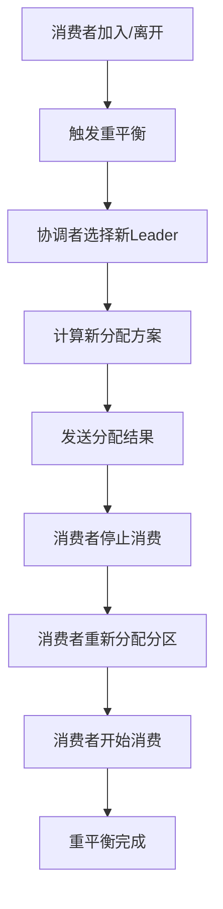
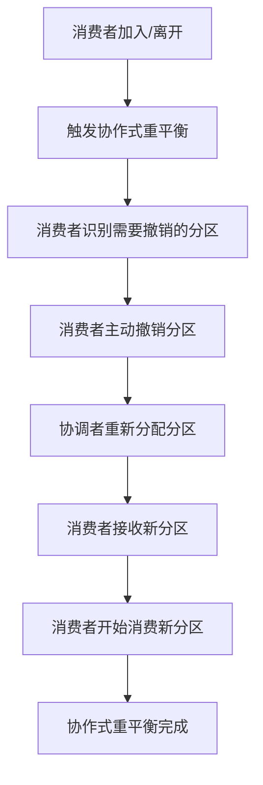

<!-- START doctoc generated TOC please keep comment here to allow auto update -->
<!-- DON'T EDIT THIS SECTION, INSTEAD RE-RUN doctoc TO UPDATE -->
**Table of Contents**  *generated with [DocToc](https://github.com/thlorenz/doctoc)*

- [SpringBoot集成Kafka消费者分区分配策略演示](#springboot%E9%9B%86%E6%88%90kafka%E6%B6%88%E8%B4%B9%E8%80%85%E5%88%86%E5%8C%BA%E5%88%86%E9%85%8D%E7%AD%96%E7%95%A5%E6%BC%94%E7%A4%BA)
  - [Kafka消费消息时的分区策略深度解读](#kafka%E6%B6%88%E8%B4%B9%E6%B6%88%E6%81%AF%E6%97%B6%E7%9A%84%E5%88%86%E5%8C%BA%E7%AD%96%E7%95%A5%E6%B7%B1%E5%BA%A6%E8%A7%A3%E8%AF%BB)
    - [1. 分区分配策略概述](#1-%E5%88%86%E5%8C%BA%E5%88%86%E9%85%8D%E7%AD%96%E7%95%A5%E6%A6%82%E8%BF%B0)
      - [1.1 重平衡触发条件](#11-%E9%87%8D%E5%B9%B3%E8%A1%A1%E8%A7%A6%E5%8F%91%E6%9D%A1%E4%BB%B6)
      - [1.2 分区分配策略的核心目标](#12-%E5%88%86%E5%8C%BA%E5%88%86%E9%85%8D%E7%AD%96%E7%95%A5%E7%9A%84%E6%A0%B8%E5%BF%83%E7%9B%AE%E6%A0%87)
    - [2. 四种分区分配策略深度解析](#2-%E5%9B%9B%E7%A7%8D%E5%88%86%E5%8C%BA%E5%88%86%E9%85%8D%E7%AD%96%E7%95%A5%E6%B7%B1%E5%BA%A6%E8%A7%A3%E6%9E%90)
      - [2.1 RangeAssignor（区间分配策略）](#21-rangeassignor%E5%8C%BA%E9%97%B4%E5%88%86%E9%85%8D%E7%AD%96%E7%95%A5)
      - [2.2 RoundRobinAssignor（轮询分配策略）](#22-roundrobinassignor%E8%BD%AE%E8%AF%A2%E5%88%86%E9%85%8D%E7%AD%96%E7%95%A5)
      - [2.3 StickyAssignor（粘性分配策略）](#23-stickyassignor%E7%B2%98%E6%80%A7%E5%88%86%E9%85%8D%E7%AD%96%E7%95%A5)
      - [2.4 CooperativeStickyAssignor（协作式粘性分配策略）](#24-cooperativestickyassignor%E5%8D%8F%E4%BD%9C%E5%BC%8F%E7%B2%98%E6%80%A7%E5%88%86%E9%85%8D%E7%AD%96%E7%95%A5)
    - [3. 分区分配策略对比分析](#3-%E5%88%86%E5%8C%BA%E5%88%86%E9%85%8D%E7%AD%96%E7%95%A5%E5%AF%B9%E6%AF%94%E5%88%86%E6%9E%90)
    - [4. 重平衡过程详解](#4-%E9%87%8D%E5%B9%B3%E8%A1%A1%E8%BF%87%E7%A8%8B%E8%AF%A6%E8%A7%A3)
      - [4.1 传统重平衡流程](#41-%E4%BC%A0%E7%BB%9F%E9%87%8D%E5%B9%B3%E8%A1%A1%E6%B5%81%E7%A8%8B)
      - [4.2 协作式重平衡流程](#42-%E5%8D%8F%E4%BD%9C%E5%BC%8F%E9%87%8D%E5%B9%B3%E8%A1%A1%E6%B5%81%E7%A8%8B)
    - [5. 性能影响分析](#5-%E6%80%A7%E8%83%BD%E5%BD%B1%E5%93%8D%E5%88%86%E6%9E%90)
      - [5.1 重平衡性能指标](#51-%E9%87%8D%E5%B9%B3%E8%A1%A1%E6%80%A7%E8%83%BD%E6%8C%87%E6%A0%87)
      - [5.2 各策略性能对比](#52-%E5%90%84%E7%AD%96%E7%95%A5%E6%80%A7%E8%83%BD%E5%AF%B9%E6%AF%94)
    - [6. 最佳实践建议](#6-%E6%9C%80%E4%BD%B3%E5%AE%9E%E8%B7%B5%E5%BB%BA%E8%AE%AE)
      - [6.1 策略选择指南](#61-%E7%AD%96%E7%95%A5%E9%80%89%E6%8B%A9%E6%8C%87%E5%8D%97)
      - [6.2 配置优化建议](#62-%E9%85%8D%E7%BD%AE%E4%BC%98%E5%8C%96%E5%BB%BA%E8%AE%AE)
      - [6.3 监控指标](#63-%E7%9B%91%E6%8E%A7%E6%8C%87%E6%A0%87)
  - [项目作用](#%E9%A1%B9%E7%9B%AE%E4%BD%9C%E7%94%A8)
  - [项目结构](#%E9%A1%B9%E7%9B%AE%E7%BB%93%E6%9E%84)
  - [核心实现](#%E6%A0%B8%E5%BF%83%E5%AE%9E%E7%8E%B0)
    - [1. 依赖配置](#1-%E4%BE%9D%E8%B5%96%E9%85%8D%E7%BD%AE)
    - [2. 配置文件](#2-%E9%85%8D%E7%BD%AE%E6%96%87%E4%BB%B6)
    - [3. Kafka配置类](#3-kafka%E9%85%8D%E7%BD%AE%E7%B1%BB)
    - [4. 分区策略演示消费者](#4-%E5%88%86%E5%8C%BA%E7%AD%96%E7%95%A5%E6%BC%94%E7%A4%BA%E6%B6%88%E8%B4%B9%E8%80%85)
    - [5. 生产者与控制器](#5-%E7%94%9F%E4%BA%A7%E8%80%85%E4%B8%8E%E6%8E%A7%E5%88%B6%E5%99%A8)
  - [分区分配策略详解与"预期说明"](#%E5%88%86%E5%8C%BA%E5%88%86%E9%85%8D%E7%AD%96%E7%95%A5%E8%AF%A6%E8%A7%A3%E4%B8%8E%E9%A2%84%E6%9C%9F%E8%AF%B4%E6%98%8E)
    - [独立Topic主题说明](#%E7%8B%AC%E7%AB%8Btopic%E4%B8%BB%E9%A2%98%E8%AF%B4%E6%98%8E)
  - [测试方法](#%E6%B5%8B%E8%AF%95%E6%96%B9%E6%B3%95)
    - [1. 启动应用](#1-%E5%90%AF%E5%8A%A8%E5%BA%94%E7%94%A8)
    - [2. 独立策略测试](#2-%E7%8B%AC%E7%AB%8B%E7%AD%96%E7%95%A5%E6%B5%8B%E8%AF%95)
      - [2.1 RangeAssignor策略测试](#21-rangeassignor%E7%AD%96%E7%95%A5%E6%B5%8B%E8%AF%95)
      - [2.2 RoundRobinAssignor策略测试](#22-roundrobinassignor%E7%AD%96%E7%95%A5%E6%B5%8B%E8%AF%95)
      - [2.3 StickyAssignor策略测试](#23-stickyassignor%E7%AD%96%E7%95%A5%E6%B5%8B%E8%AF%95)
      - [2.4 CooperativeStickyAssignor策略测试](#24-cooperativestickyassignor%E7%AD%96%E7%95%A5%E6%B5%8B%E8%AF%95)
    - [3. 对比测试](#3-%E5%AF%B9%E6%AF%94%E6%B5%8B%E8%AF%95)
  - [日志示例](#%E6%97%A5%E5%BF%97%E7%A4%BA%E4%BE%8B)
    - [RangeAssignor策略日志](#rangeassignor%E7%AD%96%E7%95%A5%E6%97%A5%E5%BF%97)
    - [RoundRobinAssignor策略日志](#roundrobinassignor%E7%AD%96%E7%95%A5%E6%97%A5%E5%BF%97)
    - [StickyAssignor策略日志](#stickyassignor%E7%AD%96%E7%95%A5%E6%97%A5%E5%BF%97)
    - [CooperativeStickyAssignor策略日志](#cooperativestickyassignor%E7%AD%96%E7%95%A5%E6%97%A5%E5%BF%97)
    - [7. 实际应用场景分析](#7-%E5%AE%9E%E9%99%85%E5%BA%94%E7%94%A8%E5%9C%BA%E6%99%AF%E5%88%86%E6%9E%90)
      - [7.1 电商订单处理系统](#71-%E7%94%B5%E5%95%86%E8%AE%A2%E5%8D%95%E5%A4%84%E7%90%86%E7%B3%BB%E7%BB%9F)
      - [7.2 日志收集系统](#72-%E6%97%A5%E5%BF%97%E6%94%B6%E9%9B%86%E7%B3%BB%E7%BB%9F)
      - [7.3 实时数据流处理](#73-%E5%AE%9E%E6%97%B6%E6%95%B0%E6%8D%AE%E6%B5%81%E5%A4%84%E7%90%86)
    - [8. 故障排查指南](#8-%E6%95%85%E9%9A%9C%E6%8E%92%E6%9F%A5%E6%8C%87%E5%8D%97)
      - [8.1 常见问题及解决方案](#81-%E5%B8%B8%E8%A7%81%E9%97%AE%E9%A2%98%E5%8F%8A%E8%A7%A3%E5%86%B3%E6%96%B9%E6%A1%88)
      - [8.2 监控和诊断工具](#82-%E7%9B%91%E6%8E%A7%E5%92%8C%E8%AF%8A%E6%96%AD%E5%B7%A5%E5%85%B7)
    - [9. 性能调优建议](#9-%E6%80%A7%E8%83%BD%E8%B0%83%E4%BC%98%E5%BB%BA%E8%AE%AE)
      - [9.1 参数调优](#91-%E5%8F%82%E6%95%B0%E8%B0%83%E4%BC%98)
      - [9.2 JVM调优](#92-jvm%E8%B0%83%E4%BC%98)
    - [10. 最佳实践总结](#10-%E6%9C%80%E4%BD%B3%E5%AE%9E%E8%B7%B5%E6%80%BB%E7%BB%93)
      - [10.1 策略选择决策树](#101-%E7%AD%96%E7%95%A5%E9%80%89%E6%8B%A9%E5%86%B3%E7%AD%96%E6%A0%91)
      - [10.2 配置检查清单](#102-%E9%85%8D%E7%BD%AE%E6%A3%80%E6%9F%A5%E6%B8%85%E5%8D%95)
  - [注意事项](#%E6%B3%A8%E6%84%8F%E4%BA%8B%E9%A1%B9)

<!-- END doctoc generated TOC please keep comment here to allow auto update -->

# SpringBoot集成Kafka消费者分区分配策略演示

## Kafka消费消息时的分区策略深度解读

### 1. 分区分配策略概述

Kafka的分区分配策略（Partition Assignment
Strategy）是决定消费者组内各个消费者实例如何分配Topic分区的核心机制。当消费者组发生重平衡（Rebalance）时，Kafka会根据配置的策略重新分配分区，确保每个分区只被组内的一个消费者实例消费。

#### 1.1 重平衡触发条件

- **消费者加入组**：新的消费者实例加入消费者组
- **消费者离开组**：消费者实例离开或崩溃
- **Topic分区数变化**：Topic的分区数发生变化
- **订阅Topic变化**：消费者组订阅的Topic发生变化

#### 1.2 分区分配策略的核心目标

1. **负载均衡**：尽可能均匀地将分区分配给各个消费者
2. **稳定性**：减少重平衡时的分区迁移，保持消费连续性
3. **效率性**：最小化重平衡的时间和资源消耗
4. **一致性**：确保同一分区不会被多个消费者同时消费

### 2. 四种分区分配策略深度解析

#### 2.1 RangeAssignor（区间分配策略）

**策略原理**：

- 按照Topic名称的字典序排序
- 将每个Topic的分区按顺序分配给消费者
- 使用简单的区间划分算法

**分配算法**：

```java
// 伪代码示例
int partitionsPerConsumer = totalPartitions / consumers.size();
int extraPartitions = totalPartitions % consumers.size();

for (int i = 0; i < consumers.size(); i++) {
    int start = i * partitionsPerConsumer + Math.min(i, extraPartitions);
    int length = partitionsPerConsumer + (i < extraPartitions ? 1 : 0);
    // 分配分区 [start, start + length) 给消费者 i
}
```

**特点分析**：

- ✅ **优点**：算法简单，分配结果可预测
- ❌ **缺点**：容易导致负载不均，特别是Topic数量少时
- 📊 **适用场景**：Topic数量多，分区分布相对均匀的场景

**实际分配示例**（10分区，3消费者）：

```
消费者1: [0, 1, 2, 3]     // 4个分区
消费者2: [4, 5, 6]        // 3个分区  
消费者3: [7, 8, 9]        // 3个分区
```

#### 2.2 RoundRobinAssignor（轮询分配策略）

**策略原理**：

- 将所有Topic的所有分区和所有消费者进行排序
- 按照轮询方式依次分配分区给消费者
- 确保分配结果更加均匀

**分配算法**：

```java
// 伪代码示例
List<String> sortedTopics = topics.sort();
List<String> sortedConsumers = consumers.sort();
List<Integer> allPartitions = getAllPartitions(sortedTopics);

for (int i = 0; i < allPartitions.size(); i++) {
    String consumer = sortedConsumers.get(i % consumers.size());
    assignPartition(allPartitions.get(i), consumer);
}
```

**特点分析**：

- ✅ **优点**：分配结果最均匀，负载均衡效果最好
- ❌ **缺点**：重平衡时可能导致大量分区迁移
- 📊 **适用场景**：对负载均衡要求高，能容忍重平衡时的短暂中断

**实际分配示例**（10分区，3消费者）：

```
消费者1: [0, 3, 6, 9]     // 4个分区
消费者2: [1, 4, 7]        // 3个分区
消费者3: [2, 5, 8]        // 3个分区
```

#### 2.3 StickyAssignor（粘性分配策略）

**策略原理**：

- 优先保持现有的分区分配不变
- 只在必要时进行最小化的重新分配
- 通过"粘性"机制减少重平衡时的分区迁移

**分配算法**：

```java
// 伪代码示例
Map<String, List<Integer>> currentAssignment = getCurrentAssignment();

// 1. 保持现有分配
for (String consumer : consumers) {
    if (currentAssignment.containsKey(consumer)) {
        keepExistingAssignment(consumer, currentAssignment.get(consumer));
    }
}

// 2. 处理新增分区
List<Integer> newPartitions = getNewPartitions();
distributeNewPartitions(newPartitions, consumers);

// 3. 处理消费者变化
handleConsumerChanges();
```

**特点分析**：

- ✅ **优点**：重平衡时分区迁移最少，消费连续性最好
- ✅ **优点**：初始分配接近均匀分布
- ❌ **缺点**：算法复杂度较高
- 📊 **适用场景**：对消费连续性要求高，能容忍轻微负载不均

**实际分配示例**（10分区，3消费者）：

```
初始分配: 接近均匀分布
重平衡后: 尽可能保持原有分配，最小化迁移
```

#### 2.4 CooperativeStickyAssignor（协作式粘性分配策略）

**策略原理**：

- 基于StickyAssignor的改进版本
- 支持协作式重平衡（Cooperative Rebalancing）
- 允许消费者主动参与重平衡过程，减少协调者负担

**分配算法**：

```java
// 伪代码示例
// 1. 协作式重平衡
if (isCooperativeRebalance()) {
    // 消费者主动参与重平衡
    List<String> revokedPartitions = identifyPartitionsToRevoke();
    List<String> assignedPartitions = identifyPartitionsToAssign();
    
    // 逐步迁移分区
    migratePartitions(revokedPartitions, assignedPartitions);
} else {
    // 传统重平衡
    performTraditionalRebalance();
}
```

**特点分析**：

- ✅ **优点**：重平衡过程更平滑，减少消费中断时间
- ✅ **优点**：支持增量重平衡，提高系统可用性
- ✅ **优点**：减少协调者的压力
- ❌ **缺点**：实现复杂度最高
- 📊 **适用场景**：大规模生产环境，对可用性要求极高

**实际分配示例**（10分区，3消费者）：

```
协作式重平衡: 分区逐步迁移，减少消费中断
传统重平衡: 一次性重新分配所有分区
```

### 3. 分区分配策略对比分析

| 策略                        | 负载均衡  | 重平衡稳定性 | 算法复杂度 | 适用场景          |
|---------------------------|-------|--------|-------|---------------|
| RangeAssignor             | ⭐⭐    | ⭐⭐     | ⭐     | 简单场景，Topic数量多 |
| RoundRobinAssignor        | ⭐⭐⭐⭐⭐ | ⭐      | ⭐⭐    | 负载均衡要求高       |
| StickyAssignor            | ⭐⭐⭐⭐  | ⭐⭐⭐⭐   | ⭐⭐⭐   | 消费连续性要求高      |
| CooperativeStickyAssignor | ⭐⭐⭐⭐  | ⭐⭐⭐⭐⭐  | ⭐⭐⭐⭐⭐ | 大规模生产环境       |

### 4. 重平衡过程详解

#### 4.1 传统重平衡流程



#### 4.2 协作式重平衡流程



### 5. 性能影响分析

#### 5.1 重平衡性能指标

- **重平衡时间**：从触发到完成的时间
- **分区迁移数量**：重平衡时需要迁移的分区数
- **消费中断时间**：消费者停止消费的持续时间
- **协调者负载**：协调者处理重平衡的CPU和内存消耗

#### 5.2 各策略性能对比

| 策略                        | 重平衡时间 | 分区迁移数 | 消费中断 | 协调者负载 |
|---------------------------|-------|-------|------|-------|
| RangeAssignor             | 短     | 中等    | 短    | 低     |
| RoundRobinAssignor        | 中等    | 多     | 中等   | 中等    |
| StickyAssignor            | 长     | 少     | 短    | 高     |
| CooperativeStickyAssignor | 中等    | 少     | 很短   | 中等    |

### 6. 最佳实践建议

#### 6.1 策略选择指南

1. **开发测试环境**：使用RangeAssignor，简单可靠
2. **负载均衡优先**：使用RoundRobinAssignor
3. **消费连续性优先**：使用StickyAssignor
4. **生产环境推荐**：使用CooperativeStickyAssignor

#### 6.2 配置优化建议

```properties
# 推荐配置
partition.assignment.strategy=org.apache.kafka.clients.consumer.CooperativeStickyAssignor
session.timeout.ms=30000
heartbeat.interval.ms=10000
max.poll.interval.ms=300000
```

#### 6.3 监控指标

- **重平衡频率**：监控重平衡触发次数
- **分区分配均匀性**：监控各消费者分配的分区数
- **消费延迟**：监控消息消费的端到端延迟
- **错误率**：监控消费过程中的错误率

## 项目作用

本项目演示了SpringBoot中Kafka消费者的分区分配策略（Partition
Assignor），即Kafka主题topic的哪些分区由哪些消费者来消费。示例对比了四种策略：RangeAssignor、RoundRobinAssignor、StickyAssignor、CooperativeStickyAssignor，并为每个策略创建了独立的Topic主题，实现完全隔离的测试环境，帮助理解不同策略下分区如何在同一消费者组内分配。

## 项目结构

```
kafka-14-consumer-partition-assignor/
├── src/main/java/com/action/kafka14consumerpartitionassignor/
│   ├── config/
│   │   └── KafkaConfig.java                       # Kafka配置（四种策略的容器工厂 + Topic + Producer）
│   ├── consumer/
│   │   └── AssignorDemoConsumer.java              # 四个@KafkaListener分别演示四种策略
│   ├── controller/
│   │   └── AssignorController.java                # REST API控制器（发送测试消息）
│   ├── service/
│   │   └── AssignorProducerService.java           # 生产者服务
│   └── Kafka14ConsumerPartitionAssignorApplication.java # 主启动类
├── src/main/resources/
│   └── application.properties                     # 配置文件
└── pom.xml                                        # Maven配置
```

## 核心实现

### 1. 依赖配置

`pom.xml`：引入Kafka与Web、Lombok、测试依赖

```xml
<dependencies>
    <dependency>
        <groupId>org.springframework.boot</groupId>
        <artifactId>spring-boot-starter</artifactId>
    </dependency>
    <dependency>
        <groupId>org.springframework.kafka</groupId>
        <artifactId>spring-kafka</artifactId>
    </dependency>
    <dependency>
        <groupId>org.projectlombok</groupId>
        <artifactId>lombok</artifactId>
        <optional>true</optional>
    </dependency>
    <dependency>
        <groupId>org.springframework.boot</groupId>
        <artifactId>spring-boot-starter-test</artifactId>
        <scope>test</scope>
    </dependency>
    <dependency>
        <groupId>org.springframework.kafka</groupId>
        <artifactId>spring-kafka-test</artifactId>
        <scope>test</scope>
    </dependency>
    <!-- 如需调用HTTP接口，可引入 spring-boot-starter-web -->
</dependencies>
```

### 2. 配置文件

`application.properties`：Kafka服务器、Topic、四个组名与端口

```properties
spring.application.name=kafka-14-consumer-partition-assignor

# Kafka 连接
spring.kafka.bootstrap-servers=192.168.56.10:9092

# 生产者序列化
spring.kafka.producer.key-serializer=org.apache.kafka.common.serialization.StringSerializer
spring.kafka.producer.value-serializer=org.apache.kafka.common.serialization.StringSerializer

# 消费者基础配置
spring.kafka.consumer.key-deserializer=org.apache.kafka.common.serialization.StringDeserializer
spring.kafka.consumer.value-deserializer=org.apache.kafka.common.serialization.StringDeserializer
spring.kafka.consumer.enable-auto-commit=false
spring.kafka.consumer.auto-offset-reset=earliest

# 自定义
kafka.topic.name=assignor-topic
kafka.group.range=range-assignor-group
kafka.group.rr=roundrobin-assignor-group
kafka.group.sticky=sticky-assignor-group
kafka.group.coop=coop-sticky-assignor-group

server.port=9104
```

### 3. Kafka配置类

`config/KafkaConfig.java`：为每个策略创建独立的Topic与对应的容器工厂

```java
// 为每个策略创建独立的Topic
@Bean
public NewTopic rangeAssignorTopic() {
    return TopicBuilder.name("range-assignor-topic")
            .partitions(10)
            .replicas(1)
            .build();
}

@Bean
public NewTopic roundRobinAssignorTopic() {
    return TopicBuilder.name("roundrobin-assignor-topic")
            .partitions(10)
            .replicas(1)
            .build();
}

@Bean
public NewTopic stickyAssignorTopic() {
    return TopicBuilder.name("sticky-assignor-topic")
            .partitions(10)
            .replicas(1)
            .build();
}

    @Bean
public NewTopic coopStickyAssignorTopic() {
    return TopicBuilder.name("coop-sticky-assignor-topic")
                .partitions(10)
                .replicas(1)
                .build();
    }
```

```88:139:kafka-14-consumer-partition-assignor/src/main/java/com/action/kafka14consumerpartitionassignor/config/KafkaConfig.java
    @Bean("rangeKafkaListenerContainerFactory")
    public ConcurrentKafkaListenerContainerFactory<String, String> rangeFactory() {
        Map<String, Object> props = baseConsumerProps(rangeGroup);
        props.put(ConsumerConfig.PARTITION_ASSIGNMENT_STRATEGY_CONFIG, List.of(RangeAssignor.class.getName()));
        return buildFactory(props);
    }
```

```145:157:kafka-14-consumer-partition-assignor/src/main/java/com/action/kafka14consumerpartitionassignor/config/KafkaConfig.java
    @Bean("rrKafkaListenerContainerFactory")
    public ConcurrentKafkaListenerContainerFactory<String, String> rrFactory() {
        Map<String, Object> props = baseConsumerProps(rrGroup);
        props.put(ConsumerConfig.PARTITION_ASSIGNMENT_STRATEGY_CONFIG, List.of(RoundRobinAssignor.class.getName()));
        return buildFactory(props);
    }
```

```163:175:kafka-14-consumer-partition-assignor/src/main/java/com/action/kafka14consumerpartitionassignor/config/KafkaConfig.java
    @Bean("stickyKafkaListenerContainerFactory")
    public ConcurrentKafkaListenerContainerFactory<String, String> stickyFactory() {
        Map<String, Object> props = baseConsumerProps(stickyGroup);
        props.put(ConsumerConfig.PARTITION_ASSIGNMENT_STRATEGY_CONFIG, List.of(StickyAssignor.class.getName()));
        return buildFactory(props);
    }
```

```181:193:kafka-14-consumer-partition-assignor/src/main/java/com/action/kafka14consumerpartitionassignor/config/KafkaConfig.java
    @Bean("coopStickyKafkaListenerContainerFactory")
    public ConcurrentKafkaListenerContainerFactory<String, String> coopStickyFactory() {
        Map<String, Object> props = baseConsumerProps(coopGroup);
        props.put(ConsumerConfig.PARTITION_ASSIGNMENT_STRATEGY_CONFIG, List.of(CooperativeStickyAssignor.class.getName()));
        return buildFactory(props);
    }
```

### 4. 分区策略演示消费者

`consumer/AssignorDemoConsumer.java`：四个监听方法，分别监听独立的Topic，绑定不同策略的工厂与组。每个策略通过`@KafkaListener`注解的`concurrency = "3"`属性配置3个并发消费者实例，日志中显示线程ID和消费者信息，便于观察分区分配差异。

```java
// RangeAssignor 监听独立Topic - 3个并发消费者实例
@KafkaListener(topics = "range-assignor-topic",
            groupId = "${kafka.group.range}",
            containerFactory = "rangeKafkaListenerContainerFactory",
            concurrency = "3")
public void onRange(ConsumerRecord<String, String> record, ...) {
        long threadId = Thread.currentThread().getId();
        String threadName = Thread.currentThread().getName();
        log.info("[RangeAssignor] Thread[{}] Consumer[{}] topic={}, partition={}, offset={}, key={}, value={}",
                threadId, threadName, topic, partition, offset, record.key(), record.value());
        ack.acknowledge();
    }

// RoundRobinAssignor 监听独立Topic - 3个并发消费者实例
@KafkaListener(topics = "roundrobin-assignor-topic",
        groupId = "${kafka.group.rr}",
        containerFactory = "rrKafkaListenerContainerFactory",
        concurrency = "3")
public void onRoundRobin(ConsumerRecord<String, String> record, ...) {
    long threadId = Thread.currentThread().getId();
    String threadName = Thread.currentThread().getName();
    log.info("[RoundRobinAssignor] Thread[{}] Consumer[{}] topic={}, partition={}, offset={}, key={}, value={}",
            threadId, threadName, topic, partition, offset, record.key(), record.value());
    ack.acknowledge();
}

// StickyAssignor 监听独立Topic - 3个并发消费者实例
@KafkaListener(topics = "sticky-assignor-topic",
        groupId = "${kafka.group.sticky}",
        containerFactory = "stickyKafkaListenerContainerFactory",
        concurrency = "3")
public void onSticky(ConsumerRecord<String, String> record, ...) {
    long threadId = Thread.currentThread().getId();
    String threadName = Thread.currentThread().getName();
    log.info("[StickyAssignor] Thread[{}] Consumer[{}] topic={}, partition={}, offset={}, key={}, value={}",
            threadId, threadName, topic, partition, offset, record.key(), record.value());
    ack.acknowledge();
}

// CooperativeStickyAssignor 监听独立Topic - 3个并发消费者实例
@KafkaListener(topics = "coop-sticky-assignor-topic",
        groupId = "${kafka.group.coop}",
        containerFactory = "coopStickyKafkaListenerContainerFactory",
        concurrency = "3")
public void onCoopSticky(ConsumerRecord<String, String> record, ...) {
    long threadId = Thread.currentThread().getId();
    String threadName = Thread.currentThread().getName();
    log.info("[CooperativeStickyAssignor] Thread[{}] Consumer[{}] topic={}, partition={}, offset={}, key={}, value={}",
            threadId, threadName, topic, partition, offset, record.key(), record.value());
    ack.acknowledge();
}
```

### 5. 生产者与控制器

`service/AssignorProducerService.java` 与 `controller/AssignorController.java`：为每个策略提供独立的批量消息发送接口

```java
// 生产者服务 - 为每个策略提供独立的消息发送方法
@Service
public class AssignorProducerService {
    private final KafkaTemplate<String, String> kafkaTemplate;

    // RangeAssignor策略批量发送
    public CompletableFuture<Void> sendRangeAssignorBatch(int count) {
        // 发送到 range-assignor-topic
    }

    // RoundRobinAssignor策略批量发送
    public CompletableFuture<Void> sendRoundRobinAssignorBatch(int count) {
        // 发送到 roundrobin-assignor-topic
    }

    // StickyAssignor策略批量发送
    public CompletableFuture<Void> sendStickyAssignorBatch(int count) {
        // 发送到 sticky-assignor-topic
    }

    // CooperativeStickyAssignor策略批量发送
    public CompletableFuture<Void> sendCoopStickyAssignorBatch(int count) {
        // 发送到 coop-sticky-assignor-topic
    }
}
```

```java
// 控制器 - 为每个策略提供独立的测试接口
@RestController
@RequestMapping("/api/assignor")
public class AssignorController {
    
    // RangeAssignor策略测试接口
    @GetMapping("/range/batch")
    public ResponseEntity<Map<String, Object>> sendRangeAssignorBatch(
            @RequestParam(value = "count", defaultValue = "12") int count) {
        // 调用 producerService.sendRangeAssignorBatch(count)
    }

    // RoundRobinAssignor策略测试接口
    @GetMapping("/roundrobin/batch")
    public ResponseEntity<Map<String, Object>> sendRoundRobinAssignorBatch(
            @RequestParam(value = "count", defaultValue = "12") int count) {
        // 调用 producerService.sendRoundRobinAssignorBatch(count)
    }

    // StickyAssignor策略测试接口
    @GetMapping("/sticky/batch")
    public ResponseEntity<Map<String, Object>> sendStickyAssignorBatch(
            @RequestParam(value = "count", defaultValue = "12") int count) {
        // 调用 producerService.sendStickyAssignorBatch(count)
    }

    // CooperativeStickyAssignor策略测试接口
    @GetMapping("/coop-sticky/batch")
    public ResponseEntity<Map<String, Object>> sendCoopStickyAssignorBatch(
            @RequestParam(value = "count", defaultValue = "12") int count) {
        // 调用 producerService.sendCoopStickyAssignorBatch(count)
    }
}
```

## 分区分配策略详解与"预期说明"

每个策略都有独立的Topic主题，每个Topic有10个分区（p0~p9），每个策略对应的组内并发为3（通过`@KafkaListener`注解的`concurrency = "3"`属性配置，同一应用内由容器并发启动3个消费者实例）。每个消费者实例都有独立的线程ID，在日志中可以通过Thread[ID]和Consumer[Name]来区分不同的消费者实例。

### 独立Topic主题说明

- **RangeAssignor策略**：监听 `range-assignor-topic` 主题
- **RoundRobinAssignor策略**：监听 `roundrobin-assignor-topic` 主题  
- **StickyAssignor策略**：监听 `sticky-assignor-topic` 主题
- **CooperativeStickyAssignor策略**：监听 `coop-sticky-assignor-topic` 主题

- RangeAssignor（区间分配，默认策略）：
  - 计算每个消费者应得分区数：10 / 3 = 3 余 1；
  - 消费者1: p0,p1,p2,p3；消费者2: p4,p5,p6；消费者3: p7,p8,p9；
  - 预期日志：`[RangeAssignor]` 前缀下能看到上述分区的消费记录。

- RoundRobinAssignor（轮询分配）：
  - 分区与消费者排序后轮询分配，更加平均地交错分布；
  - 典型结果：C1: p0,p3,p6,p9；C2: p1,p4,p7；C3: p2,p5,p8；
  - 预期日志：`[RoundRobinAssignor]` 前缀下分区呈现交错分布。

- StickyAssignor（粘性分配）：
  - 尽可能保持已有分配稳定，仅在必要时调整，初始分布接近均匀；
  - 典型结果：C1: p0,p1,p2,p3；C2: p3,p4,p5,p6；C3: p6,p7,p8,p9；（初始分配接近均匀，重平衡时保持稳定）
  - 预期日志：`[StickyAssignor]` 前缀下分区较为均匀，重平衡后尽量保持不变。

- CooperativeStickyAssignor（协作式粘性分配）：
  - 基于协作式再均衡，逐步迁移分区以减少抖动；
  - 典型结果：C1: p0,p1,p2,p3；C2: p3,p4,p5,p6；C3: p6,p7,p8,p9；（初始分配接近均匀，协作式重平衡时迁移更平滑）
  - 预期日志：`[CooperativeStickyAssignor]` 前缀下重平衡期间分区迁移更平滑。

## 测试方法

### 1. 启动应用

```bash
cd kafka-14-consumer-partition-assignor
mvn spring-boot:run
```

### 2. 独立策略测试

每个策略都有独立的测试接口，可以单独测试每个分区分配策略的效果：

#### 2.1 RangeAssignor策略测试

```bash
# 发送12条消息到RangeAssignor策略
curl "http://localhost:9104/api/assignor/range/batch?count=12"
```

**预期结果**：只有RangeAssignor消费者会收到消息，日志显示 `[RangeAssignor]` 前缀，分区分配为区间分布。

#### 2.2 RoundRobinAssignor策略测试

```bash
# 发送12条消息到RoundRobinAssignor策略
curl "http://localhost:9104/api/assignor/roundrobin/batch?count=12"
```

**预期结果**：只有RoundRobinAssignor消费者会收到消息，日志显示 `[RoundRobinAssignor]` 前缀，分区分配为轮询分布。

#### 2.3 StickyAssignor策略测试

```bash
# 发送12条消息到StickyAssignor策略
curl "http://localhost:9104/api/assignor/sticky/batch?count=12"
```

**预期结果**：只有StickyAssignor消费者会收到消息，日志显示 `[StickyAssignor]` 前缀，分区分配为粘性分布。

#### 2.4 CooperativeStickyAssignor策略测试

```bash
# 发送12条消息到CooperativeStickyAssignor策略
curl "http://localhost:9104/api/assignor/coop-sticky/batch?count=12"
```

**预期结果**：只有CooperativeStickyAssignor消费者会收到消息，日志显示 `[CooperativeStickyAssignor]` 前缀，分区分配为协作式粘性分布。

### 3. 对比测试

可以依次调用不同策略的接口，观察日志中不同策略的分区分配差异：

```bash
# 依次测试四种策略
curl "http://localhost:9104/api/assignor/range/batch?count=10"
curl "http://localhost:9104/api/assignor/roundrobin/batch?count=10"  
curl "http://localhost:9104/api/assignor/sticky/batch?count=10"
curl "http://localhost:9104/api/assignor/coop-sticky/batch?count=10"
```

## 日志示例

### RangeAssignor策略日志
```
INFO  - [RangeAssignor] Thread[45] Consumer[kafka-listener-0] topic=range-assignor-topic, partition=0, offset=0, key=range-key-0, value=range-msg-0
INFO  - [RangeAssignor] Thread[46] Consumer[kafka-listener-1] topic=range-assignor-topic, partition=1, offset=0, key=range-key-1, value=range-msg-1
INFO  - [RangeAssignor] Thread[47] Consumer[kafka-listener-2] topic=range-assignor-topic, partition=2, offset=0, key=range-key-2, value=range-msg-2
INFO  - [RangeAssignor] Thread[45] Consumer[kafka-listener-0] topic=range-assignor-topic, partition=3, offset=0, key=range-key-3, value=range-msg-3
```

### RoundRobinAssignor策略日志
```
INFO  - [RoundRobinAssignor] Thread[48] Consumer[kafka-listener-0] topic=roundrobin-assignor-topic, partition=0, offset=0, key=rr-key-0, value=rr-msg-0
INFO  - [RoundRobinAssignor] Thread[49] Consumer[kafka-listener-1] topic=roundrobin-assignor-topic, partition=3, offset=0, key=rr-key-1, value=rr-msg-1
INFO  - [RoundRobinAssignor] Thread[50] Consumer[kafka-listener-2] topic=roundrobin-assignor-topic, partition=6, offset=0, key=rr-key-2, value=rr-msg-2
INFO  - [RoundRobinAssignor] Thread[48] Consumer[kafka-listener-0] topic=roundrobin-assignor-topic, partition=9, offset=0, key=rr-key-3, value=rr-msg-3
```

### StickyAssignor策略日志
```
INFO  - [StickyAssignor] Thread[51] Consumer[kafka-listener-0] topic=sticky-assignor-topic, partition=1, offset=0, key=sticky-key-0, value=sticky-msg-0
INFO  - [StickyAssignor] Thread[52] Consumer[kafka-listener-1] topic=sticky-assignor-topic, partition=4, offset=0, key=sticky-key-1, value=sticky-msg-1
INFO  - [StickyAssignor] Thread[53] Consumer[kafka-listener-2] topic=sticky-assignor-topic, partition=7, offset=0, key=sticky-key-2, value=sticky-msg-2
```

### CooperativeStickyAssignor策略日志
```
INFO  - [CooperativeStickyAssignor] Thread[54] Consumer[kafka-listener-0] topic=coop-sticky-assignor-topic, partition=2, offset=0, key=coop-key-0, value=coop-msg-0
INFO  - [CooperativeStickyAssignor] Thread[55] Consumer[kafka-listener-1] topic=coop-sticky-assignor-topic, partition=5, offset=0, key=coop-key-1, value=coop-msg-1
INFO  - [CooperativeStickyAssignor] Thread[56] Consumer[kafka-listener-2] topic=coop-sticky-assignor-topic, partition=8, offset=0, key=coop-key-2, value=coop-msg-2
```

### 7. 实际应用场景分析

#### 7.1 电商订单处理系统

**场景描述**：处理用户订单，需要保证订单的顺序性和高可用性

**推荐策略**：CooperativeStickyAssignor
**理由**：

- 订单处理需要保证顺序性，减少重平衡时的分区迁移
- 高可用性要求，协作式重平衡减少消费中断
- 大规模生产环境，需要稳定的分区分配

**配置示例**：

```properties
partition.assignment.strategy=org.apache.kafka.clients.consumer.CooperativeStickyAssignor
session.timeout.ms=30000
heartbeat.interval.ms=10000
max.poll.interval.ms=300000
```

#### 7.2 日志收集系统

**场景描述**：收集各服务的日志，对负载均衡要求高

**推荐策略**：RoundRobinAssignor
**理由**：

- 日志处理对顺序性要求不高
- 需要均匀分配负载，提高处理效率
- 可以容忍重平衡时的短暂中断

#### 7.3 实时数据流处理

**场景描述**：处理实时数据流，需要低延迟和高吞吐

**推荐策略**：StickyAssignor
**理由**：

- 减少重平衡时的分区迁移，保持消费连续性
- 实时处理对延迟敏感，需要稳定的分区分配
- 平衡负载均衡和消费连续性

### 8. 故障排查指南

#### 8.1 常见问题及解决方案

**问题1：重平衡频繁触发**

```
症状：日志中出现大量重平衡信息
原因：session.timeout.ms设置过小，网络不稳定
解决：调整session.timeout.ms和heartbeat.interval.ms
```

**问题2：分区分配不均**

```
症状：某些消费者分配的分区数明显多于其他消费者
原因：使用了RangeAssignor且Topic数量少
解决：切换到RoundRobinAssignor或StickyAssignor
```

**问题3：消费延迟增加**

```
症状：消息消费延迟明显增加
原因：重平衡过程中分区迁移导致消费中断
解决：使用CooperativeStickyAssignor，优化重平衡过程
```

#### 8.2 监控和诊断工具

**关键指标监控**：

```bash
# 查看消费者组状态
kafka-consumer-groups.sh --bootstrap-server localhost:9092 --group my-group --describe

# 查看Topic分区信息
kafka-topics.sh --bootstrap-server localhost:9092 --topic my-topic --describe

# 监控重平衡事件
kafka-console-consumer.sh --bootstrap-server localhost:9092 --topic __consumer_offsets
```

**日志分析**：

```bash
# 分析重平衡日志
grep "Rebalancing" application.log | tail -100

# 分析分区分配日志
grep "Partition assignment" application.log | tail -50
```

### 9. 性能调优建议

#### 9.1 参数调优

```properties
# 基础配置
bootstrap.servers=localhost:9092
group.id=my-consumer-group
# 分区分配策略
partition.assignment.strategy=org.apache.kafka.clients.consumer.CooperativeStickyAssignor
# 会话和心跳配置
session.timeout.ms=30000
heartbeat.interval.ms=10000
max.poll.interval.ms=300000
# 消费配置
enable.auto.commit=false
auto.offset.reset=earliest
max.poll.records=500
# 网络配置
connections.max.idle.ms=540000
request.timeout.ms=30000
```

#### 9.2 JVM调优

```bash
# JVM参数建议
-Xms2g -Xmx2g
-XX:+UseG1GC
-XX:MaxGCPauseMillis=200
-XX:+PrintGCDetails
-XX:+PrintGCTimeStamps
```

### 10. 最佳实践总结

#### 10.1 策略选择决策树

```
开始
  ↓
是否需要负载均衡？
  ├─ 是 → 使用RoundRobinAssignor
  └─ 否 → 是否需要消费连续性？
      ├─ 是 → 使用StickyAssignor
      └─ 否 → 是否需要协作式重平衡？
          ├─ 是 → 使用CooperativeStickyAssignor
          └─ 否 → 使用RangeAssignor
```

#### 10.2 配置检查清单

- [ ] 分区分配策略已正确配置
- [ ] 会话超时时间合理设置
- [ ] 心跳间隔适当配置
- [ ] 消费者组ID唯一性确认
- [ ] Topic分区数合理规划
- [ ] 监控指标已配置
- [ ] 错误处理机制完善

## 注意事项

1. **Kafka服务器**：确保Kafka在 `192.168.56.10:9092` 运行（按需调整）。
2. **Topic分区数**：本示例为10分区，便于观察分布差异。
3. **并发设置**：四个容器工厂并发均为3，便于模拟同组多个实例的分配行为。
4. **手动确认**：消费者使用手动确认（ack.acknowledge()）。
5. **重平衡观测**：可在运行时调整并发或临时停止某些实例，观察Sticky/CooperativeSticky的稳定性差异。
6. **指定分区发送**：强制分区发送不受策略影响，适合作为对照。
7. **生产环境**：生产环境建议使用CooperativeStickyAssignor，并做好监控。
8. **性能测试**：在生产环境部署前，建议进行充分的性能测试。
9. **监控告警**：设置重平衡频率和消费延迟的监控告警。
10. **文档维护**：及时更新配置文档和运维手册。

